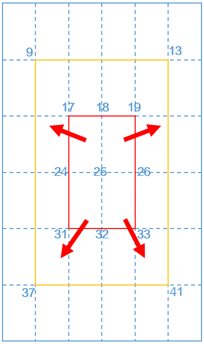

# 网格化-位移&lt;MeshImage-Translation&gt;

## 动效概述

可实现局部区域抖动效果，如果需要响应加速度传感器，需要设置sensor="true"，否则不会响应。

## 场景举例

* 滑动图片使其变形，例如用手点击猫脸，脸部变形变肿，点胡子，胡子变长后再弹回等，点击尾巴，尾巴会收缩。
* 射箭游戏，张弓搭箭，拉动弓箭弦，有变形弯曲效果。
* 小丑的鼻子拉伸，拍皮球或者拍肚子产生回弹效果。

## XML规范

```
<MeshImage mesh="" center_point="" sensor="" src="">
     <Translation duration="" repeat="" delay="" factor="" values="" max_distance_x="" max_distance_y="" no_move_distance_x="" no_move_distance_y=""/>
</MeshImage>
```

* <strong>MeshImage</strong> <strong>参数说明</strong>

网格化动画标签，划分网格数量，设置网格中心点。


使用w、h设置MeshImage宽高时，为了保证效果，MeshImage宽高比需要与src中引用的图片本身的宽高比保持一致。否则会导致在子网格区域中操作对应的局部图片展示异常。

| 参 数 | 类 型 | 选 项 | 注 释 |
| --- | --- | --- | --- |
| mesh | 字符串 | 必填 | 用英文逗号分开的两个正整数，表示图片x,y轴上划分的网格数，如："20,20"表示图片x,y轴上分别划分20个网格。  x,y轴网格数取值范围为[2,屏幕宽度/高度的二分之一]的整数，且x,y轴网格数至少有一个大于等于2。 |
| center\_point | 数值 | 选填 | 网格中心点编号，可指定具体数字。不设置时程序默认计算公式为：(int) (((meshX+ 1) \* (meshY+ 1)) / 2 + 0.5）。如：mesh="6,6"，共划分为36个网格，共49个顶点，则第25个顶点为中心点。 |
| sensor | 字符串 | 选填 | 是否支持通过加速度传感器来控制网格化的位移、旋转、缩放、透明度动效。true/false，默认为false。为true时，晃动手机触发动效开始。 |
| src | 字符串 | 必填 | 图片资源名称，支持变量，如@abc。 |

* <strong>Translation</strong> <strong>参数说明</strong>

网格化-位移标签，实现局部区域抖动效果。


局部位移区域向左下移动时，为了跟网格化区域的外边缘进行衔接，会呈现一种内折的效果。

| 参 数 | 类 型 | 选 项 | 注 释 |
| --- | --- | --- | --- |
| duration | 数值 | 选填 | 单次动画持续时间（毫秒），取值正整数，默认为2000，支持表达式。 |
| repeat | 数值 | 选填 | 动画重复次数，-1表示无限循环，0表示不重复，n表示重复n+1次，默认为0，支持表达式。 |
| delay | 数值 | 选填 | 动画延迟执行的毫秒数，即触发动画后需要delay毫秒才开始执行动画，取值正整数，默认为0，支持表达式。 |
| factor | 数值 | 选填 | 动画回弹因子，取值0~1之间，值越大回弹幅度越小，默认为0.2，支持表达式。 |
| values | 字符串 | 必填 | 由多个0-1之间的实数构成的运动参数列表，实数个数最少2个，最多5个。示例：“1.0,0,1.0”表示从当前位置运动到初始位置，然后又运动到当前位置，实数值越大移动距离越大，但受限于max\_distance\_x和max\_distance\_y。 |
| max\_distance\_x | 数值 | 选填 | x轴最大运动距离，单位为像素，取值为(0，每个网格宽度)，默认为一个网格宽度，支持表达式。 |
| max\_distance\_y | 数值 | 选填 | y轴最大运动距离，单位为像素，取值为(0，每个网格高度)，默认为一个网格高度，支持表达式。 |
| no\_move\_distance\_x | 数值 | 选填 | x轴方向不动的点，离中心点大于no\_move\_distance\_x距离的点不动。设置的值需大于0，如果为0值则被认为是图片宽度，默认为图片宽度，单位为像素，支持表达式。 |
| no\_move\_distance\_y | 数值 | 选填 | y轴方向不动的点，离中心点大于no\_move\_distance\_y距离的点不动。设置的值需大于0，如果为0值则被认为是图片高度，默认为图片高度，单位为像素，支持表达式。 |

### 局部位移区域与最大运动范围计算方法：

示例：图片w=1080，h=1920，mesh="6,6"，则共划分为36个网格。每个网格宽180，高320。

<strong>局部位移区域：</strong>center\_point=25，no\_move\_distance\_x=180，no\_move\_distance\_y=320，则x轴方向上距离中心点25距离小于等于180，且y轴方向上距离中心点25距离小于等于320的区域（即网格顶点17、18、19、24、26、31、32、33组成的区域）为局部可移动区域。

<strong>最大运动范围：</strong>max\_distance\_x="180"，max\_distance\_y="320"，则x轴最大运动距离为180，y轴最大运动距离为320，即手指滑动图片时局部可移动区域在网格顶点9、13、37、41组成的范围内进行位移拉伸。

```
<MeshImage x="0" y="0" w="1080" h="1920" mesh="6,6" center_point="25" sensor="true" src="bg.jpg">
     <Translation duration="2000" repeat="0" delay="0" factor="0.15" values="1.0,0" max_distance_x="180" max_distance_y="320" no_move_distance_x="180" no_move_distance_y="320"/>
</MeshImage>
```



## 效果和脚本展示

将宽339、高388的图片分成横20格、竖20格，共400个网格，每个网格宽16.95，高19.4。values设为1,0表示局部图片随手指或传感器产生位移抖动效果后恢复原位，位移大小与手指移动距离或手机加速度大小成正比，max\_distance\_x/y设为30，使得位移动画的x,y轴最大位移为30像素，动画过程持续2s。no\_move\_distance\_x/y设置为121、138，根据每个网格的宽高可以算出中心点左右共14列和上下共14排相交的区域为局部移动区域，可以通过手指滑动该区域，滑动时该区域与包裹着该区域的网格顶点间有拉伸变形。

[](https://alliance-communityfile-drcn.dbankcdn.com/FileServer/getFile/publicContent/011/111/111/0000000000011111111.20251218173501.60138214636934952851391083905067:20260601222003:2800:A5117B1E78AED098C9BD34D3BB6B38DDB3D5314DB0E029F30EA13E908DD4D91D.mp4)

```
<MeshImage x="538" y="875" w="339" h="388" mesh="20,20" center_point="221" sensor="true" src="part.jpg">
     <Translation duration="2000" repeat="0" delay="0" factor="0.15" values="1.0,0" max_distance_x="30" max_distance_y="30" no_move_distance_x="121" no_move_distance_y="138"/>
</MeshImage>
```

## 制作视频

[](https://alliance-communityfile-drcn.dbankcdn.com/FileServer/getFile/publicContent/011/111/111/0000000000011111111.20251218173501.05728633824251731214259074330855:20260601222003:2800:342370B007FD10EF8608824D68E94E3C17CF9ADBC4D976824E50933B89190223.mp4)