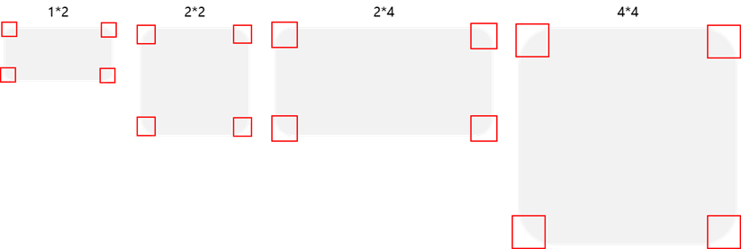
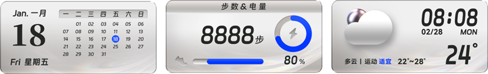
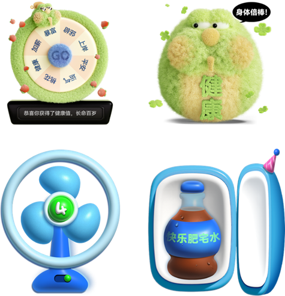
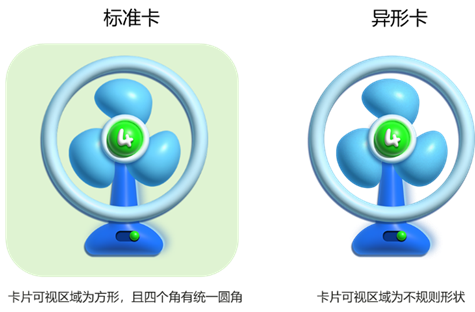

# 脚本设计

创作者可基于主题引擎能力编写出各式各样动态效果的百变卡片，具体脚本写法参见HarmonyOS 5.0及以上版本主题引擎脚本规范。

不同卡片规格有不同的虚拟屏幕宽高，不允许修改。

（1）1×2卡片脚本根标签写法：

```
<?xml version="1.0" encoding="utf-8"?>
<Widget screenWidth="1372" screenHeight="530" frameRate="60">
</Widget>
```

（2）2×2卡片脚本根标签写法：

```
<?xml version="1.0" encoding="utf-8"?>
<Widget screenWidth="1384" screenHeight="1384" frameRate="60">
</Widget>
```

（3）2×4卡片脚本根标签写法：

```
<?xml version="1.0" encoding="utf-8"?>
<Widget screenWidth="1372" screenHeight="640" frameRate="60">
</Widget>
```

（4）4×4卡片脚本根标签写法：

```
<?xml version="1.0" encoding="utf-8"?>
<Widget screenWidth="1384" screenHeight="1440" frameRate="60">
</Widget>
```

以2×2时钟卡片为例，脚本示例如下：

```
<?xml version="1.0" encoding="utf-8"?>
<Widget screenWidth="1384" screenHeight="1384" frameRate="60">
    <Var name="w" const="true" expression="#screen_width" persist="true" />
    <Var name="h" const="true" expression="#screen_height" persist="true" />
    <Image x="0" y="0" w="1384" h="1384" src="bg.png"/>
    <Image x="429" y="161" pivotX="51" pivotY="319" src="minute.png" rotation="360*(#minute/60)"/>
    <Image x="429" y="258" pivotX="51" pivotY="222" src="hour.png" rotation="360*(#hour12/12)+30*(#minute/60)"/>
    <Button x="0" y="0" w="#w" h="#h">
        <Trigger action="click">
            <IntentCommand action="action.system.home" package="com.huawei.hmos.clock" class=" com.huawei.hmos.clock.phone"/>
        </Trigger>
    </Button>
</Widget>
```


一个好的百变卡片，不仅需要很好的视觉效果，还需要有流畅的体验。设计时需要兼顾用户设备的性能、玩机水平，实现用户体验最大化。

1、每张百变卡片设计的可播放动画（视频、序列帧等），连续的动画总时长不超过 15秒，模拟时钟的秒针变化暂不受影响。

2、尽量避免大量使用视频和序列帧图片。

3、含有动画效果时，需规范代码书写方式，动画暂停需要在ExternalCommands的pause中调用stop方法。

4、降低图片、视频文件大小，减少缓存时读取的时间，节省运行内存。

5、尽量使用合适尺寸的图片、视频，能用小尺寸绝不用大尺寸，有效减少计算量。因每类卡片规格使用的图片&视频素材有最大分辨率限制，当图片或视频分辨率无法达到设计宽和高时，可以将Image、Video等视图的w和h参数设置成固定值。

例如：2×2卡片的某个图片的设计宽高为800×800 px，图片素材实际宽高（bg.png）为692×692 px，则实现代码可以如下：

```
<Image x="0" y="0" w=“800” h=“800” src="bg.png"/>
```

6、服务卡片由系统统一裁剪圆角，为了避免与服务卡片风格不一致，让用户误以为是系统BUG，规范版本Harmony OS 6.0及以下，单卡-大卡、单卡-中卡仅允许制作异形卡片；规范版本Harmony OS 6.1开始，允许创作者制作标准卡。

* 标准卡：卡片可视区域为方形（下图灰色部分），且四个角为直角或四个角采用统一圆角进行裁剪。

  

  标准卡样例：

  
* 异形卡：除标准卡外，所有形状不规则卡片的统称。

  异形卡样例

  
* 标准卡如何转换为异形卡？

  