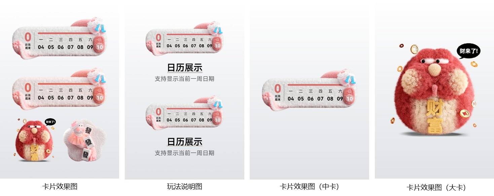
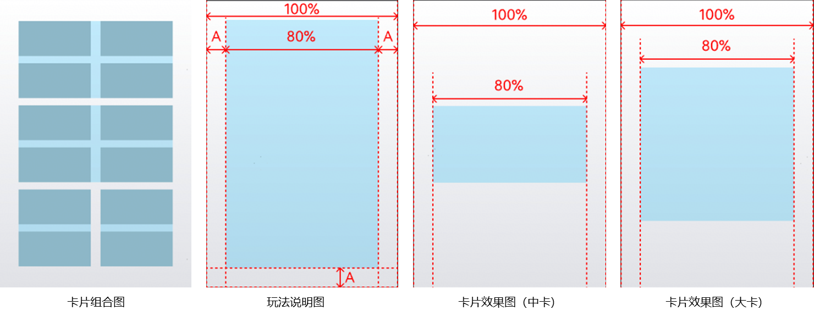

# 卡片套装

<strong>样例图：</strong>

<strong>设计要求：</strong>

详情图<strong>不少于2张</strong>，最多20张，包含卡片组合效果图，玩法说明图，卡片效果图(可选)

卡片组合效果图展示多张卡片实际效果，卡片可展示的最大宽度为背景宽度的80%，可展示最大高度为背景高度的80%，卡片需上下左右居中。

卡片效果图展示卡片实际效果，卡片可展示的最大宽度为背景宽度的80%，卡片需上下左右居中，具体可参考下图示例。

玩法说明图展示卡片实际效果并对卡片玩法进行介绍。卡片可展示的最大宽度为背景宽度的80%，可展示最大高度为背景高度的80%，展示区域需上下左右居中，具体可参考下图示例。

