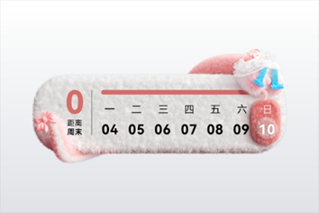
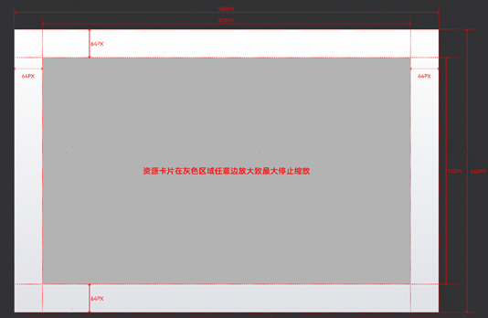
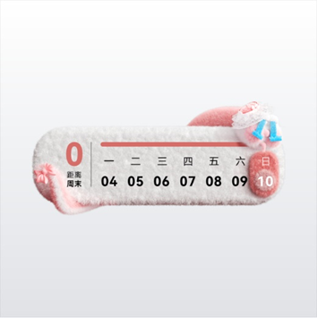
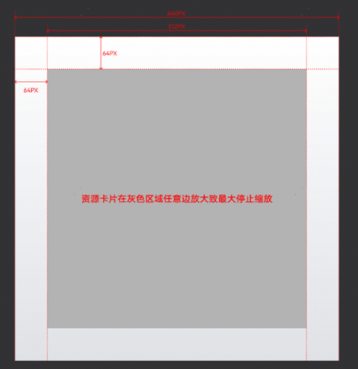

# 单卡-中卡

## （1）3:2封面图

<strong>样例图：</strong>

<strong>设计要求：</strong>

3:2封面图尺寸为960×640 px

3:2封面图内百变卡片可展示的最大宽度为背景宽度的80%，即832px，可展示最大高度为背景高度的80%，即512px，百变卡片需上下左右居中，具体可参考下图示例。

## （2）1:1封面图

<strong>样例图：</strong>

<strong>设计要求：</strong>

1:1封面图尺寸为640×640 px

1:1封面图内百变卡片可展示的最大宽度为背景宽度的80%，即512px，可展示最大高度为背景高度的80%，即512px，百变卡片需上下左右居中，具体可参考下图示例。

