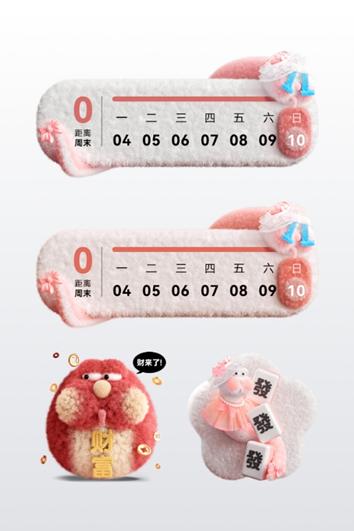
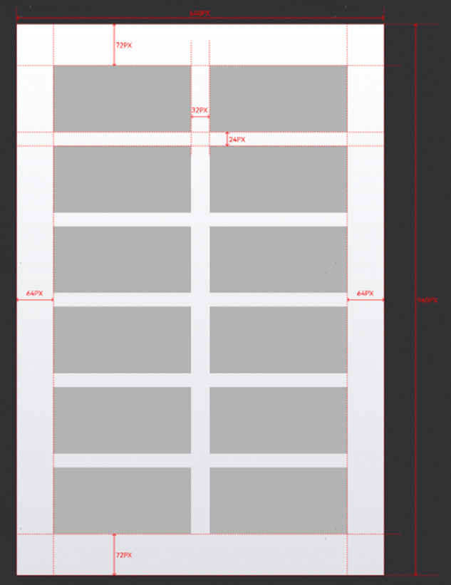
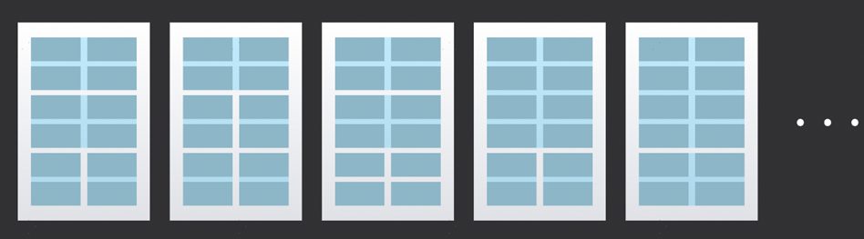
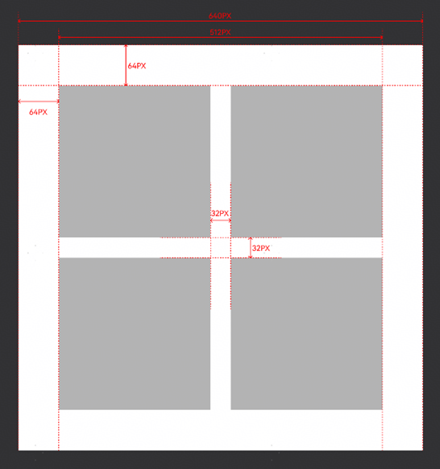
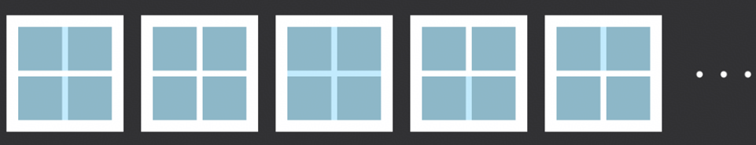

# 卡片套装

## （1）2:3封面图

<strong>样例图：</strong>

<strong>设计要求：</strong>

2:3封面图尺寸为640×960 px

2:3封面图内百变卡片可展示的最大宽度为背景宽度的80%，即832px，可展示最大高度为背景高度的80%，即512px。百变卡片之间，上下间距为24px，左右间距为32px。封面图由多张百变卡片组合而成，可根据百变卡片特征自由组合，需占满所有宫格，卡片在宫格内任意边放大至最大则停止缩放，具体可参考下图示例。

卡片组合样式：

## （2）1:1封面图

<strong>样例图：</strong>

<strong>设计要求：</strong>

1:1封面图尺寸为640×640 px

1:1封面图内百变卡片可展示的最大宽度为背景宽度的80%，即512px，可展示最大高度为背景高度的80%，即512px。百变卡片之间，上下间距为32px，左右间距为32px。封面图由多张百变卡片组合而成，可根据百变卡片特征自由组合，需占满所有宫格，卡片在宫格内任意边放大至最大则停止缩放，具体可参考下图示例。

卡片组合样式

