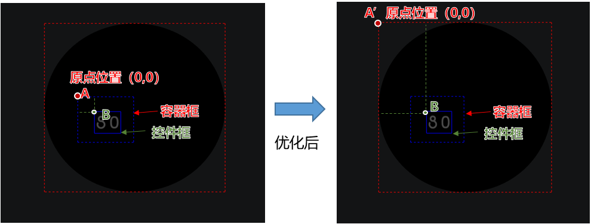
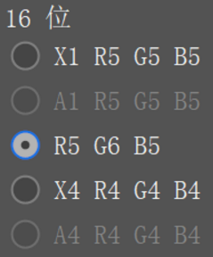

# Theme Studio版本更新说明

## Theme Studio 11.0.20.310（2024-7-15）

### 表盘主题新增特性

1、优化视频录制问题。

2、优化不同分辨率的电脑上，工具生成预览图尺寸不一致问题。

3、优化466\*466分辨率表盘，切换轻智能系列后，导出的表盘包不符合规范的问题。

4、优化390\*390、454\*454分辨率表盘，当使用睡眠文本和十二时辰选图后，y版本号为7。

### 手机主题新增特性

1、优化生成平板预览图时，时间日期元素与壁纸的偏移问题。

2、个性化弹窗新增电池图标不超出背景范围限制。

3、优化个性化弹窗电池图标位置与真机预览不一致问题。

## Theme Studio 11.0.20.300（2024-4-2）

### 表盘主题新增特性

* 优化控件中位置属性的计算方式。

  

  将容器原点为参考计算，优化为画布原点为参考计算。

  

  优化Mac版同步时出现卡死的问题。

### 手机主题新增特性

* 优化折叠屏与手机生成cover图不一致问题。

## Theme Studio 11.0.19.320（2024-1-3）

### 表盘主题新增特性

* 增加图片的兼容处理逻辑，解决图片buffer过大，导致导出表盘时报错“获取图片信息错误，请确认图片是否正确”的问题。
* 修复图片名字中含有大写字母，图片无法识别的问题。
* 修复BMP格式图片无法识别的问题。
* 修复466\*466分辨率表盘勾选“轻智能系列”复选框后，导出表盘包版本变成1.1.z的问题。
* 修复194\*368分辨率不含熄屏显示的表盘，安装至华为Band6手环出现黑屏的问题。
* 修复194\*368分辨率表盘 【文本】-【分钟】在工具的动态预览区显示与手环上显示存在差异的问题。

### 手机主题新增特性

* 修复【图标】-【展示】页面不显示图标仅显示背景的问题。
* 修复【截图生成手机预览图】“图标”仅截背景图不显示图标的问题。
* 修复【通知】-【下拉通知】页面， 控制中心“热点”名称显示乱码的问题。
* 修复锁屏壁纸、桌面壁纸无法替换、无法实时预览的问题。
* 修复EMUI11.0版本中【通话】-【联系人】界面，“+”图标位置不居中的问题。

## Theme Studio 11.0.19.310（2023-11-21）

### 表盘主题新增特性

* 466\*466分辨率（1.y.z版本），表盘HWT包文件大小限制调整为4.5MB。
* 194\*368分辨率支持熄屏表盘制作，包含熄屏表盘的版本号为2.2.z。
* 466\*466（2.0.z版本除外）、336\*480、194\*368分辨率，熄屏表盘允许的非黑色像素点占比由10%增大到20%。
* 优化视频控件属性描述文案。

### 手机主题新增特性

* HarmonyOS 2.0版本主题包，运动健康、华为阅读图标更新。

## Theme Studio 11.0.18.300（2023-2-20）

### 表盘主题新增特性

<strong>新增功能</strong>

* 支持240\*240分辨率表盘可视化制作。
* 制作表盘主题时，支持上传BMP格式的图片。

  

  BMP图片宽像素点、高像素点必须为偶数，位深必须为16位 R5 G6 B5。

  
* 扩宽资源包总体大小和单张图片像素点大小限制。

  

  + 资源包总体大小限制：390\*390/454\*454/466\*466（轻智能系列）调整至4M。
  + 单张图片像素点大小限制：390\*390/454\*454/466\*466（轻智能系列）调整至750KB；280\*456/336\*480调整至497KB；194\*368调整至338KB。

<strong>优化问题</strong>

* 修复在图层区选中容器，点击复制图层无响应的问题。

### 手机主题新增特性

<strong>优化问题</strong>

* 修复15/16/17版本新建并导出主题资源包时默认携带AOD目录，且AOD默认资源图片边缘有小绿点的问题。

## Theme Studio 11.0.17.300（2022-12-21）

### 表盘主题新增特性

<strong>新增功能</strong>

* 466\*466分辨率轻智能系列新增[样式自定义功能](https://developer.huawei.com/consumer/cn/doc/content/style-customize-0000001401559326)和[颜色自定义功能](https://developer.huawei.com/consumer/cn/doc/content/color-customize-0000001459125433)。
* 336\*480分辨率新增[样式自定义功能](https://developer.huawei.com/consumer/cn/doc/content/style-customize-0000001401559326)。

<strong>优化问题</strong>

* 开发者和设计师名称去掉不能连续输入空格限制。

### 手机主题新增特性

<strong>优化问题</strong>

* HarmonyOS 2.0版本删除万能卡片遮罩和圆角资源相关入口。
* 修复部分图标预览图截图失败问题。
* 修复导入、导出主题包时，误报home\_wallpaper\_0.jpg资源格式错误问题。

## Theme Studio 11.0.16.300（2022-11-22）

### 表盘主题新增特性

* 支持WATCH 3自定义颜色。
* 修复466\*466分辨率制作步数选图，导出的版本号显示NaN问题。
* 修复弧形图控件中心点偏移问题。
* 修复466\*466分辨率，工具显示版本号与实际版本号不符问题。

### 手机主题新增特性

* 支持开发者模式下制作万象小组件包。
* 开发者模式预览功能的渲染引擎更新，性能更加稳定并支持更全的标签。
* 修复上个版本视频桌面同步至手机不生效问题。

## Theme Studio 11.0.15.300（2022-10-29）

### 表盘主题新增特性

<strong>新增功能</strong>

* 新增能力集标签。
* 智能系列支持复杂数据（应用专属表盘）表盘制作，该功能依赖三方手表应用上架，非必选。

  

  应用专属表盘需安装官方或三方的手表版应用，并可在表盘上展示官方或三方应用的信息，展示的信息和样式由应用决定，仅限表盘应用开发者使用。

<strong>优化问题</strong>

* 修复194\*368分辨率个别字体显示不完整并出现截断问题。
* 修复表盘添加月出月落容器、12时辰等后，导出版本号显示NaN问题。
* 修复英文系统下，月份日期动态预览区播放会消失的问题。
* 修复466\*466分辨率添加的28种天气类型但预览图只能展示11种的天气问题。

### 手机主题新增特性

<strong>优化问题</strong>

* 修复导入EMUI 10.1版本主题时，部分颜色和图片资源不生效问题。
* 修复当工程有多余空文件夹时，无法导入和历史工程不显示的问题。

## Theme Studio 11.0.14.300-sp1（2022-09-20）

### 表盘主题新增特性

<strong>新增功能</strong>

* 新增WATCH 3、GT3、FIT 2、华为手环 7数据/能力的开放。

<strong>优化问题</strong>

* 优化FIT 2手表字体偏移问题。
* 修复WATCH 3/GT 2/GT 3/Band 6/FIT工具星期文本英文状态与手表显示缩写不一致的问题。
* 优化表盘双时区默认展示时间改成02:08。
* 优化watch3/GT3月份文本英文显示和手表一致。

<strong>规范同步</strong>

* 336\*480分辨率根据规范和手表侧的显示，屏蔽步数进度选图。
* 390\*390分辨率根据规范和手表侧字体显示，屏蔽不支持的星期文本字体字号。

### 手机主题新增特性

<strong>新增功能</strong>

* 支持一镜到底主题可视化制作。
* 支持平板、折叠屏动态锁屏及可交互桌面的同时制作。

<strong>优化问题</strong>

* 修复历史项目无内容、无法导入主题及升降级后主题结构异常的问题。
* 修复导出时校验弹窗无内容的问题。
* 其他界面、卡顿及性能体验优化。

## Theme Studio 11.0.14.300（2022-6-30）

### 表盘主题新增特性

* 表盘工具新增更多数值类型。
* 466分辨率智能系列支持景深效果。
* 操作区域，图层可多选并可同时拖拽。
* fit表盘简介修改，可支持填写两个简介分别在带AOD资源包展示和不带AOD资源包展示。
* 优化吸附功能，新增辅助线、旋转中心点吸附对齐。
* 优化工程文件拖拽：
  + 支持项目页拖拽一个资源包打开。
  + 支持项目页面同时拖拽最多打开10个资源包。
  + 编辑页面，整屏支持拖拽打开资源包。
* 优化亮度可视化提醒，优化AOD非黑色像素提醒。
* 支持图层【！】号提醒，提醒图层异常。
* 支持图层总大小实时计算，图片总大小实时计算。鼠标悬浮可查看单独图层大小。
* 466分辨率智能系列，由于工具的展示方式需与手表保持一致，故【双时区时/分文本】数据类型由原始展示方式“10:08”修改为 "LON 10:08"。

### 手机主题新增特性

* 导入、导出及开发者模式新增XSD校验，支持校验引擎脚本内容是否符合规范。
* 优化出现问题工程时的兜底方案，修复因存在问题工程导致无法新建，历史工程无内容的问题。
* 修复动态锁屏日期预览样式与真机样式不一致问题。
* 修复开发者模式校验不准确，导致使用资源未导出的问题。
* 修复动态模拟时钟未全部替换时导出卡死的问题。
* 修复当选择可交互桌面的开发者模式时引擎字段丢失问题。
* 修复切换主题类型菜单导致的AOD背景资源未导出问题。
* 其他界面样式、提示说明及体验优化。

## Theme Studio 11.0.13.300-sp1（2022-4-22）

11.0.13.300-sp1版本包含11.0.13.300版本所有功能，您可以直接下载更稳定的11.0.13.300-sp1版本制作体验。

### 表盘主题新增特性

* 新增表盘RAM（表盘中所有图片大小的总和）计算限制。
* 优化以下内容：
  + 模板功能仅支持当前分辨率模板显示。
  + 336\*480分辨率版本号由2.3.x改成2.1.x。
  + 280\*456分辨率优化连接文本的月份为阿拉伯数字。
  + 跨分辨率插入时优化交互体验。

  

  1. 优化插入时，不可以插入资源置灰，插入后会修改资源需手动插入。
  2. 优化插入表盘资源后显示错位问题。
  3. 优化方形表和圆形表跨版本插入时，以宽/高最大值为标准进行缩放，保证视觉完整。
  4. 优化插入表盘后，原始png透明图会增加背景，显示效果与插入前不一致问题。
  5. 优化插入时，运动表插入智能表，组合图的无效资源图和默认资源图会消失问题。
  6. 优化工具对导出时，轻智能2.0导出的包变成了1.0版本号问题。

### 手机主题新增特性

* 修复因部分字段缺失导致视频桌面不生效问题。
* 修复因项目文件损坏导致无法新建问题。
* 修复导出时填写的主题名称或描述不生效问题。
* 修复导出的数字时钟AOD背景不生效问题。
* 修复可交互桌面帧动画图片资源丢失问题。
* 其他界面样式及体验优化。

## Theme Studio 11.0.13.300（2022-3-24）

### 通用特性

* 支持拖拽移动项目位置，调整顺序。

* 色板新增取色器，支持取色。
* 支持拖拽添加图片。

当工具未安装在C盘上时，才支持拖拽添加图片功能。

录屏等涉及图片处理功能无法使用？[点击查看解决方法](https://developer.huawei.com/consumer/cn/doc/development/Tools-Guides/faq-0000001050147125)。

### 表盘主题新增特性

* 支持336\*480分辨率表盘的可视化制作。
* 支持跨分辨率插入表盘可支持的素材。
* 支持保存自有模板包。
* 圆形手表新增编辑区域黑色蒙层。

  

  高亮区域为有效区域，黑色蒙层内为非有效区域，非有效区域的背景素材，导出时会被裁剪。裁剪仅支持：单图、选图、单组序列帧。
* 支持背景素材的旋转，缩放。
* 支持素材左上角（原点）辅助自动对齐/吸附功能。
* 表盘工具上传素材时支持精准报错提醒。
* 欢迎页及表盘编辑页支持拖拽导入主题包文件。

### 手机主题新增特性

* 支持手机/平板/折叠屏耳机个性化弹窗换肤可视化制作。

  

  工具预览效果为重绘，与真机有差异，请以真机应用效果为准。
* 支持版本间互相转换，同一项目导出多个版本主题。
* 支持同一主题版本关联，相互切换。

  

  版本转换为辅助功能，转换后必须根据预览效果，手动检查并调整样式保证画面清晰可见。

  当多个主题的中文名称和设计师名称同时一致时，判断为同一主题。
* 支持开发者模式预览。

  

  该功能基于渲染引擎，对性能有一定的要求。当脚本中有引擎无法识别的标签时，预览效果与真机有差异，请以真机应用效果为准。
* 新增“华为阅读”选做图标，该图标在设计上需要与已有的“阅读”图标有区分。
* 优化锁屏、桌面及导出截屏工具栏的分类。

## Theme Studio 11.0.12.300-sp1（2022-3-04）

### 表盘主题新增特性

* 修复农历的选图月份在动态预览区不显示问题。
* 修复静态预览区放大后，控件蓝色边框的上边框会消失问题。
* 解决mac录制表盘视频无反应问题。

### 手机主题新增特性

* 动效锁屏中步数支持删除。
* 平板与折叠屏主题导出多余资源过滤、提示优化。
* 修复AOD无法上传联盟问题。

## Theme Studio 11.0.12.300（2022-1-26）

### 表盘主题新增特性

* 280\*456分辨率表盘支持导出两个资源包（有AOD和没有AOD）。
* 新增466表盘2.0版本可视化制作。
* 新增466表盘能耗等级可视化。
* 支持图层与图层之间，容器框与容器框对齐。
* 预览图一键截图增加进度条。
* 半径弧宽支持可视化。

### 手机主题新增特性

* 支持平板、折叠屏静态小主题同时制作。
* 动态锁屏、可交互桌面设计者模式新增标尺、旋转及缩放动画的中心点。

## Theme Studio 11.0.11.300（2021-12-02）

### 表盘主题新增特性

* 支持撤回、重做快捷键。

  

  + 撤回快捷键：Windows：Ctrl+Z / macOS：Command+Z。
  + 重做快捷键：Windows：Ctrl+Shift+Z / macOS：Command+Shift+Z。
  + 全局可支持10个步骤的撤回与重做。
  + 切换类型、切换模板后，之前的快捷键步骤将会被清空。
* 智能手表280\*456分辨率的表盘支持AOD制作。
* 表盘的单图/选图/单组序列帧支持旋转、放大、缩小。
* 优化表盘大模块锁定功能，锁住图层不进行隐藏，且不对属性内容进行修改。
* 优化表盘导入素材后容器框过小问题。

### 手机主题新增特性

* 支持撤回、重做快捷键。

  

  + 撤回快捷键：Windows：Ctrl+Z / macOS：Command+Z。
  + 重做快捷键：Windows：Ctrl+Shift+Z / macOS：Command+Shift+Z。
  + 每个菜单均可单独支持10个步骤的撤回与重做。
  + 快捷键暂不支持内容的增减、视频锁屏、智能配色板、可交互桌面。
* 桌面壁纸及锁屏壁纸支持缩放、裁切。
* 桌面支持可交互桌面制作，包括可视化设计者模式及开发者模式。

## Theme Studio 11.0.10.300（2021-10-09）

### 表盘主题新增特性

* 新增儿童表盘可视化制作。

  

  儿童表盘当前仅支持免费商业模式，付费商业模式正在开发中。
* 新增表盘控件模板。
* 新增表盘刻度辅助制作。
* 解决表盘弧度与真机不一致等问题，优化文本框尺寸和文本一致，改进用户体验。

### 手机主题新增特性

* 新增智能配色板功能，快速配色大主题。

  

  智能配色为辅助功能，是基于桌面静态壁纸智能生成的配色方案。建议使用色彩丰富的壁纸，选择配色后请使用预览样式，手动检查并调整以达到最佳效果。
* 新增锁屏模板化制作及图标自定义模板。
* HarmonyOS版本新增万能卡片预览图可选导出。
* 解决预览图截屏失败等问题，改进用户体验。

## Theme Studio 11.0.9.300-sp1（2021-08-25）

### 表盘主题新增特性

* 支持同时制作智能系列手表和轻智能系列新手表。
* 新增标尺及辅助线功能（删除辅助线快捷方式：Ctrl+D）。
* 支持录制表盘动态预览视频。
* 支持表盘工程复制，优化容器框位置，简介窗口等。

**对于466\*466分辨率的表盘，请仔细阅读并基于如下制作场景的优缺点选择合适的制作方式。**

<strong>同时制作(默认模式)：</strong>

* 优点：一次制作及上架，内容可同时应用于智能系列手表和轻智能系列新手表。
* 缺点：能耗优先，可选控件和字体较少。

<strong>分开制作(切类型-&gt;只勾选智能系列)：</strong>

* 优点：可选控件更多，制作更加精美的智能系列表盘。
* 缺点：需要多制作一个轻智能系列新手表的表盘上架（联盟将做强制检查，切类型-&gt;同时勾选智能系列和轻智能系列）。

### 手机主题新增特性

* 支持录制动态AOD预览视频。
* 动态锁屏新增快捷应用解锁小组件。
* 开发者模式支持更多常用资源格式，包括mp4、mp3、gif等。
* 支持主题工程复制，优化预览效果，修复反馈问题改进用户体验。

## Theme Studio 11.0.8.300（2021-07-12）

### 表盘主题新增特性

* 支持HUAWEI WATCH FIT、华为手环6表盘可视化制作。
* 新增HUAWEI WATCH 3系列背景、时间、日期样式自定义编辑功能。

### 手机主题新增特性

* 支持HarmonyOS 2.0新增换肤项制作，例如大文件夹背景。
* 动态锁屏制作新增开发者模式，支持脚本编写。

## Theme Studio 11.0.7.300（2021-06-07）

### 表盘主题新增特性

* 优化表盘工具容器一键收起，单组序列帧范围等相关体验问题。

### 手机主题新增特性

* 支持[HarmonyOS 2.0主题制作](https://developer.huawei.com/consumer/cn/doc/content/themes-specification-0000001160896163)。
* 支持EMUI 11.0主题一键升级为HarmonyOS 2.0主题。
* 动态锁屏制作：新增多壁纸动效及锁屏时间自定义布局。

## Theme Studio 11.0.6.300（2021-04-26）

### 表盘主题新增特性

* Watch系列支持视频、GIF表盘可视化制作。
* Watch系列增加数字时钟表盘预览图。
* 优化工具图层区显示。
* 工具支持动态预览区放大显示。
* 优化了一些体验问题，例如简化移动快捷键的操作方式。

### 手机主题新增特性

* 支持自动按照主题规范导出主题包，例如弹窗背景色不透明度规范为100%，导出时工具会自动重写为符合规范的100%。新增至10套官方图标模板。

