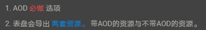

import MergeTable from '@site/src/components/MergeTable';

# 280\*456/336\*480能力集

## 控件类型

<MergeTable
  headers={['控件类型', '280*456（2.y.z）', '', '336*480（2.y.z）', '']}
  rows={
    [null, '是否支持', 'y版本号', '是否支持', 'y版本号'],
    ['单图', '是，单张图片像素点大小≤497KB', '3', '是，单张图片像素点大小≤497KB', '1'],
    ['选图', '是', '3', '是', '1'],
    ['组合图', '是', '3', '是', '1'],
    ['文本', '是', '3', '是', '1'],
    ['连接文本', '是', '3', '是', '1'],
    ['直线图', '是', '3', '是', '1'],
    ['弧形图', '是', '3', '是', '1'],
    ['指针', '是', '3', '是', '1'],
    ['单组序列帧', '是，帧数≤30帧且尺寸≤200px*200px', '3', '是，帧数≤30帧且尺寸≤200px*200px', '1']
  }
/>

## 数值类型

## 时间

<MergeTable
  headers={['数值类型', '280*456（2.y.z）', '', '336*480（2.y.z）', '']}
  rows={
    [null, '是否支持', 'y版本号', '是否支持', 'y版本号'],
    ['上午下午', '是', '3', '是', '1'],
    ['时钟高位', '是', '3', '是', '1'],
    ['时钟低位', '是', '3', '是', '1'],
    ['分钟高位', '是', '3', '是', '1'],
    ['分钟低位', '是', '3', '是', '1'],
    ['秒钟高位', '是', '3', '是', '1'],
    ['秒钟低位', '是', '3', '是', '1'],
    ['12时辰', '是', '3', '是', '1'],
    ['时钟比例12', '是', '3', '是', '1'],
    ['时钟比例24', '是', '3', '是', '1'],
    ['分钟比例', '是', '3', '是', '1'],
    ['秒钟比例', '是', '3', '是', '1'],
    ['AM/PM文本', '是', '3', '是', '1']
  }
/>

### 双时区

<MergeTable
  headers={['数值类型', '280*456（2.y.z）', '', '336*480（2.y.z）', '']}
  rows={
    [null, '是否支持', 'y版本号', '是否支持', 'y版本号'],
    ['双时区时钟高位', '是', '3', '是', '1'],
    ['双时区时钟低位', '是', '3', '是', '1'],
    ['双时区AMPM', '是', '3', '是', '1'],
    ['双时区分钟高位', '是', '3', '是', '1'],
    ['双时区分钟低位', '是', '3', '是', '1'],
    ['双时区时钟比例12', '是', '3', '是', '1'],
    ['双时区时钟比例24', '是', '3', '是', '1'],
    ['双时区分钟比例', '是', '3', '是', '1']
  }
/>

### 日期

<MergeTable
  headers={['数值类型', '280*456（2.y.z）', '', '336*480（2.y.z）', '']}
  rows={
    [null, '是否支持', 'y版本号', '是否支持', 'y版本号'],
    ['日期', '是', '3', '是', '1'],
    ['昨天', '是', '3', '是', '1'],
    ['明天', '是', '3', '是', '1'],
    ['月', '是', '3', '是', '1'],
    ['星期数据', '是', '3', '是', '1'],
    ['日期高位', '是', '3', '是', '1'],
    ['日期低位', '是', '3', '是', '1'],
    ['月份比例', '是', '3', '是', '1'],
    ['日期占31天比例', '是', '3', '是', '1'],
    ['星期比例', '是', '3', '是', '1'],
    ['星期文本', '是', '3', '是', '1'],
    ['月份文本', '是', '3', '是', '1']
  }
/>

### 农历

<MergeTable
  headers={['数值类型', '280*456（2.y.z）', '', '336*480（2.y.z）', '']}
  rows={
    [null, '是否支持', 'y版本号', '是否支持', 'y版本号'],
    ['农历月份', '是', '3', '是', '1'],
    ['农历日期高位', '是', '3', '是', '1'],
    ['农历日期低位', '是', '3', '是', '1']
  }
/>

### 电量

<MergeTable
  headers={['数值类型', '280*456（2.y.z）', '', '336*480（2.y.z）', '']}
  rows={
    [null, '是否支持', 'y版本号', '是否支持', 'y版本号'],
    ['电量', '是', '3', '是', '1'],
    ['电量枚举', '是', '3', '是', '1'],
    ['电量比例', '是', '3', '是', '1']
  }
/>

### 步数

<MergeTable
  headers={['数值类型', '280*456（2.y.z）', '', '336*480（2.y.z）', '']}
  rows={
    [null, '是否支持', 'y版本号', '是否支持', 'y版本号'],
    ['步数', '是', '3', '是', '1'],
    ['步数目标达成度', '是', '3', '是', '1'],
    ['步数选图', '是', '3', '是', '1']
  }
/>

### 卡路里

<MergeTable
  headers={['数值类型', '280*456（2.y.z）', '', '336*480（2.y.z）', '']}
  rows={
    [null, '是否支持', 'y版本号', '是否支持', 'y版本号'],
    ['卡路里', '是', '3', '是', '1'],
    ['卡路里比例', '是', '3', '是', '1']
  }
/>

### 心率

<MergeTable
  headers={['数值类型', '280*456（2.y.z）', '', '336*480（2.y.z）', '']}
  rows={
    [null, '是否支持', 'y版本号', '是否支持', 'y版本号'],
    ['心率', '是', '3', '是', '1'],
    ['最大心率', '是', '3', '是', '1'],
    ['最小心率', '是', '3', '是', '1'],
    ['心率区间', '是', '3', '是', '1'],
    ['心率比例', '是', '3', '是', '1']
  }
/>

### 压力

<MergeTable
  headers={['数值类型', '280*456（2.y.z）', '', '336*480（2.y.z）', '']}
  rows={
    [null, '是否支持', 'y版本号', '是否支持', 'y版本号'],
    ['压力', '是', '3', '是', '1'],
    ['压力比例', '是', '3', '是', '1']
  }
/>

### 中高强度时间

<MergeTable
  headers={['数值类型', '280*456（2.y.z）', '', '336*480（2.y.z）', '']}
  rows={
    [null, '是否支持', 'y版本号', '是否支持', 'y版本号'],
    ['中高强度时间', '是', '3', '是', '1'],
    ['中高强度时间比例', '是', '3', '是', '1'],
    ['中高强度选图', '是', '3', '是', '1']
  }
/>

### 站立次数

<MergeTable
  headers={['数值类型', '280*456（2.y.z）', '', '336*480（2.y.z）', '']}
  rows={
    [null, '是否支持', 'y版本号', '是否支持', 'y版本号'],
    ['站立次数', '是', '3', '是', '1'],
    ['站立次数比例', '是', '3', '是', '1'],
    ['站立次数选图', '是', '3', '是', '1']
  }
/>

### 睡眠

<MergeTable
  headers={['数值类型', '280*456（2.y.z）', '', '336*480（2.y.z）', '']}
  rows={
    [null, '是否支持', 'y版本号', '是否支持', 'y版本号'],
    ['睡眠文本', '是', '3', '是', '1'],
    ['睡眠比例', '是', '3', '是', '1']
  }
/>

### 天气

<MergeTable
  headers={['数值类型', '280*456（2.y.z）', '', '336*480（2.y.z）', '']}
  rows={
    [null, '是否支持', 'y版本号', '是否支持', 'y版本号'],
    ['气温', '是', '3', '是', '1'],
    ['最高温度', '是', '3', '是', '1'],
    ['最低温度', '是', '3', '是', '1'],
    ['天气类型', '是', '3', '是', '1'],
    ['温度类型', '是', '3', '是', '1'],
    ['温度比例', '是', '3', '是', '1']
  }
/>

### 空气质量等级（仅国内）

<MergeTable
  headers={['数值类型', '280*456（2.y.z）', '', '336*480（2.y.z）', '']}
  rows={
    [null, '是否支持', 'y版本号', '是否支持', 'y版本号'],
    ['AQI', '是', '3', '是', '1'],
    ['AQI等级', '是', '3', '是', '1'],
    ['AQI比例', '是', '3', '是', '1']
  }
/>

### 跳转应用

<MergeTable
  headers={['应用', '280*456（2.y.z）', '', '336*480（2.y.z）', '']}
  rows={
    [null, '是否支持', 'y版本号', '是否支持', 'y版本号'],
    ['日出日落时间', '是', '3', '是', '1'],
    ['心率', '是', '3', '是', '1'],
    ['最大摄氧量', '否', '/', '是', '1'],
    ['站立次数', '是', '3', '是', '1'],
    ['压力', '是', '3', '是', '1'],
    ['中高强度时间', '是', '3', '是', '1'],
    ['天气', '是', '3', '是', '1'],
    ['空气质量（仅国内）', '是', '3', '是', '1'],
    ['海拔高度', '否', '/', '是', '1'],
    ['距离', '是', '3', '是', '1'],
    ['睡眠', '是', '3', '是', '1'],
    ['锻炼', '是', '3', '是', '1'],
    ['支付宝（仅国内）', '是', '3', '是', '1'],
    ['闹钟', '是', '3', '是', '1'],
    ['秒表', '是', '3', '是', '1'],
    ['计时器', '是', '3', '是', '1'],
    ['锻炼记录', '是', '3', '是', '1'],
    ['训练状态', '是', '3', '是', '1'],
    ['活动记录', '是', '3', '是', '1'],
    ['联系人', '否', '/', '是', '1'],
    ['呼吸训练', '是', '3', '否', '/'],
    ['音乐', '是', '3', '是', '1'],
    ['指南针', '否', '/', '是', '1'],
    ['通话记录', '否', '/', '是', '1'],
    ['血氧饱和度（仅国内）', '是', '1', '是', '1'],
    ['紫外线（仅国内）', '否', '/', '是', '1'],
    ['月相', '否', '/', '是', '1'],
    ['爬楼', '否', '/', '是', '1']
  }
/>

## 字体字号

| 字体字号 | **280\*456（2.y.z）是否支持 | 280\*456（2.y.z）**y版本号 |
| --- | --- | --- |
| * HYQIHEI\_60S 20/26/30/48字号 * ROBOTOCONDENSED\_REGULAR 20/23/26/30/48字号 * EXPANSIVA BOLD 16字号 * ROBOTO\_BLACKLTALIC 38字号 * ROBOTO\_MEDIUM 20/23/26/30/60字号 | 是 | 3 |

各字体字号显示效果，详见：[280x456 支持的字体显示效果.zip](https://communityfile-drcn.op.dbankcloud.cn/FileServer/getFile/cmtyPub/011/111/111/0000000000011111111.20250620110529.95463673377907319489665711339795%3A50001231000000%3A2800%3AFD2969B74968D56044A625728806AB774C44CA20B06A372491C99BCF139D17E0.zip?needInitFileName=true)。

| 字体字号 | **336\*480（2.y.z）是否支持 | 336\*480**（2.y.z）y版本号 |
| --- | --- | --- |
| * HYQIHEI\_60S 20/26/30字号 * ROBOTOCONDENSED\_REGULAR 38字号 * EXPANSIVE\_BOLD 16字号 * ROBOTO\_BLACKITALIC 38字号 | 是 | 1 |

各字体字号显示效果，详见：[336x480 支持的字体显示效果.zip](https://communityfile-drcn.op.dbankcloud.cn/FileServer/getFile/cmtyPub/011/111/111/0000000000011111111.20250620110529.01110861147365903605342318374975%3A50001231000000%3A2800%3A828CD4AFD28BF0F3899D3C496392296194A03C144A93F94B6A2A80018E891954.zip?needInitFileName=true)。

## 熄屏表盘

<MergeTable
  headers={['熄屏表盘', '280*456（2.y.z）', '', '336*480（2.y.z）', '']}
  rows={
    [null, '是否支持', 'y版本号', '是否支持', 'y版本号'],
    ['熄屏表盘', '是（非黑像素点占比&lt;10%）', '7', '是（非黑像素点占比&lt;20%）', '1']
  }
/>

280\*456分辨率熄屏表盘为必做项，但会导出两套资源包：

* 带熄屏表盘的资源包，版本号为2.7.z。
* 不带熄屏表盘的资源包，版本号为2.1.z/2.3.z。

## 高级功能

<MergeTable
  headers={['高级功能', '280*456（2.y.z）', '', '336*480（2.y.z）', '']}
  rows={
    [null, '是否支持', 'y版本号', '是否支持', 'y版本号'],
    ['样式自定义', '否', '/', '是', '2'],
    ['控件自定义', '是', '3', '是', '1']
  }
/>

## 版本号差异性汇总

| 使用的能力集 | 表盘版本号 280\*456（2.y.z） |
| --- | --- |
| 带熄屏表盘 | 2.7.z |
| 不带熄屏表盘 | 2.1.z/2.3.z |

| 使用的能力集 | 表盘版本号 336\*480（2.y.z） |
| --- | --- |
| 使用[样式自定义](https://developer.huawei.com/consumer/cn/doc/content/style-customize-0000001401559326) | 2.2.z |
| 使用除[样式自定义](https://developer.huawei.com/consumer/cn/doc/content/style-customize-0000001401559326)外的其他能力集 | 2.1.z |