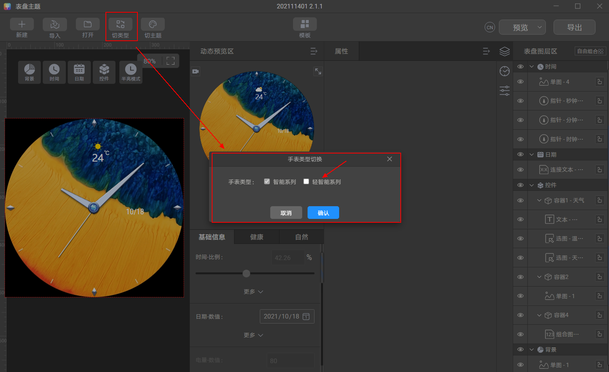

import MergeTable from '@site/src/components/MergeTable';

# 466\*466能力集

## 控件类型

<MergeTable
  headers={['控件类型', 'WATCH系列+GT系列（2.y.z）', '', 'WATCH系列（1.y.z）', '']}
  rows={
    [null, '是否支持', 'y版本号', '是否支持', 'y版本号'],
    ['单图', '是，单张图片像素点大小≤750KB', '0', '是，单张图片像素点大小&gt;750KB', '1'],
    ['选图', '是', '0', '是', '1'],
    ['组合图', '是', '0', '是', '1'],
    ['文本', '是', '0', '是', '1'],
    ['连接文本', '是', '0', '是', '1'],
    ['弧形文本', '是', '1', '是', '1'],
    ['直线图', '是', '0', '是', '1'],
    ['弧形图', '是', '0', '是', '1'],
    ['直线', '否', '/', '是', '1'],
    ['弧形', '否', '/', '是', '1'],
    ['指针', '是', '0', '是', '1'],
    ['单组序列帧', '是，帧数≤30帧且尺寸≤200px*200px', '0', '是，帧数&gt;30帧或尺寸&gt;200px*200px', '1'],
    ['视频', '否', '/', '是', '1'],
    ['动图', '否', '/', '是', '1']
  }
/>

## 数值类型

### 时间

<MergeTable
  headers={['数值类型', 'WATCH系列+GT系列（2.y.z）', '', 'WATCH系列（1.y.z）', '']}
  rows={
    [null, '是否支持', 'y版本号', '是否支持', 'y版本号'],
    ['时钟', '是', '0', '是', '1'],
    ['分钟', '是', '0', '是', '1'],
    ['秒钟', '是', '0', '是', '1'],
    ['上午下午', '是', '0', '是', '1'],
    ['时钟高位', '是', '0', '是', '1'],
    ['时钟低位', '是', '0', '是', '1'],
    ['分钟高位', '是', '0', '是', '1'],
    ['分钟低位', '是', '0', '是', '1'],
    ['秒钟高位', '是', '0', '是', '1'],
    ['秒钟低位', '是', '0', '是', '1'],
    ['时钟比例12', '是', '0', '是', '1'],
    ['时钟比例24', '是', '0', '是', '1'],
    ['分钟比例', '是', '0', '是', '1'],
    ['秒钟比例', '是', '0', '是', '1'],
    ['扫秒比例', '否', '/', '是', '1'],
    ['AM/PM文本', '是', '0', '是', '1']
  }
/>

### 双时区

<MergeTable
  headers={['数值类型', 'WATCH系列+GT系列（2.y.z）', '', 'WATCH系列（1.y.z）', '']}
  rows={
    [null, '是否支持', 'y版本号', '是否支持', 'y版本号'],
    ['双时区时钟', '是', '0', '是', '1'],
    ['双时区分钟', '是', '0', '是', '1'],
    ['双时区时钟高位', '是', '0', '是', '1'],
    ['双时区时钟低位', '是', '0', '是', '1'],
    ['双时区AMPM', '是', '0', '是', '1'],
    ['双时区分钟高位', '是', '0', '是', '1'],
    ['双时区分钟低位', '是', '0', '是', '1'],
    ['双时区时钟比例12', '是', '0', '是', '1'],
    ['双时区时钟比例24', '是', '0', '是', '1'],
    ['双时区分钟比例', '是', '0', '是', '1'],
    ['双时区AM/PM文本', '是', '0', '是', '1'],
    ['双时区缩写文本', '是', '1', '是', '1'],
    ['双时区时/分文本', '否', '/', '是', '1']
  }
/>

### 日期

<MergeTable
  headers={['数值类型', 'WATCH系列+GT系列（2.y.z）', '', 'WATCH系列（1.y.z）', '']}
  rows={
    [null, '是否支持', 'y版本号', '是否支持', 'y版本号'],
    ['日期', '是', '0', '是', '1'],
    ['昨天', '是', '0', '是', '1'],
    ['明天', '是', '0', '是', '1'],
    ['月', '是', '0', '是', '1'],
    ['月数据', '是', '1', '是', '1'],
    ['星期数据', '是', '0', '是', '1'],
    ['日期高位', '是', '0', '是', '1'],
    ['日期低位', '是', '0', '是', '1'],
    ['昨天日期高位', '是', '0', '是', '1'],
    ['昨天日期低位', '是', '0', '是', '1'],
    ['明天日期高位', '是', '0', '是', '1'],
    ['明天日期低位', '是', '0', '是', '1'],
    ['12时辰', '是', '1', '是', '1'],
    ['日期占31天比例', '是', '0', '是', '1'],
    ['星期比例', '是', '0', '是', '1'],
    ['星期文本', '是', '0', '是', '1'],
    ['月份文本', '是', '0', '是', '1']
  }
/>

### 日出日落时间

<MergeTable
  headers={['数值类型', 'WATCH系列+GT系列（2.y.z）', '', 'WATCH系列（1.y.z）', '']}
  rows={
    [null, '是否支持', 'y版本号', '是否支持', 'y版本号'],
    ['日出日落选图', '否', '/', '是', '1'],
    ['日出文本', '是', '1', '是', '1'],
    ['日落文本', '是', '1', '是', '1'],
    ['月出文本', '是', '1', '是', '1'],
    ['月落文本', '是', '1', '是', '1'],
    ['日出日落时钟高位', '是', '1', '是', '1'],
    ['日出日落时钟低位', '是', '1', '是', '1'],
    ['日出日落分钟高位', '是', '1', '是', '1'],
    ['日出日落分钟低位', '是', '1', '是', '1']
  }
/>

### 潮起潮落

<MergeTable
  headers={['数值类型', 'WATCH系列+GT系列（2.y.z）', '', 'WATCH系列（1.y.z）', '']}
  rows={
    [null, '是否支持', 'y版本号', '是否支持', 'y版本号'],
    ['潮涨时间文本', '是', '1', '是', '1'],
    ['潮落时间文本', '是', '1', '是', '1']
  }
/>

### 秒

<MergeTable
  headers={['数值类型', 'WATCH系列+GT系列（2.y.z）', '', 'WATCH系列（1.y.z）', '']}
  rows={
    [null, '是否支持', 'y版本号', '是否支持', 'y版本号'],
    ['前一秒高位', '是', '1', '是', '1'],
    ['前一秒低位', '是', '1', '是', '1'],
    ['前一秒的前一秒（前两秒）高位', '是', '1', '是', '1'],
    ['前一秒的前一秒（前两秒）低位', '是', '1', '是', '1']
  }
/>

### 农历

<MergeTable
  headers={['数值类型', 'WATCH系列+GT系列（2.y.z）', '', 'WATCH系列（1.y.z）', '']}
  rows={
    [null, '是否支持', 'y版本号', '是否支持', 'y版本号'],
    ['农历月份', '是', '0', '是', '1'],
    ['农历日期高位', '是', '0', '是', '1'],
    ['农历日期低位', '是', '0', '是', '1']
  }
/>

### 电量

<MergeTable
  headers={['数值类型', 'WATCH系列+GT系列（2.y.z）', '', 'WATCH系列（1.y.z）', '']}
  rows={
    [null, '是否支持', 'y版本号', '是否支持', 'y版本号'],
    ['电量', '是', '0', '是', '1'],
    ['电量枚举', '是', '0', '是', '1'],
    ['电量状态的枚举', '是', '1', '是', '1'],
    ['电量比例', '是', '0', '是', '1']
  }
/>

### 步数

<MergeTable
  headers={['数值类型', 'WATCH系列+GT系列（2.y.z）', '', 'WATCH系列（1.y.z）', '']}
  rows={
    [null, '是否支持', 'y版本号', '是否支持', 'y版本号'],
    ['步数', '是', '0', '是', '1'],
    ['步数个位', '是', '0', '是', '1'],
    ['步数十位', '是', '0', '是', '1'],
    ['步数百位', '是', '0', '是', '1'],
    ['步数千位', '是', '0', '是', '1'],
    ['步数万位', '是', '0', '是', '1'],
    ['步数目标达成度', '是', '0', '是', '1']
  }
/>

### 卡路里

<MergeTable
  headers={['数值类型', 'WATCH系列+GT系列（2.y.z）', '', 'WATCH系列（1.y.z）', '']}
  rows={
    [null, '是否支持', 'y版本号', '是否支持', 'y版本号'],
    ['卡路里', '是', '0', '是', '1'],
    ['卡路里比例', '是', '0', '是', '1']
  }
/>

### 心率

<MergeTable
  headers={['数值类型', 'WATCH系列+GT系列（2.y.z）', '', 'WATCH系列（1.y.z）', '']}
  rows={
    [null, '是否支持', 'y版本号', '是否支持', 'y版本号'],
    ['心率', '是', '0', '是', '1'],
    ['最大心率', '是', '0', '是', '1'],
    ['最小心率', '是', '0', '是', '1'],
    ['心率区间', '是', '0', '是', '1'],
    ['心率比例', '是', '0', '是', '1']
  }
/>

### 压力

<MergeTable
  headers={['数值类型', 'WATCH系列+GT系列（2.y.z）', '', 'WATCH系列（1.y.z）', '']}
  rows={
    [null, '是否支持', 'y版本号', '是否支持', 'y版本号'],
    ['压力', '是', '0', '是', '1'],
    ['压力等级类型', '是', '1', '是', '1'],
    ['压力比例', '是', '0', '是', '1']
  }
/>

### 中高强度时间

<MergeTable
  headers={['数值类型', 'WATCH系列+GT系列（2.y.z）', '', 'WATCH系列（1.y.z）', '']}
  rows={
    [null, '是否支持', 'y版本号', '是否支持', 'y版本号'],
    ['中高强度时间', '是', '0', '是', '1'],
    ['中高强度时间比例', '是', '0', '是', '1']
  }
/>

### 站立次数

<MergeTable
  headers={['数值类型', 'WATCH系列+GT系列（2.y.z）', '', 'WATCH系列（1.y.z）', '']}
  rows={
    [null, '是否支持', 'y版本号', '是否支持', 'y版本号'],
    ['站立次数', '是', '0', '是', '1'],
    ['站立次数比例', '是', '0', '是', '1']
  }
/>

### 最大摄氧量

<MergeTable
  headers={['数值类型', 'WATCH系列+GT系列（2.y.z）', '', 'WATCH系列（1.y.z）', '']}
  rows={
    [null, '是否支持', 'y版本号', '是否支持', 'y版本号'],
    ['最大摄氧量', '是', '0', '是', '1'],
    ['最大摄氧量比例', '是', '0', '是', '1']
  }
/>

### 天气

<MergeTable
  headers={['数值类型', 'WATCH系列+GT系列（2.y.z）', '', 'WATCH系列（1.y.z）', '']}
  rows={
    [null, '是否支持', 'y版本号', '是否支持', 'y版本号'],
    ['气温', '是', '0', '是', '1'],
    ['最高温度', '是', '0', '是', '1'],
    ['最低温度', '是', '0', '是', '1'],
    ['当前温度减一', '是', '0', '是', '1'],
    ['当前温度加一', '是', '0', '是', '1'],
    ['28种天气类型', '是', '0', '是', '1'],
    ['11种天气类型', '是', '1', '是', '1'],
    ['温度类型', '是', '0', '是', '1'],
    ['温度比例', '是', '0', '是', '1'],
    ['月相', '是', '1', '是', '1']
  }
/>

### 大气压

<MergeTable
  headers={['数值类型', 'WATCH系列+GT系列（2.y.z）', '', 'WATCH系列（1.y.z）', '']}
  rows={
    [null, '是否支持', 'y版本号', '是否支持', 'y版本号'],
    ['气压', '是', '0', '是', '1'],
    ['气压比例', '是', '0', '是', '1']
  }
/>

### 空气质量（仅国内）

<MergeTable
  headers={['数值类型', 'WATCH系列+GT系列（2.y.z）', '', 'WATCH系列（1.y.z）', '']}
  rows={
    [null, '是否支持', 'y版本号', '是否支持', 'y版本号'],
    ['AQI', '是', '0', '是', '1'],
    ['AQI等级', '是', '0', '是', '1'],
    ['AQI比例', '是', '0', '是', '1']
  }
/>

### 海拔高度

<MergeTable
  headers={['数值类型', 'WATCH系列+GT系列（2.y.z）', '', 'WATCH系列（1.y.z）', '']}
  rows={
    [null, '是否支持', 'y版本号', '是否支持', 'y版本号'],
    ['海拔', '是', '0', '是', '1'],
    ['海拔高度单位', '是', '0', '是', '1'],
    ['高度比例', '是', '0', '是', '1'],
    ['海拔高度数据', '是', '1', '是', '1']
  }
/>

### 距离

<MergeTable
  headers={['数值类型', 'WATCH系列+GT系列（2.y.z）', '', 'WATCH系列（1.y.z）', '']}
  rows={
    [null, '是否支持', 'y版本号', '是否支持', 'y版本号'],
    ['距离数据', '是', '1', '是', '1'],
    ['距离文本', '是', '1', '是', '1']
  }
/>

### 情绪

<MergeTable
  headers={['数值类型', 'WATCH系列+GT系列（2.y.z）', '', 'WATCH系列（1.y.z）', '']}
  rows={
    [null, '是否支持', 'y版本号', '是否支持', 'y版本号'],
    ['情绪类型', '是', '9', '是', '9'],
    ['情绪获取时间', '是', '9', '是', '9']
  }
/>

### 跳转应用

<MergeTable
  headers={['应用', 'WATCH系列+GT系列（2.y.z）', '', 'WATCH系列（1.y.z）', '']}
  rows={
    [null, '是否支持', 'y版本号', '是否支持', 'y版本号'],
    ['双时区', '是', '0', '是', '1'],
    ['心率', '是', '0', '是', '1'],
    ['站立次数', '是', '0', '是', '1'],
    ['中高强度时间', '是', '0', '是', '1'],
    ['天气', '是', '0', '是', '1'],
    ['空气质量（仅国内）', '是', '0', '是', '1'],
    ['大气压', '是', '0', '是', '1'],
    ['海拔高度', '是', '0', '是', '1'],
    ['日出日落时间', '是', '0', '是', '1'],
    ['距离', '是', '0', '是', '1'],
    ['睡眠', '是', '0', '是', '1'],
    ['锻炼', '是', '0', '是', '1'],
    ['支付宝（仅国内）', '是', '0', '是', '1'],
    ['闹钟', '是', '0', '是', '1'],
    ['秒表', '是', '0', '是', '1'],
    ['计时器', '是', '0', '是', '1'],
    ['锻炼记录', '是', '0', '是', '1'],
    ['训练状态', '是', '0', '是', '1'],
    ['活动记录', '是', '0', '是', '1'],
    ['有氧锻炼', '是', '0', '是', '1'],
    ['联系人', '是', '0', '是', '1'],
    ['音乐', '是', '0', '是', '1'],
    ['指南针', '是', '0', '是', '1'],
    ['通话记录', '是', '0', '是', '1'],
    ['血氧饱和度（仅国内）', '是', '0', '是', '1'],
    ['紫外线（仅国内）', '是', '0', '是', '1'],
    ['月相', '是', '0', '是', '1'],
    ['爬楼', '是', '0', '是', '1'],
    ['情绪', '是', '9', '是', '9']
  }
/>

## 字体字号

<MergeTable
  headers={['字体字号', 'WATCH系列+GT系列（2.y.z）', '', 'WATCH系列（1.y.z）', '']}
  rows={
    [null, '是否支持', 'y版本号', '是否支持', 'y版本号'],
    ['HW-ezpansiva Roboto-Blackltalic Roboto-Bold DaysOne-Regular Oswald-Medium RussoOne-Regular janus-bold', '否', '/', '是', '1'],
    ['ROBOTO_MEDIUM 36字号、38字号 ROBOTOCONDENSED_REGULAR 36字号', '是', '1', '是', '1'],
    ['ROBOTO_MEDIUM 20字号、26字号 ROBOTOCONDENSED_REGULAR 20字号、26字号、38字号', '是', '0', '是', '1']
  }
/>

各字体字号显示效果，详见：[466x466 支持的字体显示效果.zip](https://alliance-communityfile-drcn.dbankcdn.com/FileServer/getFile/cmtyPub/011/111/111/0000000000011111111.20250822125851.40770106646038599305038135252593%3A50001231000000%3A2800%3AE7ED344AEC24B24E6FA3E6B22977D3F84F7B0BE85970C582498F2C471122DC5C.zip?needInitFileName=true)。

## 高级功能

<MergeTable
  headers={['高级功能', 'WATCH系列+GT系列（2.y.z）', '', 'WATCH系列（1.y.z）', '']}
  rows={
    [null, '是否支持', 'y版本号', '是否支持', 'y版本号'],
    ['景深', '否', '/', '是', '1'],
    ['颜色自定义', '是', '2', '是', '2'],
    ['样式自定义', '是', '2', '是', '1'],
    ['控件自定义', '是', '0', '是', '1']
  }
/>

## 熄屏表盘

<MergeTable
  headers={['熄屏表盘', 'WATCH系列+GT系列（2.y.z）', '', 'WATCH系列（1.y.z）', '']}
  rows={
    [null, '是否支持', 'y版本号', '是否支持', 'y版本号'],
    [{ text: '熄屏表盘', rowspan: 2, colspan: 1 }, '是（非黑像素点占比&lt;10%）', '0', { text: '是（非黑像素点占比&lt;20%）', rowspan: 2, colspan: 1 }, { text: '1', rowspan: 2, colspan: 1 }],
    [null, '是（10%≤非黑像素点占比&lt;20%）', '1', null, null]
  }
/>

## 版本号差异性汇总

| 使用的能力集 | 表盘版本号 |
| --- | --- |
| 高级功能   * 在1.1.z基础上，使用[颜色自定义](https://developer.huawei.com/consumer/cn/doc/content/color-customize-0000001459125433) | 1.2.z |
| 高级功能   * [景深](https://developer.huawei.com/consumer/cn/doc/content/depth-of-field-0000001401719294)     控件 类型   * 背景-单图（像素点大小&gt;750KB） * 背景-视频 * 背景-动图 * 背景-单组序列帧（尺寸&gt;200px\*200px或张数&gt;30张） * 背景-自定义选项 * 时间-多组序列帧 * 时间-自定义选项 * 日期-自定义选项 * 控件-单组序列帧 * 直线 * 弧形   字体 字号   * HW-ezpansiva * Roboto-Blackltalic * Roboto-Bold * DaysOne-Regular * Oswald-Medium * RussoOne-Regular * janus-bold     数值类型   * 扫秒比例  * 双时区 时/分文本 * 日出日落选图 | 1.1.z |
| 高级功能   * 在2.0.z/2.1.z基础上，使用[颜色自定义](https://developer.huawei.com/consumer/cn/doc/content/color-customize-0000001459125433) * 在2.0.z/2.1.z基础上，使用[样式自定义](https://developer.huawei.com/consumer/cn/doc/content/style-customize-0000001401559326) | 2.2.z |
| 控件 类型   * 弧形文本     字体 字号   * ROBOTO\_MEDIUM 36/38字号 * ROBOTOCONDENSED\_REGULAR 36字号     数值类型   * 月数据 * 12时辰 * 月相 * 双时区缩写文本 * 电量状态的枚举 * 压力等级类型 * 11种天气类型 * 海拔高度数据 * 距离文本 * 距离数据 * 日出文本 * 日落文本 * 月出文本 * 月落文本 * 日出日落时钟高位 * 日出日落时钟低位 * 日出日落分钟高位 * 日出日落分钟低位 * 潮涨时间文本 * 潮落时间文本 * 前一秒高位 * 前一秒低位 * 前一秒的前一秒（前两秒）高位 * 前一秒的前一秒（前两秒）低位 | 2.1.z |
| 未使用以上1.2.z、1.1.z、2.2.z和2.1.z版本包含的能力集 | 2.0.z |

## 切换制作模式

新建466\*466分辨率表盘项目时，默认为“WATCH系列+GT系列（2.y.z）”制作模式，此时“WATCH系列（1.y.z）”支持的能力集（详见以上表格）默认置灰不可选择/默认不显示。

需点击“切类型”，取消勾选“轻智能系列”，进入仅制作“智能系列”模式，此时“智能系列”支持的能力集可以选择/显示出来。

WATCH系列+GT系列（2.y.z）：表盘资源包版本号为2.y.z，可以同时应用于WATCH系列+GT系列手表，在Theme Studio中显示为“轻智能系列”。

WATCH系列（1.y.z）：表盘资源包版本号为1.y.z，仅支持应用于WATCH系列手表，在Theme Studio中显示为“智能系列”。

