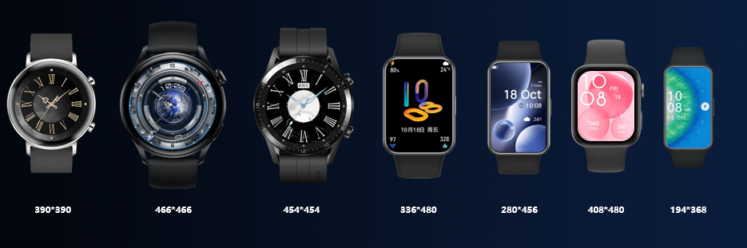

import MergeTable from '@site/src/components/MergeTable';

# 分辨率与版本号

## 表盘分辨率

华为手表/手环屏幕具有多种分辨率，我们将基于屏幕分辨率进行表盘制作。

Theme Studio支持制作的表盘分辨率如下图所示：

## 表盘版本号

表盘版本号：x.y.z。

x：作为手表GUI能力的标识。不可自定义编辑。

y：作为手表表盘能力的版本号，从1开始定义。不可自定义编辑。

z：作为表盘资源包版本号，用于表盘资源包版本更新，从1开始定义，不能超过9000。

## 表盘分发规则

表盘资源包上架后，将根据其分辨率和版本号，分发到相应手表/手环的表盘市场，提供给用户使用。

<strong>当前分发规则如下表所示：</strong>

<MergeTable
  headers={['设备类型', '表盘分辨率', '分辨率代码', '表盘版本号', '是否支持熄 屏表盘', '熄屏表盘非黑 像素点占比', '默认分发规则', '备注']}
  rows={
    [{ text: '手表', rowspan: 14, colspan: 1 }, { text: '466*466', rowspan: 6, colspan: 1 }, { text: 'HWHD09', rowspan: 6, colspan: 1 }, '2.1.z（必做）', '是', '20%', 'GT 3及以上系列、WATCH 3及以上系列、GT Runner、GT Cyber、WATCH Ultimate系列、WATCH Buds', '支持分发到WATCH 3及以上系列的表盘市场，但同时存在2.1.z和1.y.z版本时，仅展示1.y.z版本'],
    [null, null, null, '2.2.z', '是', '20%', 'GT 3及以上系列、GT Runner、GT Cyber WATCH Ultimate系列', '在2.1.z基础上，使用 颜色自定义 、 样式自定义 功能，导出2.2.z版本'],
    [null, null, null, '2.9.z', '是', '20%', '仅支持分发到Harmony OS 6.0及以上的GT、WATCH系列', '使用了情绪相关的数据类型，导出2.9.z版本'],
    [null, null, null, '1.1.z', '是', '20%', 'WATCH 3及以上系列', '/'],
    [null, null, null, '1.2.z', '是', '20%', 'WATCH 3及以上系列', '在1.1.z基础上，使用 颜色自定义 功能，导出1.2.z版本'],
    [null, null, null, '1.9.z', '是', '20%', '仅支持分发到Harmony OS 6.0及以上的WATCH系列', '使用了情绪相关的数据类型，导出1.9.z版本'],
    [null, '390*390', 'HWHD01', '3.5.z/3.6.z/3.7.z', '否', '/', 'GT 2系列（42mm）', '/'],
    [null, { text: '454*454', rowspan: 2, colspan: 1 }, { text: 'HWHD02', rowspan: 2, colspan: 1 }, '2.5.z/2.6.z/2.7.z', '否', '/', 'GT 2系列（46mm）', '/'],
    [null, null, null, '2.8.z', '否', '/', 'GT 2 Pro', '/'],
    [null, { text: '280*456', rowspan: 2, colspan: 1 }, { text: 'HWHD06', rowspan: 2, colspan: 1 }, '2.1.z/2.3.z', '否', '/', 'WATCH FIT系列 WATCH D', '/'],
    [null, null, null, '2.7.z', '是', '10%', 'WATCH D', '带熄屏表盘的资源包，版本号为2.7.z'],
    [null, '336*480', 'HWHD11', '2.1.z/2.2.z', '是', '20%', 'WATCH FIT 2', '使用 样式自定义 功能，版本号为2.2.z'],
    [null, { text: '408*480', rowspan: 2, colspan: 1 }, { text: 'HWHD13', rowspan: 2, colspan: 1 }, '2.1.z', '是', '20%', 'WATCH FIT 3/4', '/'],
    [null, null, null, '2.9.z', '是', '20%', '仅支持分发到Harmony OS 6.0及以上的FIT系列', '使用了情绪相关的数据类型，导出2.9.z版本'],
    [{ text: '手环', rowspan: 3, colspan: 1 }, { text: '194*368', rowspan: 2, colspan: 1 }, { text: 'HWHD07', rowspan: 2, colspan: 1 }, '2.1.z', '否', '/', '华为手环 6/7/8/9/10、WATCH FIT mini', '/'],
    [null, null, null, '2.2.z', '是', '20%', '华为手环 8/9/10', '制作熄屏表盘，版本号为2.2.z'],
    [null, '286*482', 'HWHD 14', '2.1.z', '是', '20%', '华为手环', '/']
  }
/>

<strong>WATCH Buds</strong> <strong>特别说明</strong> <strong>：</strong>

在466\*466 2.1.z版本基础上，WATCH Buds不支持以下能力集：

* [大气压](/docs/distribute/content-dist/theme-center/development-tutorial-0000001054519376/watchface-0000001054571181/basic-concepts-0000001207883464/resolution-capability-0000001523484462/x466-capability-0000001881726154#section1127013516811)
* [海拔高度](/docs/distribute/content-dist/theme-center/development-tutorial-0000001054519376/watchface-0000001054571181/basic-concepts-0000001207883464/resolution-capability-0000001523484462/x466-capability-0000001881726154#section1337313267819)
* 指南针（跳转应用）

因此，466\*466 2.1.z版本如果使用了以上能力集，将无法分发到WATCH Buds的表盘市场。

## 表盘上传规则

通过主题联盟上传手表表盘时，必做分辨率如下：

<MergeTable
  headers={['设备类型', '表盘分辨率', '分辨率代码', '是否必做']}
  rows={
    [{ text: '手表', rowspan: 4, colspan: 1 }, '454*454', 'HWHD02', '选做'],
    [null, '466*466', 'HWHD09', '必做'],
    [null, '336*480', 'HWHD11', '选做'],
    [null, '408*480', 'HWHD13', '必做']
  }
/>

通过主题联盟上传手环表盘时，必做分辨率如下：

<MergeTable
  headers={['设备类型', '表盘分辨率', '分辨率代码', '是否必做']}
  rows={
    [{ text: '手环', rowspan: 2, colspan: 1 }, '194*368', 'HWHD07', '必做'],
    [null, '286*482', 'HWHD 14', '选做']
  }
/>

## 表盘能力集

表盘能力集是指：一款表盘设备支持的能力范围，不同的表盘设备支持的能力集不同。

表盘能力集包括：控件类型、数值类型、字体字号、高级功能、熄屏表盘。

每类分辨率支持的能力集及对应的版本号详见：

* [466\*466能力集](/docs/distribute/content-dist/theme-center/development-tutorial-0000001054519376/watchface-0000001054571181/basic-concepts-0000001207883464/resolution-capability-0000001523484462/x466-capability-0000001881726154)
* [408\*480能力集](/docs/distribute/content-dist/theme-center/development-tutorial-0000001054519376/watchface-0000001054571181/basic-concepts-0000001207883464/resolution-capability-0000001523484462/x408-capability-0000001933842793)
* [390\*390/454\*454能力集](/docs/distribute/content-dist/theme-center/development-tutorial-0000001054519376/watchface-0000001054571181/basic-concepts-0000001207883464/resolution-capability-0000001523484462/x454-capability-0000001580733885)
* [280\*456/336\*480能力集](/docs/distribute/content-dist/theme-center/development-tutorial-0000001054519376/watchface-0000001054571181/basic-concepts-0000001207883464/resolution-capability-0000001523484462/x280-capability-0000001592176765)
* [194\*368能力集](/docs/distribute/content-dist/theme-center/development-tutorial-0000001054519376/watchface-0000001054571181/basic-concepts-0000001207883464/resolution-capability-0000001523484462/x194-capability-0000001591976781)