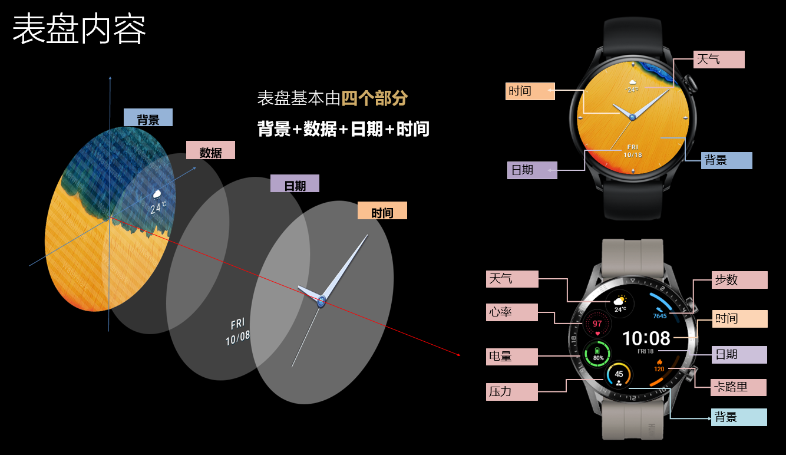
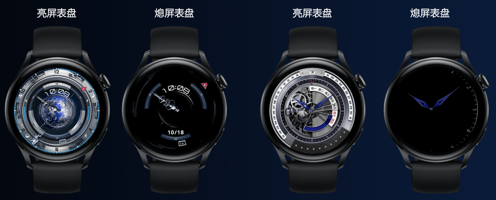

# 表盘介绍

## 表盘是什么

“表盘”指华为手表/手环亮屏或熄屏状态下显示的界面，创作者可通过Theme Studio可视化制作个性表盘。用户可进入主题APP和华为运动健康APP的表盘市场，选择心仪表盘，解锁“腕”间精彩。

## 表盘内容

表盘内容由以下四大元素组成：

* <strong>背景</strong>（表盘背景，支持静态或动态背景），为必做元素。
* <strong>时间</strong>（时、分、秒等时间相关数据），为必做元素。
* <strong>日期</strong>（月、日、星期等日期相关数据），为选做元素。
* <strong>数据</strong>（电量、步数、卡路里、心率、压力、天气等数据），为选做元素。

## 亮屏表盘与熄屏表盘

一个表盘资源包，包含亮屏表盘与熄屏表盘。

### 亮屏表盘

<strong>亮屏表盘</strong>：亮屏状态时显示的表盘，由背景、时间、日期和数据组成。

<strong>使用场景</strong>：抬腕、按下表冠或点击屏幕，让屏幕整块亮起，显示亮屏表盘。如无操作，整块屏幕在一段时间后自动熄灭，亮屏表盘随之消失。

### 熄屏表盘

<strong>熄屏表盘</strong>：熄屏状态时显示的表盘，由有限的信息组成。

<strong>使用场景</strong>：整块屏幕熄灭后，支持在不点亮整块屏幕的情况下，控制屏幕局部亮起，显示熄屏表盘。熄屏表盘在手表上常亮。

* 仅部分手表设备支持熄屏表盘，详见[分辨率与版本号](/docs/distribute/content-dist/theme-center/development-tutorial-0000001054519376/watchface-0000001054571181/basic-concepts-0000001207883464/resolution-version-0000001252603441)。同时用户还须在手表中打开“熄屏显示”，熄屏表盘才会显示出来。
* 熄屏显示，也称之为AOD（Always On Display）。