# 辅助功能

## 跨分辨率插入

<strong>功能介绍</strong>：支持跨分辨率插入已制作完成的表盘项目，提高多分辨率制作效率。

<strong>功能演示</strong>：以466\*466分辨率表盘资源包插入454\*454分辨率制作项目中为例进行演示 。

1. 将制作完成的466\*466表盘包导出保存，获得一个466\*466表盘资源包 xxxx.hwt文件。

   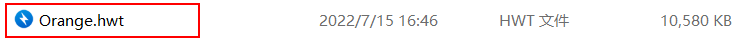
2. 新建一个455\*455分辨率制作项目。通过“导入”&gt;“插入到当前表盘”，将制作完成的466\*466分辨率表盘资源包插入进来。

   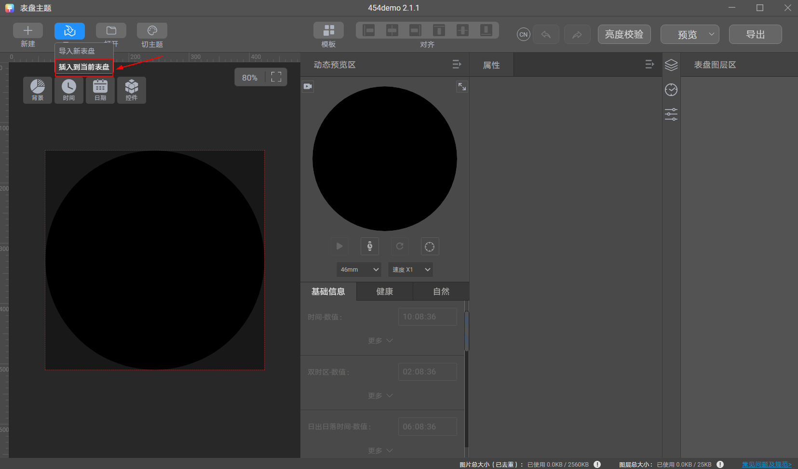

   插入后出现提示：资源在进行跨分辨率插入时，会基于不同分辨率进行等比换算，插入后需手动检查并调整，以达到最佳效果。

   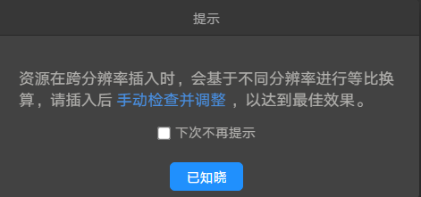

   关闭提示后，页面中将出现466\*466分辨率表盘资源包中的全部素材，其中454\*454分辨率支持的素材可直接勾选复用；454\*454分辨率不支持的素材置灰不可选择，或者可以手动选择并替换为支持的素材。

   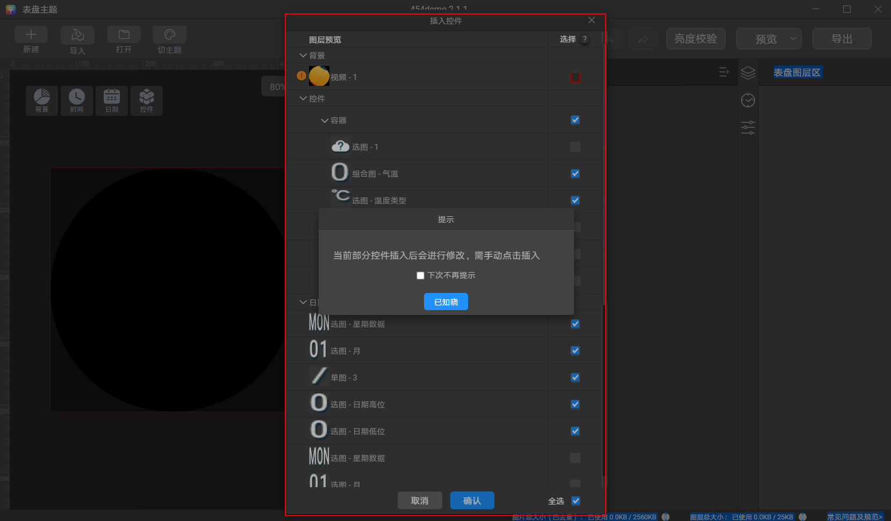

   示例：视频不支持在454\*454分辨率中使用，可手动选择并确认替换为支持的单图：

   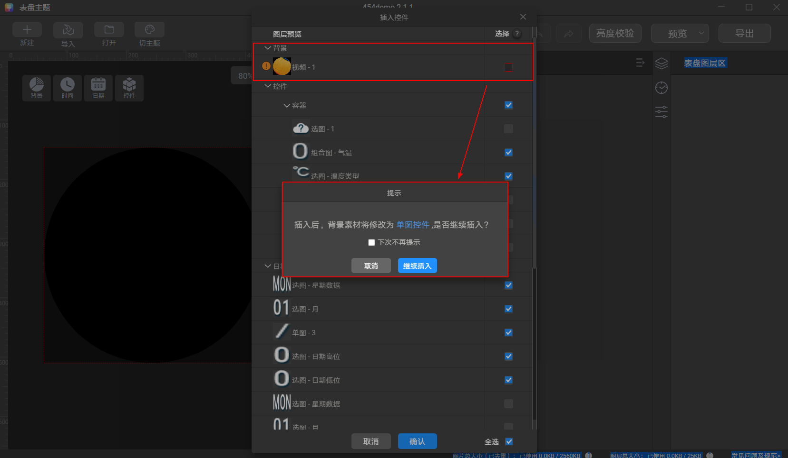

   图层选择完成后，点击“确认”即可完成插入。

   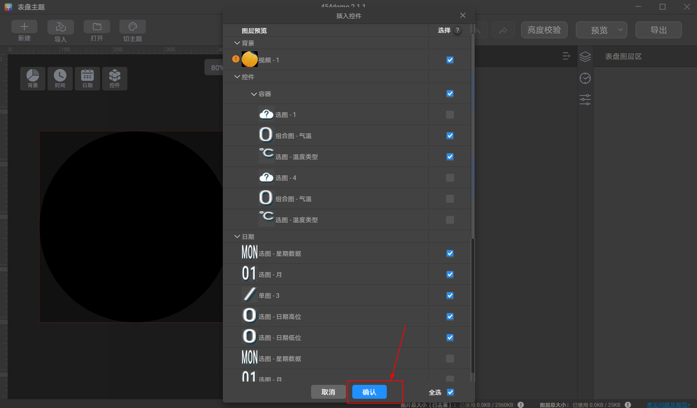
3. 插入完成后，手动检查并调整图层，以达到最佳效果。

   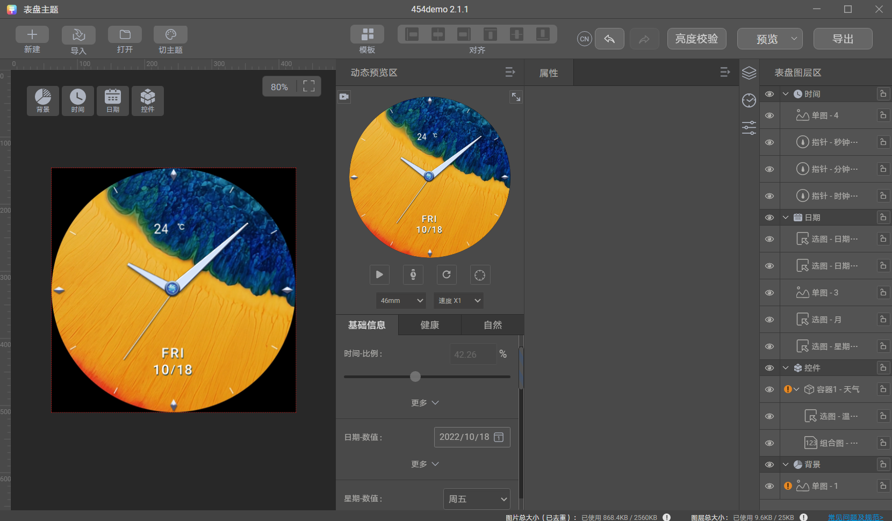

## 图片处理能力

* 支持图层与图层之间，容器框与容器框对齐，提供多种对齐方式。

  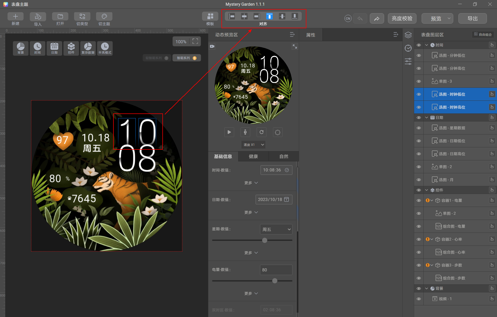
* 支持素材的旋转，缩放。

  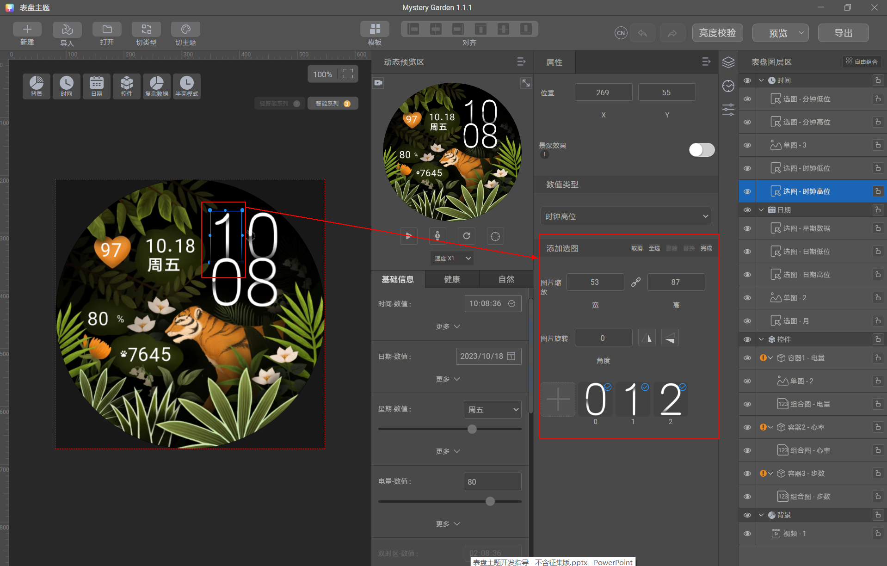

## 表盘模板

Theme Studio中内置表盘模板，可通过添加模板-替换素材，高效制作表盘。

同时支持将已制作完成的整个表盘或单个模块（背景、时间、日期、控件模块）添加为模板，便于后续复用。

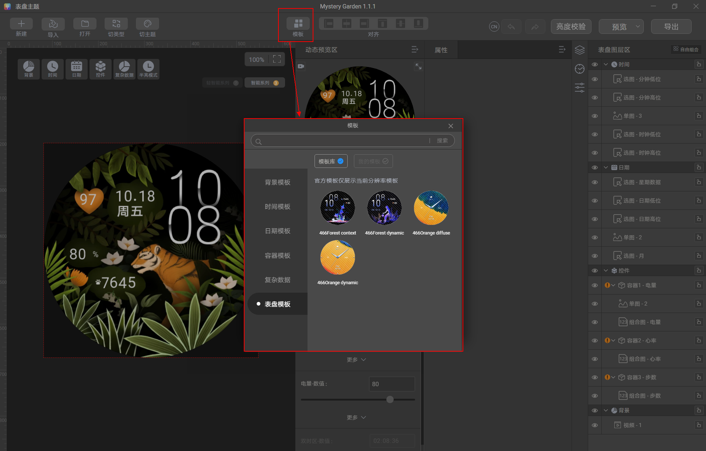

例：将整个表盘添加为模板。

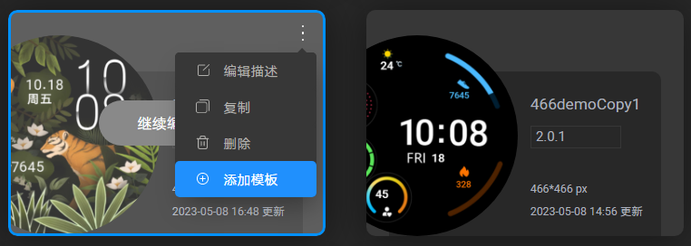

例：将时间模块添加为模板。

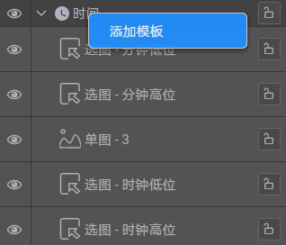

## Theme Studio快捷键

| 操作 | 快捷键（Windows） | 快捷键（ macOS） |
| --- | --- | --- |
| 删除图层 | Delete | Delete |
| 复制图层 | Ctrl+C | Command+C |
| 粘贴图层 | Ctrl+V | Command+V |
| 向上/下/左/右移动1像素 | ▲/▼/◀ / ▶ | ▲/▼/◀ / ▶ |
| 向上/下/左/右移动10像素 | Shift+▲/▼/◀ / ▶ | Shift+▲/▼/◀ / ▶ |
| 撤回 | Ctrl+Z | Command+Z |
| 重做 | Ctrl+Shift+Z | Command+Shift+Z |

1. 全局可支持10个步骤的撤回与重做。
2. 切换类型、切换模板后，之前的快捷键步骤将会被清空。