# 颜色自定义

## 功能介绍

<strong>颜色自定义功能</strong>：支持设计师自定义颜色，应用于已选择的图层。同时支持用户在手表侧自定义设置其他颜色，应用于设计师已选择的图层。

1. “颜色自由组合”与[“样式自由组合”](https://developer.huawei.com/consumer/cn/doc/content/style-customize-0000001401559326)功能互斥，只能选择其中一种进行制作。例如：当制作了“颜色自由组合”后，再切换到“样式自由组合”，会提示“暂未达到使用该功能条件”。反之亦然。

   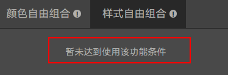
2. 每个表盘最多支持创建28种自定义颜色。以下示例共创建了5个自定义颜色。
3. 选择高亮颜色后，将对其进行亮度校验。

<strong>颜色自定义表盘示例</strong>：以下示例表盘中，设计师自定义了5种颜色，应用于已选择的时间和日期图层。用户下载并安装该表盘后，可以设置颜色，该颜色将被应用到时间和日期图层。

<strong>颜色自定义表盘使用方法</strong>：长按表盘 &gt; 点击“设置” &gt; 上下滑动，切换颜色。

## 制作实操

1. **新建/打开一个466\*466表盘制作项目。**

   按照常规方法，制作一个466\*466表盘。本示例中，直接打开一个制作好的466\*466表盘。

   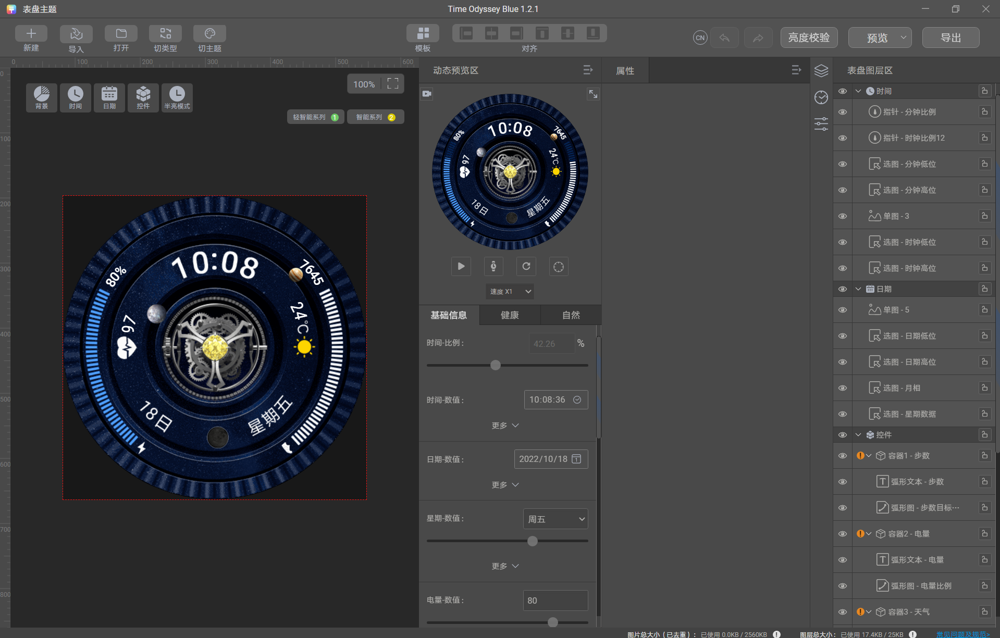
2. <strong>为亮屏表盘设置颜色自由组合。</strong>

   ① 点击“自由组合”&gt;“创建新颜色”，进入颜色自由组合制作页面。

   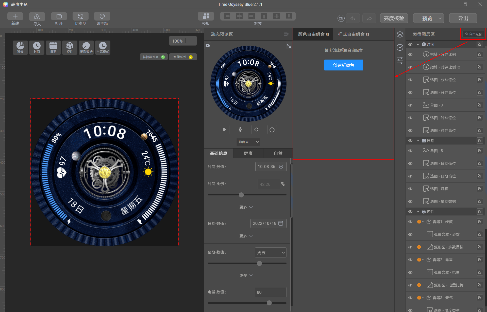

   ② 在颜色设置区域，先设置颜色和透明度，然后点击“编辑”，进入图层选择页面。

   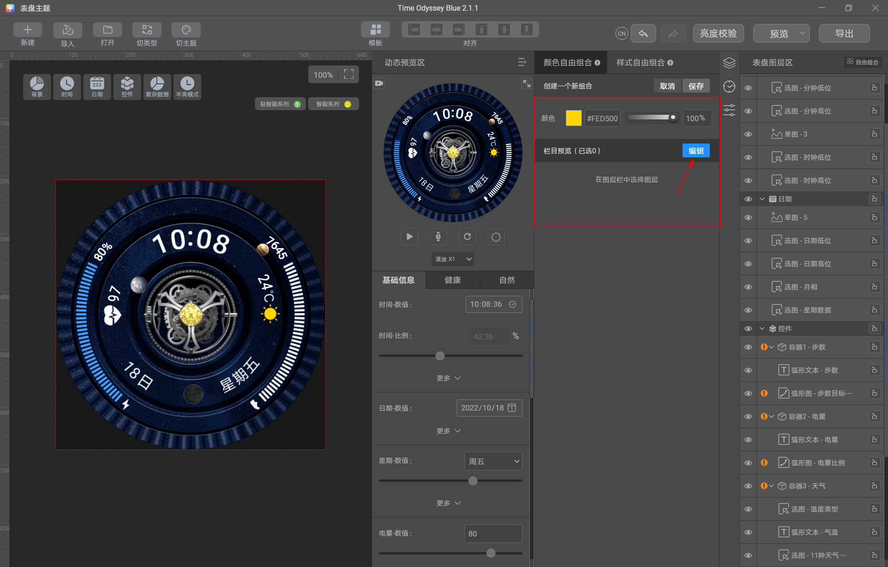

   ③ 在图层选择页面，勾选目标图层。选中的图层会出现在栏目预览区域，并应用当前设置的颜色，颜色应用效果可以在左侧区域预览。

   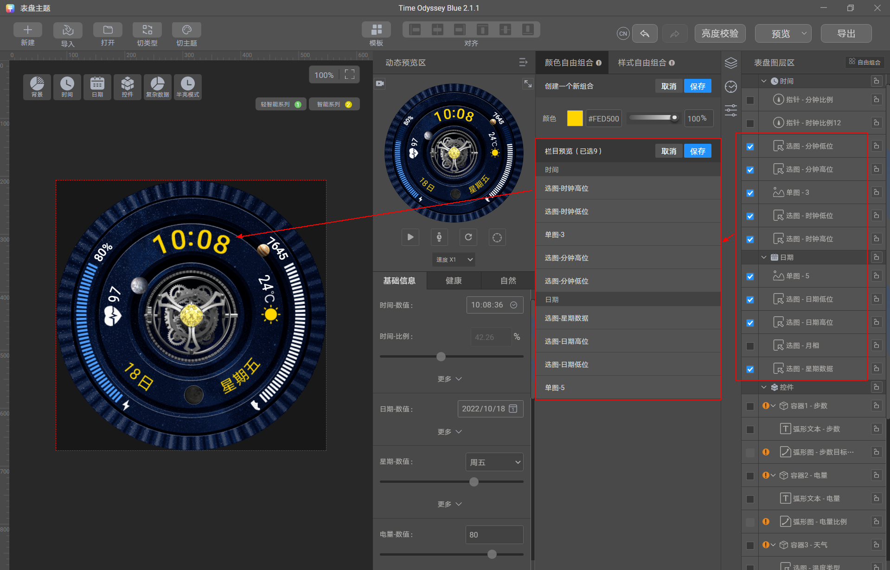

   ④ 点击“保存”当前选中的图层。再点击“保存”当前组合中的颜色和图层。

   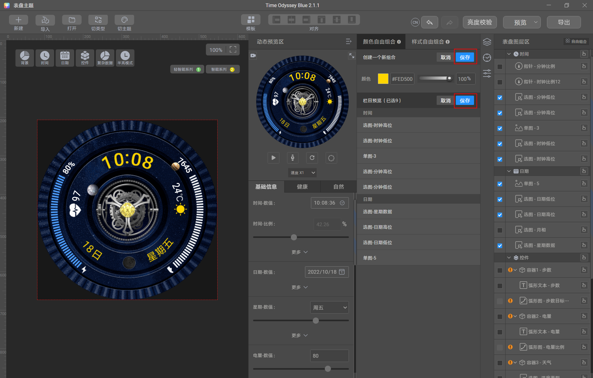

   可以看到，第一个自定义颜色组合就设置好了。

   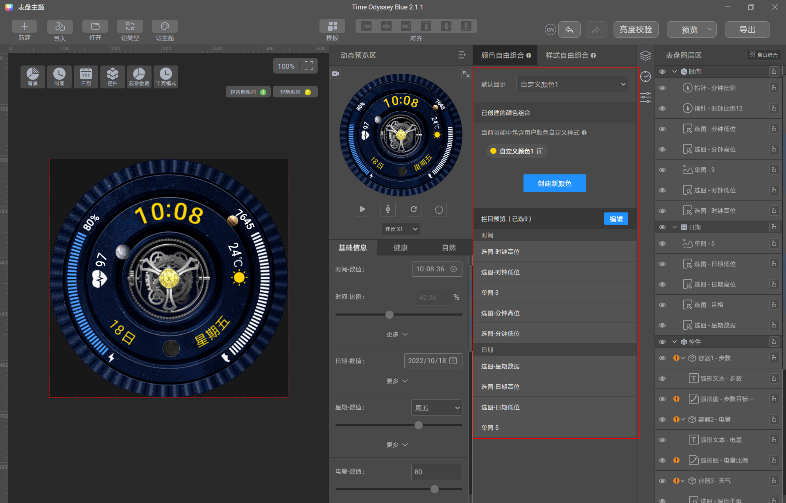

   

   1. 保存选中的图层后，可再次点击“编辑”修改。
   2. 除了选择设计师自定义创建的颜色外，用户还可以在手表侧自定义设置其他颜色，应用到选中的图层上。为保证比较好的表盘效果，建议设计师在选择图层时，考虑用户在手表侧自定义设置其他颜色的场景。

   ⑤ 点击“创建新颜色”，继续创建更多的自定义颜色。最多支持创建28种自定义颜色。

   本示例共创建了5个自定义颜色。

   可以在“默认显示”区域，选择默认展示的自定义颜色。

   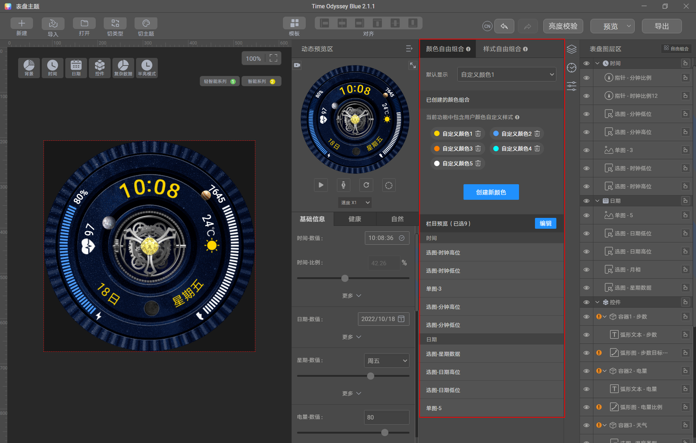

   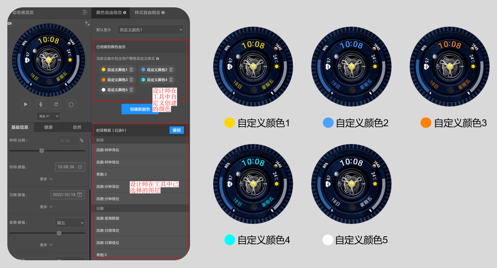
3. <strong>为AOD表盘设置颜色自由组合。</strong>

   ① 点击“半亮模式”，进入AOD表盘制作页面。

   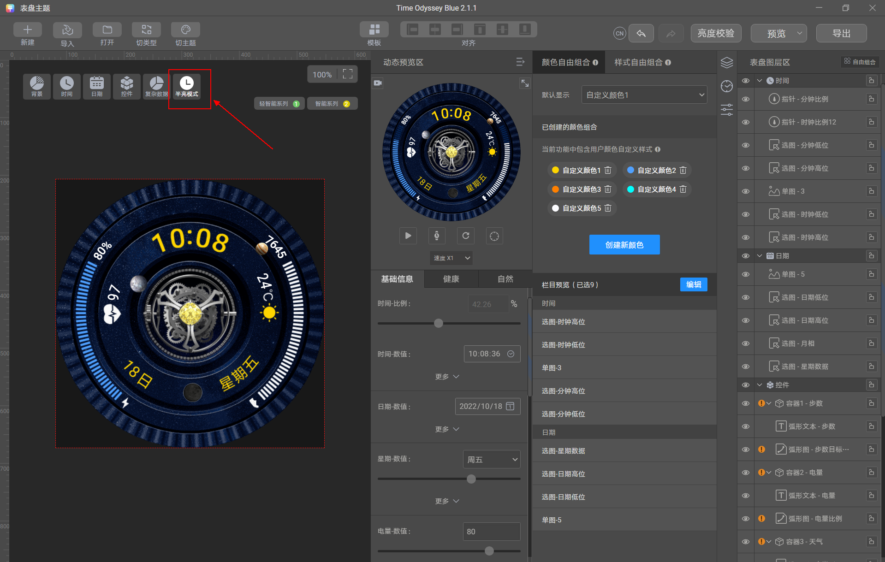

   ② AOD表盘中的颜色选项，将自动跟随亮屏表盘中创建好的自定义颜色选项，不支持另外再创建。

   但是可以编辑选中的图层：点击“编辑”，将AOD表盘中需要改变颜色的图层选中即可。

   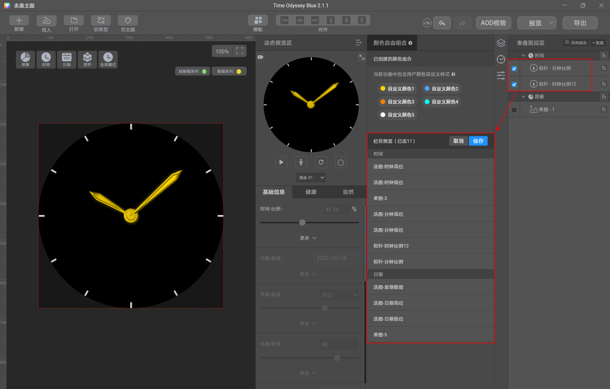
4. <strong>预览图制作。</strong>

   表盘制作完成后，可在动态预览区点击  或拉动进度条，预览表盘动态效果。

   预览无误后，点击  将数据恢复至默认状态（截图之前必须将数据恢复至默认状态）。

   然后点击“预览”-“截屏生成展示图”，自动生成三张预览图（cover.jpg、aod.jpg、icon.jpg）和一张缩略图（res.png）。

   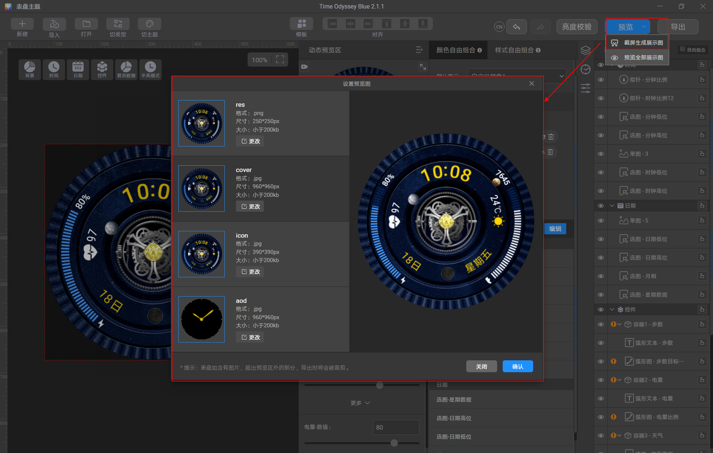
5. <strong>表盘导出。</strong>

   截图完成后，点击“导出”，填写以下信息后，点击“确认”导出。

   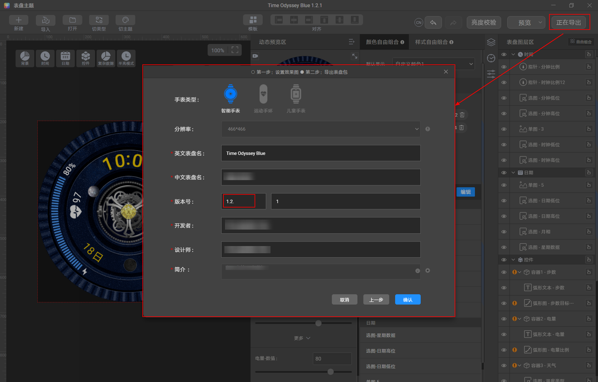

   导出后获得以下1个文件：xxxx.hwt （xxxx为表盘英文名称）。

   xxxx.hwt：表盘资源包，后续将对其进行测试、自检与上传到联盟。