# 控件自定义

## 功能介绍

<strong>控件自定义</strong>：支持在表盘上设置多个自定义区域，并为每个自定义区域制作多个自定义选项。用户通过表盘市场下载、安装控件自定义表盘后，可以为每个自定义区域更换展示的自定义选项。

<strong>控件自定义表盘示例</strong>：示例表盘设置了4个圆形的自定义区域，每个自定义区域制作了12个自定义选项，用户可以从这12个自定义选项中，选择其中一个进行展示。

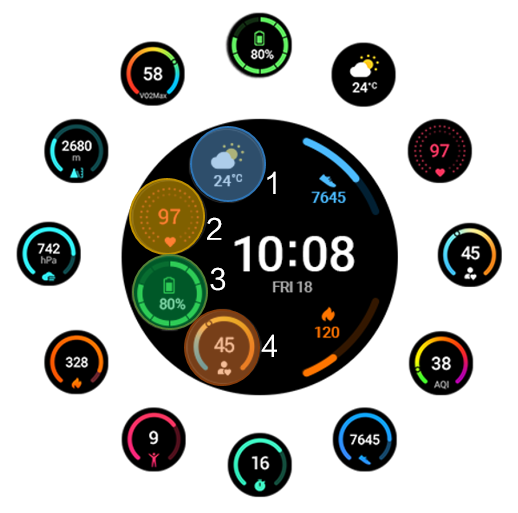

<strong>控件自定义表盘使用方法</strong> <strong>：</strong>长按表盘 &gt; 点击“设置” &gt;点击“自定义区域”&gt; 更换自定义选项。

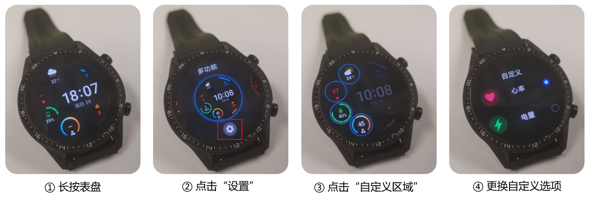

## 设计与切图

下文以454\*454分辨率为例进行说明，其他分辨率是类似的。

### 视觉设计

先设计好454px\*454px的控件自定义表盘预览图。

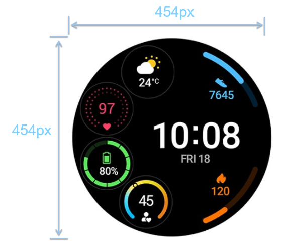

### 切图准备

<strong>非自定义部分切图</strong> <strong>示例：</strong>

在本示例中，步数、卡路里等数据，是非自定义的部分。

<strong>自定义部分切图</strong> <strong>示例</strong>：

* 自定义蒙版：上表后用户使用自定义功能时，突出可自定义的区域。
* 自定义边框：上表后用户使用自定义功能时，显示可自定义区域的边框。
* 自定义选项预览图：上表后用户使用自定义功能时，显示可以自定义切换的选项预览图（如天气、心率、电量、压力等数据选项）。
* 自定义选项切图：每一个自定义选项的切图资源。

1. 自定义蒙版尺寸需与表盘分辨率一致，制作时将自定义区域挖空，并设置60%透明度。
2. 自定义区域必须添加一个边框，标明每个可自定义区域的范围。自定义边框的形状和大小建议与当前自定义容器的边框和大小保持一致。
3. 自定义选项预览图需与实际制作的数据样式保持一致。

## 制作说明

1. 一个表盘最多同时支持制作16个自定义选项，每个自定义选项下的图层不超过5层。
2. 每一个自定义容器中，至少制作两个自定义选项。
3. 选中自定义容器，可调整容器的位置、大小和默认展示的选项。
4. 添加新的自定义容器后，勾选目标自定义选项，可将其直接复制到新的自定义容器中。

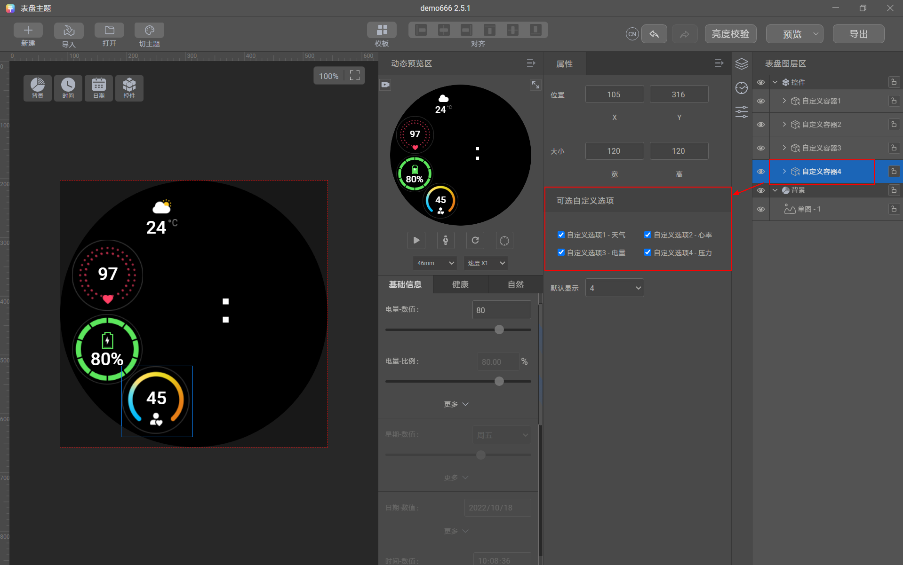

## 制作实操

下文以454\*454分辨率为例进行制作演示，其他分辨率是类似的。

1. <strong>制作背景</strong> <strong>。</strong>
   1. 选择“背景”&gt;“单图”，导入背景图。

      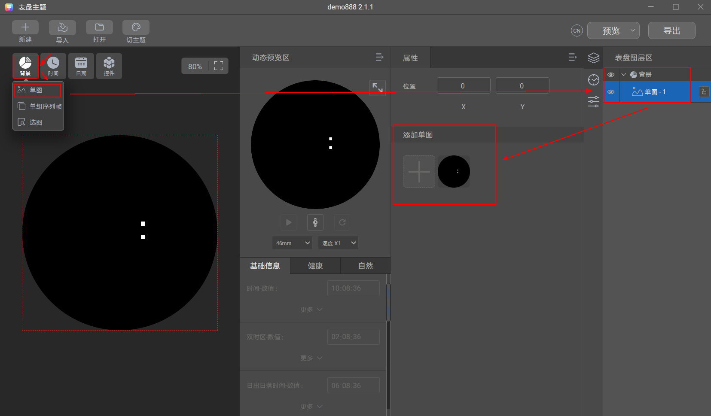
   2. 选中“背景”图层，导入自定义蒙版。

      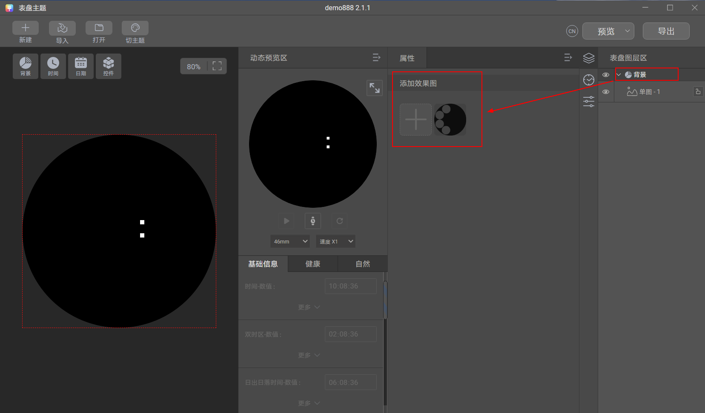

      

      自定义蒙版尺寸需与表盘分辨率一致，制作时将自定义区域挖空，并设置60%透明度。

      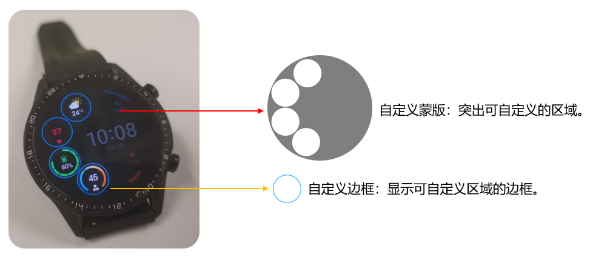
2. <strong>制作自定义容器1-天气自定义选项。</strong>
   1. 选择“控件”&gt;“自定义选项”，导入天气预览图和边框资源。

      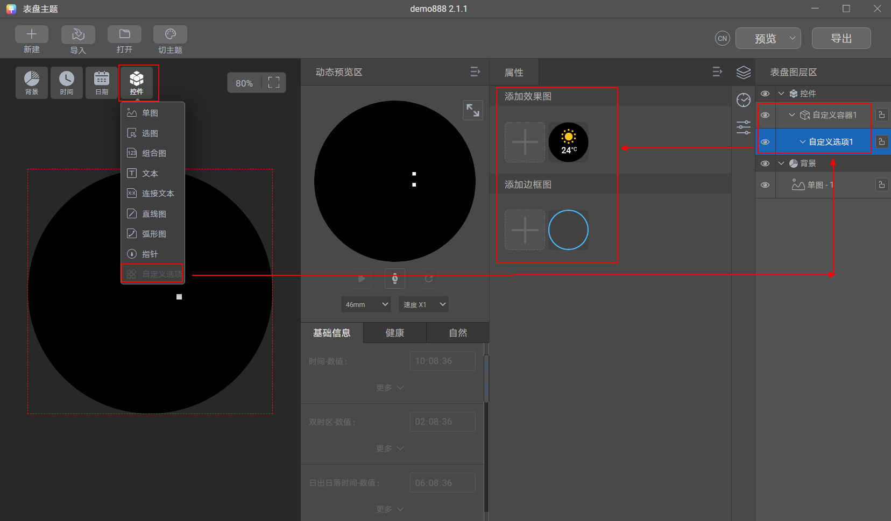

      

      1. 自定义区域必须添加一个边框，标明每个可自定义区域的范围。自定义边框的形状和大小建议与当前自定义容器的边框和大小保持一致。
      2. 自定义选项预览图需与实际制作的数据样式保持一致。

      
   2. 选择“控件”&gt;“选图”，数值类型为“天气类型”，导入天气类型切图。
   3. 选择“控件”&gt;“选图”，数值类型为“温度类型”，导入温度类型切图。
   4. 选择“控件”&gt;“文本”，数值类型为“气温”。

      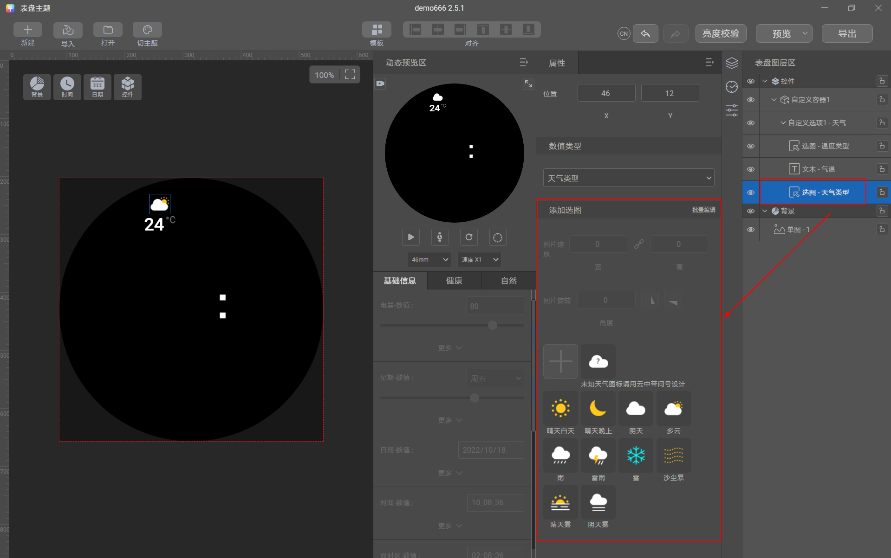
3. <strong>制作自定义容器1-</strong> <strong>心率自定义选项。</strong>
   1. 选中“自定义容器1”图层。
   2. 选择“控件”&gt;“自定义选项”，导入心率预览图和边框资源。
   3. 选择“控件”&gt;“单图”，并导入心率背景图。
   4. 选择“控件”&gt;“弧形图”，数值类型为“心率比例”，导入心率弧形图。
   5. 选择“控件”&gt;“文本”，数值类型为“心率”。

   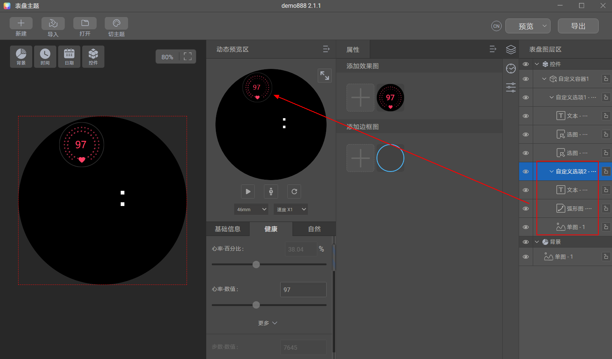
4. <strong>制作自定义容器1-</strong> <strong>电量自定义选项。</strong>
   1. 同理，选择“控件”&gt;“自定义选项”，导入电量预览图和边框资源。
   2. 选择“控件”&gt;“单图”，导入电量背景图。
   3. 选择“控件”&gt;“选图”，数值类型为“电量枚举”，导入电量枚举图。
   4. 选择“控件”&gt;“弧形图”，数值类型为“电量比例”，导入电量弧形图。
   5. 选择“控件”&gt;“连接文本”，第1个数值类型为“电量”，第2个数值类型为“无数据”，连接属性为“百分号%”。

   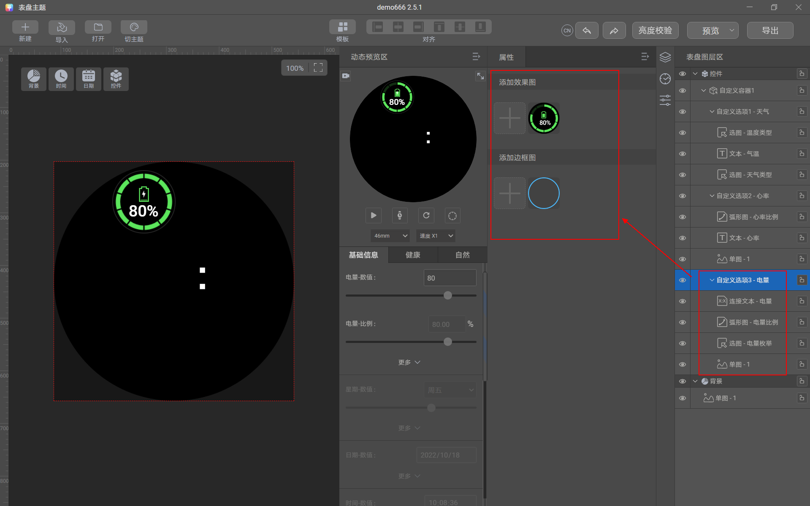
5. <strong>制作自定义容器1-</strong> <strong>压力自定义选项。</strong>
   1. 同理，选择“控件”&gt;“自定义选项”，导入压力预览图和边框资源。
   2. 选择“控件”&gt;“单图”，导入压力背景图。
   3. 选择“控件”&gt;“文本”，数值类型为“压力”。

   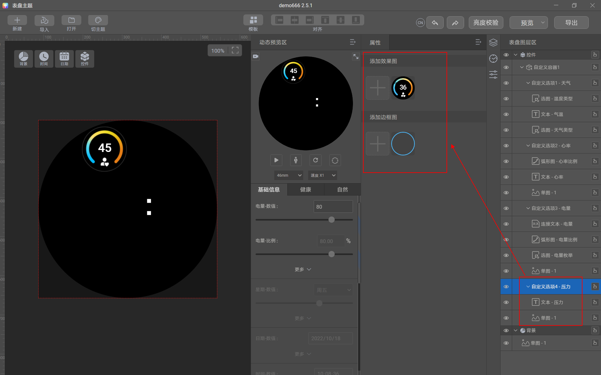
6. <strong>制作更多自定义容器。</strong>
   1. 选中“控件”图层。
   2. 选择“控件”&gt;“自定义选项”，按需添加更多的自定义容器。
   3. 然后参考步骤3-6，为新添加的自定义容器制作自定义选项即可。

   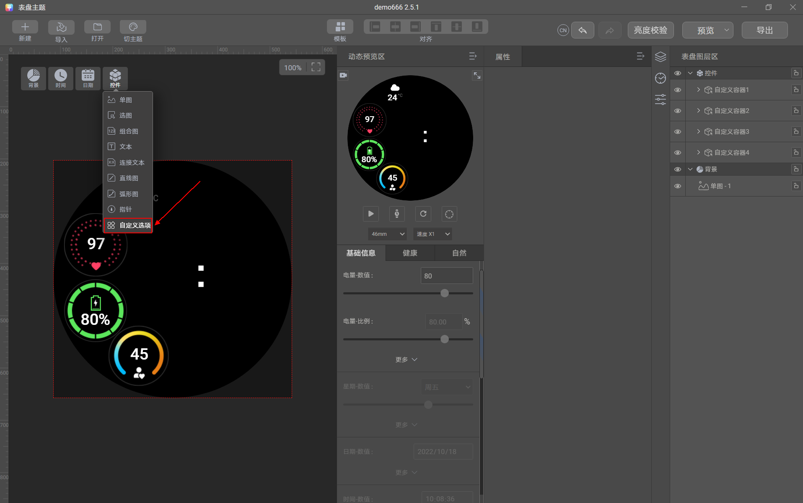

经过以上步骤，控件自定义表盘制作完成，后续按照常规步骤，[截图生成预览图](https://developer.huawei.com/consumer/cn/doc/content/watch-face-production-0000001530133996#section106176113417)与[导出表盘](https://developer.huawei.com/consumer/cn/doc/content/watch-face-production-0000001530133996#section1783463344019)即可。

## 常见问题

1、提示“制作自定义容器，至少制作两个自定义选项”如何解决？

Theme Studio提示：

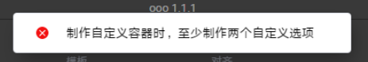

问题原因：添加了自定义容器，则该表盘会成为自定义表盘。自定义表盘是在一定区域内数据具有替换功能的表盘，用户可自定义展示预置数据，那么替换的状态下就需要制作两个以上的自定义选项，方可进行替换。

Theme Studio 解决方式：增加一个自定义选项即可。

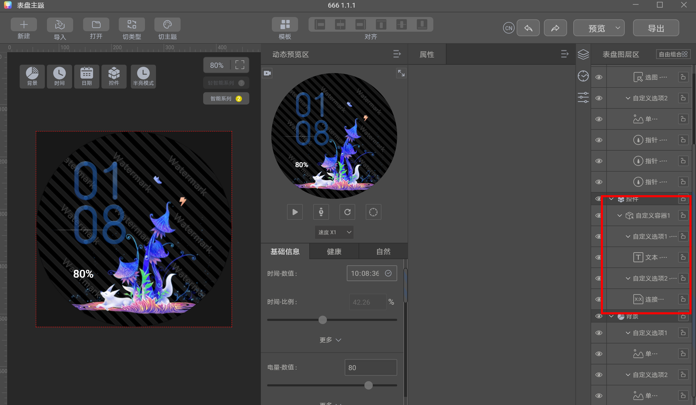