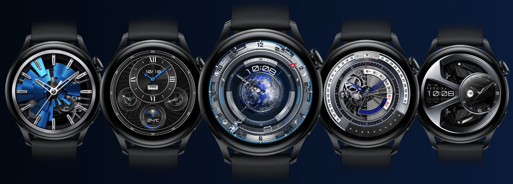
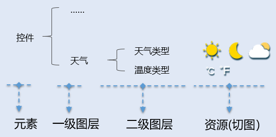
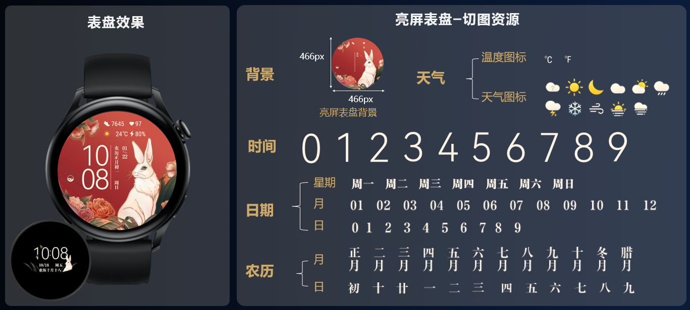

# 制作准备

## 视觉设计

基于要制作的表盘分辨率，进行表盘视觉设计，包含[亮屏表盘](/docs/distribute/content-dist/theme-center/development-tutorial-0000001054519376/watchface-0000001054571181/basic-concepts-0000001207883464/watch-face-introduction-0000001566918497#section0147798445)和[熄屏表盘](/docs/distribute/content-dist/theme-center/development-tutorial-0000001054519376/watchface-0000001054571181/basic-concepts-0000001207883464/watch-face-introduction-0000001566918497#section2023216179448)视觉。

1. 进行视觉设计时，需考虑当前分辨率表盘支持的能力集，详见：
   * [466\*466能力集](/docs/distribute/content-dist/theme-center/development-tutorial-0000001054519376/watchface-0000001054571181/basic-concepts-0000001207883464/resolution-capability-0000001523484462/x466-capability-0000001881726154)
   * [390\*390/454\*454能力集](/docs/distribute/content-dist/theme-center/development-tutorial-0000001054519376/watchface-0000001054571181/basic-concepts-0000001207883464/resolution-capability-0000001523484462/x454-capability-0000001580733885)
   * [280\*456/336\*480能力集](/docs/distribute/content-dist/theme-center/development-tutorial-0000001054519376/watchface-0000001054571181/basic-concepts-0000001207883464/resolution-capability-0000001523484462/x280-capability-0000001592176765)
   * [194\*368能力集](/docs/distribute/content-dist/theme-center/development-tutorial-0000001054519376/watchface-0000001054571181/basic-concepts-0000001207883464/resolution-capability-0000001523484462/x194-capability-0000001591976781)
2. 仅部分手表设备支持熄屏表盘，详见[分辨率与版本号](/docs/distribute/content-dist/theme-center/development-tutorial-0000001054519376/watchface-0000001054571181/basic-concepts-0000001207883464/resolution-version-0000001252603441)。

**466\*466**<strong>视觉设计示例：</strong>

## 切图准备

按照表盘视觉设计，制作切图：

* 按照背景、时间（时、分、秒）、日期（月、日、星期）和控件（天气、步数等）四大元素，进行元素分解。
* 将每个元素按照具体绘制类型，分解为一个或多个图层。
* 针对每个图层绘制所需要的资源进行切图导出。

1. 图片文件建议采用A100\_002.png、A100\_003.png……这样的格式次序命名，避免图片素材导入出错。
2. 如何确定特定数据对应多少张切图？详见[数值类型](/docs/distribute/content-dist/theme-center/development-tutorial-0000001054519376/watchface-0000001054571181/watch-face-production-0000001573924705/start-production-0000001523804314/value-type-0000001529974532)。
3. 不同分辨率的表盘资源包具有不同的[制作校验](/docs/distribute/content-dist/theme-center/development-tutorial-0000001054519376/watchface-0000001054571181/watch-face-production-0000001573924705/start-production-0000001523804314/constraints-0000001580893701)，请在规定的范围内进行切图准备。

**466\*466切图示例：**

## 工具准备

仅支持使用[Theme Studio](https://developer.huawei.com/consumer/cn/doc/development/Tools-Library/theme_download-0000001050424897)制作表盘，否则上传表盘资源包时将无法通过主题联盟的校验。

* <strong>工具下载</strong>：点击下载[Theme Studio](https://developer.huawei.com/consumer/cn/doc/development/Tools-Library/theme_download-0000001050424897)。
* <strong>工具简介</strong>：详见[Theme Studio简介](https://developer.huawei.com/consumer/cn/doc/development/Tools-Guides/overview-0000001050145150)。