# 制作实例

## 说明

1. 下文以466\*466分辨率为例进行演示，其他分辨率的制作方法类似，只是支持的能力集有一些差异，详见：
   * [466\*466能力集](https://developer.huawei.com/consumer/cn/doc/content/466-capability-0000001881726154)
   * [390\*390/454\*454能力集](https://developer.huawei.com/consumer/cn/doc/content/454-capability-0000001580733885)
   * [280\*456/336\*480能力集](https://developer.huawei.com/consumer/cn/doc/content/280-capability-0000001592176765)
   * [194\*368能力集](https://developer.huawei.com/consumer/cn/doc/content/194-capability-0000001591976781)
2. 466\*466有两种制作模式：WATCH系列+GT系列（2.y.z）和WATCH系列（1.y.z）制作模式。两种制作模式支持不同的能力集，需点击【切类型】进行切换，详见制作模式切换。

   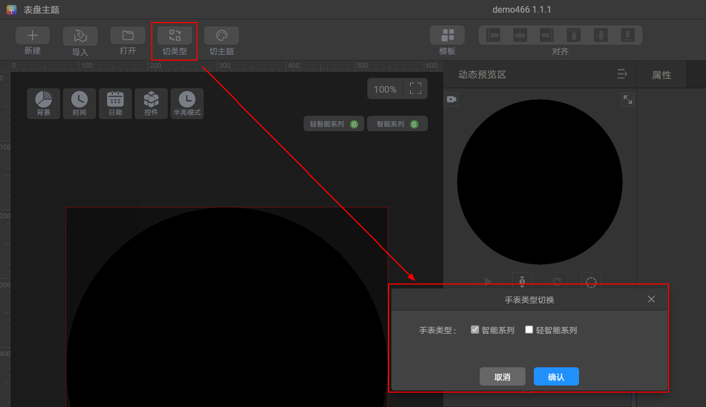

## 背景

### 单图

<strong>通过单图控件，制作表盘静态背景。</strong>

<strong>切图准备</strong> <strong>：</strong>

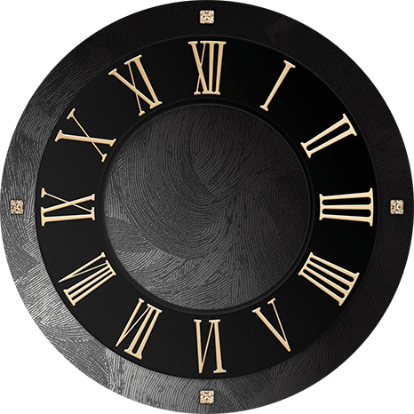

<strong>切图说明：</strong>

* 背景避免白色像素过多，饱和度/亮度过高，否则会导致手表功耗过大，耗电量较快。Theme Studio支持亮度校验，亮度过高不可导出。
* 设计背景时，静态元素尽量与背景融合以减少图层及图片大小。

<strong>制作步骤：</strong>

1. 添加“背景”&gt;“单图”控件。
2. 导入表盘背景图。

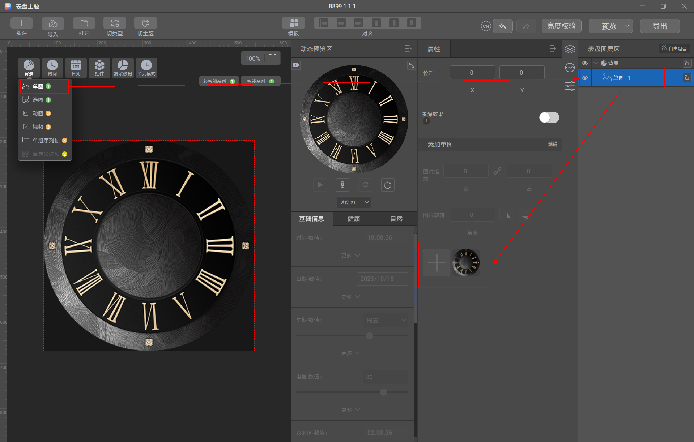

### 选图

<strong>通过选图控件，实现表盘静态背景切换，最多支持切换5个静态背景。</strong>

<strong>切图准备：</strong>

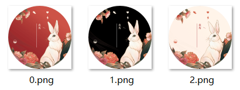

<strong>制作步骤：</strong>

1. 添加“背景”&gt;“选图”控件。
2. 数值类型选择“背景切换”。
3. 导入5张表盘背景图。

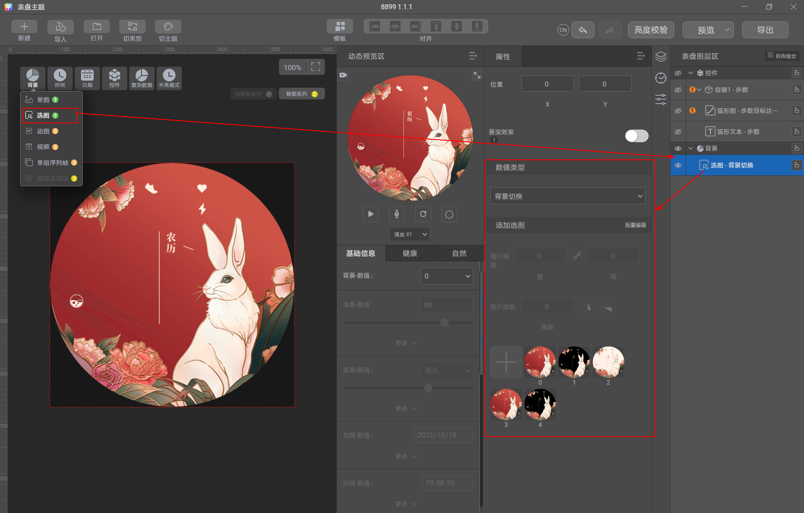

### 动图

<strong>通过动图控件，上传动图资源，制作表盘动态背景。</strong>

<strong>动图准备：</strong>

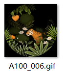

<strong>动图规格：</strong>

* 动图尺寸：466\*466
* 动图大小：≤10M
* 动图时长：5-10s
* 动图格式：GIF
* 动图帧率：15-30帧/秒
* 最多可以添加1个动图
* 建议素材首尾能相接循环，不能有明显跳帧痕迹

<strong>制作步骤：</strong>

1. 添加“背景”&gt;“动图”控件。
2. 导入动图资源和动图预览图。

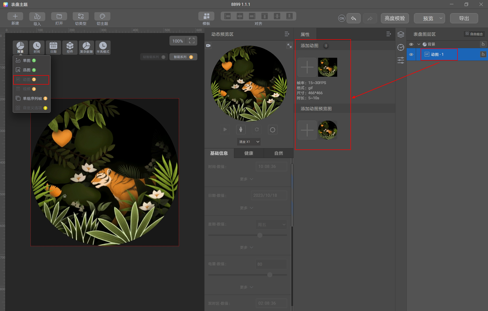

### 视频

<strong>通过视频控件，上传视频资源，制作表盘动态背景。</strong>

<strong>视频准备：</strong>

<strong>视频规格：</strong>

* 视频尺寸：466\*466
* 视频大小：≤10M
* 视频时长：5-10s
* 视频格式：mp4
* 视频编码：H.264
* 视频帧率：25-30帧
* 最多可以添加3个视频
* 建议素材首尾能相接循环，不能有明显跳帧痕迹

<strong>制作步骤：</strong>

1. 添加“背景”&gt;“视频”控件。

   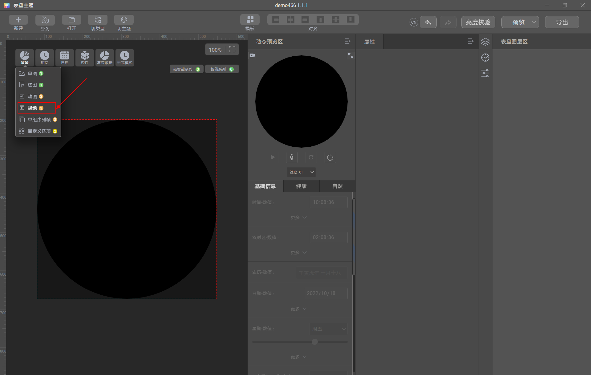
2. 导入视频资源。

   “+”：点击添加视频资源，最多支持添加3个。

   “播放”：预览视频效果。

   滑动白条选择合适的画面，生成视频预览图（必须生成预览图）。

   如果添加了多个视频，须通过“视频切换”，为每一个视频生成一张预览图。

   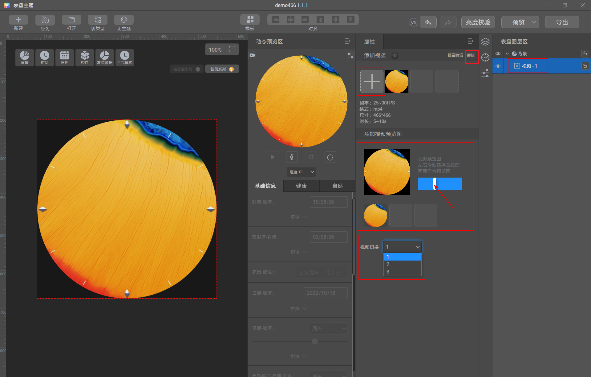

### 单组序列帧

<strong>通过单组序列帧控件，上传单组序列帧资源，制作表盘动态背景。</strong>

<strong>单组序列帧准备：</strong>

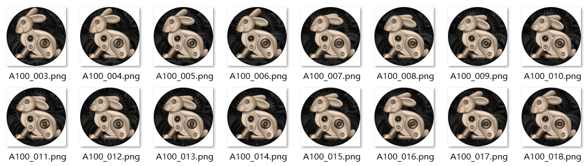

<strong>单组序列帧规格：</strong>

* 单组序列帧帧数：“WATCH系列+GT系列”须≤30帧，“WATCH系列”可&gt;30帧
* 单组序列帧单张大小：建议小于40KB
* 单组序列帧格式：PNG
* 单组序列帧每帧的尺寸大小必须保持一致
* 单组序列帧尺寸：“WATCH系列+GT系列”须≤200px\*200px，“WATCH系列”可&gt;200px\*200px
* 素材首尾能相接循环，不能有明显跳帧痕迹

<strong>制作步骤：</strong>

1. 选择“背景”&gt;“单组序列帧”控件，导入单组序列帧资源。

   播放模式：单次播放：在表盘上序列帧只播放一次；循环播放：在表盘上循环播放不暂停。

   位置：单组序列帧在表盘中的位置。

   帧间隔：每帧与每帧的间隔时间。

   延时播放：在设置的时间过后，再播放序列帧。

   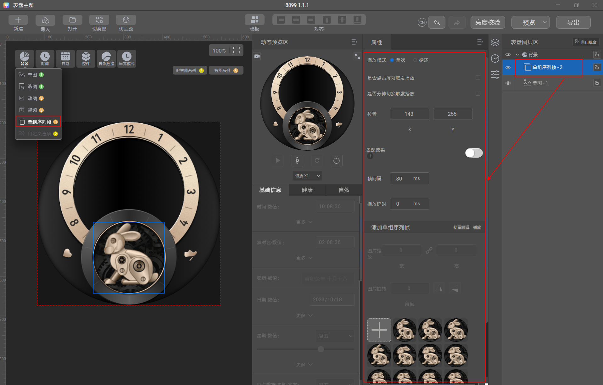
2. 检测单组序列帧播放是否流畅<strong>。</strong>

   <strong>播放</strong>：点击播放按钮，预览单组序列帧动效是否流畅。

   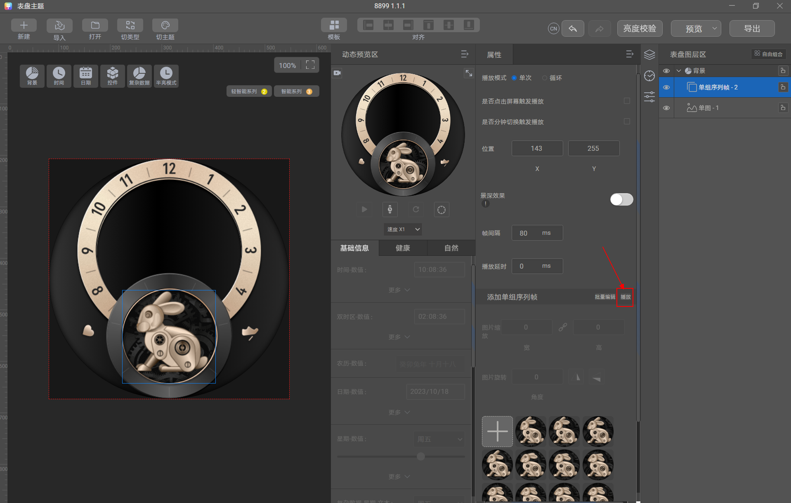

## 时间

时间一般有两种展示方式：模拟时钟和数字时钟。

### 模拟时钟

<strong>通过表盘和指针显示时间，需制作时针、分针、秒针（选做）。</strong>

<strong>使用控件：</strong>指针。

<strong>切图准备：</strong>时针、分针、秒针切图。

<strong>切图说明：</strong>

1. 指针切图需指向0点方向（指针旋转的初始方向）。
2. 如果表盘背景制作了刻度，刻度须正确无偏差，可使用Theme Studio进行刻度校验。

<strong>制作步骤：</strong>

1. 添加“时间”&gt;“指针”控件。

   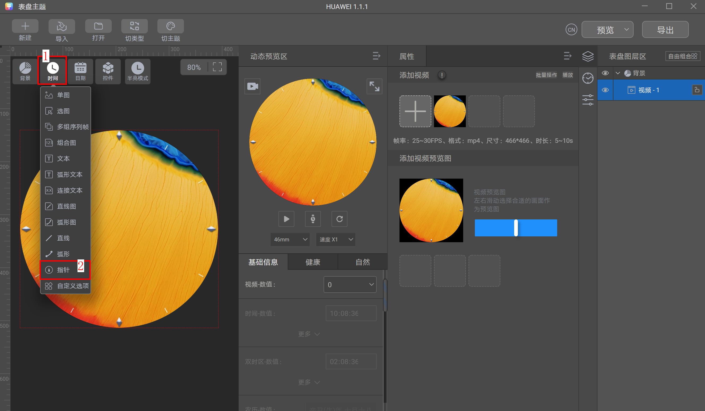
2. 数值类型选择“时钟比例12”。

   
3. 点击“+”导入时针切图，并修改指针中心点为（233,233）；角度为（0,360）；旋转中心点为（17,104）。

   
4. 再次添加“时间”&gt;“指针”控件，数值类型选择“分钟比例”。点击“+”导入分针切图，并修改指针中心点为（233,233）；角度为（0,360）；旋转中心点为（17,196）。

   
5. 再次添加“时间”&gt;“指针”控件，数值类型选择“秒针比例”。点击“+”，导入秒针切图，并修改指针中心点为（233,233）；角度为（0,360）；旋转中心点为（4,165）。

   
6. 添加“时间”&gt;“单图”控件，点击“+”导入装饰的圆点切图，并调整好位置。

   

<strong>参数说明：</strong>

1. 指针中心点：指针在表盘画布上的旋转中心点，一般为画布的中心。466\*466分辨率，指针中心点一般为（233,233）；280\*456分辨率，指针中心点一般为（140,228）。
2. 角度：指针的旋转角度，模拟时间中一般为360°。
3. 旋转中心点：指针自身的旋转中心点，根据指针设计而定，可在设计软件中进行确定。

   

### 数字时钟

<strong>通过数字0-9显示时间，需制作时钟、分钟、秒钟（选做）。</strong>

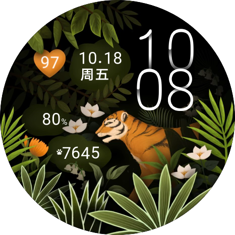

<strong>使用控件：</strong>选图。

<strong>切图准备：</strong>数字0-9切图。

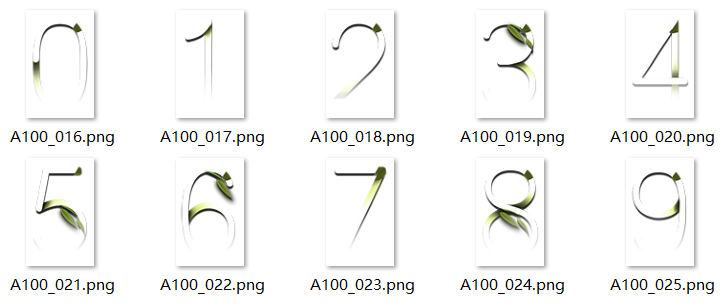

<strong>制作步骤：</strong>

1. 添加“时间”&gt;“选图”控件，数值类型选择“时钟高位”。然后点击“+”，批量导入0-2的数字切图，并调整好位置。
2. 再次添加“时间”&gt;“选图”控件，数值类型选择“时钟低位”。然后点击“+”，批量导入0-9的数字切图，并调整好位置。

   
3. 再次添加“时间”&gt;“选图”控件，数值类型选择“分钟高位”。然后点击“+”，批量导入0-5的数字切图，并调整好位置。

   
4. 再次添加“时间”&gt;“选图”控件，数值类型选择“分钟低位”。然后点击“+”，批量导入0-9的数字切图，并调整好位置。

   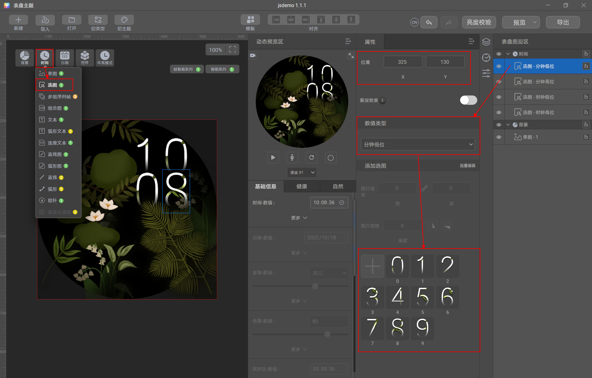

时钟高位、时钟低位、分钟高位、分钟低位的位置，需符合常规阅读习惯，避免给用户造成困扰。

### 数字时钟-多组序列帧

<strong>为0-9每个数字设计1组序列帧，以展示每个数字的动态效果，仅用于数字时钟</strong> <strong>。</strong>

<strong>使用控件：</strong>多组序列帧。

<strong>切图准备：</strong>数字0-9序列帧切图。

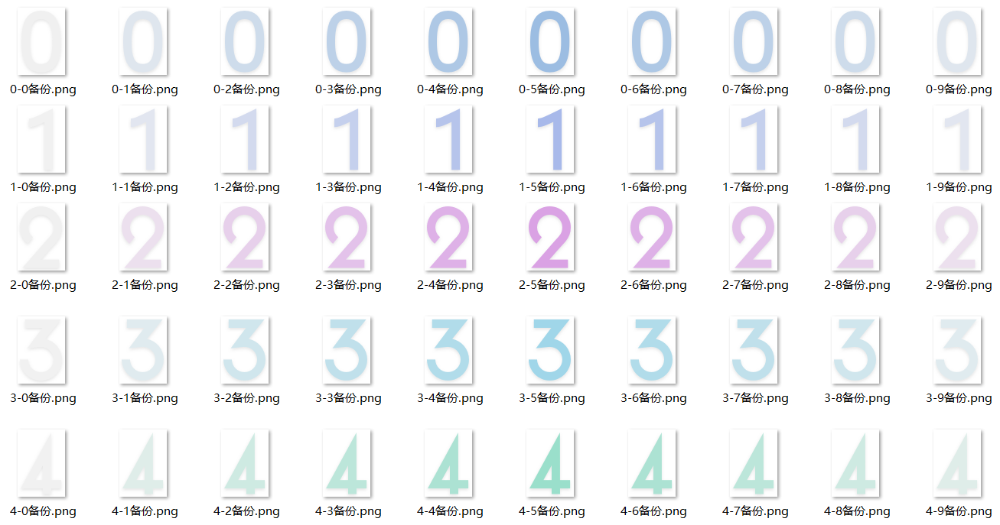

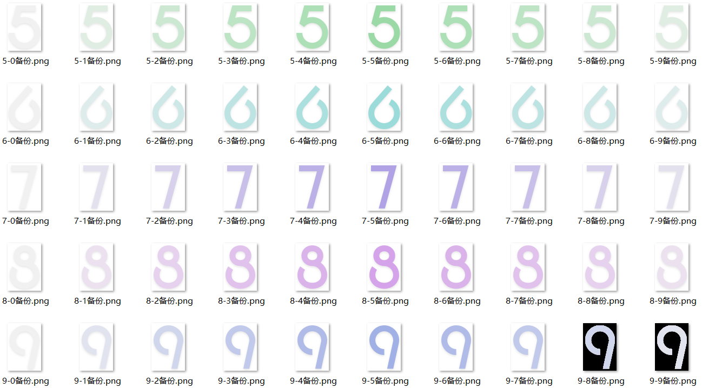

<strong>制作步骤：</strong>

1. 添加“时间”&gt;“多组序列帧”控件，数值类型选择“时钟高位”。然后点击“+”，批量导入0-2的数字序列帧切图，并调整好位置。

   序列帧张数：支持设置2-10张，本示例中设置为10张，则相应每个数字需上传10张序列帧。

   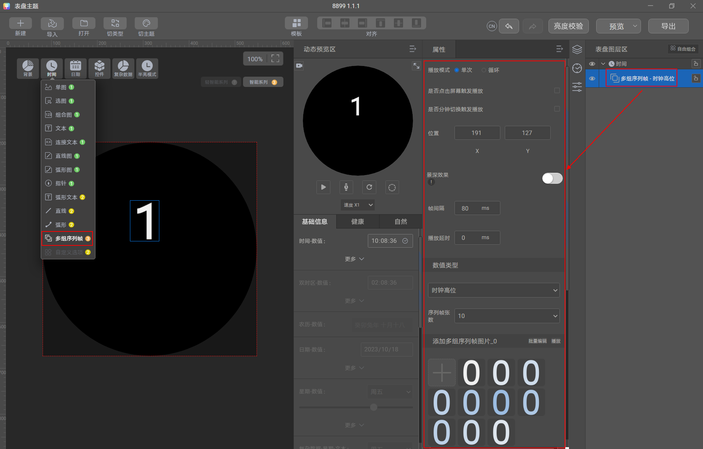
2. 点击播放按钮，预览0-2的数字序列帧动效是否流畅。

   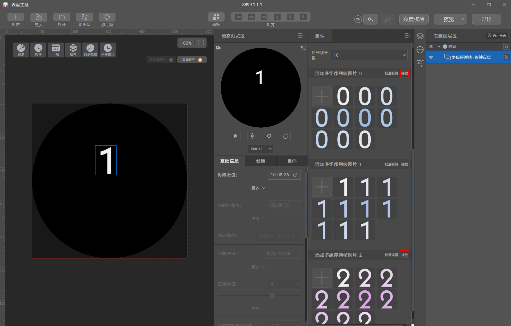
3. 按同样的方法，制作时钟低位、分钟高位、分钟低位多组序列帧<strong>。</strong>

   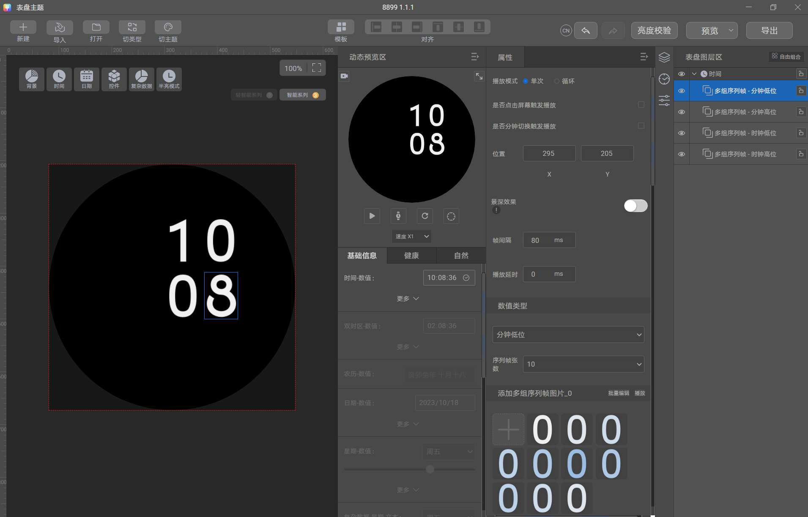

## 日期

日期一般包含月、日、星期，支持使用文本类控件或图片类控件制作。

### 日期-文本类控件制作

<strong>使用文本类控件，制作月、日、星期。</strong>

<strong>使用控件：</strong>连接文本、文本。

<strong>切图准备：</strong>无需准备切图，直接使用文本类控件。

<strong>制作步骤：</strong>

1. 添加“日期”&gt;“连接文本”控件，第1个数值类型选择“月数据”，第2个数值类型选择“日期”，连接属性选择“点.”，并调整好位置和大小。

   
2. 添加“日期”&gt;“文本”控件，数值类型选择“星期文本”。并调整好位置和大小。

   

### 日期-图片类控件制作

<strong>使用图片类控件，制作月、日、星期。</strong>

<strong>使用控件：</strong>选图。

<strong>切图准备：</strong>星期、月份、日期切图。

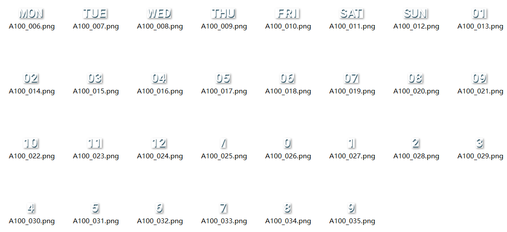

<strong>切图说明：</strong>

* 星期切图可设计为中文全称、英文全称、英文简写等。
* 月份切图可设计为中文全称、1-12数字、英文全称、英文简写等。

<strong>制作步骤：</strong>

1. 添加“日期”&gt;“选图”控件。

   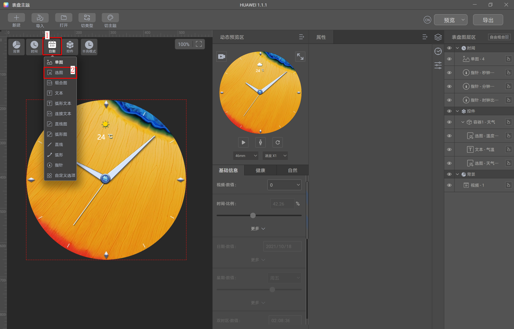
2. 数值类型选择“星期数据”。

   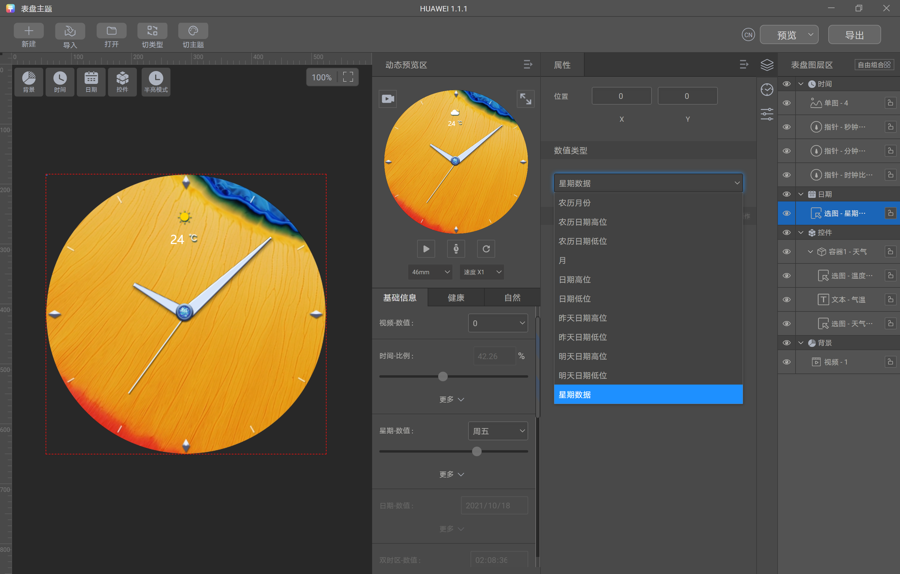
3. 点击“+”，批量导入星期资源切图，并调整好位置。

   
4. 添加“日期”&gt;“选图”控件，数值类型选择“月”，点击“+”批量导入月份切图，并调整好位置。

   
5. 添加“日期”&gt;“选图”控件，数值类型选择“日期高位”，点击“+”批量导入0-3数字切图，并调整好位置。

   
6. 添加“日期”&gt;“选图”控件，数值类型选择“日期低位”，点击“+”批量导入0-9数字切图，并调整好位置。

   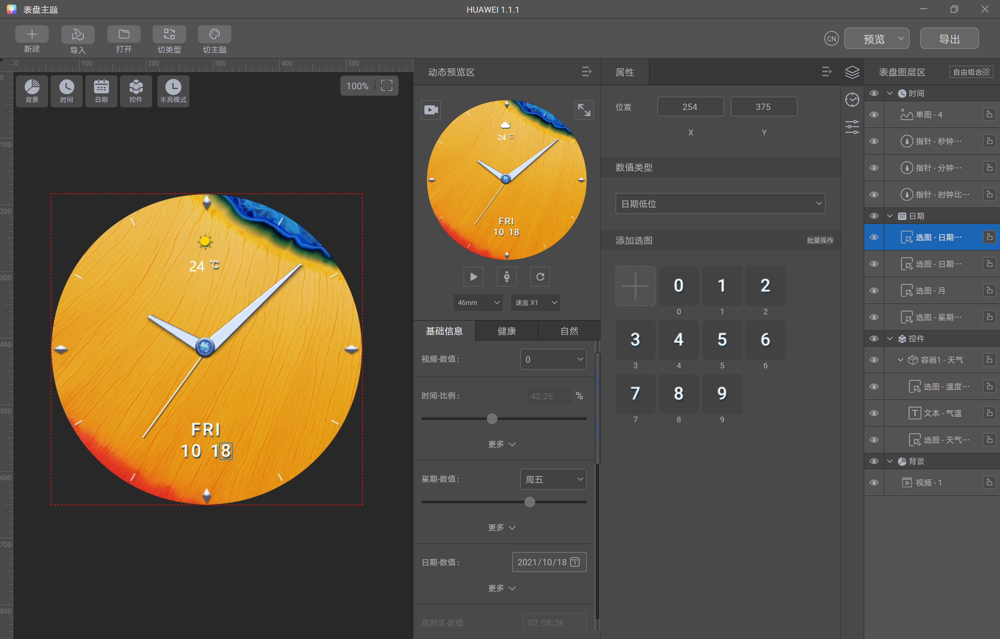
7. 添加“日期”&gt;“单图”控件，点击“+”导入连接符号/切图，并调整好位置。

   

### 农历

<strong>使用选图控件，制作农历月份和日期。</strong>

<strong>使用控件：</strong>选图。

<strong>切图准备：</strong>农历月份、农历日期高位和农历日期低位切图。

<strong>制作步骤：</strong>

1. 添加“日期”&gt;“选图”控件，数值类型选择“农历月份”，点击“+”批量导入农历月份切图，并调整好位置。

   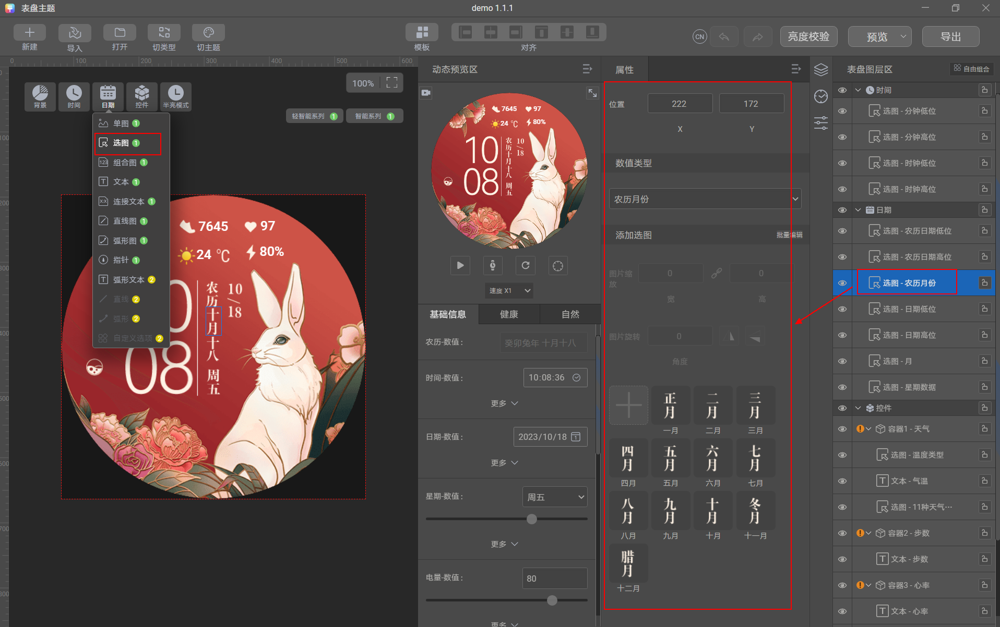
2. 添加“日期”&gt;“选图”控件，数值类型选择“农历日期高位”，点击“+”批量导入农历日期高位切图，并调整好位置。

   
3. 添加“日期”&gt;“选图”控件，数值类型选择“农历日期低位”，点击“+”批量导入农历日期低位切图，并调整好位置。

   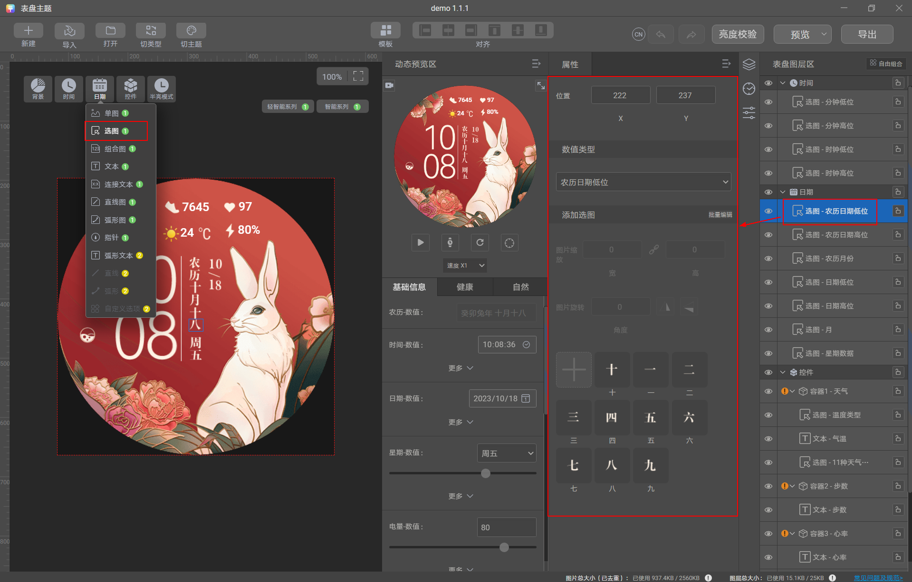

## 数据

### 电量

<strong>一般包含电量数值（必须带单位%）、电量枚举和电量比例。</strong>

<strong>使用控件：</strong>连接文本、选图、弧形图。

<strong>切图准备：</strong>电量枚举选图、电量比例底图、电量比例弧形图。

<strong>制作步骤：</strong>

1. 导入电量比例底图。

   添加“控件”&gt;“单图”控件，导入电量比例底图。

   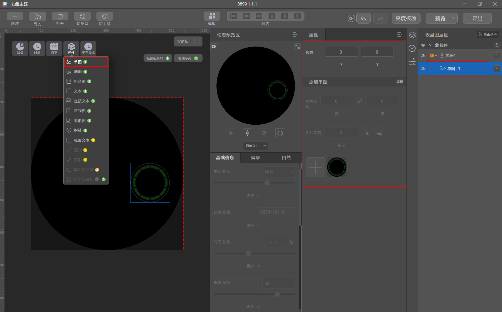
2. 制作电量文本。

   添加“控件”&gt;“连接文本”控件，数值类型选择“电量”和“无数据”，连接属性选择“百分号%” ，并调整好位置和大小。

   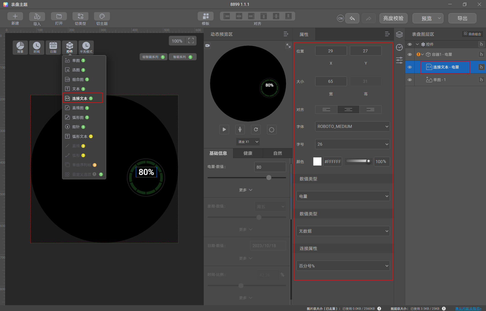
3. 制作电量枚举。

   添加“控件”&gt;“选图”控件，数值类型选择“电量枚举”，导入电量枚举图，并调整好位置。

   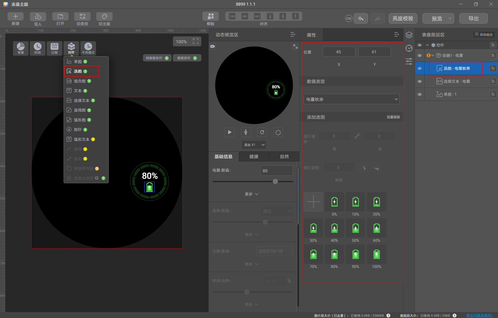
4. 制作电量比例。

   添加“控件”&gt;“弧形图”控件，数值类型选择“电量比例”，导入电量比例弧形图，并调整好位置、角度、中心点、半径、弧宽等参数。

   

### 步数

<strong>一般包含步数图标、步数数值、步数目标达成度。</strong>

<strong>使用控件：</strong>单图、弧形文本、弧形图。

<strong>切图准备：</strong>步数目标达成度弧形图、步数目标达成度底图。

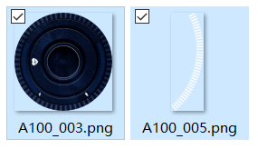

<strong>切图说明：</strong>

使用弧形图控件显示进度/比例时，需准备一张弧形图和一张底图。

* 弧形图：显示当前进度/当前比例，一般颜色较亮，需单独制作一个图层。
* 底图：显示总进度/总比例，一般颜色较深，可以是一个单图层，也可以直接制作在背景图上。

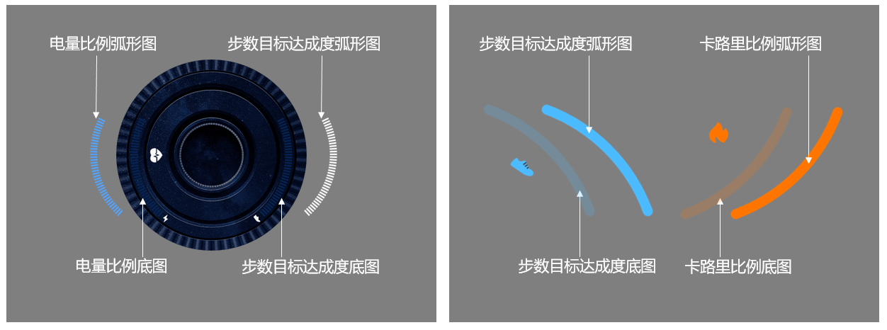

<strong>制作步骤：</strong>

1. 导入步数背景图。

   添加“控件”&gt;“单图”控件，导入步数背景图。

   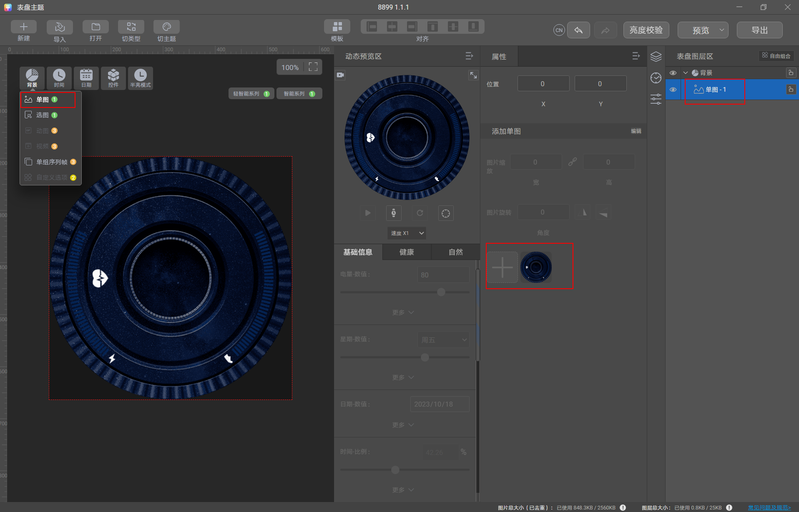
2. 制作步数文本。

   添加“控件”&gt;“弧形文本”控件，第1个数值类型选择“步数”第2个数值类型选择“无数据”，连接属性选择“空格”，并调整好位置、大小、对齐方式、字体、字号、字间距、角度、颜色等参数。

   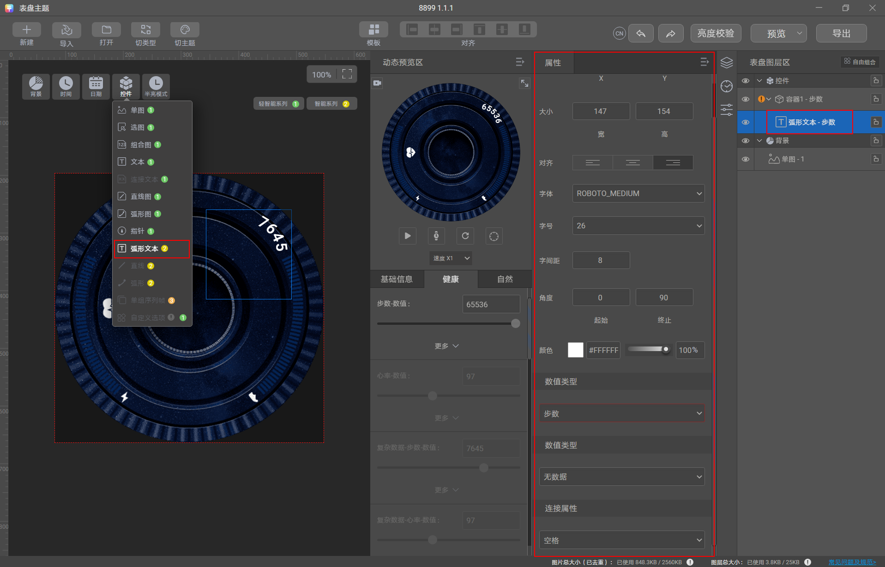
3. 制作步数目标达成度弧形图。

   添加“控件”&gt;“弧形图”控件 ，数值类型选择“步数目标达成度”，导入相应弧形图，并调整好位置、角度、中心点、半径、弧宽等参数。

   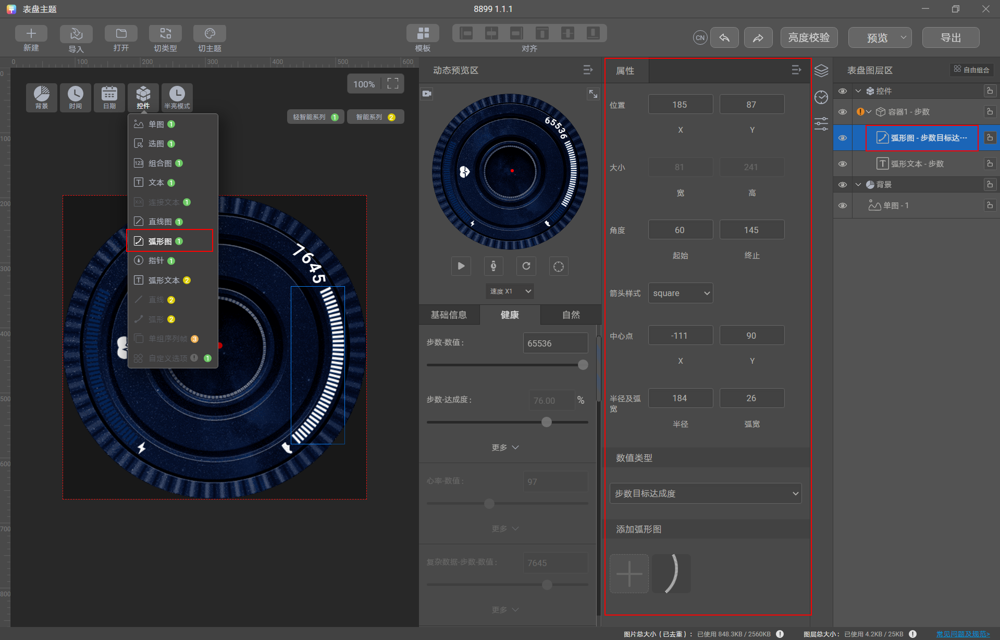

<strong>参数说明：</strong>

1. 角度：弧形起始点和终止点的角度，以弧形图的实际角度进行设置。一圈为360度，支持顺时针（例：60°至145°）或逆时针（例：300°至215°）计算。
2. 中心点：圆心。弧宽：弧形的宽度。半径：弧形的半径（内圆半径+弧宽一半）。
3. 中心点、弧宽和半径3个参数结合起来生成一个圆环，圆环的范围须覆盖弧形图的范围，再结合设置好的角度参数，即可实现使用弧形图显示当前进度/当前比例的效果。例：当前步数目标达成度为20%，则弧形图显示20%；当前步数目标达成度为90%，则弧形图显示90%。

   

### 心率

<strong>一般包含心率图标、心率数值和心率比例。</strong>

<strong>使用控件：</strong>单图、组合图、直线。

<strong>切图准备：</strong>心率图标、组合图0-9数字、组合图无效资源、组合图默认资源。

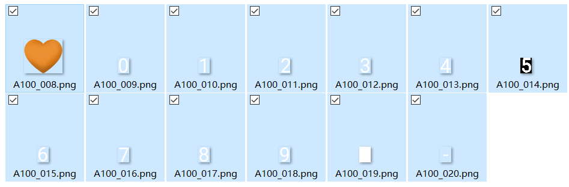

<strong>切图说明：</strong>

1. 组合图无效资源：设计一张“-”图片，未有数据同步时，显示无效资源“-”。
2. 组合图默认资源：设计一张透明图，填充数据空白区域。
3. 组合图无效资源和默认资源，与组合图0-9数字切图尺寸保持一致。

<strong>制作步骤：</strong>

1. 添加“控件”&gt;“单图”，上传心率图标，并调整好位置。

   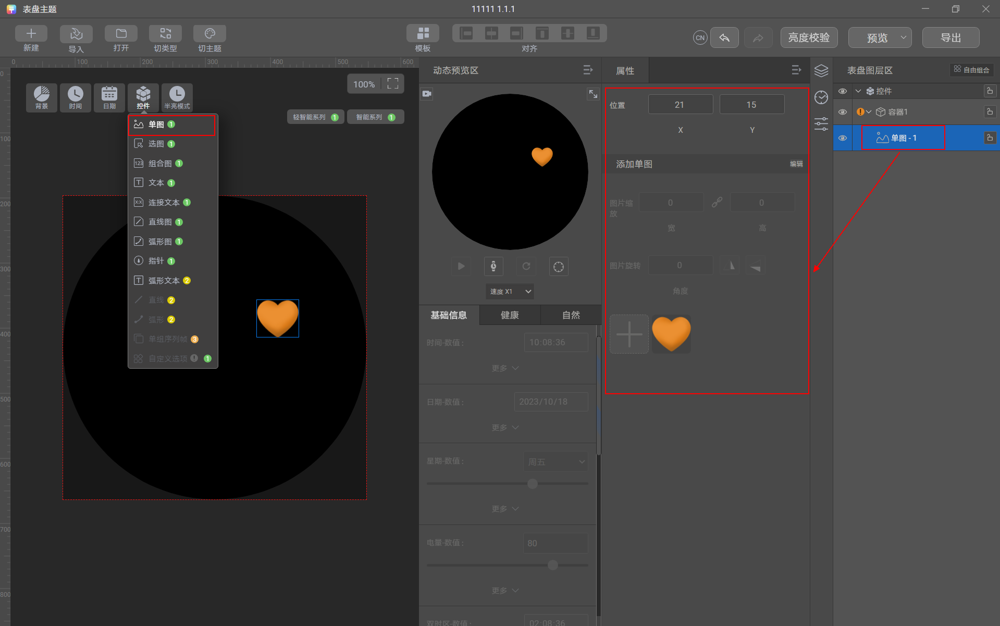
2. 添加“控件”&gt;“组合图” ，数值类型为“心率”，导入0-9数字切图、组合图无效资源和组合图默认资源，并调整好位置、对齐方式等参数。

   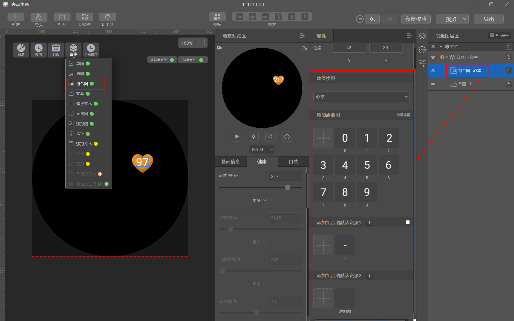
3. 添加“控件”&gt;“直线”，数值类型为“心率比例”，并调整好起始点、结束点、线条宽度、主颜色、背景颜色等参数。

   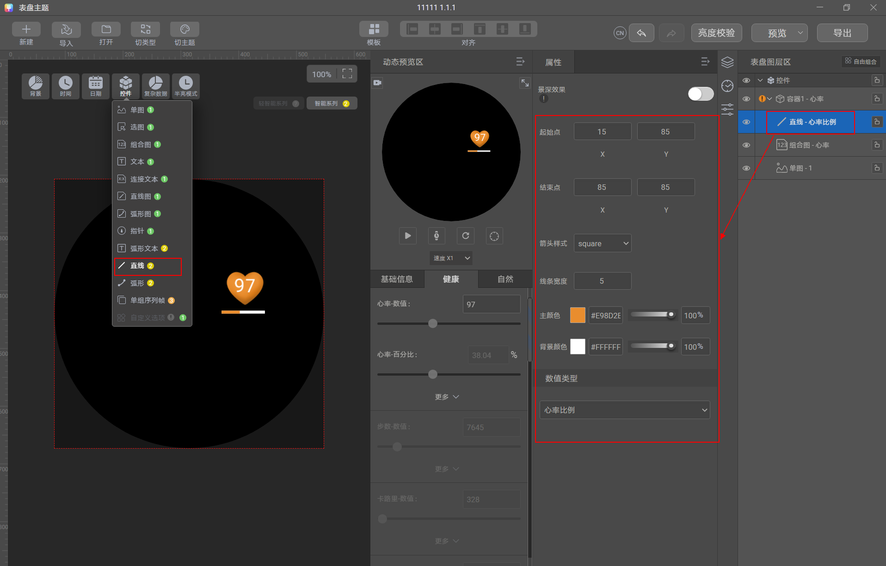

<strong>直线参数说明：</strong>

1. 通过设置起始点和结束点，生成一条直线，以显示进度/比例。
2. 主颜色：显示当前进度/比例。
3. 背景颜色：显示总进度/总比例。

### 天气

<strong>一般包含天气类型（28种或11种）、气温数值（必须带单位°c/°F）和气温类型。</strong>

<strong>使用控件：</strong>选图、文本。

<strong>切图准备：</strong>28种天气类型选图、气温类型选图。

<strong>切图说明：</strong>

* 天气类型包含28/11张切图，示例如上。并且未知样式必须为<strong>云中带问号的设计</strong>（示例：）。
* 温度类型必须制作摄氏度图标（ °c ）和华氏度图标（ °F ）。

<strong>制作步骤：</strong>

1. 添加“控件”&gt;“选图”控件，数值类型选择“28种天气类型”。

   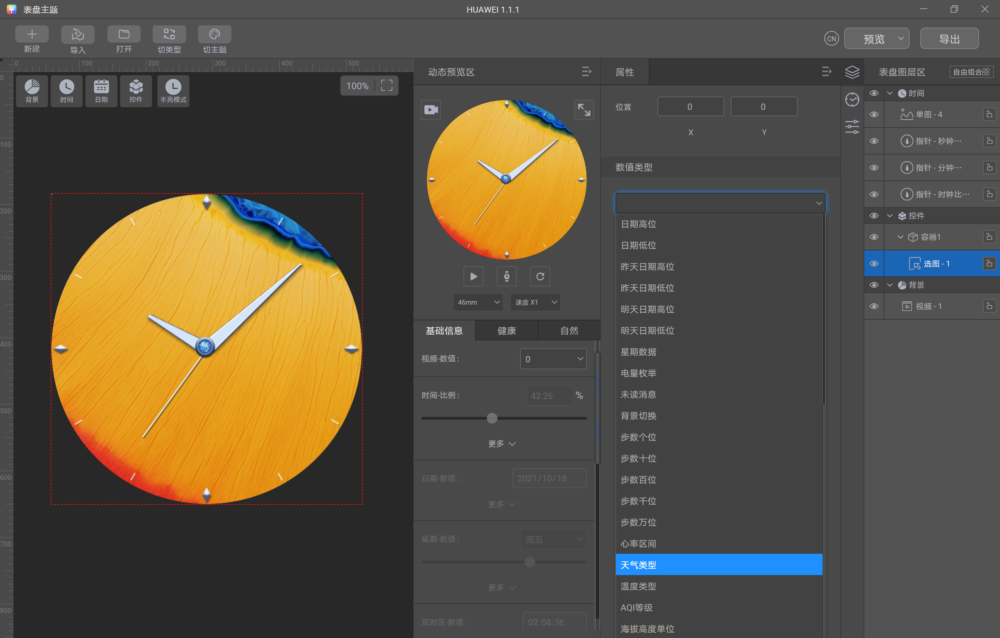
2. 批量添加28种天气类型切图，并调整好位置。

   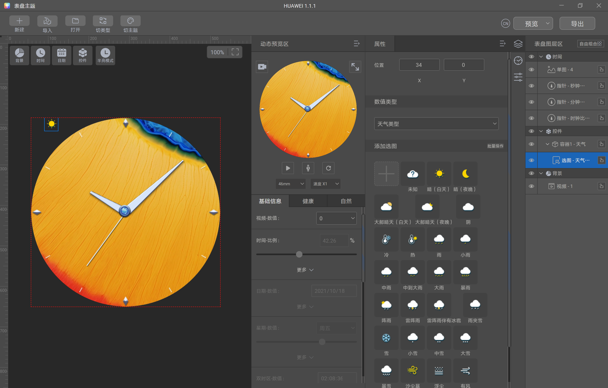
3. 在图层区点击“容器1-天气”，并调整好位置，容器大小不变。

   
4. 添加“控件”&gt;“文本”控件，数值类型选择“气温”，并调整好位置、大小、对齐方式、字体、字号、颜色等参数。

   
5. 添加“控件”&gt;“选图”控件，数值类型选择“温度类型”。导入温度类型切图，并调整好位置。

   

## 熄屏表盘制作

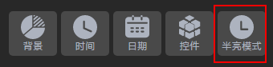

默认为[亮屏表盘](https://developer.huawei.com/consumer/cn/doc/content/watch-face-introduction-0000001566918497#section0147798445)制作模式，点击【半亮模式】则切换到[熄屏表盘](https://developer.huawei.com/consumer/cn/doc/content/watch-face-introduction-0000001566918497#section2023216179448)制作模式。

<strong>熄屏表盘要求：</strong>

1. 图层数量不超过30层。
2. 序列帧、视频、GIF控件不可用。
3. 熄屏表盘不可以单独导出，必须与亮屏表盘一起导出。
4. 屏幕非黑像素点不超过整体屏幕面积的10%或20%，详见[分辨率与版本号](https://developer.huawei.com/consumer/cn/doc/content/resolution-version-0000001252603441#section1756815468317)。
5. 非黑像素点区域尽量分散，不要出现大块集中展示。任意200px\*200px范围，非黑像素点占比不能超过60%。

<strong>熄屏表盘制作方法：</strong>

方法1：像制作亮屏表盘一样，逐一制作每个图层，以上已详细讲解。

<strong>方法2：一键复制亮屏表盘的图层。</strong>

1. 点击切换至“半亮模式”。

   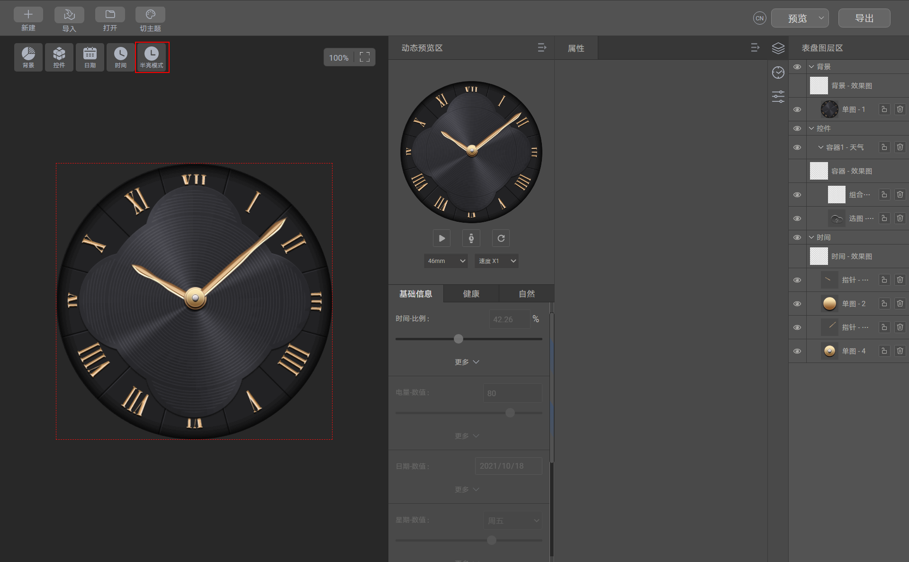
2. 点击复制全亮图层，选中需要的图层。

   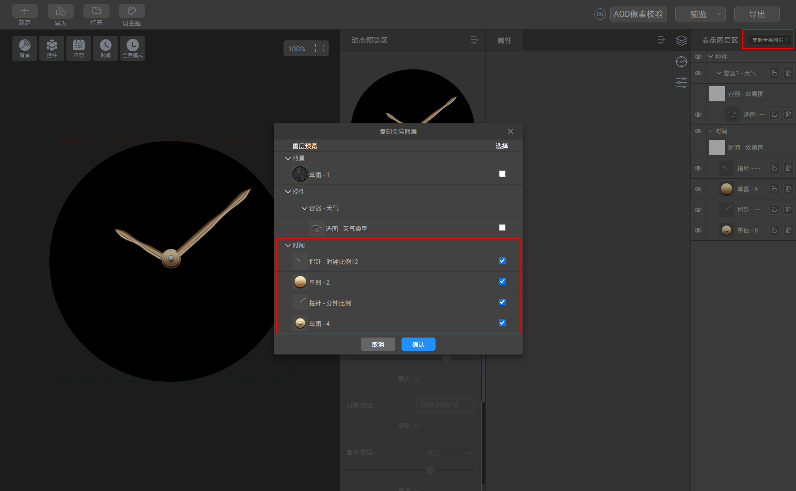
3. 点击确认，选中的图层就会复制到半亮模式中<strong>。</strong>

   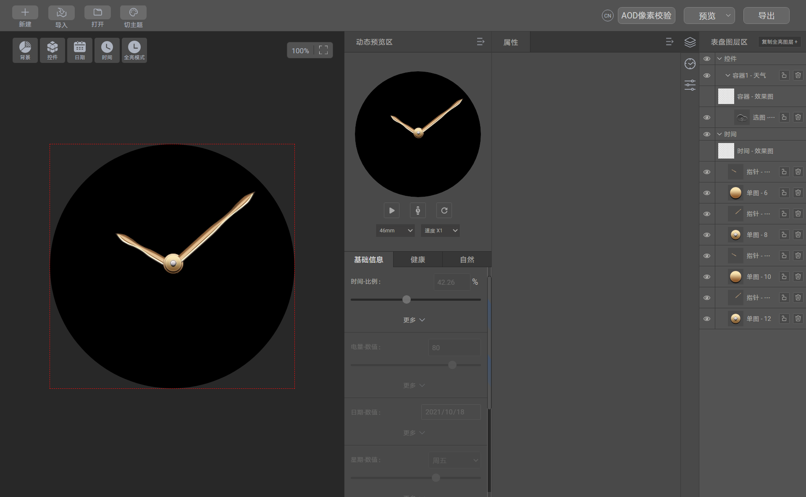
4. 点击播放或移动下方进度条查看表盘效果（测试后点击恢复按钮，表盘恢复到默认数值）。

   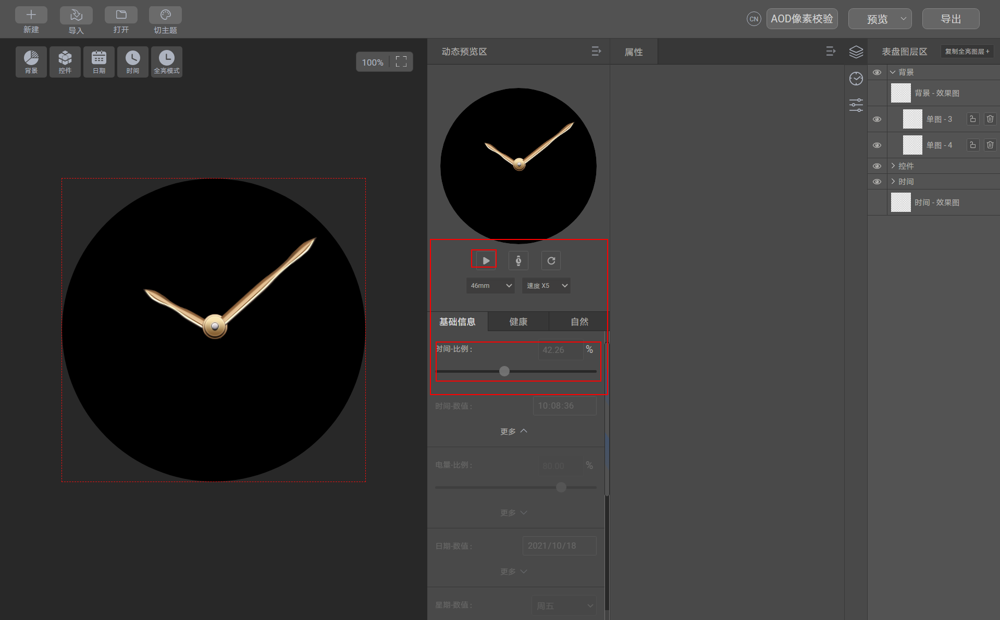
5. 点击“AOD校验”，进行非黑像素点占比校验。

   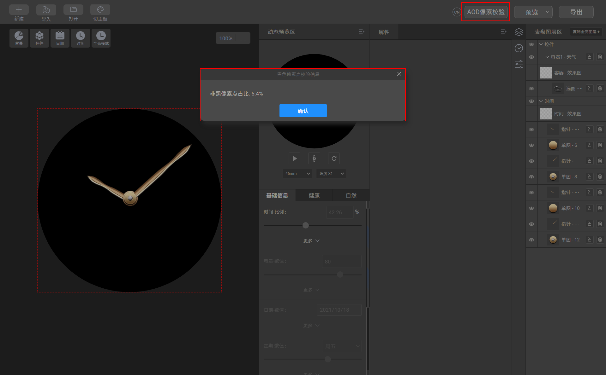

   

   非黑像素点占比超过后如何修改？详见[aod提示非黑像素点占比过高](https://developer.huawei.com/consumer/cn/doc/content/watchface-faq-0000001174035539#section595359155210)解决方法。