import MergeTable from '@site/src/components/MergeTable';

# 制作校验

在正式开始制作表盘之前，请了解相关校验：

[资源包和HWT包大小校验](#section15348517448)

[图层大小总和校验](#section164018202219)

[单张图片像素点大小校验](#section56414514119)

[图片大小总和（PSRAM）校验](#section13570211175)

## 资源包和HWT包大小校验

### 校验提醒

Theme Studio会对表盘的资源包大小和HWT包大小进行校验，弹出框提醒如下：

资源包大小校验：

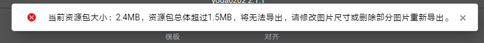

HWT包大小校验：

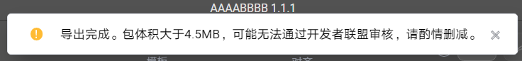

如在Theme Studio中遇到此类弹出提醒，可减少图片尺寸或删除部分图片后重新导出。

### 校验汇总

不同分辨率的手表设备，资源包大小和HWT包大小校验具有一些差异。

<MergeTable
  headers={['手表类型', '表盘分辨率', '资源包大小校验', 'HWT包大小校验']}
  rows={
    [{ text: '智能手表', rowspan: 6, colspan: 1 }, '466*466（1.y.z）', '无资源包', '4.5MB'],
    [null, '466*466（2.y.z）', '4MB', '4.5MB'],
    [null, '390*390', '4MB', '4.5MB'],
    [null, '454*454', '4MB', '4.5MB'],
    [null, '280*456', '1.5MB', '2MB'],
    [null, '336*480', '1.5MB', '2MB'],
    ['运动手环', '194*368', '0.8MB', '1.3MB']
  }
/>

* 资源包：也称之为bin包，是HWT包中的一部分。466\*466（1.y.z）无资源包；466\*466（2.y.z）资源包文件名为watchface.bin；其他分辨率资源包文件名为com.huawei.watchface。
* HWT包：整个表盘压缩包，文件名后缀为.hwt。

## 图层大小总和校验

### 校验提醒

Theme Studio会对表盘图层大小总和进行校验，如超出会弹出以下提醒：

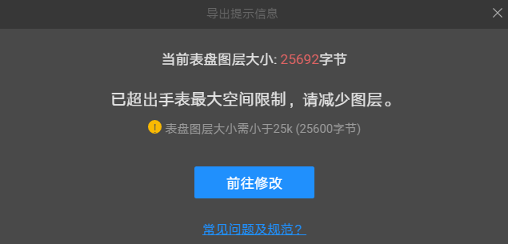

如果在Theme Studio中遇到此弹出提醒，请根据以下规范进行合理的调整。

### 校验原因

手表设备的内存空间有限，如超出校验可能会导致表盘出现黑屏的情况，而表盘制作过程中，每增加一个图层都会占用手表设备的内存空间，因此Theme Studio对表盘图层大小总和进行校验。

### 校验汇总

不同分辨率的手表设备，图层大小总和校验具有一定差异。

<MergeTable
  headers={['手表类型', '表盘分辨率', '图层大小总和校验']}
  rows={
    [{ text: '智能手表', rowspan: 7, colspan: 1 }, '466*466（1.y.z）', '/'],
    [null, '466*466（2.y.z）', '25KB（25600字节）'],
    [null, '390*390', '25KB（25600字节）'],
    [null, '454*454', '25KB（25600字节）'],
    [null, '280*456（不含熄屏表盘）', '19KB（19457字节）'],
    [null, '280*456（含熄屏表盘）', '25KB（25600字节）'],
    [null, '336*480', '25KB（25600字节）'],
    ['运动手环', '194*368', '19KB（19457字节）']
  }
/>

1MB= 1048576字节、1KB=1024字节。

### 计算方式

根据使用的表盘控件，对所有的图层进行叠加计算。

叠加计算是指：使用多个相同控件时，需要同时计算多个相同控件的图层大小。例如[样例一](#section4621959175615)中，同时使用星期文本和月数据文本，那么就需要叠加计算两次。

* **454\*454、280\*456(不含熄屏表盘)、194\*368**

<MergeTable
  headers={['类型', '名称', '大小（字节）', '计算规则']}
  rows={
    ['表盘框架类', '表盘框架', '2092', '如表盘设计中包含【普通容器】、【自定义容器】，则需增加此字节大小，只计算一次，无需叠加计算。'],
    [{ text: '表盘控件', rowspan: 11, colspan: 1 }, '文本', '132', { text: '如使用控件，计算时需增加该控件字节大小，如使用多个需叠加计算。 例如： 文本控件使用一次则计算一次，使用两次则计算两次，以此类推。 连接文本控件使用一次则计算一次，使用两次则计算两次，以此类推。', rowspan: 11, colspan: 1 }],
    [null, '连接文本', '180', null],
    [null, '弧形文本', '180', null],
    [null, '单图', '76', null],
    [null, '选图', '200', null],
    [null, '组合图', '632', null],
    [null, '指针', '104', null],
    [null, '直线图', '104', null],
    [null, '弧形图', '124', null],
    [null, '单组序列帧', '2204', null],
    [null, '多组序列帧', '3480', null],
    [{ text: '表盘元素', rowspan: 6, colspan: 1 }, '元素', '304', '元素包括：背景大模块/时间大模块/日期大模块/控件大模块，都使用需叠加计算。 例如：添加了背景大模块下的控件，即使用了背景大模块，则计算一次，如果再添加了时间大模块下的控件，即使用了背景大模块和时间大模块，则计算两次。'],
    [null, '普通容器', '292', '如表盘图层中使用容器，计算时需增加该字节大小，如使用多个需叠加计算。'],
    [null, '自定义容器', '292', '如表盘图层中使用自定义容器，计算时需增加该字节大小，如使用多个需叠加计算。'],
    [null, '自定义选项', '64', '由于自定义容器下只考虑最大的自定义选项，所以一个自定义容器下只计算一个自定义选项。'],
    [null, '图层', '256', '每增加一个图层，则叠加计算一次。'],
    [null, '自定义图层', '256', '如使用自定义容器，计算方式有所不同，先判断同一自定义容器下各个自定义选项所包含图层的大小，再选最大的自定义选项叠加计算。'],
    ['图片映射', '图片', '20', '如设计过程中添加了图片，则相当于增加一张图片的占位，从而每一张图片需增加此字节。相同资源，只需要计算一次。']
  }
/>

* **466\*466、280\*456(含熄屏表盘)、336\*480**

<MergeTable
  headers={['类型', '名称', '大小（字节）', '计算规则']}
  rows={
    ['表盘框架类', '表盘框架', '2092', '如表盘设计中包含【普通容器】、【自定义容器】，则需增加此字节大小，只计算一次，无需叠加计算。'],
    [{ text: '表盘控件', rowspan: 14, colspan: 1 }, '文本', '144', { text: '如使用控件，计算时需增加该控件字节大小，如使用多个需叠加计算。', rowspan: 14, colspan: 1 }],
    [null, '连接文本', '156', null],
    [null, '弧形文本', '156', null],
    [null, '单图', '196', null],
    [null, '选图', '268', null],
    [null, '组合图', '1252', null],
    [null, '指针', '452', null],
    [null, '直线图', '136', null],
    [null, '弧形图', '148', null],
    [null, '单组序列帧', '340', null],
    [null, '多组序列帧', '368', null],
    [null, '弧形文本', '156', null],
    [null, '直线', '184', null],
    [null, '弧形', '184', null],
    [{ text: '表盘元素', rowspan: 6, colspan: 1 }, '元素', '304', '元素包括：背景大模块/时间大模块/日期大模块/控件大模块，都使用需叠加计算。 例如：添加了背景大模块下的控件，即使用了背景大模块，则计算一次，如果再添加了时间大模块下的控件，即使用了背景大模块和时间大模块，则计算两次。'],
    [null, '普通容器', '268', '如表图层中有容器，计算时需增加该字节大小，如使用多个需叠加计算。 参考 样例一 。'],
    [null, '自定义容器', '292', '如表盘图层中使用自定义容器，计算时需增加该字节大小，如使用多个需叠加计算。 参考 样例二 。'],
    [null, '自定义选项', '180', '由于自定义容器下只考虑最大的自定义选项，所以单个自定义容器下只计算一个自定义选项。 参考 样例二 。'],
    [null, '图层', '256', '每增加一个图层，则叠加计算一次。 参考 样例一 。'],
    [null, '自定义图层', '256', '如使用自定义容器，计算方式有所不同，先判断同一自定义容器下各个自定义选项所包含图层的大小，再选最大的自定义选项叠加计算。 参考 样例二 。'],
    ['图片映射表', '图片映射表', '20', '如设计过程中添加了图片，则相当于增加一张图片的占位，从而每一张图片需增加此字节。相同资源，只需要计算一次。']
  }
/>

### 样例一：466\*466分辨率普通表盘图层大小总和计算

以下为一个466\*466分辨率普通表盘示例，使用的全部图层如下图所示：

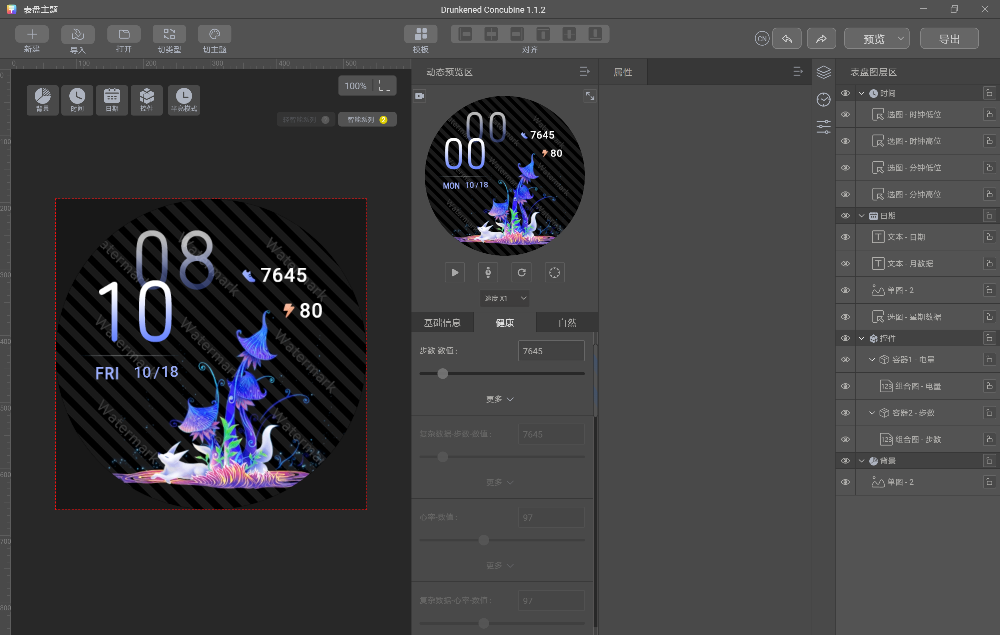

则根据[计算方式](#section24711627132513)，本示例的图层大小总和为12452字节，未超过当前表盘图层大小总和校验25600字节。

以下为计算详情：

<MergeTable
  headers={['类型', '名称', '大小（字节）', '样例表盘大小（字节）', '样例表盘图层大小计算详情']}
  rows={
    ['表盘框架类', '表盘框架', '2092', '2092', '表盘设计中包含【普通容器】，故计算表盘框架： 2092'],
    [{ text: '表盘控件', rowspan: 4, colspan: 1 }, '文本', '144', '288', '使用了2个文本：144*2'],
    [null, '单图', '196', '392', '使用了2张单图：196*2'],
    [null, '选图', '268', '1340', '使用5组选图：268*5'],
    [null, '组合图', '1252', '2504', '使用了2组组合图：1252*2'],
    [{ text: '表盘元素', rowspan: 3, colspan: 1 }, '元素', '304', '1216', '使用了背景大模块+时间大模块+日期大模块+控件大模块：304*4'],
    [null, '普通容器', '268', '536', '使用了2个容器：268*2'],
    [null, '图层', '264', '3168', '共11个图层（容器图层不算）：264*11'],
    ['图片映射表', '图片映射表', '20', '1140', '时间-时钟低位：9张图 时间-时钟高位：3张图 时间-分钟低位：9张图 时间-分钟高位：5张图 日期-单图：1张图 日期-星期数据：7张图 控件-电量组合图：11张图（包含透明图） 控件-步数组合图：11张图（包含透明图） 背景单图：1张图 共59张图：20*59'],
    ['/', '/', '/', '总计：12452', '/']
  }
/>

### 样例二：466\*466分辨率自定义表盘图层大小总和计算

以下为一个466\*466分辨率自定义表盘示例，使用的自定义图层如下图红框中所示：

本示例仅针对【控件大模块】中的自定义样式进行图层大小总和计算。

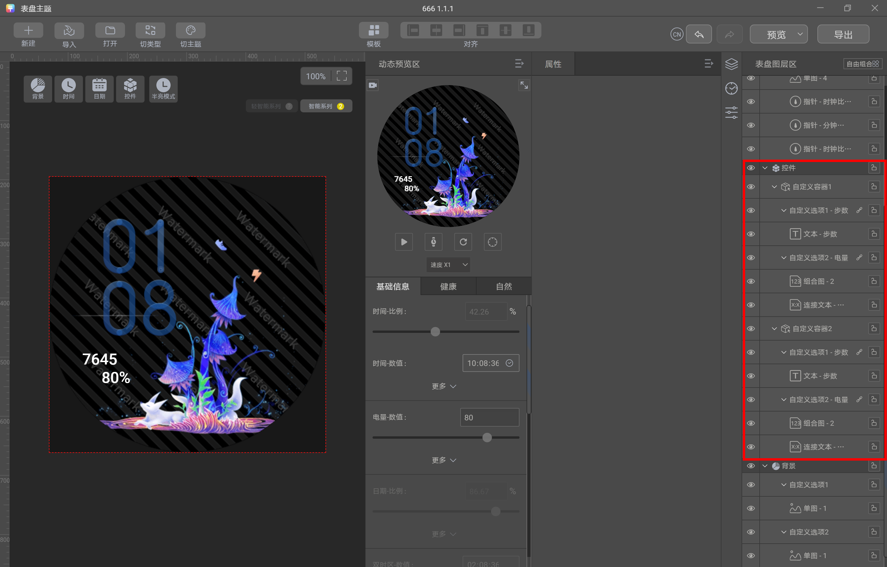

则根据[计算方式](#section24711627132513)，本示例【控件大模块】中自定义样式的图层大小总和为10652字节。

以下为计算详情：

<MergeTable
  headers={['类型', '名称', '大小（字节）', '样例表盘大小（字节）', '样例表盘图层大小计算详情']}
  rows={
    ['表盘框架类', '表盘框架', '2092', '2092', '表盘设计中包含【普通容器】和【自定义容器】，故计算表盘框架：2092'],
    [{ text: '表盘控件', rowspan: 3, colspan: 1 }, '文本', '144', '288', '使用2个文本：144*2'],
    [null, '连接文本', '156', '312', '使用两个连接文本：156*2'],
    [null, '组合图', '1252', '2504', '如图使用两个组合图：1252*2'],
    [{ text: '表盘元素', rowspan: 4, colspan: 1 }, '元素', '304', '304', '使用控件大模块：304*1'],
    [null, '自定义容器', '268', '336', '使用2个自定义容器：268*2'],
    [null, '自定义选项', '180', '360', '使用2个自定义容器，每个自定义容器计算只计算一个自定义选项：180*2'],
    [null, '自定义图层', '264', '3816', '先判断同一自定义容器下各个自定义选项所包含图层的大小，再选最大的自定义选项叠加计算。 自定义容器1下，自定义选项1中仅包含文本（144），自定义选项2中包含组合图和连接文本（1252+156），那么自定义容器1下的自定义图层大小取最大值为（1252+156）。自定义容器2计算方法一致，也取最大值为（1252+156）。故自定义图层的大小为：（1252+156）*2'],
    ['图片映射表', '图片映射表', '20', '640', '自定义选项2-电量组合图：12张图（包含透明图）：12*20 4个自定义选项中添加的效果图：20*4 4个自定义选项中添加的边框图：20*4'],
    ['/', '/', '/', '总计：10652', '/']
  }
/>

## 单张图片像素点大小校验

### 校验提醒

Theme Studio会对单张图片的像素点大小进行校验，如超出会弹出以下提醒：

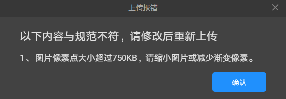

如果在Theme Studio中遇到此弹出提醒，请根据以下规范进行合理的调整。

### 校验汇总

<MergeTable
  headers={['手表类型', '表盘分辨率', '单张图片像素点大小校验']}
  rows={
    [{ text: '智能手表', rowspan: 6, colspan: 1 }, '466*466（1.y.z）', '/'],
    [null, '466*466（2.y.z）', '750KB'],
    [null, '390*390', '750KB'],
    [null, '454*454', '750KB'],
    [null, '280*456', '497KB'],
    [null, '336*480', '497KB'],
    ['运动手环', '194*368', '338KB']
  }
/>

### 计算方式

图片的像素点大小计算方式为：

* PNG图片：图片的长度\*图片的宽度\*4/1024（单位：KB）。
* BMP图片：图片的长度\*图片的宽度\*2/1024（单位：KB）。

计算后Theme Studio还将自动对其进行压缩，以压缩后得到的值为准。当压缩后得到的值超过当前分辨率校验，图片无法上传。

Theme Studio压缩图片时，当前图片的连续相同像素点越多，压缩后得到的值越小。因此，当超出像素点大小校验时，可以通过缩小图片尺寸，或者减少图片的渐变像素点来解决。

以454\*454分辨率为例：

* 一张454px\*454px的PNG图片（纯色），像素点大小为：454\*454\*4/1024≈805KB。由于是纯色图片，连续相同像素点多，压缩后的值小于750KB，则可以上传。
* 一张454px\*454px的PNG图片（非纯色），像素点大小为：454\*454\*4/1024≈805KB。由于图片色彩丰富，连续相同像素点少，压缩后的值仍大于750KB，则无法上传。

## 图片大小总和（PSRAM）校验

### 校验提醒

Theme Studio会对图片大小总和进行校验，如超出会弹出以下提醒：

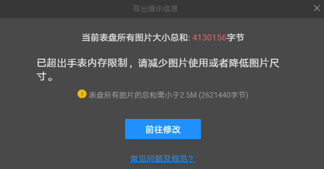

如果在Theme Studio中遇到此弹出提醒，请根据以下规范进行合理的调整。

PSRAM是指：手表资源中所有图片的大小总和，包含所有需要上传的图片的资源：单图、选图、组合图、指针图、单组序列帧、多组序列帧、直线图，弧形图。

### 校验原因

手表加载后，所有图片同时缓存在手表设备中的图片缓存区，图片缓存区大小有限，故需要校验表盘上所有图片大小总和。

### 校验汇总

<MergeTable
  headers={['手表类型', '表盘分辨率', 'PSRAM校验']}
  rows={
    [{ text: '智能手表', rowspan: 6, colspan: 1 }, '466*466（1.y.z）', '/'],
    [null, '466*466（2.y.z）', '2.5MB（2621440字节）'],
    [null, '390*390', '2.5MB（2621440字节）'],
    [null, '454*454', '2.5MB（2621440字节）'],
    [null, '280*456', '2.5MB（2621440字节）'],
    [null, '336*480', '2.5MB（2621440字节）'],
    ['运动手环', '194*368', '790KB（808960字节）']
  }
/>

1MB= 1048576字节、1KB=1024字节。

### 计算方式

根据以下公式，对所有的图片进行叠加计算：

单张PNG图片：（图片的长度\*图片的宽度）\*4=单张PNG图片的大小（单位：字节）。

单张BMP图片：（图片的长度\*图片的宽度）\*2=单张BMP图片的大小（单位：字节）。

选图只需要计算一张图片大小，其他控件需按照实际图片资源数量计算。

### 样例：466\*466分辨率表盘PSRAM计算

以下为一个466\*466分辨率表盘示例，使用的全部图片资源如下图所示：

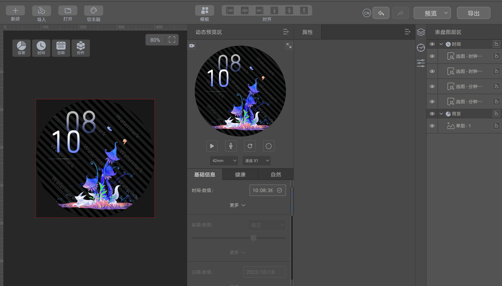

则根据[计算方式](#section1414911151316)，本示例表盘的图片大小总和为868624+94080=962704字节。

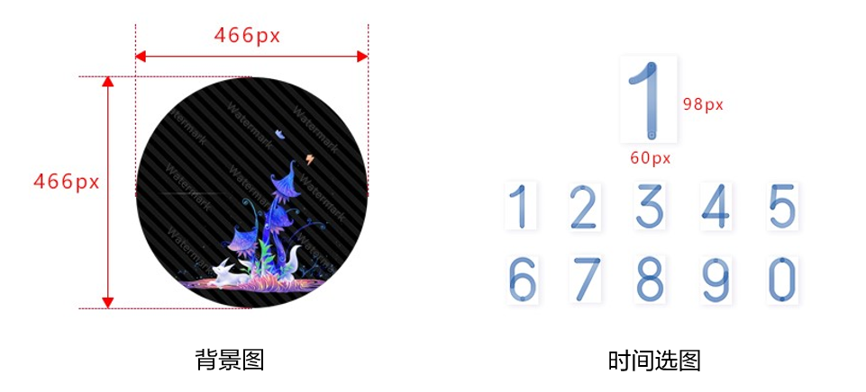

以下为计算详情：

<strong>背景图</strong>

背景图尺寸为466px\*466px，则背景图的图片大小为：（466\*466）\*4=868624（字节）。

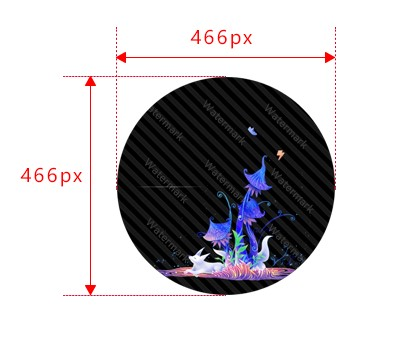

<strong>时间选图</strong>

时间 选图-时钟高位 的图片尺寸为60px\*98px，则 选图-时钟高位 的图片大小为：（60\*98）\*4=23520（字节）。

由于时间分为时钟高位，时钟低位、分钟高位、分钟低位四个部分，且这四个部分使用同一套时间数字切图，所以时间选图的总大小需\*4：23520\*4=94080。

选图只需要计算一张图片大小。

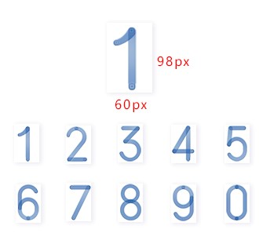