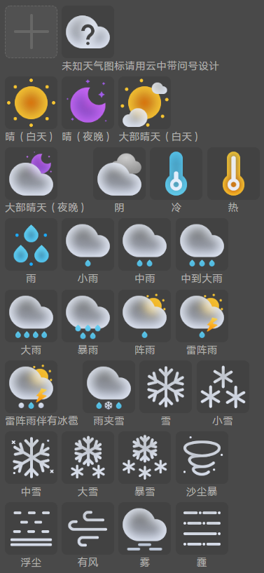
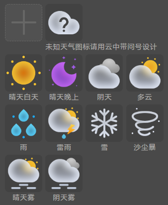
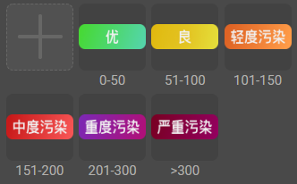
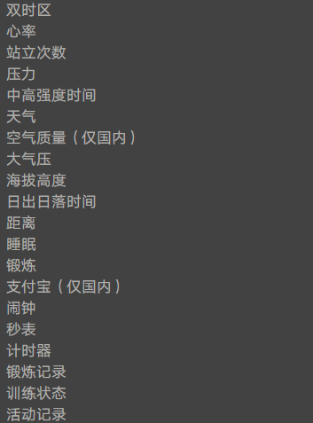

import MergeTable from '@site/src/components/MergeTable';

# 数值类型

## 数值类型分类

表盘支持制作四大类别的数值类型，每种类别支持通过特定控件呈现。

<MergeTable
  headers={['所属类别', '数值类型', '数值类型描述', '默认展示']}
  rows={
    [{ text: '原始数据', rowspan: 3, colspan: 1 }, '时钟', '时钟，根据系统设置确定24小时制还是12小时制', '10'],
    [null, '分钟', '分钟', '08'],
    [null, '秒钟', '秒钟', '36'],
    [{ text: '枚举数据', rowspan: 7, colspan: 1 }, '上午下午', 'am 上午；pm 下午；空白', '上午'],
    [null, '时钟高位', '小时的十位数值，根据系统设置确定24小时制还是12小时制', '1'],
    [null, '时钟低位', '小时的十位数值，根据系统设置确定24小时制还是12小时制', '0'],
    [null, '分钟高位', '分钟的十位数值', '0'],
    [null, '分钟低位', '分钟的个位数值', '8'],
    [null, '秒钟高位', '秒钟的十位数值', '3'],
    [null, '秒钟低位', '秒钟的个位数值', '6'],
    [{ text: '比例数据', rowspan: 4, colspan: 1 }, '时钟比例12', '以12小时为100%，当前时钟占12小时的百分比', { text: '42.26%', rowspan: 4, colspan: 1 }],
    [null, '时钟比例24', '以24小时为100%，当前时钟占24小时的百分比', null],
    [null, '分钟比例', '以60分钟为100%，当前分钟占60分钟的百分比', null],
    [null, '秒钟比例', '以60秒钟为100%，当前秒钟占60秒钟的百分比', null],
    ['文本数据', 'AM/PM文本', '用于展示AM/PM文本', '上午']
  }
/>

## 数值类型汇总

表盘支持的所有数值类型，如下表所示：

### 时间

<MergeTable
  headers={['所属类别', '数值类型', '数值类型描述', '默认展示']}
  rows={
    [{ text: '枚举数据', rowspan: 4, colspan: 1 }, '前一秒高位', '用于当前时间秒的前一秒高位选图', '3'],
    [null, '前一秒低位', '用于当前时间秒的前一秒低位选图', '5'],
    [null, '前一秒的前一秒（前两秒）高位', '用于当前时间秒的前两秒高位选图', '3'],
    [null, '前一秒的前一秒（前两秒）低位', '用于当前时间秒的前两秒低位选图', '4']
  }
/>

### 秒

<MergeTable
  headers={['所属类别', '数值类型', '数值类型描述', '默认展示']}
  rows={
    [{ text: '原始数据', rowspan: 2, colspan: 1 }, '双时区时钟', '双时区时钟，根据系统设置确定24小时制还是12小时制', '02'],
    [null, '双时区分钟', '双时区分钟', '08'],
    [{ text: '枚举数据', rowspan: 5, colspan: 1 }, '双时区时钟高位', '双时区时钟小时的十位数值，根据系统设置确定24小时制还是12小时制', '0'],
    [null, '双时区时钟低位', '双时区时钟小时的十位数值，根据系统设置确定24小时制还是12小时制', '2'],
    [null, '双时区AMPM', '双时区AMPM', '上午'],
    [null, '双时区分钟高位', '双时区分钟高位', '0'],
    [null, '双时区分钟低位', '双时区分钟低位', '8'],
    [{ text: '比例数据', rowspan: 3, colspan: 1 }, '双时区时钟比例12', '以12小时为100%，当前双时区时钟占12小时的百分比', { text: '8.93%', rowspan: 3, colspan: 1 }],
    [null, '双时区时钟比例24', '以24小时为100%，当前双时区时钟占24小时的百分比', null],
    [null, '双时区分钟比例', '以60分钟为100%，当前分钟占60分钟的百分比', null],
    [{ text: '文本数据', rowspan: 3, colspan: 1 }, '双时区AM/PM文本', '用于展示双时区的AM/PM文本', '上午'],
    [null, '双时区缩写文本', '根据当前系统设置显示时区缩写，如LON', 'LON'],
    [null, '双时区时/分文本', '用于展示双时区的时/分文本', 'LON 02:08']
  }
/>

### 双时区

<MergeTable
  headers={['所属类别', '数值类型', '数值类型描述', '默认展示']}
  rows={
    [{ text: '枚举数据', rowspan: 5, colspan: 1 }, '日出日落选图', '用于日出日落的选图 日出日落图片下标 （0 日出 1 日落）', '日出'],
    [null, '日出日落时钟高位', '用于显示日出日落时钟的高位', '0'],
    [null, '日出日落时钟低位', '用于显示日出日落时钟低位', '6'],
    [null, '日出日落分钟高位', '用于显示日出日落分钟高位', '0'],
    [null, '日出日落分钟低位', '用于显示日出日落分钟低位', '8'],
    [{ text: '文本数据', rowspan: 2, colspan: 1 }, '日出文本', '用于展示日出文本 日出时间，如 7:30', '6:30'],
    [null, '日落文本', '用于展示日落文本 日落时间，如 20:00', '18:30']
  }
/>

### 日出日落

<MergeTable
  headers={['所属类别', '数值类型', '数值类型描述', '默认展示']}
  rows={
    [{ text: '文本数据', rowspan: 2, colspan: 1 }, '月出文本', '用于展示月出文本 月出时间，如 7:30', '19:30'],
    [null, '月落文本', '用于展示月落文本 月落时间，如 7:30', '8:30']
  }
/>

### 月出月落

<MergeTable
  headers={['所属类别', '数值类型', '数值类型描述', '默认展示']}
  rows={
    [{ text: '原始数据', rowspan: 4, colspan: 1 }, '日期', '日期', '18'],
    [null, '昨天', '昨天日期', '17'],
    [null, '明天', '明天日期', '19'],
    [null, '月数据', '用于月份数据的显示（纯阿拉伯数字1-12）', '10'],
    [{ text: '枚举数据', rowspan: 10, colspan: 1 }, '月', 'january 一月 february 二月 march 三月 april 四月 may 五月 june 六月 july 七月 august 八月 september 九月 october 十月 november 十一月 december 十二月', '十月'],
    [null, '星期数据', 'Monday 星期一 Tuesday 星期二 Wednesday 星期三 Thursday 星期四 Friday 星期五 Saturday 星期六 Sunday 星期天', '星期五'],
    [null, '日期高位', '日期高位', '1'],
    [null, '日期低位', '日期低位', '8'],
    [null, '昨天日期高位', '昨天日期高位', '1'],
    [null, '昨天日期低位', '昨天日期低位', '7'],
    [null, '明天日期高位', '明天日期高位', '1'],
    [null, '明天日期低位', '明天日期低位', '9'],
    [null, '12时辰', '12时辰 0表示子时，时间区间为23点-0点，0点-1点，2小时为一个时辰区间', '巳'],
    [null, '月相', 'New 新月 WaxingCrescent 峨眉月 First 上弦月 WaxingGibbous 盈凸月 Full 满月 WaningGibbous 亏凸月 Last 下弦月 WaningCrescent 残月', '新月'],
    [{ text: '比例数据', rowspan: 2, colspan: 1 }, '日期占31天比例', '以31天为100%，当前日期占31天的百分比（区别于144）', '51.61%'],
    [null, '星期比例', '以7天为100%，当前星期占7天的百分比', '71.43%'],
    [{ text: '文本数据', rowspan: 2, colspan: 1 }, '星期文本', '用于展示星期文本', '周五'],
    [null, '月份文本', '用于展示月份文本', '10月']
  }
/>

### 日期

<MergeTable
  headers={['所属类别', '数值类型', '数值类型描述', '默认展示']}
  rows={
    [{ text: '枚举数据', rowspan: 3, colspan: 1 }, '农历月份', '农历月份', '十月'],
    [null, '农历日期高位', '农历日期高位', '十'],
    [null, '农历日期低位', '农历日期低位', '八']
  }
/>

### 农历

<MergeTable
  headers={['所属类别', '数值类型', '数值类型描述', '默认展示']}
  rows={
    ['原始数据', '电量', '电量', '80'],
    [{ text: '枚举数据', rowspan: 2, colspan: 1 }, '电量枚举', '0%，10%，20%，30%，40%，50%，60%，70%，80%，90%，100%', '80%'],
    [null, '电量状态的枚举', '用于显示电量状态，（0-10表示电量枚举，11-21表示充电电量枚举）', '80%'],
    ['比例数据', '电量比例', '以电量100为100%，当前实际电量占100的百分比', '80%']
  }
/>

### 电量

<MergeTable
  headers={['所属类别', '数值类型', '数值类型描述', '默认展示']}
  rows={
    ['原始数据', '步数', '步数', '7645'],
    [{ text: '枚举数据', rowspan: 5, colspan: 1 }, '步数个位', '步数个位数值', '5'],
    [null, '步数十位', '步数十位数值', '4'],
    [null, '步数百位', '步数百位数值', '6'],
    [null, '步数千位', '步数千位数值', '7'],
    [null, '步数万位', '步数万位数值', '0'],
    ['比例数据', '步数目标达成度', '以从APP获取的步数目标位100%，当前实际步数占步数目标的百分比，超过100%按100%计算', '76%']
  }
/>

### 步数

<MergeTable
  headers={['所属类别', '数值类型', '数值类型描述', '默认展示']}
  rows={
    [{ text: '原始数据', rowspan: 3, colspan: 1 }, '心率', '心率', '97'],
    [null, '最大心率', '最大心率', '255'],
    [null, '最小心率', '最小心率', '1'],
    ['枚举数据', '心率区间', '五档心率区间 无效值：心率=0 或 心率 &lt; 96 第一档：96 &lt;= 心率 &lt; 115 第二档：115 &lt;= 心率 &lt; 134 第三档：134 &lt;= 心率 &lt; 153 第四档：153 &lt;= 心率 &lt; 172 第五档：172 &lt;= 心率', '第一档'],
    ['比例数据', '心率比例', '以心率最大值255为100%，当前实际心率值占255的百分比', '38.04%']
  }
/>

### 卡路里

<MergeTable
  headers={['所属类别', '数值类型', '数值类型描述', '默认展示']}
  rows={
    [{ text: '原始数据', rowspan: 5, colspan: 1 }, '气温', '气温，随设置自动切换摄氏度/华氏度', '24'],
    [null, '最高温度', '最高温度', '-10'],
    [null, '最低温度', '最低温度', '36'],
    [null, '当前温度减一', '当前温度减一', '23'],
    [null, '当前温度加一', '当前温度加一', '25'],
    [{ text: '枚举数据', rowspan: 3, colspan: 1 }, '温度类型', '摄氏度（°C），华氏度（°F）', '°C'],
    [null, '28种天气类型', '未知，网络未连接等异常导致天气未知 晴（白天） 晴（夜晚） 大部晴天（白天） 大部晴天（夜晚） 阴 冷 热 雨 小雨 中雨 中到大雨 大雨 暴雨 阵雨 雷阵雨 雷阵雨伴有冰雹 雨夹雪 雪 小雪 中雪 大雪 暴雪 沙尘暴 浮尘 有风 雾 霾', '晴（白天）'],
    [null, '11种天气类型', 'unknown 未知：网络未连接等异常导致天气未知 sunny day 晴天白天 sunny night 晴天晚上 overcast 阴天 cloudy 多云 rain 雨 thunderstorms 雷雨 snow 雪 dust storm 沙尘暴 haze 晴天雾 fog 阴天雾', '晴天白天'],
    ['比例数据', '温度比例', '以最大最小差值为100%，当前温度与最小差值所占最大最小差值的百分比', '50%']
  }
/>

### 心率

<MergeTable
  headers={['所属类别', '数值类型', '数值类型描述', '默认展示']}
  rows={
    [{ text: '原始数据', rowspan: 2, colspan: 1 }, '海拔', '海拔', '2680'],
    [null, '海拔高度数据', '海拔高度数据', '2680'],
    ['枚举数据', '海拔高度单位', '海拔高度单位：米，英尺', '米'],
    ['比例数据', '高度比例', '最大高度为8848，最小高度为-800，当期高度所占百分比', '50%']
  }
/>

### 压力

<MergeTable
  headers={['所属类别', '数值类型', '数值类型描述', '默认展示']}
  rows={
    [{ text: '文本数据', rowspan: 2, colspan: 1 }, '潮涨时间文本', '用于显示潮涨时间的文本，如 7:30或20:00', '8:30'],
    [null, '潮落时间文本', '用于显示潮落时间的文本，如 7:30或20:00', '10:30']
  }
/>

### 中高强度时间

| 所属类别 | 数值类型 | 数值类型描述 | 默认展示 |
| --- | --- | --- | --- |
| 原始数据 | 中高强度时间 | 中高强度时间 | 26 |
| 比例数据 | 中高强度时间比例 | 以从中高强度目标30为100%，当前中高强度时间占中高强度目标的百分比，超过100%按100%算 | 1.81% |

### 站立次数

| 所属类别 | 数值类型 | 数值类型描述 | 默认展示 |
| --- | --- | --- | --- |
| 原始数据 | 站立次数 | 站立次数 | 12 |
| 比例数据 | 站立次数比例 | 以从站立次数目标12为100%，当前站立次数占站立次数目标的百分比，超过100%按100%计算 | 0% |

### 最大摄氧量

| 所属类别 | 数值类型 | 数值类型描述 | 默认展示 |
| --- | --- | --- | --- |
| 原始数据 | 最大摄氧量 | 最大摄氧量 | 58 |
| 比例数据 | 最大摄氧量比例 | 以最大摄氧量最大值80为100%，当前最大摄氧量数据占最大值的百分比 | 72.5% |

### 睡眠

| 所属类别 | 数值类型 | 数值类型描述 | 默认展示 |
| --- | --- | --- | --- |
| 文本数据 | 睡眠文本(\*h\*m) | 用于显示睡眠时间的文本 | 7h30m |
| 比例数据 | 睡眠比例 | 以目标睡眠时长为100%，当前睡眠时长占目标睡眠时长的百分比 | 0% |

### 天气

| 所属类别 | 数值类型 | 数值类型描述 | 默认展示 |
| --- | --- | --- | --- |
| 原始数据 | 气温 | 气温，随设置自动切换摄氏度/华氏度 | 24 |
| 最高温度 | 最高温度 | -10 |
| 最低温度 | 最低温度 | 36 |
| 当前温度减一 | 当前温度减一 | 23 |
| 当前温度加一 | 当前温度加一 | 25 |
| 枚举数据 | 温度类型 | 摄氏度（°C），华氏度（°F） | °C |
| 28种天气类型 | 1. 未知，网络未连接等异常导致天气未知 2. 晴（白天） 3. 晴（夜晚） 4. 大部晴天（白天） 5. 大部晴天（夜晚） 6. 阴 7. 冷 8. 热 9. 雨 10. 小雨 11. 中雨 12. 中到大雨 13. 大雨 14. 暴雨 15. 阵雨 16. 雷阵雨 17. 雷阵雨伴有冰雹 18. 雨夹雪 19. 雪 20. 小雪 21. 中雪 22. 大雪 23. 暴雪 24. 沙尘暴 25. 浮尘 26. 有风 27. 雾 28. 霾 | 晴（白天）   |
| 11种天气类型 | 1. unknown 未知：网络未连接等异常导致天气未知 2. sunny day 晴天白天 3. sunny night 晴天晚上 4. overcast 阴天 5. cloudy 多云 6. rain 雨 7. thunderstorms 雷雨 8. snow 雪 9. dust storm 沙尘暴 10. haze 晴天雾 11. fog 阴天雾 | 晴天白天   |
| 比例数据 | 温度比例 | 以最大最小差值为100%，当前温度与最小差值所占最大最小差值的百分比 | 50% |

### 大气压

| 所属类别 | 数值类型 | 数值类型描述 | 默认展示 |
| --- | --- | --- | --- |
| 原始数据 | 气压 | 气压 | 742 |
| 比例数据 | 气压比例 | 最大气压为1100，最小气压为300，当期气压所占百分比 | 0% |

### 空气质量（仅国内）

| 所属类别 | 数值类型 | 数值类型描述 | 默认展示 |
| --- | --- | --- | --- |
| 原始数据 | AQI | 空气污染指数 | 58 |
| 枚举数据 | AQI等级 | 六档等级(0-50, 51-100, 101-150, 151-200, 201-300, &gt;300) | 51-100   |
| 比例数据 | AQI比例 | 以500为100%，当前AQI所占的百分比 | 0% |

### 海拔高度

| 所属类别 | 数值类型 | 数值类型描述 | 默认展示 |
| --- | --- | --- | --- |
| 原始数据 | 海拔 | 海拔 | 2680 |
| 海拔高度数据 | 海拔高度数据 | 2680 |
| 枚举数据 | 海拔高度单位 | 海拔高度单位：米，英尺 | 米   |
| 比例数据 | 高度比例 | 最大高度为8848，最小高度为-800，当期高度所占百分比 | 50% |

### 距离

| 所属类别 | 数值类型 | 数值类型描述 | 默认展示 |
| --- | --- | --- | --- |
| 文本数据 | 距离文本 | 用于显示距离数据的文本，如 10.5 | 3.66 |
| 原始数据 | 距离数据 | 用于距离数据的显示 | 3660 |

### 小时分钟

| 所属类别 | 数值类型 | 数值类型描述 | 默认展示 |
| --- | --- | --- | --- |
| 文本数据 | 潮涨时间文本 | 用于显示潮涨时间的文本，如 7:30或20:00 | 8:30 |
| 潮落时间文本 | 用于显示潮落时间的文本，如 7:30或20:00 | 10:30 |

### 跳转应用

