import MergeTable from '@site/src/components/MergeTable';

# 制作表盘

本文将介绍表盘制作工具Theme Studio的界面、功能和使用方法。

## 选择分辨率

点击“+”号，以创建一个新表盘。

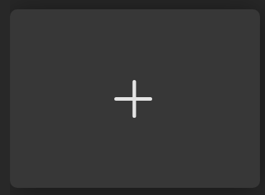

选择手表类型和分辨率，这里以466\*466为例进行演示。

其他分辨率的制作方法类似，只是支持的能力集有一些差异，详见：

* [466\*466能力集](/docs/distribute/content-dist/theme-center/development-tutorial-0000001054519376/watchface-0000001054571181/basic-concepts-0000001207883464/resolution-capability-0000001523484462/x466-capability-0000001881726154)
* [390\*390/454\*454能力集](/docs/distribute/content-dist/theme-center/development-tutorial-0000001054519376/watchface-0000001054571181/basic-concepts-0000001207883464/resolution-capability-0000001523484462/x454-capability-0000001580733885)
* [280\*456/336\*480能力集](/docs/distribute/content-dist/theme-center/development-tutorial-0000001054519376/watchface-0000001054571181/basic-concepts-0000001207883464/resolution-capability-0000001523484462/x280-capability-0000001592176765)
* [194\*368能力集](/docs/distribute/content-dist/theme-center/development-tutorial-0000001054519376/watchface-0000001054571181/basic-concepts-0000001207883464/resolution-capability-0000001523484462/x194-capability-0000001591976781)

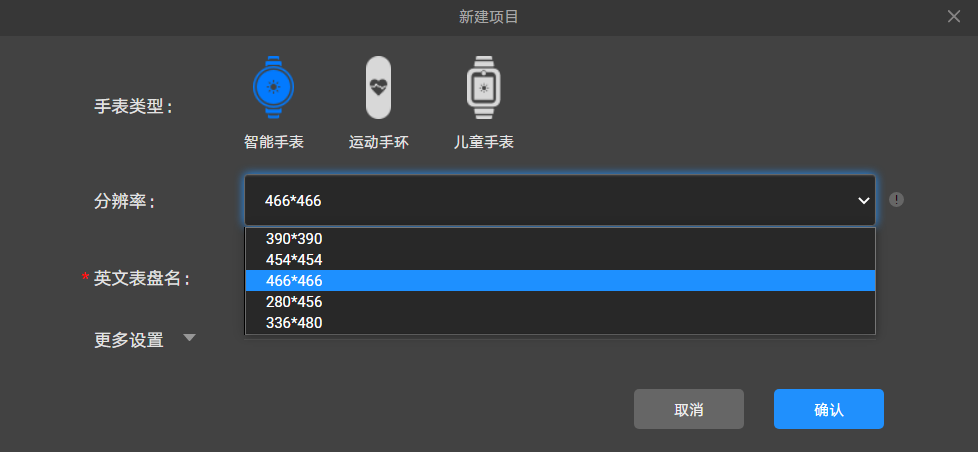

## 进入制作页面

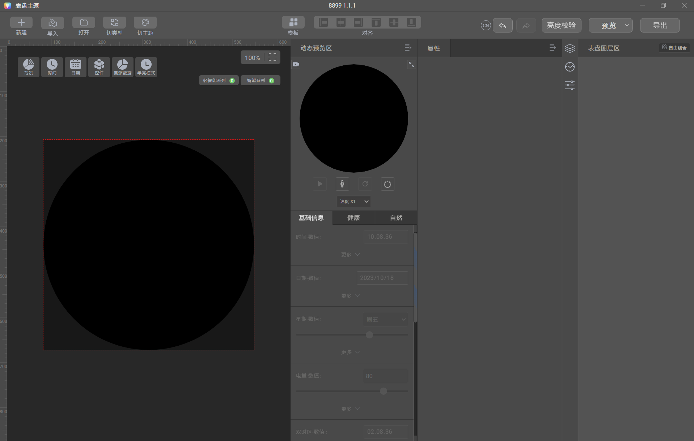

### 顶部菜单栏

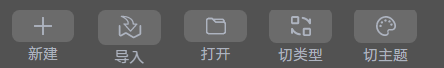

<strong>新建</strong>：创建一个新的表盘制作项目。

<strong>导入</strong>：从本地导入已有的表盘制作项目，支持拖拽导入。

<strong>打开</strong>：打开Theme Studio中已有的表盘制作项目。

<strong>切类型</strong>：仅466\*466支持切换类型，点击可切换制作模式。

<strong>切主题</strong>：点击切换到手机主题制作页面。

### 控件区

<strong>背景</strong>：展示制作背景时，支持使用的控件类型。

<strong>时间</strong>：展示制作时间（时、分、秒）时，支持使用的控件类型。

<strong>日期</strong>：展示制作日期（月、日、星期）时，支持使用的控件类型。

<strong>控件</strong>：展示制作数据（天气、步数、心率等）时，支持使用的控件类型。

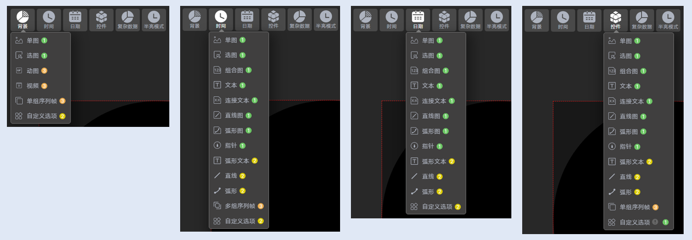

<strong>控件介绍</strong>

控件是表盘的功能选项，每个控件都有其独特作用。

通过添加一定数量的控件，进行表盘制作。

例如：添加一个视频组件，显示表盘动态背景；添加一个文本控件，显示步数或心率。

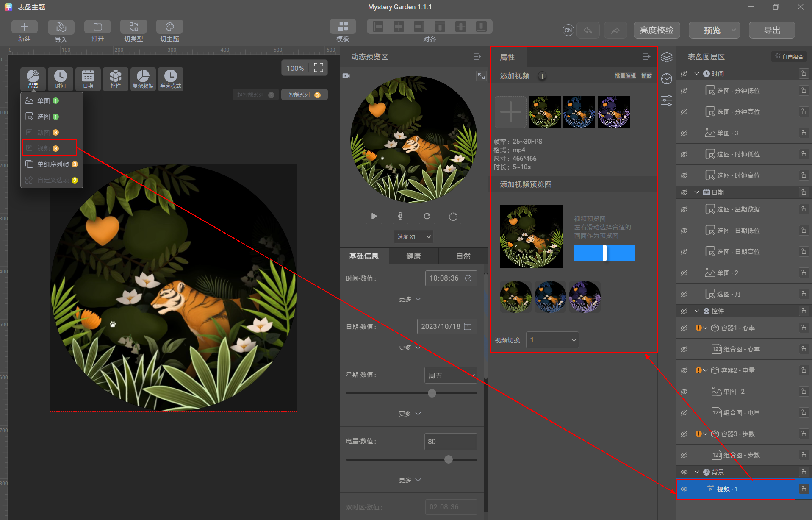

<strong>控件汇总</strong>

当前共支持15种控件，详见下表。

每种控件的功能与使用方法，我们将结合[制作实例](/docs/distribute/content-dist/theme-center/development-tutorial-0000001054519376/watchface-0000001054571181/watch-face-production-0000001573924705/production-example-0000001530293740)详细讲解。

每类分辨率支持的控件类型及其对应的版本号，详见：

* [466\*466控件类型](/docs/distribute/content-dist/theme-center/development-tutorial-0000001054519376/watchface-0000001054571181/basic-concepts-0000001207883464/resolution-capability-0000001523484462/x466-capability-0000001881726154#section1921412381417)
* [390\*390/454\*454控件类型](/docs/distribute/content-dist/theme-center/development-tutorial-0000001054519376/watchface-0000001054571181/basic-concepts-0000001207883464/resolution-capability-0000001523484462/x454-capability-0000001580733885#section9686121420109)
* [280\*456/336\*480控件类型](/docs/distribute/content-dist/theme-center/development-tutorial-0000001054519376/watchface-0000001054571181/basic-concepts-0000001207883464/resolution-capability-0000001523484462/x280-capability-0000001592176765#section387762991810)
* [194\*368控件类型](/docs/distribute/content-dist/theme-center/development-tutorial-0000001054519376/watchface-0000001054571181/basic-concepts-0000001207883464/resolution-capability-0000001523484462/x194-capability-0000001591976781#section387762991810)

<MergeTable
  headers={['控件类型', '控件功能', '关联数据类型', '场景举例']}
  rows={
    ['单图', '上传静态图片，以展示静态画面', { text: '不关联数据', rowspan: 4, colspan: 1 }, { text: '使用单图控件，制作表盘静态背景 使用单组序列帧/视频/动图控件，制作表盘动态背景', rowspan: 4, colspan: 1 }],
    ['单组序列帧', '上传序列帧动画，以展示动态画面', null, null],
    ['视频', '上传MP4格式的视频，以展示动态画面，仅用于背景', null, null],
    ['动图', '上传GIF格式的动图，以展示动态画面，仅用于背景', null, null],
    ['选图', '上传一组图片，根据数据实际值显示组图中的一张，以制作枚举数据', '枚举数据', '使用选图控件，制作静态背景切换 使用选图控件，制作天气类型枚举 使用选图控件，制作电量枚举'],
    ['多组序列帧', '上传0-9数字序列帧，每个数字设计1组序列帧，以展示每个数字的动态效果，仅用于数字时钟', '枚举数据', '使用多组序列帧控件，制作数字时钟'],
    ['组合图', '上传0-9数字切图，每个数字设计1张切图，并将其组合起来，以展示数据数值', '原始数据', '使用组合图控件，制作心率数值'],
    ['文本', '展示单个动态文本', { text: '原始数据 文本数据', rowspan: 3, colspan: 1 }, { text: '使用文本控件，制作步数、心率数值 使用连接文本控件，制作XX-XX格式的心率、XX%格式的电量、XX/XX格式的日期 使用弧形文本控件，制作带弧度的步数数值', rowspan: 3, colspan: 1 }],
    ['连接文本', '展示1~2个带特殊符号的动态文本', null, null],
    ['弧形文本', '展示带弧度的动态文本', null, null],
    ['直线', '绘制直线，展示进度/比例', { text: '比例数据', rowspan: 5, colspan: 1 }, { text: '使用弧形图控件，制作步数目标达成度、电量比例 使用直线控件，制作心率比例', rowspan: 4, colspan: 1 }],
    ['弧形', '绘制弧形，展示进度/比例', null, null],
    ['直线图', '上传直线图，展示进度/比例', null, null],
    ['弧形图', '上传弧形图，展示进度/比例', null, null],
    ['指针', '上传指针切图，通过指针旋转展示进度/比例', null, '使用指针控件，制作时针、分针、秒针']
  }
/>

### 表盘图层区

每添加一个控件，都将自动生成一个对应的图层，显示在右侧表盘图层区。

表盘图层区显示已添加的所有控件图层。

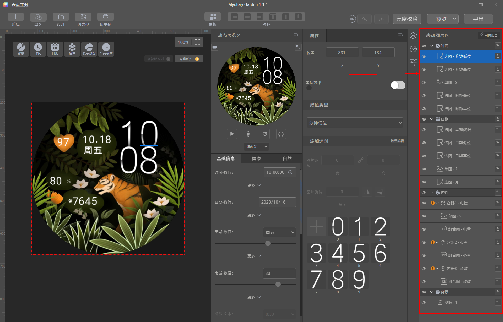

<strong>图层分组</strong>

1. 基于控件添加的位置，控件图层自动分为背景、时间、日期和控件四组。
2. 四组图层由下至上叠加显示：背景最底层、控件第3层、日期第2层、时间最顶层。
3. 在“控件”图层内部，容器1在最底层，依次往上叠加。

<strong>容器介绍</strong>

1. 初次从“控件”中添加一个控件后，同时会新建一个容器。容器是一组图层的细化分组，默认显示为“容器X”（X为阿拉伯数字），此时未关联数值类型。当该容器下的图层关联“数值类型”后，该容器将变为特定数据容器，显示为“容器X-XX数据”。例如：“容器1-心率”、“容器2-电量”、“容器3-步数”。

   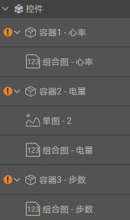
2. 选中某个容器或者容器下的图层时（蓝色为选中状态），只能在当前容器下新建控件图层。且图层关联的数值类型，只能从该数据容器中进行选择。例如：选中“容器1-心率”，只能在此容器下新建控件图层，且只能选择心率相关的数值类型。

   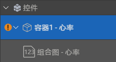
3. 如果需要新建一个容器，则需要先取消选中状态（点击“控件”可取消选中状态），然后再添加一个控件，此时即可新建一个容器。新的容器可以关联新的数值类型。

   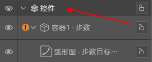
4. 图层只能在当前容器的范围中移动。建议先选中容器，调整好容器的大小和位置，再选中图层，调整图层的大小和位置。

   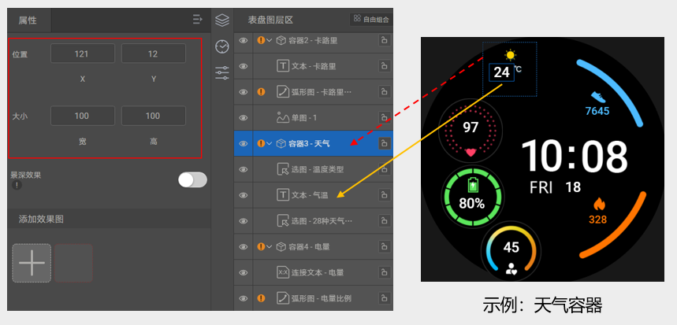

<strong>容器跳转</strong>

容器变为特定数据容器后，点击当前容器的范围，可跳转至相关应用。哪些容器支持跳转？点击查看[跳转应用](/docs/distribute/content-dist/theme-center/development-tutorial-0000001054519376/watchface-0000001054571181/watch-face-production-0000001573924705/start-production-0000001523804314/value-type-0000001529974532#section1743413371488)。

因此，在制作特定数据容器时，请注意多个数据容器的范围不可重叠，避免出现“跳转失误”问题。

例如：点击天气容器，须跳转至天气应用，点击心率容器，须跳转至心率应用。因此，天气容器和心率容器的范围不可重叠。

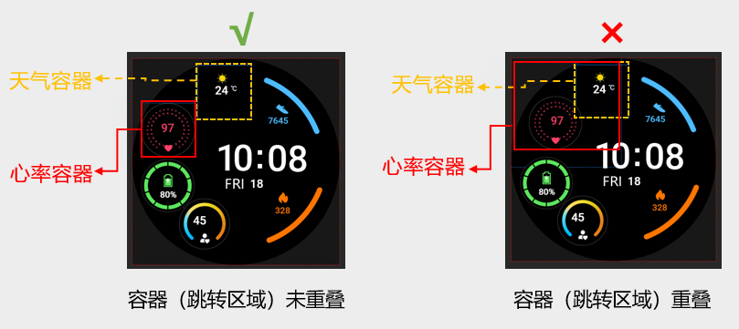

<strong>在表盘图层区，支持执行以下操作：</strong>

* 显示/隐藏图层：隐藏的图层不会显示在预览区中。
* 锁定/解锁图层：锁定图层以免其在画布上移动。
* 移动图层：移动图层位置，仅支持在当前分组中进行移动。
* 删除图层：删除当前图层（右键后删除/Delete快捷键）。
* 复制图层：仅支持复制容器图层（右键后复制）。
* 添加模板：将当前容器图层添加为模板（右键后添加）。

### 属性编辑区

每个控件图层都有一系列可编辑的属性，我们将结合[制作实例](/docs/distribute/content-dist/theme-center/development-tutorial-0000001054519376/watchface-0000001054571181/watch-face-production-0000001573924705/production-example-0000001530293740)详细讲解。

<strong>数值类型</strong> <strong>介绍</strong>

在一系列属性中，关联<strong>“数值类型”</strong>非常重要。

* 关联“数值类型”前，控件与表盘支持的“数值类型”无联系。
* 关联“数值类型”后，控件与表盘支持的“数值类型”联系起来——通过该控件动态、实时显示当前“数值类型”的值。

例如：为组合图控件关联数值类型“步数”，则通过该控件动态、实时显示当前实际步数值。

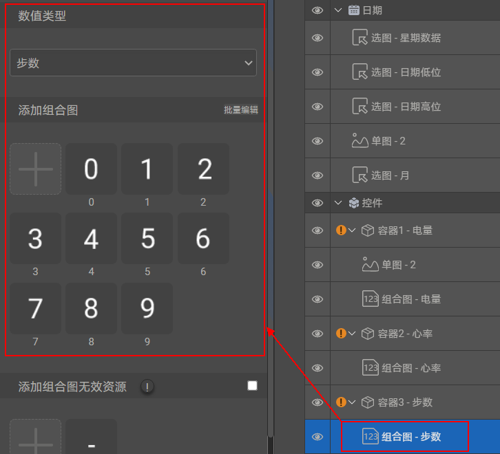

<strong>数值类型汇总</strong>

表盘支持的所有数值类型及其介绍，详见[数值类型](/docs/distribute/content-dist/theme-center/development-tutorial-0000001054519376/watchface-0000001054571181/watch-face-production-0000001573924705/start-production-0000001523804314/value-type-0000001529974532)。

常用的数值类型制作方法，我们将结合[制作实例](/docs/distribute/content-dist/theme-center/development-tutorial-0000001054519376/watchface-0000001054571181/watch-face-production-0000001573924705/production-example-0000001530293740)详细讲解。

每类分辨率支持的数值类型及其对应的版本号，详见：

* [466\*466数值类型](/docs/distribute/content-dist/theme-center/development-tutorial-0000001054519376/watchface-0000001054571181/basic-concepts-0000001207883464/resolution-capability-0000001523484462/x466-capability-0000001881726154#section1462914111857)
* [390\*390/454\*454数值类型](/docs/distribute/content-dist/theme-center/development-tutorial-0000001054519376/watchface-0000001054571181/basic-concepts-0000001207883464/resolution-capability-0000001523484462/x454-capability-0000001580733885#section1781115539139)
* [280\*456/336\*480数值类型](/docs/distribute/content-dist/theme-center/development-tutorial-0000001054519376/watchface-0000001054571181/basic-concepts-0000001207883464/resolution-capability-0000001523484462/x280-capability-0000001592176765#section322152141813)
* [194\*368数值类型](/docs/distribute/content-dist/theme-center/development-tutorial-0000001054519376/watchface-0000001054571181/basic-concepts-0000001207883464/resolution-capability-0000001523484462/x194-capability-0000001591976781#section322152141813)

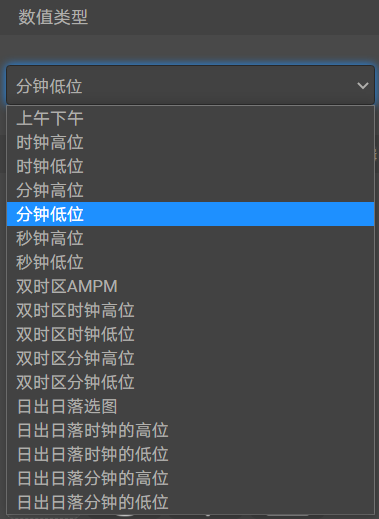

### 表盘编辑区

支持在表盘编辑区中，快速选中一个或多个图层，以进行将图层拖拽到合适位置、调整图层大小、调整图层对齐方式等操作。

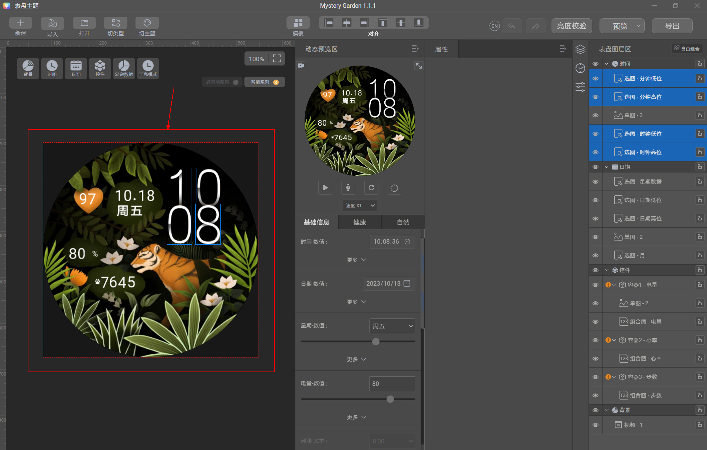

### 动态预览区

：自动运行表盘，以测试表盘在不同数值下的显示效果。

：模拟添加表带后的效果，可切换不同样式的表带。

：将表盘数值恢复至默认状态。

：校验表盘刻度是否准确。

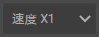：调整表盘运行速度，支持0.5/1/2/5倍速。

手动运行表盘：手动输入数值或拉动进度条，以测试表盘在不同数值下的显示效果。

请对照[表盘主题测试规范](/docs/distribute/content-dist/theme-center/content-release-0000001054679366/content-review-specifications-0000001054679960/content-check-pecifications-0000001057301166/sportwatch-test-0000001057059331)进行测试。

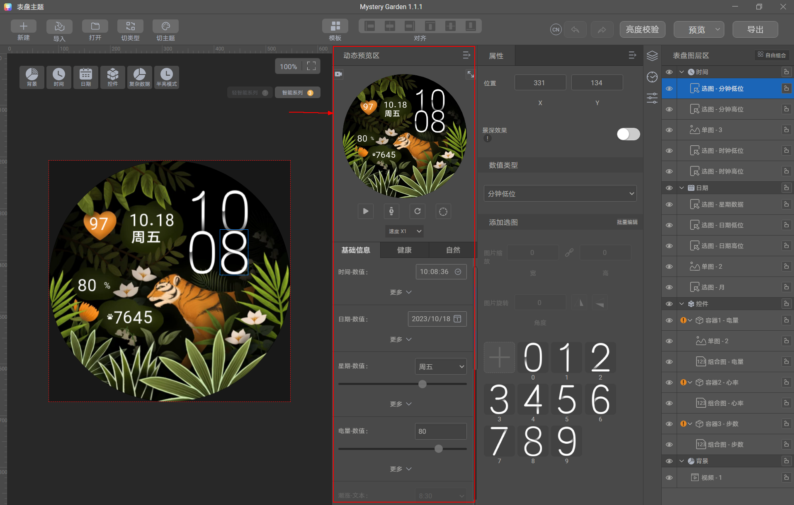

## 截图生成预览图

预览无误后，点击  将表盘数值恢复至默认状态。

然后点击“预览”-“截屏生成展示图”，自动生成预览图。

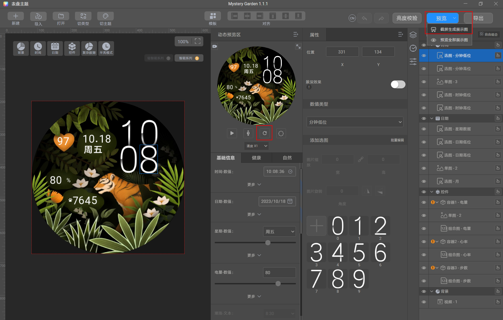

1. 由于表盘预览图上必须统一显示默认数值（详见[表盘主题测试规范](/docs/distribute/content-dist/theme-center/content-release-0000001054679366/content-review-specifications-0000001054679960/content-check-pecifications-0000001057301166/sportwatch-test-0000001057059331)），因此必须先在动态预览区点击  将数据恢复至默认状态，再“截屏生成展示图”。
2. 每类分辨率的预览图（res.png、cover.jpg、icon.jpg、aod.jpg）的尺寸不同，以Theme Studio实际截屏生成的预览图尺寸为准。
3. 支持制作熄屏表盘时，才会生成aod.jpg这张预览图。

**466\*466分辨率预览图**

自动生成以下几张预览图：

* res.png
* cover.jpg
* icon.jpg
* aod.jpg

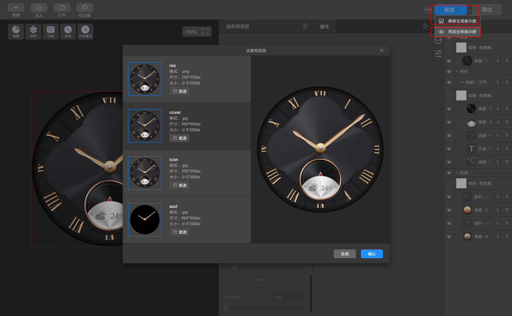

| res.png | cover.jpg | icon.jpg | aod.jpg |
| --- | --- | --- | --- |
| 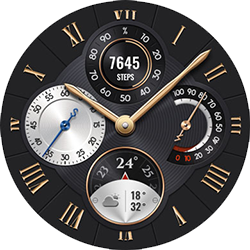 | 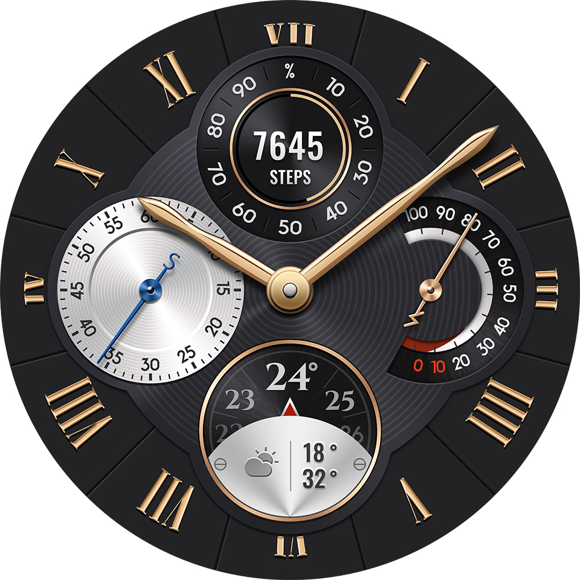 | 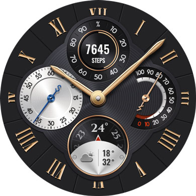 | 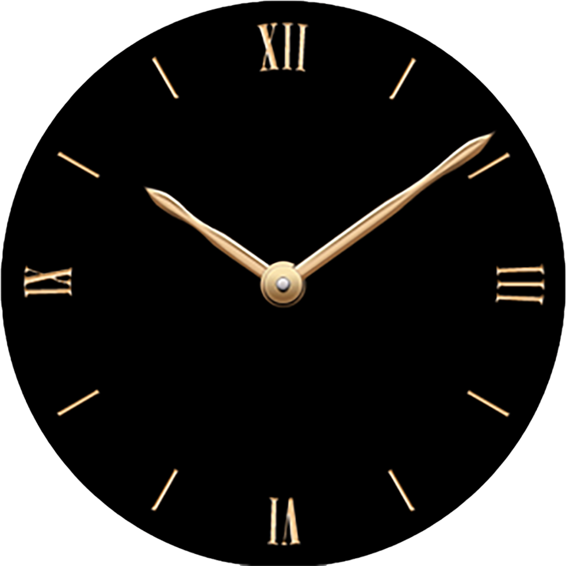 |
| 表盘缩略图 | 表盘预览图 | 图标预览图 | 熄屏表盘预览图 |
| 在手表上切换表盘时展示 | 在表盘市场中展示 | 在表盘市场中展示 | 在表盘市场中展示 |
| * 格式：png * 尺寸：250px\*250px | * 格式：jpg * 尺寸：960px\*960px | * 格式：jpg * 尺寸：390px\*390px | * 格式：jpg * 尺寸：960px\*960px |

**194\*368分辨率预览图**

自动生成以下几张预览图：

* cover.jpg
* icon.jpg

除自动生成的预览图外，还需手动制作并上传以下1张预览图：

* res.bmp

res.bmp格式为bmp，需使用设计软件手动制作，导出时选择高级模式16位R5 G6 B5。然后再上传至Theme Studio。

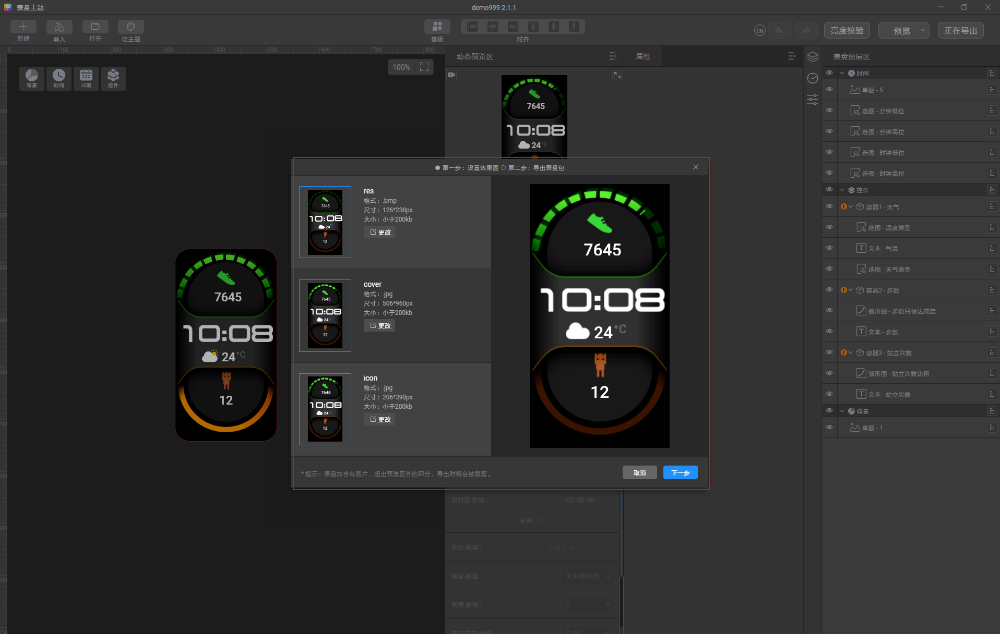

| res.bmp | cover.jpg | icon.jpg |
| --- | --- | --- |
|  | 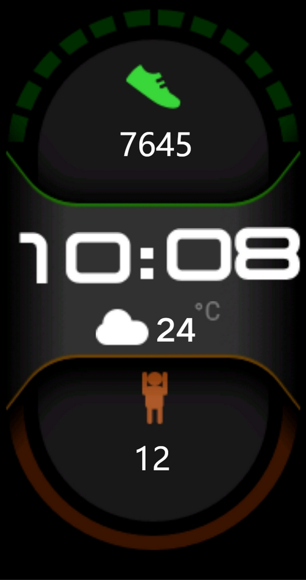 | 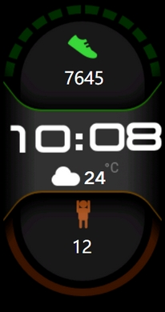 |
| 表盘缩略图 | 表盘预览图 | 图标预览图 |
| 在手表上切换表盘时展示 | 在表盘市场中展示 | 在表盘市场中展示 |
| * 格式：bmp * 尺寸：126px\*238px | * 格式：jpg * 尺寸：589px\*960px | * 格式：jpg * 尺寸：206px\*390px |

## 表盘导出

### 导出信息填写

<strong>截图完成后点击“导出”，等待表盘资源包校验完成。</strong> <strong>然后</strong> <strong>填写以下信息，并点击“确认”导出。</strong>

* 表盘英文名称（自定义填写，必须为英文名称），导出的表盘资源包将以这里输入的英文名称命名。
* 表盘中文名称（自定义填写，必须为中文名称）。
* 版本号（Theme Studio自动生成，详见[表盘版本号](/docs/distribute/content-dist/theme-center/development-tutorial-0000001054519376/watchface-0000001054571181/basic-concepts-0000001207883464/resolution-version-0000001252603441#section14815328193116)说明）。
* 开发者（自定义填写，需要和联盟注册的设计师名称相同）。
* 设计师（自定义填写，需要和联盟注册的设计师名称相同）。
* 表盘简介（自定义填写，需要填写中文简介和英文简介）。

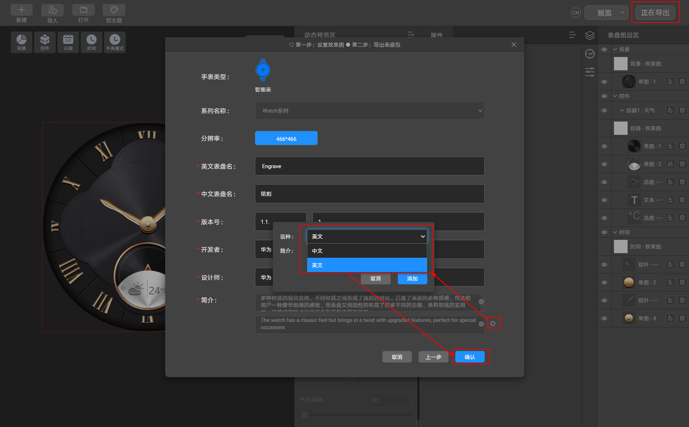

### 导出文件说明

* **466\*466分辨率**

导出后获得以下1个文件：

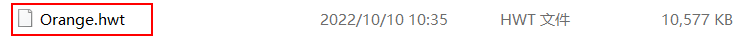

| 文件名称 | 文件说明 |
| --- | --- |
| xxxx.hwt | 表盘资源包，后续将对其进行测试、自检与上传到联盟。  同时也是表盘制作工程文件，可将其导入Theme Studio再次编辑。 |

* **280\*456分辨率**

导出后获得以下4个hwt文件：

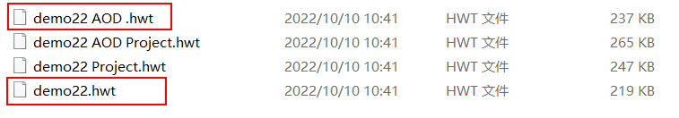

| 文件名称 | 文件说明 |
| --- | --- |
| xxxx AOD Project.hwt | 带熄屏表盘的表盘制作工程文件，可导入Theme Studio再次编辑，无需上传。 |
| xxxx AOD.hwt | 带熄屏表盘的表盘资源包，后续将对其进行测试、自检与上传到联盟。 |
| xxxx Project.hwt | 不带熄屏表盘的表盘制作工程文件，可导入Theme Studio再次编辑，无需上传至联盟。 |
| xxxx.hwt | 不带熄屏表盘的表盘资源包，后续将对其进行测试、自检与上传到联盟。 |

* <strong>其他分辨率</strong>

导出后获得以下2个文件：

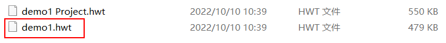

| 文件名称 | 文件说明 |
| --- | --- |
| xxxx Project.hwt | 表盘制作工程文件，可导入Theme Studio再次编辑，无需上传至联盟。 |
| xxxx.hwt | 表盘资源包，后续将对其进行测试、自检与上传到联盟。 |