# 常见问题

## 在表盘上点击特定位置，错误跳转至其他数据对应的应用，如何解决？

<strong>问题场景：</strong>用户在表盘上点击特定位置，错误跳转至其他数据对应的应用。例如：点击“时间”所在位置，错误跳转至“农历”对应的“日程”应用。

<strong>问题原因：</strong>制作表盘时，某个数据容器的范围设置过大（数据以容器的范围进行跳转，[点击了解](https://developer.huawei.com/consumer/cn/doc/content/watch-face-production-0000001530133996#section14484153615342)），覆盖了其他数据容器/控件的范围。例如：制作466\*466表盘，选择“12时辰”数据类型，上传一组466\*466图片作为表盘背景，实现背景昼夜切换。“12时辰”归属于“农历”容器，“农历”容器大小设置为宽466高466，范围过大，覆盖了其他数据容器/控件的范围。用户点击表盘上其他数据所在位置时，都将错误跳转至“农历”容器对应的“日程”应用。

<strong>解决方式</strong> <strong>：</strong>将数据容器调整为合适大小，不覆盖其他数据容器/控件的范围。在上述场景中，“12时辰”所在的“农历”容器，仅作为背景切换，无需跳转至“日程”应用，则将农历”容器大小设置为0即可。

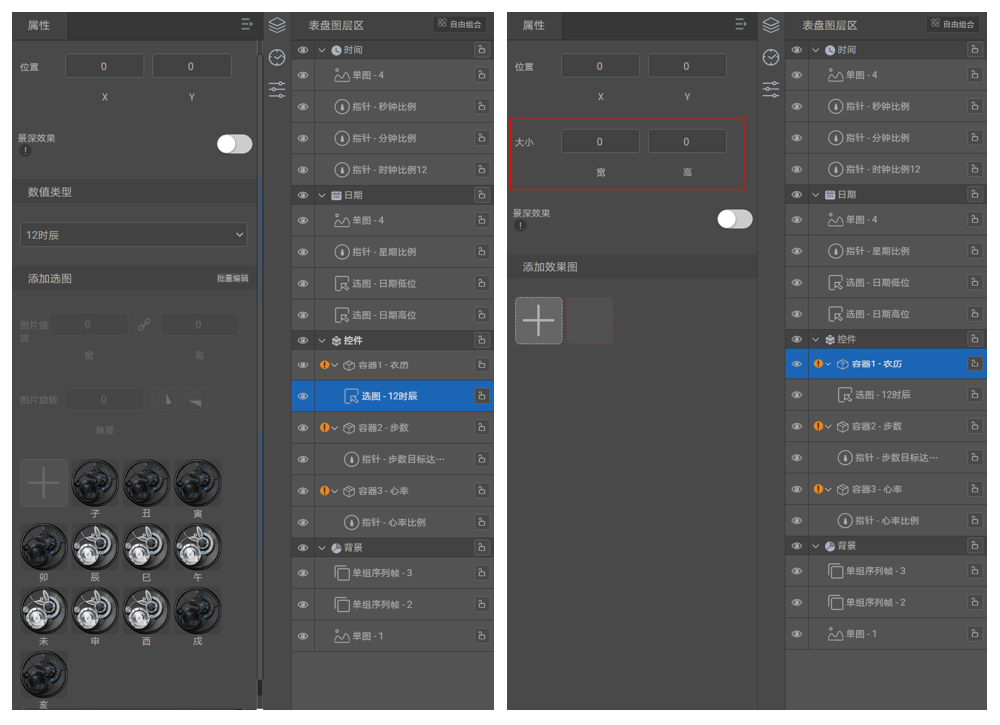

## 新建项目时输入相同的英文表盘名，提示“项目已存在”，如何解决？

<strong>问题场景：</strong>同一个设计师，同一个表盘作品，支持上传不同分辨率的表盘资源包，且资源包的中文名称、英文名称（不区分大小写）须相同。但在

Theme Studio中“新建项目”时，选择不同的分辨率后，输入相同的“英文表盘名”（不区分大小写），提示“项目已存在”，无法新建项目。

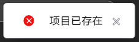

<strong>问题原因：</strong>“新建项目”时，输入的“英文表盘名”为<strong>表盘工程项目名称</strong>，不允许相同。<strong>表盘资源包名称</strong>，默认为表盘工程项目名称，支持在导出表盘资源包时进行修改。

<strong>解决方式</strong> <strong>：</strong>“新建项目”时，选择不同的分辨率后，输入不同的“表盘英文名”，以成功创建表盘工程项目。制作完成后，在导出表盘资源包时，再修改为相同的“英文表盘名”，此时修改后的“英文表盘名”即为最终表盘资源包的英文名称。

<strong>制作示例：</strong>某表盘作品中文名为XXXX，英文名为AAAABBBB。“新建项目”时，466\*466的“表盘英文名”输入为AAAA；454\*454的“表盘英文名”输入为BBBB。制作完成后，在导出表盘资源包时，再修改为相同的“AAAABBBB”。

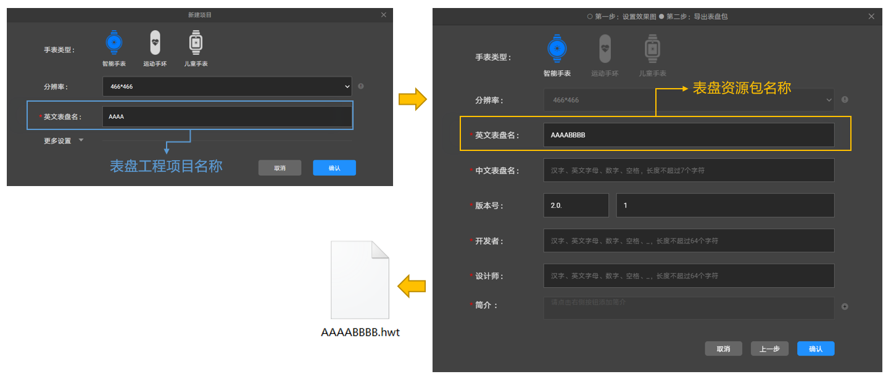

## 提示“上传动图张数与预览图张数需保持一致，请修改”，如何解决？

<strong>Theme Studio提示：</strong>

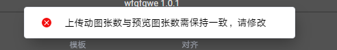

<strong>问题原因：</strong>背景动图中未添加动图预览图。

<strong>解决方式：</strong>请在背景大模块下点击动图控件，在【添加动图预览图】处上传一张当前分辨率下的png图片，（例如：466分辨率需上传466分辨率的png图片）。

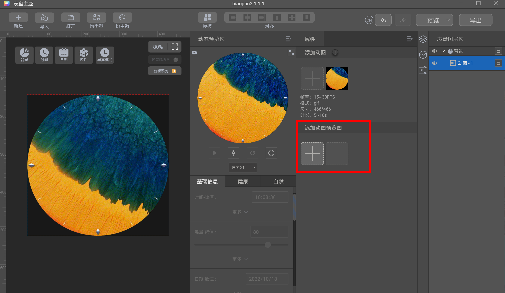

## 提示“上传视频个数与预览图张数需保持一致，请修改”，如何解决？

<strong>Theme Studio提示：</strong>

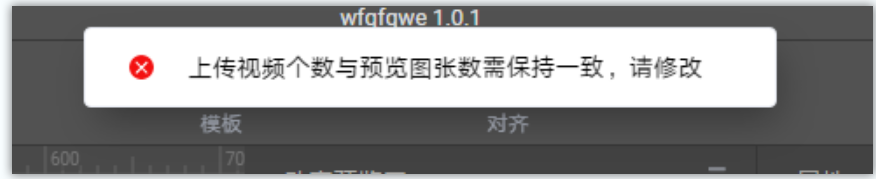

<strong>问题原因：</strong>视频背景中，未添加与视频个数相符合的预览图。

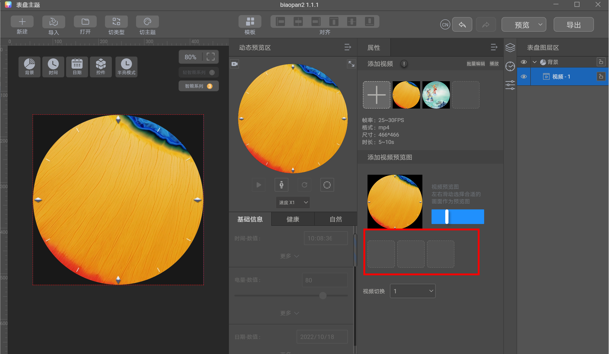

<strong>解决方式：</strong>拖拽【1】处，可在【2】处自动生成预览图，点击【3】处视频切换，生成第二张视频预览图，视频的个数需要与预览图个数一致。

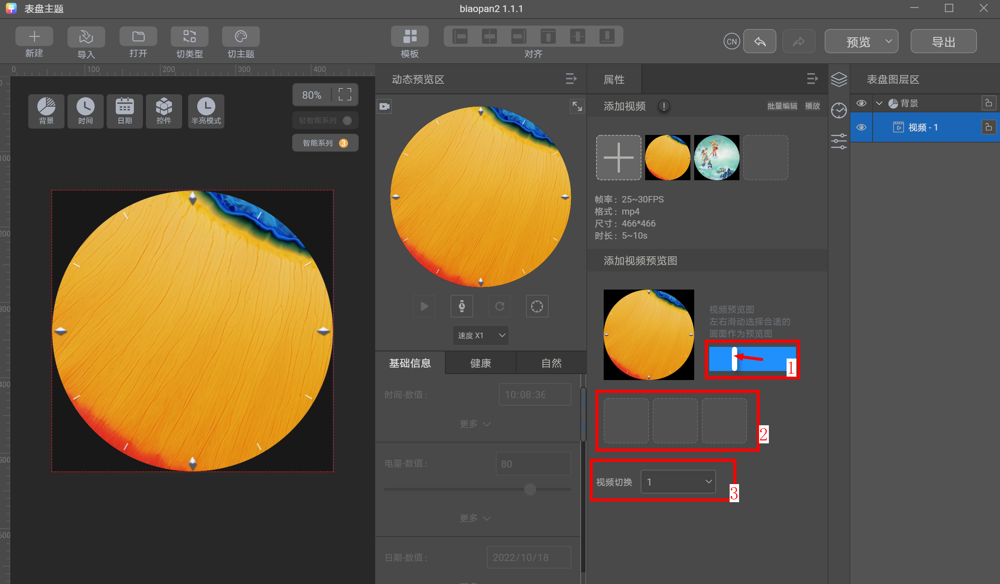

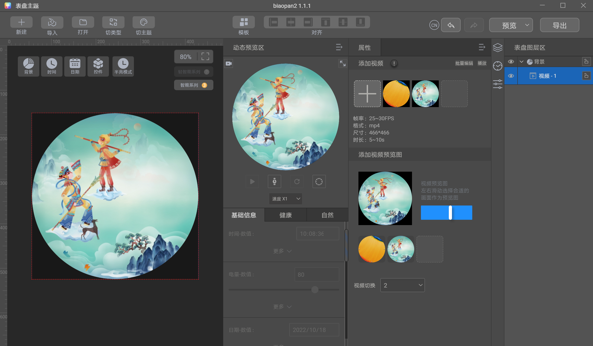

## 提示“制作组合图时，未添加无效资源或默认资源，请添加后再导出”，如何解决？

<strong>Theme Studio提示：</strong>

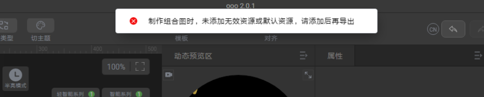

<strong>问题原因：</strong>缺少组合图属性下的无效资源和默认资源：

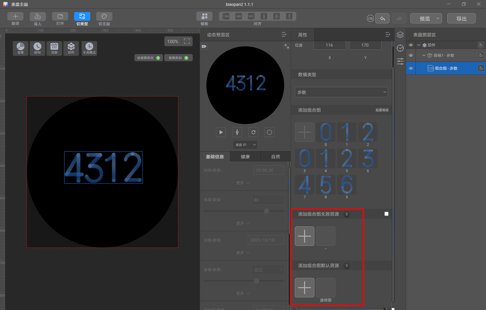

<strong>解决方式：</strong>添加一张与组合图大小一致的无效资源图，点击【勾】可预览样式。当手表设备未能同步该数据时，会展示这张无效资源图。同时需要添加一张与组合图大小相同的png透明图，填充数据空白区域将使用这张透明图。

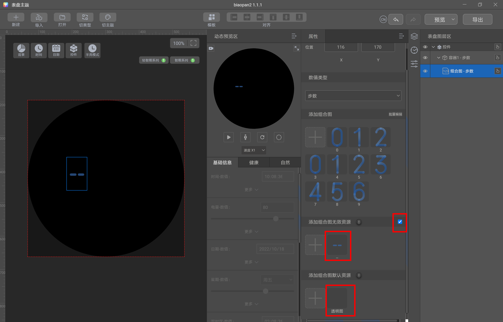

## 出现“当前表盘整体亮度过亮提醒”，如何解决？

<strong>Theme Studio提示：</strong>

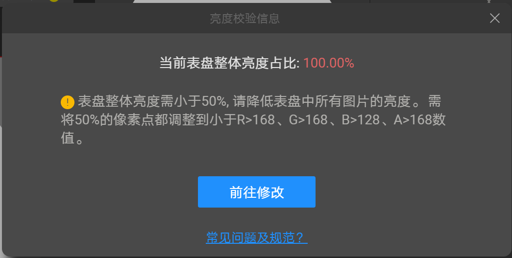

<strong>问题原因：</strong>表盘亮度过高，会导致表盘的能耗过高。表盘亮度校验是对表盘中所有像素点的校验。表盘过亮判定规则为：R&gt;168 、G&gt;168 、B&gt;128 、A&gt;168，当RGBA的四个数值同时满足大于条件时，才算此像素点过亮。同时当过亮的像素点超过50%时，则会判定为表盘整体亮度过亮。

<strong>解决方式：</strong>可通过修改表盘中图片资源的RGBA值，减少过亮像素点的数量，从而解决过亮问题。建议设计师在调整数值幅度时，可差异化大一些。

A的取值范围为0-255，在设计软件中需自行换算成百分比进行设置，A&gt;168换算成百分比即A&gt;(168/255)%。

## 熄屏表盘提示非黑像素点占比过高，如何解决？

<strong>Theme Studio提示：</strong>

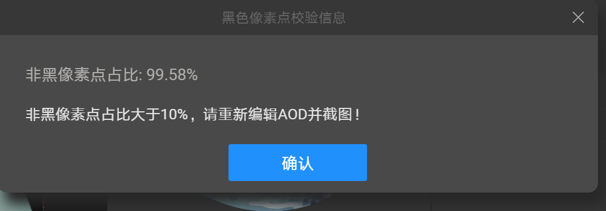

<strong>问题原因：</strong>半量模式制作的样式用于手表熄屏显示下展示的内容，也就是手表正常关闭表盘屏幕后，在表盘屏幕上常亮显示的内容。由于该内容为常亮显示，所以不宜过亮或图案过多。校验原理，非黑色像素（非#000000）像素点占整个手表表盘的像素点的比例不能超过10%或20%（详见[分辨率与版本号](https://developer.huawei.com/consumer/cn/doc/content/resolution-version-0000001252603441#section1756815468317)）。

<strong>解决方式：</strong>简化表盘的设计，使非黑色像素符合校验要求。可将图案缩小，或增加黑色色块。

## 提交Watch系列表盘，审核驳回理由为：应用数据，要放在对应的容器框里，如何修改？

Watch系列的控件数据：天气、步数、心率、卡路里、站立次数、睡眠、距离、中高强度、海拔、气压、摄氧量、压力等，必须放在对应的容器框内，方可点击。

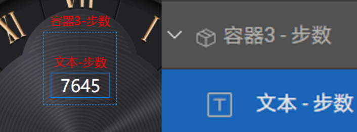

## 制作上传海外表盘要注意哪些？

1. 表盘设计/设计师名称不能有中文信息。
2. GT系列/Watch系列海外不支持AQI数据，华为手环6系列/Watch Fit系列/通话手环B6海外不支持AQI、海拔、气压等数据。

## 未知天气图标必须用云中带问号设计吗？

在手表与手机断链/手表未连接网络情况下，天气图标会出现未知天气，此图标为统一设计为：云中带问号形式便于用户理解。

## 制作Watch Fit表盘上表测试背景图/缩略图出现花屏，如何修改？

背景图和缩略图格式导出错误，显示异常。格式：png 32位深度。导出方法：设计软件--文件--导出--快速导出png。

## 导出时Theme Studio提示导出表盘为高功耗表盘，请重新编辑，如何修改？

表盘背景亮度过高时导出会有此提示，降低表盘亮度，尽量增加黑色像素即可导出。

## 运动健康APP中没有找到“添加表盘”入口，是什么原因？

具备<strong>“主题认证设计师-表盘权限”</strong>的华为账号（主账号+团队账号），才具有“添加表盘”权限。

如何申请<strong>“主题认证设计师-表盘权限”</strong>？详见[入驻指导](https://developer.huawei.com/consumer/cn/doc/content/settlement-guidance-0000001056348857)。

已注册并通过审核的设计师，账号不能外借他人。

## 表盘预览图背景如何制作？

预览图的背景要设置为白色。

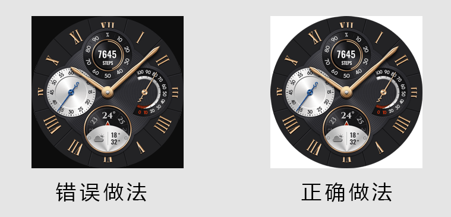

## 制作表盘时，切图有白色切痕有问题吗?

如果切图有白色切痕（如下图错误示例所示，为便于查看，将切痕标识为红色），可能上表后会在表盘边缘处显示出来，影响表盘的整体视觉效果。请大家在导出切图时仔细检查，避免切图出现白色切痕。

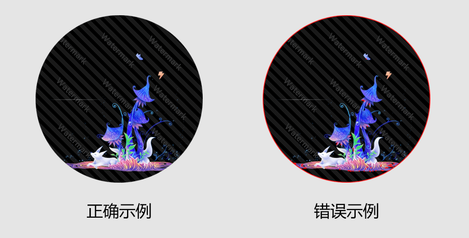

## 工具提示报错“A JavaScript error occurred in the main process”如何解决？

因系统缺少dll文件的原因，导致Theme Studio工具的无法正常安装，可将缺少的dll文件通过手动下载后，放置

C:\Users\XXX\AppData\Local\Programs\ThemeStudio\resources\app.asar.unpacked\node\_modules\@hw-theme\osanodelib\native目录下，再进行工具的正常安装。工具主要涉及到的dll文件有MSVCP140.DLL、VCRUNTIME140.DLL、CONCRT140.DLL。

## 表盘的背景需按照表盘的分辨率和形状进行制作吗？

表盘的背景需严格按照表盘的分辨率和形状进行制作，否则在一些自动适配的场景下，可能背景会呈现为不规则形状，影响视觉效果。

以GT2 454\*454的表盘为例，背景资源的尺寸必须为：454\*454，形状必须为：圆形。

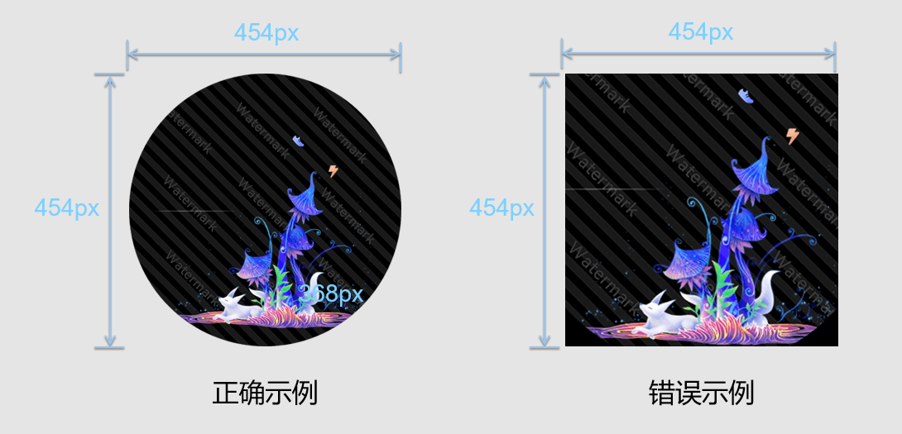

## 在使用Theme Studio制作表盘的过程中出现问题，如何进行反馈？

可通过联盟的客服工单反馈，请同时提供以下4项内容，以便于我们更高效地复现并定位问题：

1. 详细描述出现的问题和相关操作步骤。

   举例：制作466分辨率表盘，使用时间文本控件后，截屏生成预览图时，发现预览图某个控件/数据的位置与制作过程中动态预览区显示的位置不一样。
2. 提供清晰的、可对比展示问题的多张截图。

   举例：基于1中的问题，同时提供截屏生成的预览图与制作过程中动态预览区显示的位置截图。
3. 提供Theme Studio的日志文件：hwt-app.log。

   日志文件路径：C:\Users\xxxxx\AppData\Roaming\ThemeStudio\hwt-logs。

   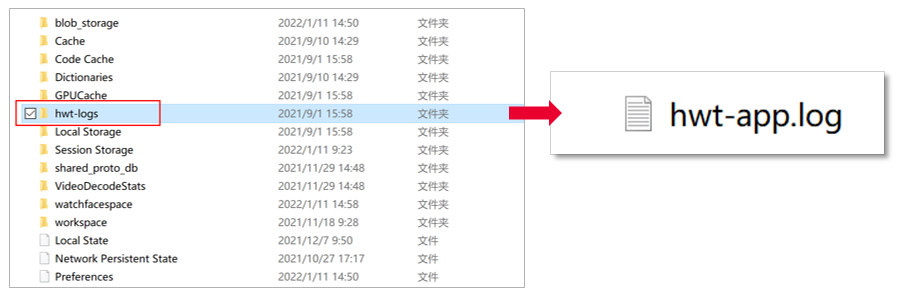
4. 提供出现问题的表盘包（xxxx.hwt）与工程文件（xxxxProject.hwt），466分辨率只需提供表盘包。