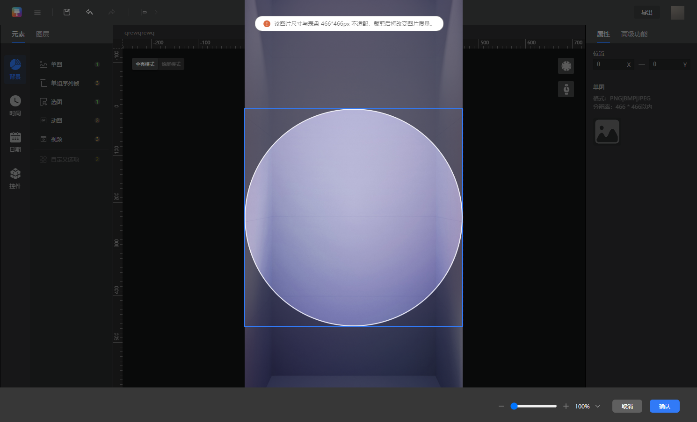
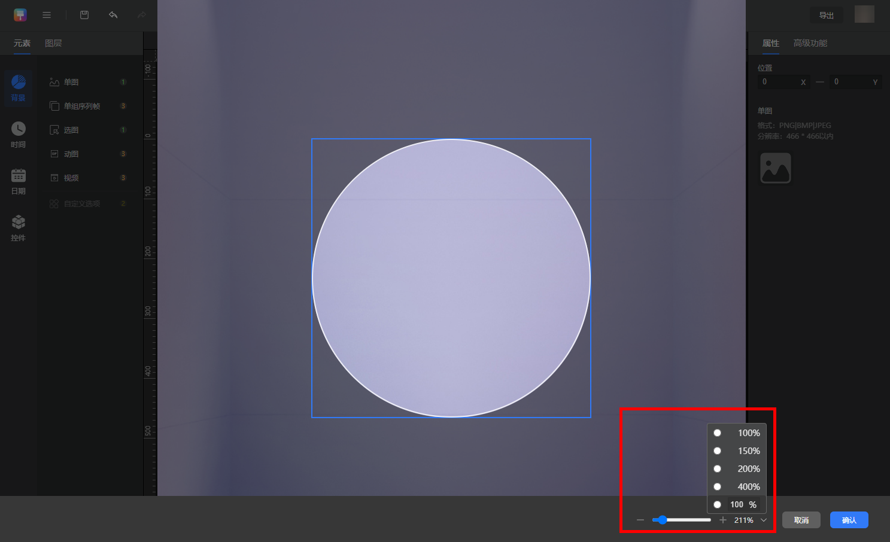
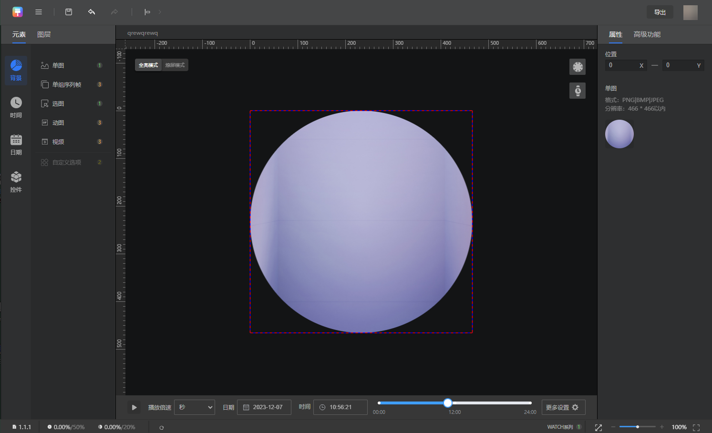

# 辅助功能

## Theme Studio Pro快捷键

| 操作 | 快捷键（Windows） | 快捷键（ macOS） |
| --- | --- | --- |
| 新建作品 | Ctrl+M | Command+M |
| 导入 | Ctrl+I | Command+I |
| 插入 | Ctrl + Shift + I | Command + Shift +I |
| 导出 | Ctrl + E | Command + E |
| 快速保存 | Ctrl+ S | Command+S |
| 撤回 | Ctrl+Z | Command+Z |
| 重做 | Ctrl+Shift+Z | Command+Shift+Z |
| 删除 | Delete | Delete |
| 显示/隐藏标尺辅助线 | Ctrl + H | Command+H |
| 放大 | Ctrl+【+】/鼠标向上滚轴 | Command+加号/鼠标向上滚轴 |
| 缩小 | Ctrl+【-】/鼠标向下滚轴 | Command+减号/鼠标向下滚轴 |
| 复制图层 | Ctrl+C | Command+C |
| 粘贴图层 | Ctrl+V | Command+V |
| 剪切图层 | Ctrl+X | Command+X |
| 向上/下/左/右移动1像素 | ↑ / ↓ / ← / → | ↑ / ↓ / ← / → |
| 向上/下/左/右移动10像素 | Shift+ ↑/ ↓ / ← / → | Shift+ ↑/ ↓ /← / → |
| 拖动画布 | 空格+鼠标左键 | 空格+鼠标左键 |
| 全选图层 | Ctrl + A | Command+A |
| 自适应窗口大小 | Ctrl + 0 | Command+0 |
| 100%大小 | Ctrl + 1 | Command+1 |
| 挑选图层 | Ctrl + 鼠标左键 | Command+鼠标左键 |
| 连续选中图层 | Shift + 鼠标左键 | Shift + 鼠标左键 |

1. 全局可支持10个步骤的撤回与重做。
2. 切换类型、切换模板后，之前的快捷键步骤将会被清空。

## 上传裁剪

背景模块的【单图】元素，上传时，如上传的图片不符合规范，可对图片进行裁剪。

可通过右下角缩放条和鼠标滚轮的滚动放大缩小图片

确定后，生成466\*466分辨率的背景单图，

