# 颜色自定义

## 功能介绍

<strong>颜色自定义功能</strong>：支持设计师自定义颜色，应用于已选择的图层。同时支持用户在手表侧自定义设置其他颜色，应用于设计师已选择的图层。

“颜色自定义”与[“样式自定义”](https://developer.huawei.com/consumer/cn/doc/content/style-customize-pro-0000001583807170)互斥，只能选择其中一种进行制作。例如：当制作了“颜色自定义”后，再切换到“样式自定义”，会提示“暂未达到使用该功能条件”。反之亦然。

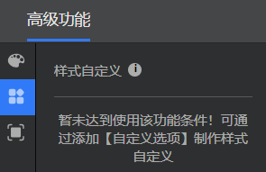

<strong>颜色自定义表盘示例</strong>：以下示例表盘中，设计师自定义了5种颜色，应用于已选择的时间和日期图层。用户下载并安装该表盘后，可以设置颜色，该颜色将被应用到时间和日期图层。

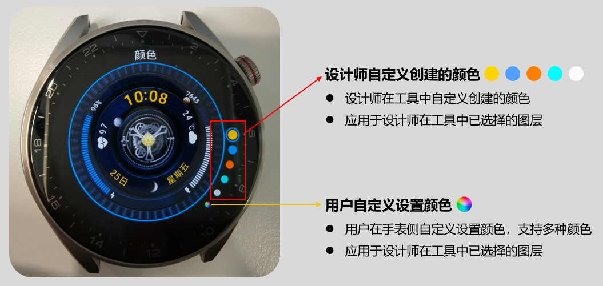

<strong>颜色自定义表盘使用方法</strong>：长按表盘 &gt; 点击“设置” &gt; 上下滑动，切换颜色。

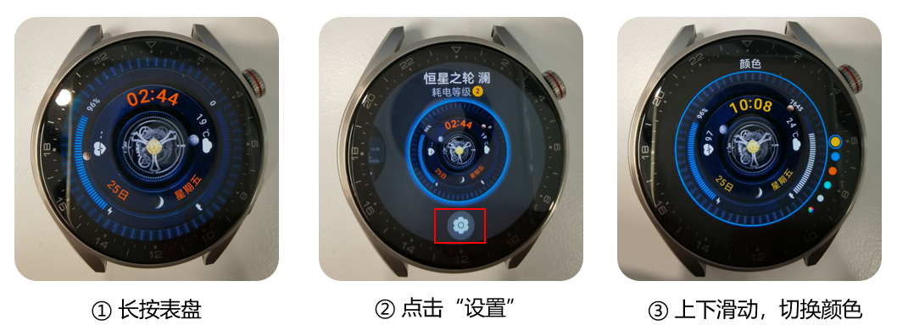

## 制作实操

1. **新建/打开/导入一个466\*466表盘作品。**

   466\*466“1.y”和“2.y”均支持“颜色自定义”表盘。

   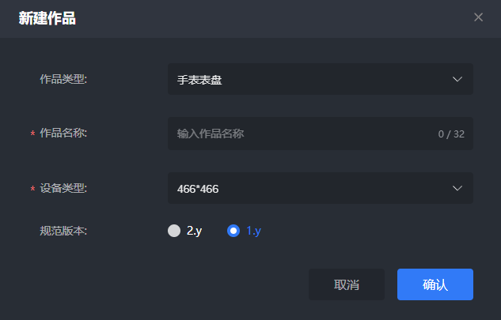
2. <strong>按常规方法制作表盘。</strong>

   按常规方法制作好表盘，我们将在此基础上设置“颜色自定义”效果。

   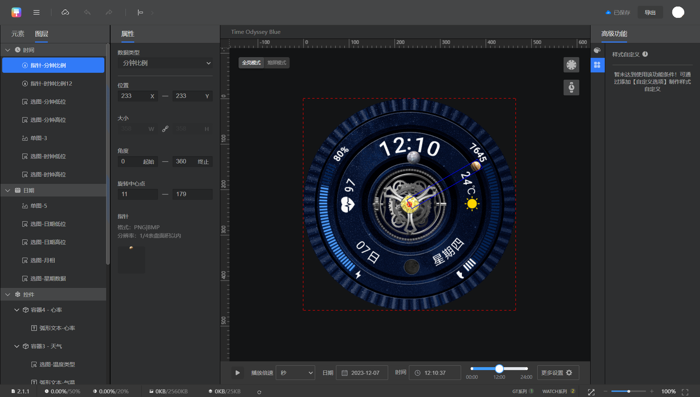
3. <strong>为亮屏表盘设置颜色自由组合。</strong>

   ① 点击“高级功能”&gt;&gt;“创建图层颜色组合”，进入颜色自由组合制作页面。

   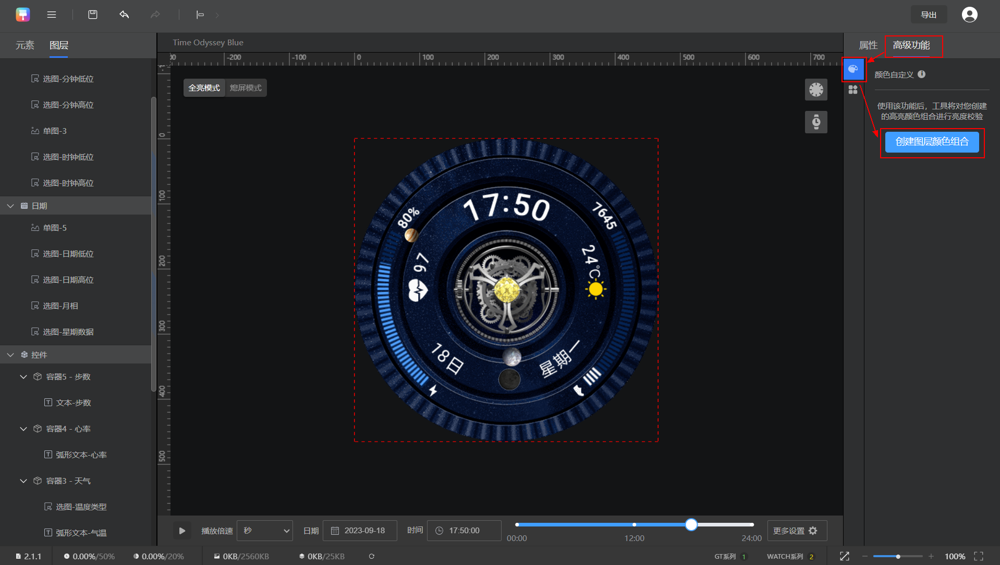

   ② 进入页面后，默认提供红色，可点击右上角编辑按钮，将其替换成其他颜色。然后点击“+”号，选择图层。

   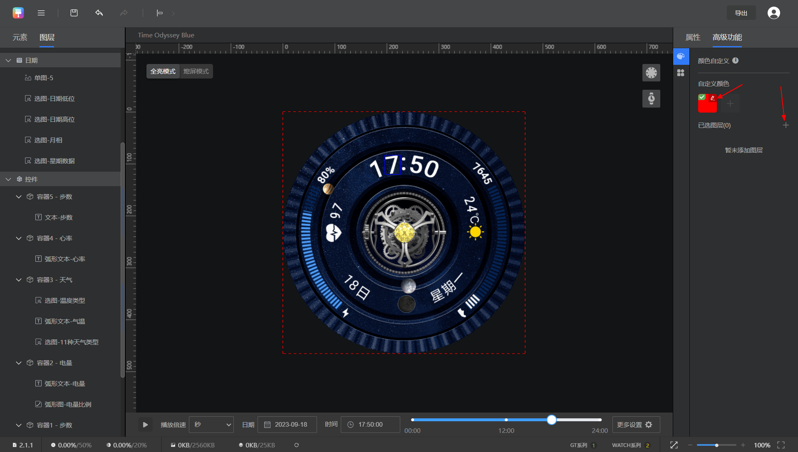

   ③ 在图层选择页面，勾选目标图层。选中的图层会出现在下方，并应用当前设置的颜色，颜色应用效果可以在左侧区域预览。

   确认选择无误后“保存”当前选中的图层。

   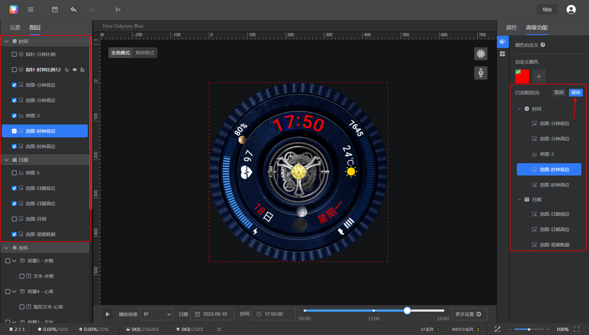

   

   除了选择设计师自定义创建的颜色外，用户还可以在手表侧自定义设置其他颜色，应用到选中的图层上。为保证比较好的表盘效果，建议设计师在选择图层时，考虑用户在手表侧自定义设置其他颜色的场景。

   ④ 点击“+”号，添加更多自定义颜色。这些颜色均将应用于已经下方已选择好的图层。

   * 点击颜色，可查看颜色在所选图层上的应用效果。
   * 点击颜色右上角编辑按钮，可修改当前颜色。
   * 在当前颜色上右键，可将其设置为默认颜色。

   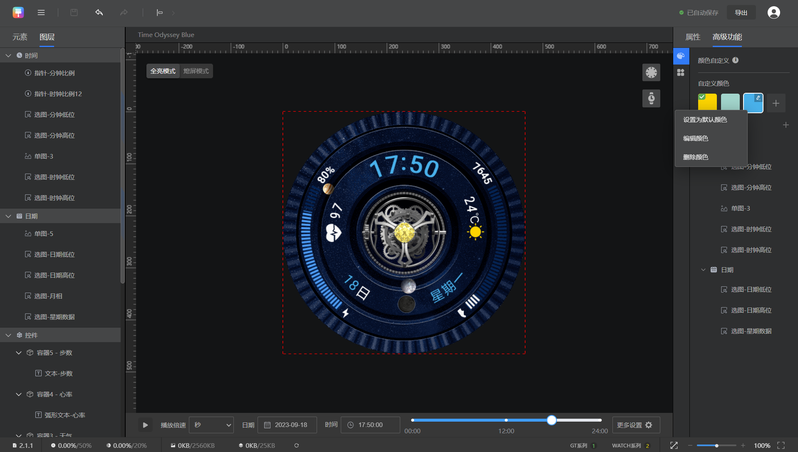
4. <strong>为熄屏表盘设置颜色自由组合。</strong>

   熄屏表盘中的颜色选项，将自动跟随亮屏表盘中创建好的自定义颜色选项，不支持另外再创建。但支持编辑颜色应用的图层。

   ① 点击“熄屏模式”，进入熄屏表盘制作页面。

   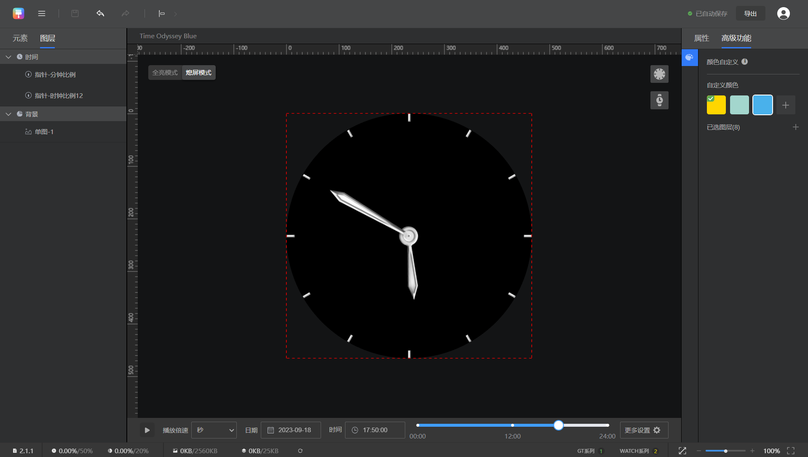

   ② 点击“+”，将熄屏表盘中需要改变颜色的图层选中，然后再保存即可。

   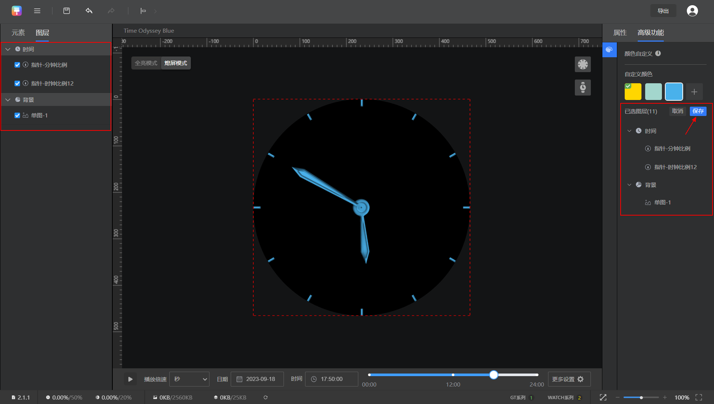

   

   408\*480分辨率图层添加限制：背景最多可添加 8个图层，时间最多可添加25个图层、日期最多可添加25个，控件最多可添加8个（特殊场景：控件自定义选项图层最多可添加8个）。

   466\*466分辨率“Watch系列+GT系列”图层添加限制：背景最多可添加 8个图层，时间最多可添加8个图层、日期最多可添加8个，控件最多可添加8个。（特殊场景：控件自定义选项图层最多可添加8个）。

经过以上步骤，颜色自定义表盘制作完成，后续按照常规步骤，[导出表盘](https://developer.huawei.com/consumer/cn/doc/content/watch-face-production-pro-0000001583647406#section1783463344019)即可。