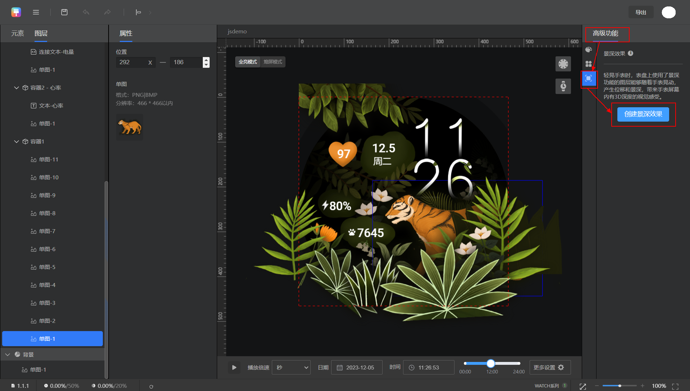
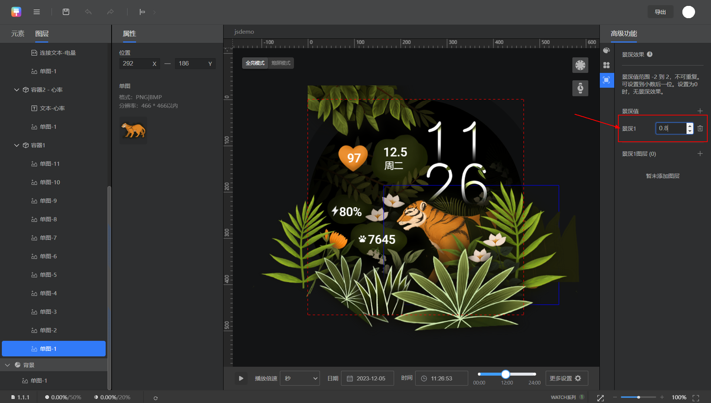
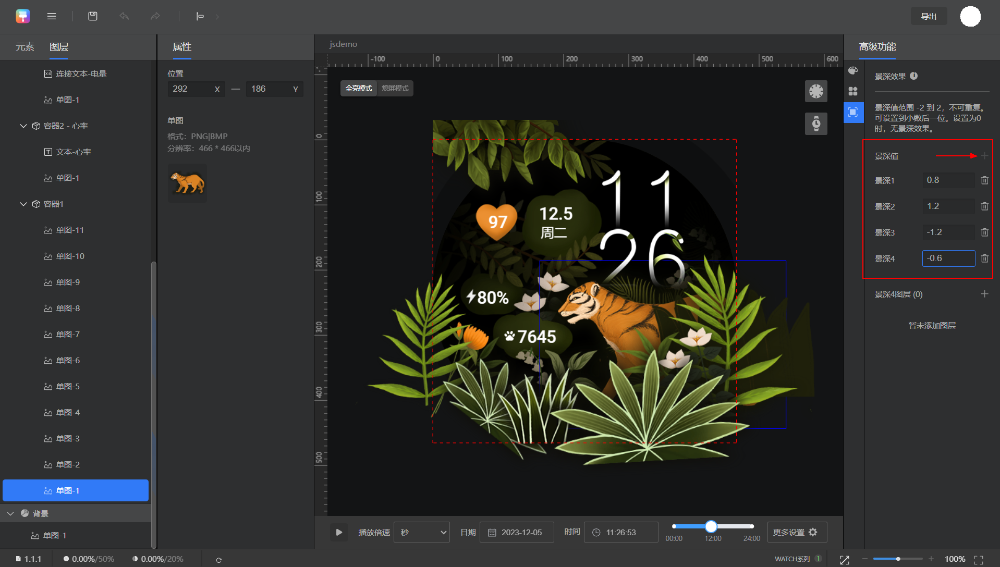
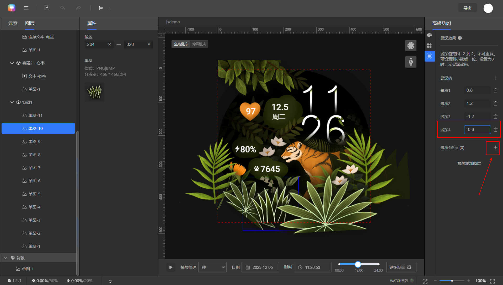
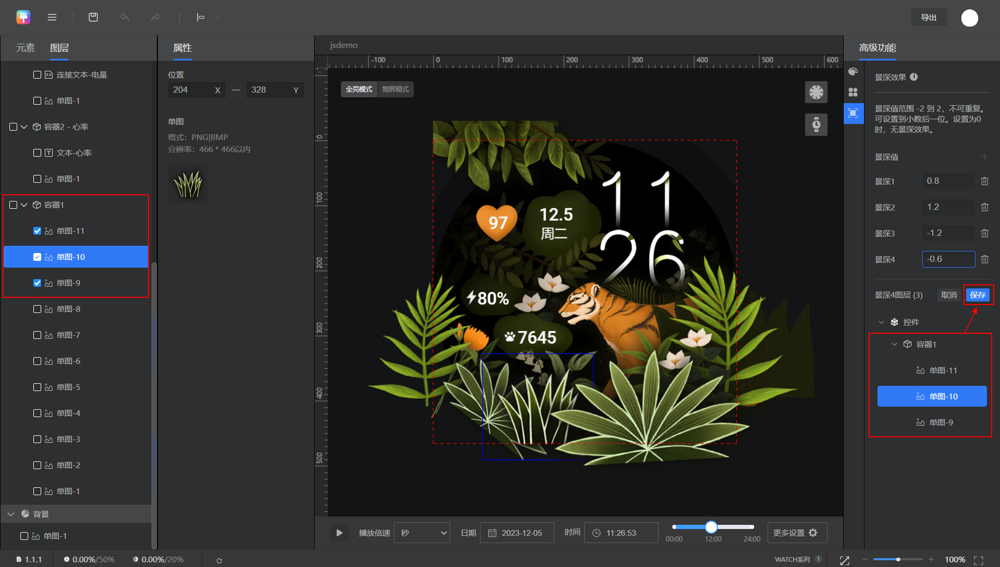
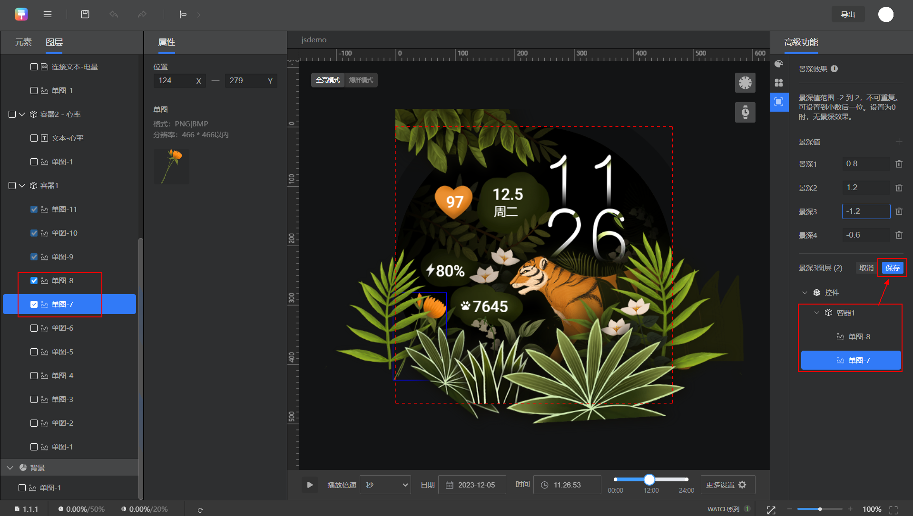
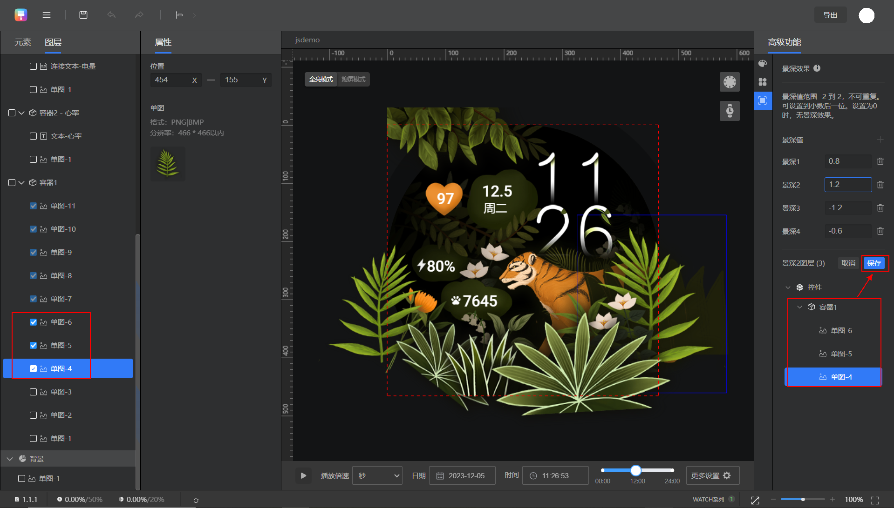
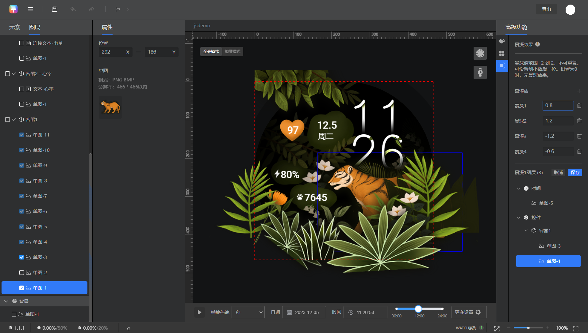
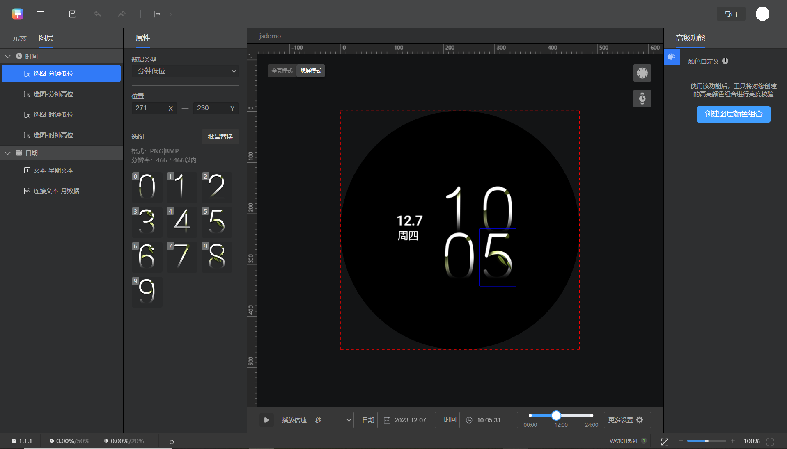

# 景深

## 功能介绍

<strong>景深功能</strong>：轻晃手表时，表盘上使用了景深功能的图层能够随着手表晃动，产生位移和景深，带来手表屏幕内有3D深度的视觉感受。

<strong>景深表盘</strong> <strong>示例</strong>：轻晃手表时，左上方的树叶、下方的老虎、草堆、花朵等图层就随着手表晃动，产生了位移和景深，带来生动有趣且富有互动性的动态效果。

## 制作实操

1. **新建/打开/导入一个466\*466“1.y”表盘作品。**

   当前仅466\*466“1.y”支持“景深”表盘。

   
2. <strong>按常规方法制作表盘。</strong>

   按常规方法制作好表盘，我们将在此基础上为部分图层设置景深值，以实现景深效果。

   

   1. 在背景中添加图片资源时，该图片资源超出表盘圆形区域的部分会被裁剪。如果对该图片资源设置景深效果，则晃动手表图片位移时，可能会出现漏出黑色边缘的情况。因此，<strong>如果设计中有超出表盘圆形区域的图片资源，并且想要为该图片设置景深效果，则该图片建议不添加在背景中，可以根据设计需要，添加在时间、日期或控件中</strong>，这样超出表盘圆形区域的部分不会被裁剪，实现比较好的景深效果。在此示例中，需要设置景深效果的图层，添加在时间和控件的容器1中。
   2. 弧形图、视频、GIF控件不支持景深效果。

   
3. <strong>设置景深值。</strong>

   点击“高级功能”&gt;，即可设置景深值。点击“+”号可新建一个景深值。

   

   1. 景深值范围为-2到2，不可重复。设置为0时，无景深效果。设置为正值，表示图层移动方向与手表晃动方向相同，负值则相反。景深值越靠近-2或2，图层移动的幅度越大。
   2. 景深值最多支持设置4个。本示例表盘中设置了4个景深值（0.8 1.2 -1.2 -0.6）以后，“+”号置灰，无法再点击添加新的景深值。支持在选中后修改为其他景深值，或删除后新建其他景深值。

   

   
4. <strong>为景深值关联图层。</strong>

   设置好景深值之后，即可为每个景深值关联图层。被关联的图层将具备对应景深值的景深效果。

   ① 选中景深4，点击“+”号，为景深4关联容器1中的3个单图图层。

   

   

   ② 选中景深3，点击“+”号，为景深3关联容器1中的2个单图图层。

   

   ③ 选中景深2，点击“+”号，为景深2关联容器1中的3个单图图层。

   

   ④ 选中景深1，点击“+”号，为景深1关联时间中的1个图层和容器1中的2个单图图层。

   
5. <strong>制作熄屏表盘</strong> <strong>。</strong>

   熄屏表盘不支持景深效果。

   切换至“熄屏模式”，通过添加图层或复制图层的方式，制作熄屏表盘即可。

   

经过以上步骤，景深表盘制作完成，后续按照常规步骤，[导出表盘](/docs/distribute/content-dist/theme-center/development-tutorial-0000001054519376/watchface-0000001054571181/watch-face-production-pro-0000001633846449/start-production-pro-0000001583807166/watch-face-production-pro-0000001583647406#section1783463344019)即可。

当前不支持在Theme Studio Pro中预览景深效果，可导出资源包，上表查看效果。