# 样式自定义

## 功能介绍

<strong>样式自定义</strong>：支持设计师为<strong>背景</strong>、<strong>时间</strong>和<strong>日期</strong>制作多个不同的自定义选项，然后将这些自定义选项自由组合起来，形成多个自定义样式。用户实际应用时，可自行切换组合好的自定义样式。

“样式自定义”与[“颜色自定义”](/docs/distribute/content-dist/theme-center/development-tutorial-0000001054519376/watchface-0000001054571181/watch-face-production-pro-0000001633846449/creative-function-pro-0000001584126522/color-customize-pro-0000001633687085)互斥，只能选择其中一种进行制作。例如：当制作了“样式自定义”后，再切换到“颜色自定义”，会提示“暂未达到使用该功能条件”。反之亦然。

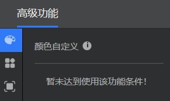

<strong>样式自定义表盘</strong> <strong>示例</strong>：以下示例表盘中，背景制作了2个自定义选项，时间也制作了2个自定义选项，将它们自由组合为4个自定义样式，提供给用户切换。

<strong>样式自定义表盘使用方法</strong>：长按表盘 &gt; 点击“设置” &gt; 上下滑动，切换样式。

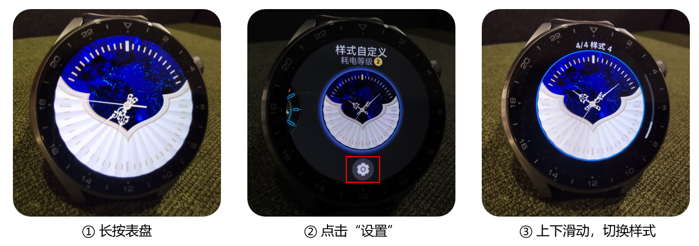

## 制作实操

本文以466\*466样式自定义表盘为例进行制作演示。

1. **新建一个466\*466表盘作品。**

   466\*466“1.y”和“2.y”均支持“样式自定义”表盘。

   
2. <strong>制作背景自定义选项。</strong>

   本示例中制作了2个背景自定义选项。

   <strong>① 制作背景-自定义选项1。</strong>

   选择“背景”&gt;“自定义选项”。

   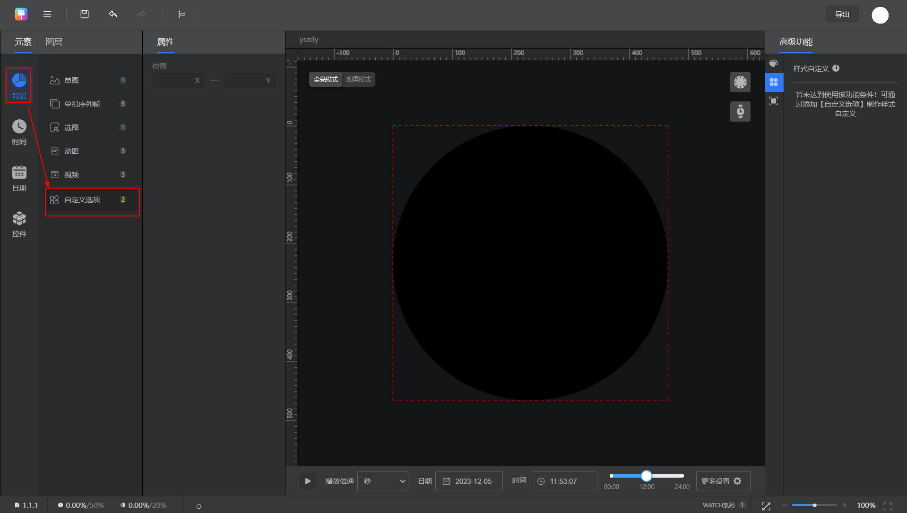

   选择“自定义选项1”&gt;“单图”。

   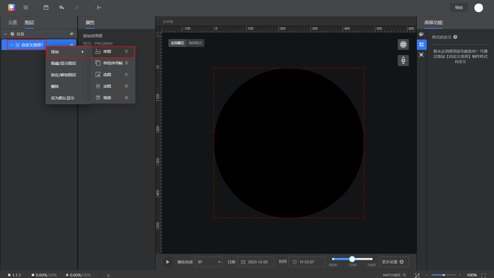

   选中“单图”，上传背景-自定义选项1的图片资源。

   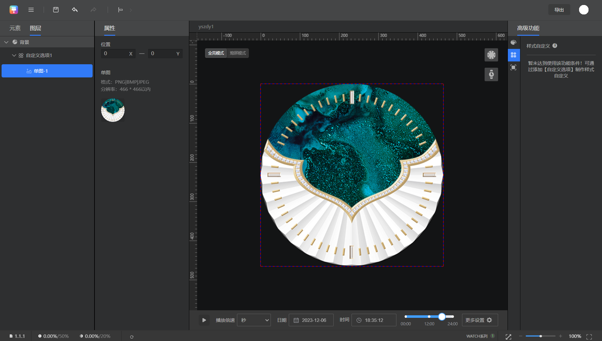

   然后为背景-自定义选项1添加效果图。

   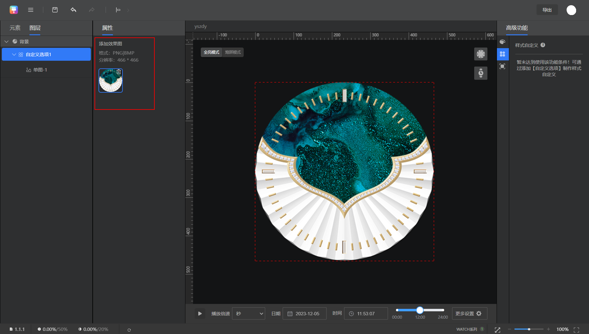

   

   背景-自定义选项的效果图，会与组合中的时间/日期-自定义选项的效果图叠加形成自定义样式的效果图，上表后在样式选择界面提供给用户预览。背景/时间/日期-自定义选项的效果图请以实际效果为准。

   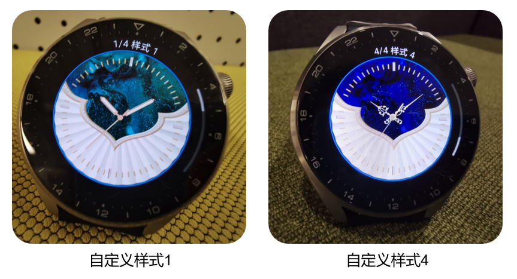

   <strong>② 重复以上操作，制作背景-自定义选项2。</strong>

   选择“背景”&gt;“自定义选项”。

   选择“自定义选项2”&gt;“单图”，上传背景-自定义选项2的图片资源。

   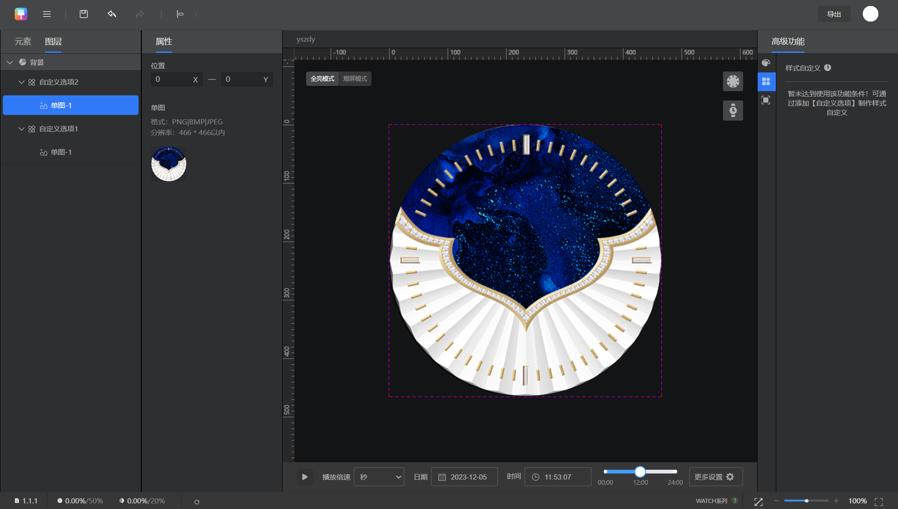

   然后为背景-自定义选项2添加效果图。

   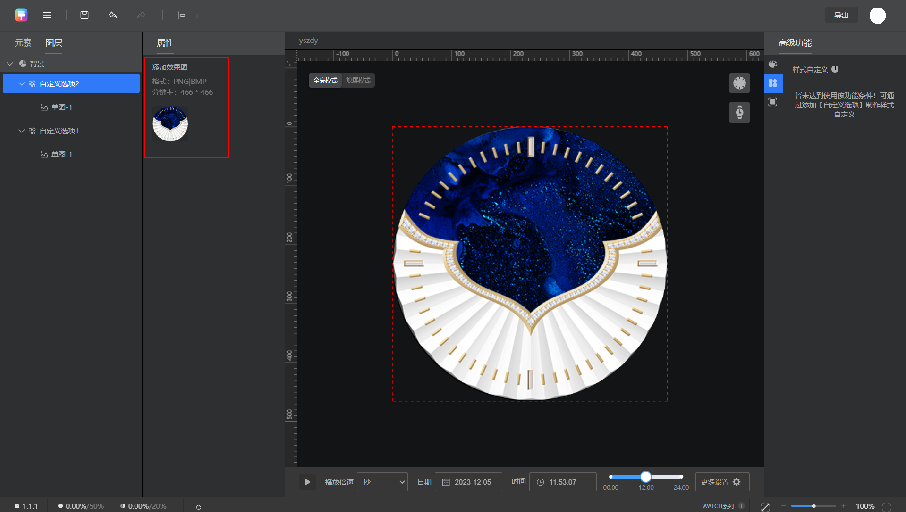

   

   本示例中2个背景自定义选项都使用的单图控件。实际操作过程中，大家可添加更多背景自定义选项，也可以选择其他控件。
3. <strong>制作时间自定义选项</strong>。

   本示例中制作了2个背景自定义选项。

   <strong>① 制作时间-自定义选项1。</strong>

   选择“时间”&gt;“自定义选项”。

   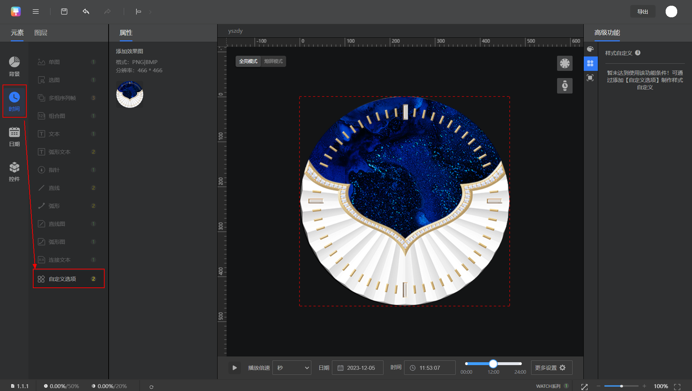

   按照常规表盘的制作方法，在时间-自定义选项1下，制作模拟时钟，包括时针、分针、秒针。

   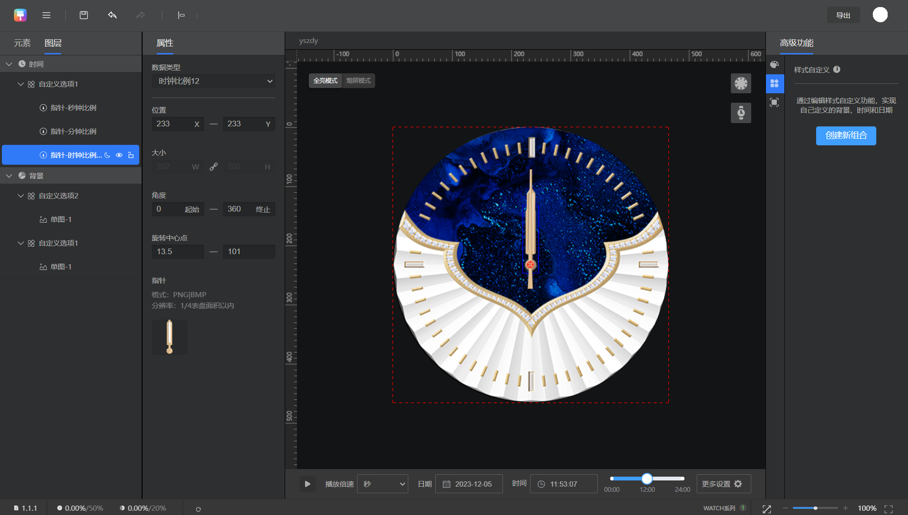

   然后为时间-自定义选项1添加效果图。

   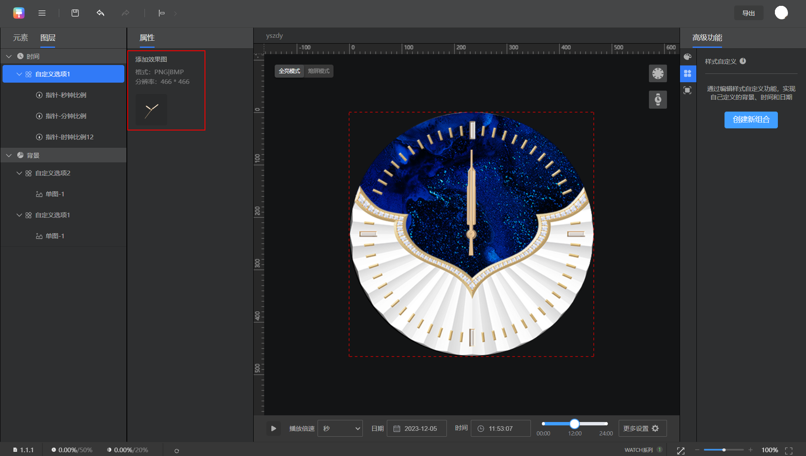

   <strong>② 重复以上操作，制作时间-自定义选项2。</strong>

   选择“时间”&gt;“自定义选项”。

   按照常规表盘的制作方法，在时间-自定义选项2下，制作模拟时钟，包括时针、分针、秒针。

   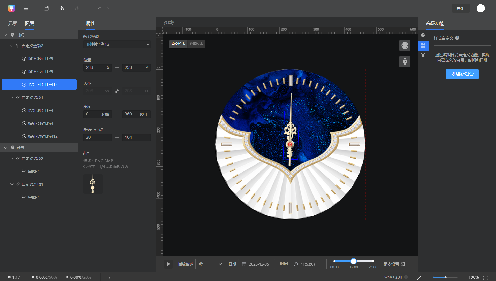

   然后为时间-自定义选项2添加效果图。

   
4. <strong>为亮屏表盘创建样式自由组合。</strong>

   ① 背景和时间的2个自定义选项制作完成之后，点击“高级功能”&gt;&gt;“创建新组合”，进入样式组合页面。

   

   ② 将背景-自定义选项1和时间-自定义选项1勾选，然后点击“确认”，组合成自定义样式1。

   

   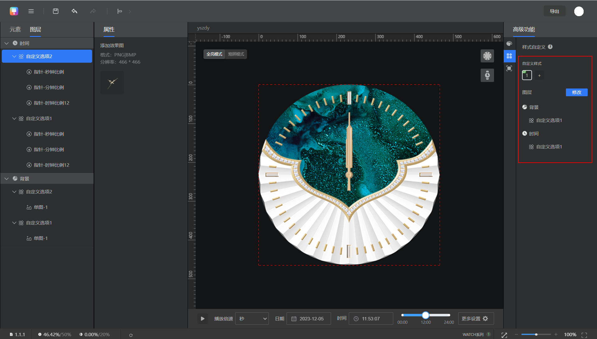

   ③ 点击“+”号，创建新的自定义样式。示例表盘中创建了4种自定义样式。

   * 自定义样式1：背景-自定义选项1 + 时间-自定义选项1。
   * 自定义样式2：背景-自定义选项1 + 时间-自定义选项2。
   * 自定义样式3：背景-自定义选项2 + 时间-自定义选项1。
   * 自定义样式4：背景-自定义选项2 + 时间-自定义选项2。

   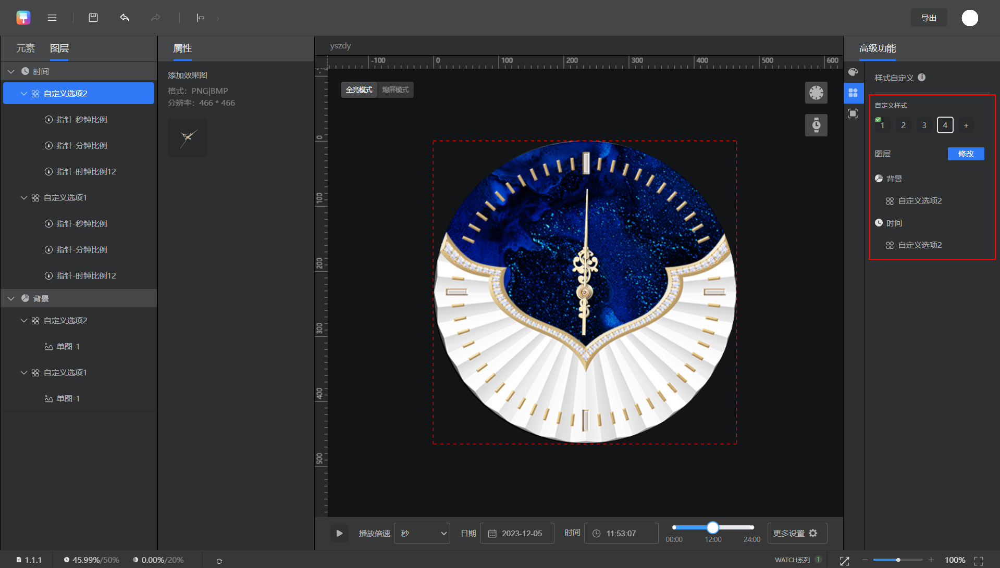

   在当前自定义样式右键，可将其设置默认显示的自定义样式，或删除当前自定义样式。

   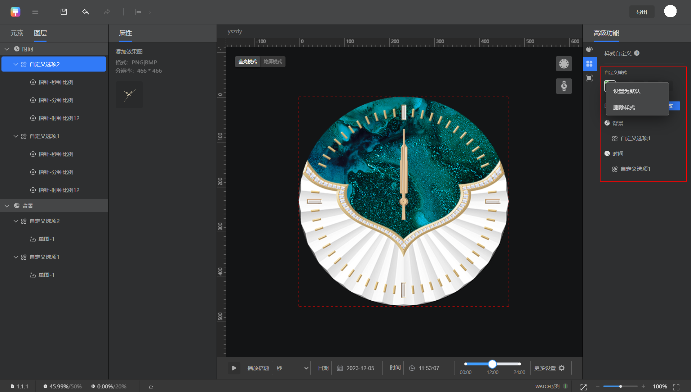
5. <strong>制作熄屏表盘。</strong>

   熄屏表盘中的背景和时间，将跟随全亮表盘中设置好的自定义样式进行展示。

   ① 将“全亮模式”中的所需图层，复制至“熄屏模式”。

   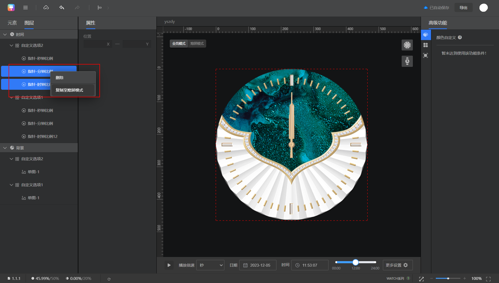

   ② 切换至“熄屏模式”，查看复制好的图层。

   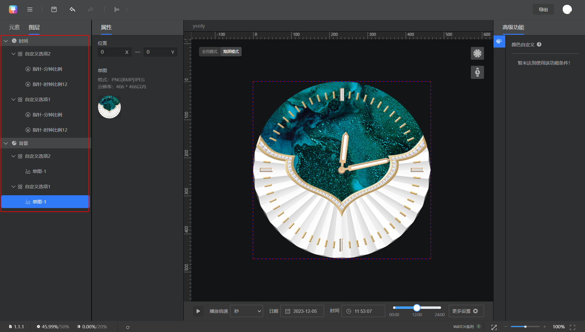

   ③ 从“全亮模式”中复制过来的背景图层，背景图片非黑色像素占比过高，不适用于熄屏表盘，将其替换成合适的背景图片即可。

   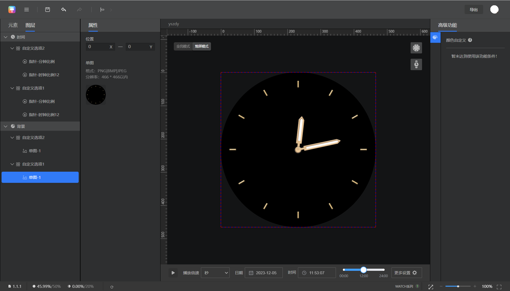

经过以上步骤，样式自定义表盘制作完成，后续按照常规步骤，[导出表盘](/docs/distribute/content-dist/theme-center/development-tutorial-0000001054519376/watchface-0000001054571181/watch-face-production-pro-0000001633846449/start-production-pro-0000001583807166/watch-face-production-pro-0000001583647406#section1783463344019)即可。

## 相关问题

<strong>1、提示“自定义样式组合尚未保存”如何解决？</strong>

Theme Studio Pro提示：

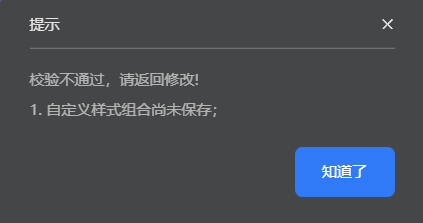

问题原因：自定义样式表盘需要对自定义样式的组合进行保存，以达到上表之后自由切换的效果。

Theme Studio Pro 解决方式：

1、点击“高级功能”&gt;&gt;“创建新组合”。

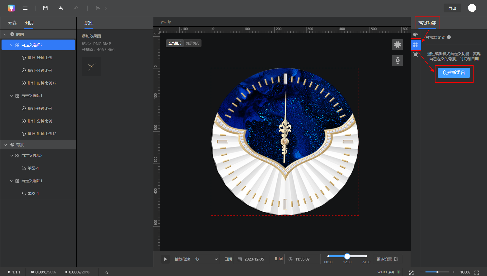

2、选择背景/时间/日期中对应的自定义选项进行组合，点击“确定”，形成自定义样式。

<strong>2、如何设置“默认”的自定义样式？</strong>

在当前自定义样式上右键，选择“设置为默认”。

<strong>3、自定义样式的校验信息在哪里？</strong>

工具将对每一个自定义样式进行规范校验。

自定义样式的校验信息显示在底部校验区，鼠标悬浮至自定义名称即可查看全部。