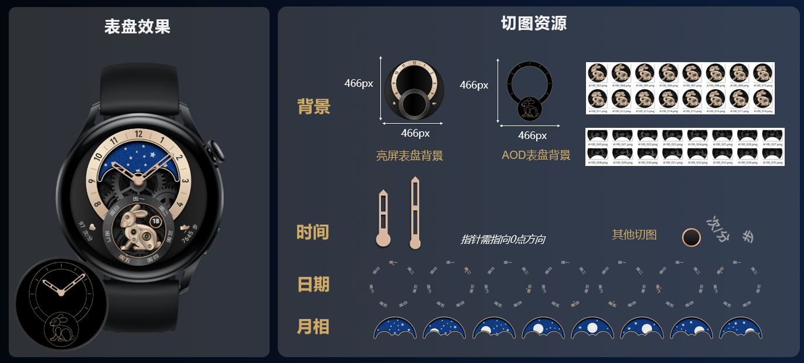

# 制作准备

## 工具准备

访问网址： &lt;https://themestudio.cloud.huawei.com.cn/&gt;

登录账号：拥有华为主题认证设计师-表盘权限的华为账号。

网络环境：连接互联网Internet环境。

1. 支持466\*466分辨率、408\*480分辨率表盘制作。
2. 请使用Chrome浏览器95以上版本访问。
3. 如何申请<strong>“主题认证设计师-表盘权限”</strong>？详见[入驻指导](/docs/distribute/content-dist/theme-center/beginner-guide-0000001054200638/settlement-guidance-0000001056348857)。

## 视觉设计

基于要制作的表盘分辨率，进行表盘视觉设计，包含[亮屏表盘](/docs/distribute/content-dist/theme-center/development-tutorial-0000001054519376/watchface-0000001054571181/basic-concepts-0000001207883464/watch-face-introduction-0000001566918497#section0147798445)和[熄屏表盘](/docs/distribute/content-dist/theme-center/development-tutorial-0000001054519376/watchface-0000001054571181/basic-concepts-0000001207883464/watch-face-introduction-0000001566918497#section2023216179448)视觉。

进行视觉设计时，需考虑当前分辨率表盘支持的能力集，详见：[分辨率与能力集](https://developer.huawei.com/consumer/cn/doc/content/resolution-capability-0000001523484462)。

**466\*466**<strong>视觉设计示例：</strong>

## 切图准备

按照表盘视觉设计，制作切图：

* 按照背景、时间（时、分、秒）、日期（月、日、星期）和控件（天气、步数等）四大元素，进行元素分解。
* 将每个元素按照具体绘制类型，分解为一个或多个图层。
* 针对每个图层绘制所需要的资源进行切图导出。

1. 图片文件建议采用A100\_002.png、A100\_003.png……这样的格式次序命名，避免图片素材导入出错。
2. 如何确定特定数据对应多少张切图？详见[数据类型](/docs/distribute/content-dist/theme-center/development-tutorial-0000001054519376/watchface-0000001054571181/watch-face-production-pro-0000001633846449/start-production-pro-0000001583807166/value-type-pro-0000001583966586)。
3. 不同分辨率的表盘资源包具有不同的[制作校验](/docs/distribute/content-dist/theme-center/development-tutorial-0000001054519376/watchface-0000001054571181/watch-face-production-pro-0000001633846449/start-production-pro-0000001583807166/constraints-pro-0000001633566545)，请在规定的范围内进行切图准备。

<strong>切图示例：</strong>

样例为466\*466分辨率切图，其他分辨率切图方式相同。