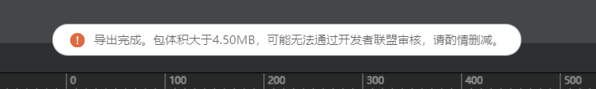
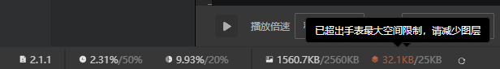
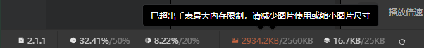
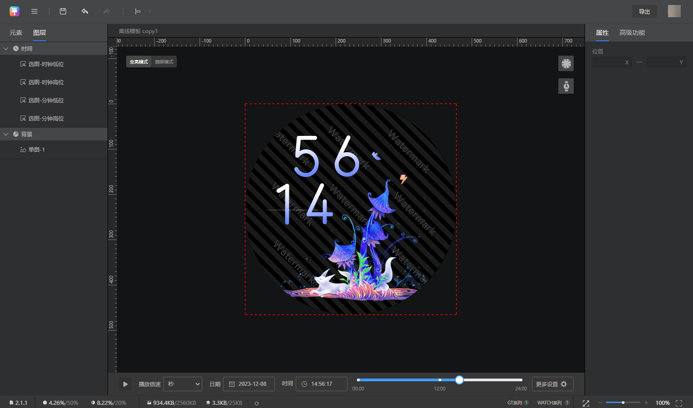
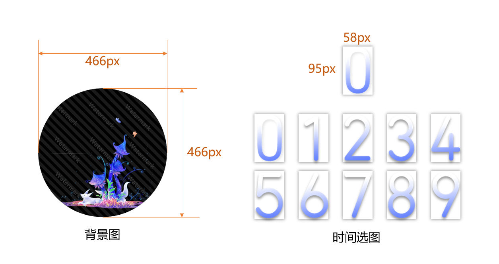
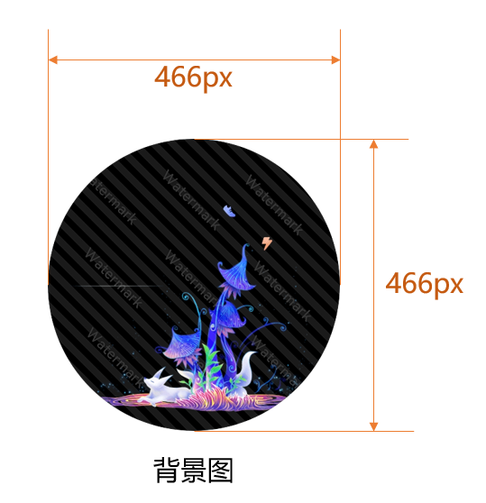
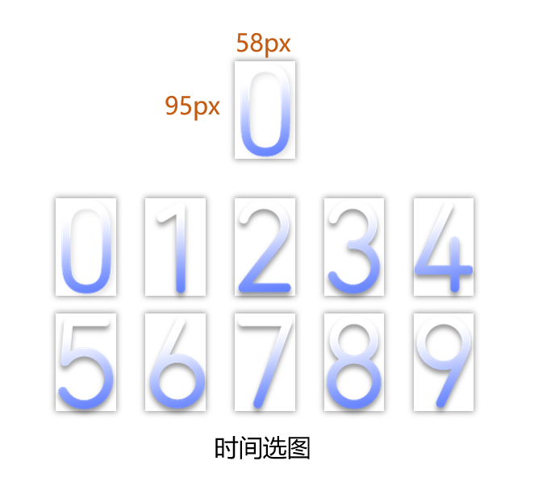

import MergeTable from '@site/src/components/MergeTable';

# 制作校验

在正式开始制作表盘之前，请了解相关校验：

[资源包大小和HWT包大小校验](#section15348517448)

[图层大小总和校验](#section164018202219)

[单张图片像素点大小校验](#section56414514119)

[图片大小总和（PSRAM）校验](#section13570211175)

## 资源包大小和HWT包大小校验

### 校验提醒

Theme Studio Pro 会对表盘的资源包大小和HWT包大小进行校验，弹出框提醒如下：

HWT包大小校验：

如在Theme Studio Pro中遇到此类弹出提醒，可减少图片尺寸或删除部分图片后重新导出。

### 校验汇总

<MergeTable
  headers={['手表类型', '表盘分辨率', '资源包大小校验', 'HWT包大小校验']}
  rows={
    [{ text: '智能手表', rowspan: 3, colspan: 1 }, '466*466（1.y.z）', '无资源包', '4.5MB'],
    [null, '466*466（2.y.z）', '4MB', '4.5MB'],
    [null, '408*480（2.y.z）', '4MB', '4.5MB']
  }
/>

* 资源包：也称之为bin包，是HWT包中的一部分。例如：466\*466（1.y.z）无资源包；466\*466（2.y.z）资源包文件名为watchface.bin。
* HWT包：整个表盘压缩包，文件名后缀为.hwt。

## 图层大小总和校验

### 校验提醒

Theme Studio Pro会对表盘图层大小总和进行校验，如超出会弹出以下提醒：

如果在Theme Studio Pro中遇到此弹出提醒，请根据以下规范进行合理的调整。

### 校验原因

手表设备的内存空间有限，如超出校验可能会导致表盘出现黑屏的情况，而表盘制作过程中，每增加一个图层都会占用手表设备的内存空间，因此Theme Studio Pro对表盘图层大小总和进行校验。

### 校验汇总

<MergeTable
  headers={['手表类型', '表盘分辨率', '图层大小总和校验']}
  rows={
    [{ text: '智能手表', rowspan: 3, colspan: 1 }, '466*466（1.y.z）', '/'],
    [null, '466*466（2.y.z）', '25KB（25600字节）'],
    [null, '408*480（2.y.z）', '25KB（25600字节）']
  }
/>

1MB= 1048576字节、1KB=1024字节。

### 计算方式

根据使用的表盘控件，对所有的图层进行叠加计算。

叠加计算是指：使用多个相同控件时，需要同时计算多个相同控件的图层大小。例如：同时使用星期文本和月数据文本，那么就需要叠加计算两次。

* **466\*466<strong>、</strong>408\*480**

<MergeTable
  headers={['类型', '名称', '大小（字节）', '计算规则']}
  rows={
    ['表盘框架类', '表盘框架', '2092', '如表盘设计中包含【普通容器】、【自定义容器】，则需增加此字节大小，只计算一次，无需叠加计算。'],
    [{ text: '表盘控件', rowspan: 14, colspan: 1 }, '文本', '144', { text: '如使用控件，计算时需增加该控件字节大小，如使用多个需叠加计算。', rowspan: 14, colspan: 1 }],
    [null, '连接文本', '156', null],
    [null, '弧形文本', '156', null],
    [null, '单图', '196', null],
    [null, '选图', '268', null],
    [null, '组合图', '1252', null],
    [null, '指针', '452', null],
    [null, '直线图', '136', null],
    [null, '弧形图', '148', null],
    [null, '单组序列帧', '340', null],
    [null, '多组序列帧', '368', null],
    [null, '弧形文本', '156', null],
    [null, '直线', '184', null],
    [null, '弧形', '184', null],
    [{ text: '表盘元素', rowspan: 6, colspan: 1 }, '元素', '304', '元素包括：背景大模块/时间大模块/日期大模块/控件大模块，都使用需叠加计算。 例如：添加了背景大模块下的控件，即使用了背景大模块，则计算一次，如果再添加了时间大模块下的控件，即使用了背景大模块和时间大模块，则计算两次。'],
    [null, '普通容器', '268', '如表图层中有容器，计算时需增加该字节大小，如使用多个需叠加计算。'],
    [null, '自定义容器', '292', '如表盘图层中使用自定义容器，计算时需增加该字节大小，如使用多个需叠加计算。'],
    [null, '自定义选项', '180', '由于自定义容器下只考虑最大的自定义选项，所以单个自定义容器下只计算一个自定义选项。'],
    [null, '图层', '256', '每增加一个图层，则叠加计算一次。'],
    [null, '自定义图层', '256', '如使用自定义容器，计算方式有所不同，先判断同一自定义容器下各个自定义选项所包含图层的大小，再选最大的自定义选项叠加计算。'],
    ['图片映射表', '图片映射表', '20', '如设计过程中添加了图片，则相当于增加一张图片的占位，从而每一张图片需增加此字节。相同资源，只需要计算一次。 说明： 添加组合图后，系统默认提供一张透明图，该图片会进行相应的字节计算。']
  }
/>

## 单张图片像素点大小校验

### 校验汇总

<MergeTable
  headers={['手表类型', '表盘分辨率', '单张图片像素点大小校验']}
  rows={
    [{ text: '智能手表', rowspan: 3, colspan: 1 }, '466*466（1.y.z）', '/'],
    [null, '466*466（2.y.z）', '750KB'],
    [null, '408*480（2.y.z）', '750KB']
  }
/>

### 计算方式

图片的像素点大小计算方式为：

* PNG图片：图片的长度\*图片的宽度\*4/1024（单位：KB）。
* BMP图片：图片的长度\*图片的宽度\*2/1024（单位：KB）。

计算后Theme Studio Pro还将自动对其进行压缩，以压缩后得到的值为准。当压缩后得到的值超过当前分辨率校验，图片无法上传。

Theme Studio Pro Pro压缩图片时，当前图片的连续相同像素点越多，压缩后得到的值越小。因此，当超出像素点大小校验时，可以通过缩小图片尺寸，或者减少图片的渐变像素点来解决。

## 图片大小总和校验

### 校验提醒

Theme Studio Pro 会对图片大小总和进行校验，如超出会弹出以下提醒：

如果在Theme Studio Pro 中遇到此弹出提醒，请根据以下规范进行合理的调整。

### 校验原因

手表加载后，所有图片同时缓存在手表设备中的图片缓存区，图片缓存区大小有限，故需要校验表盘上所有图片大小总和。

### 校验汇总

<MergeTable
  headers={['手表类型', '表盘分辨率', 'PSRAM校验']}
  rows={
    [{ text: '智能手表', rowspan: 3, colspan: 1 }, '466*466（1.y.z）', '/'],
    [null, '466*466（2.y.z）', '2.5MB（2621440字节）'],
    [null, '408*480（2.y.z）', '2.5MB（2621440字节）']
  }
/>

1MB= 1048576字节、1KB=1024字节。

### 计算方式

根据以下公式，对所有的图片进行叠加计算：

单张PNG图片：（图片的长度\*图片的宽度）\*4=单张PNG图片的大小（单位：字节）。

单张BMP图片：（图片的长度\*图片的宽度）\*2=单张BMP图片的大小（单位：字节）。

### 样例：466\*466分辨率表盘图片大小总和计算

以下为一个466\*466分辨率表盘示例，使用的全部图片资源如下图所示：

则根据[计算方式](https://developer.huawei.com/consumer/cn/doc/content/constraints-0000001580893701#section1414911151316)，本示例表盘的图片大小总和为868624+88160=986784字节，因1KB=1024字节，故本示例表盘约为934.4KB。

以下为计算详情：

<strong>背景图</strong>

背景图尺寸为466px\*466px，则背景图的图片大小为：（466\*466）\*4=868624（字节）。

<strong>时间选图</strong>

时间 选图-时钟高位 的图片尺寸为58px\*95px，则 选图-时钟高位 的图片大小为：（58\*95）\*4=22040（字节）。

由于时间分为时钟高位，时钟低位、分钟高位、分钟低位四个部分，且这四个部分使用同一套时间数字切图，所以时间选图的总大小需\*4：22040\*4=88160。

选图只需要计算一张图片大小。

