import MergeTable from '@site/src/components/MergeTable';

# 制作表盘

本文将介绍表盘制作工具Theme Studio Pro的界面、功能和使用方法。

## 新建作品

<strong>操作步骤：</strong>

1. 点击“新建作品” 。
2. 作品类型选择“手表表盘” 。
3. 输入表盘作品名称，选择设备类型，选择规范版本。

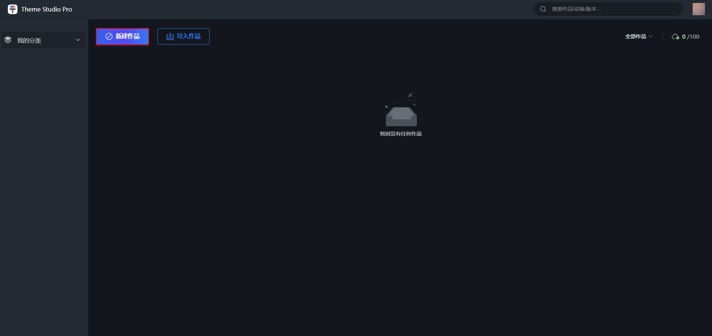

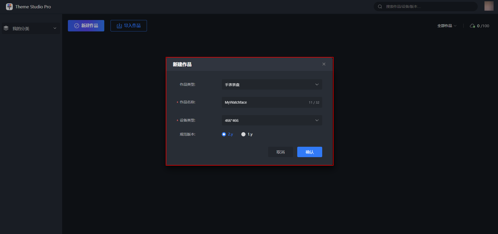

1. 设备类型：支持466\*466、408\*480分辨率表盘制作。
2. 规范版本：“466\*466”支持1.y和2.y；“408\*480”支持2.y。

## 作品管理

新建作品后，作品管理页面会自动生成一个作品。支持在作品管理页面复制作品、删除作品和重命名作品。

编辑过程中保存作品后（为已保存），将自动生成表盘缩略图，显示在作品管理页面。

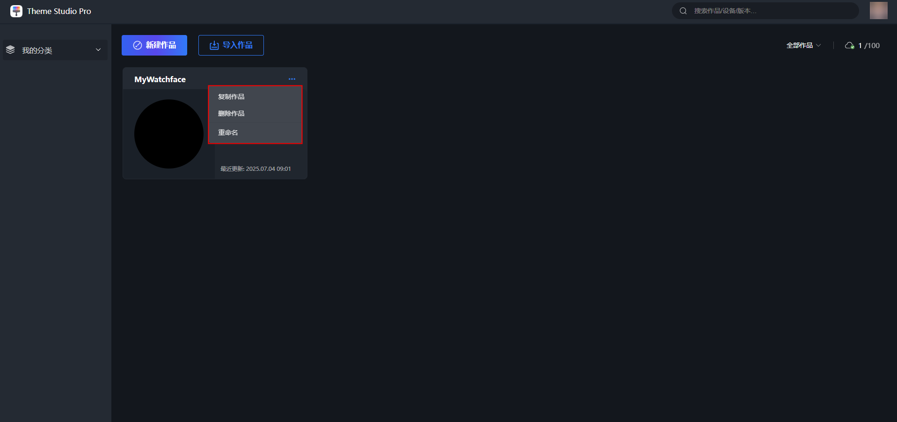

## 制作页面

表盘制作界面按红色线框划分为五个区域：

* [菜单栏](#section66771179404)
* [元素栏](#section138781830103420)&[图层栏](#section14484153615342)
* [编辑预览区](#section791014383413)
* [属性栏](#section250116388345)&高级功能栏
* 状态栏

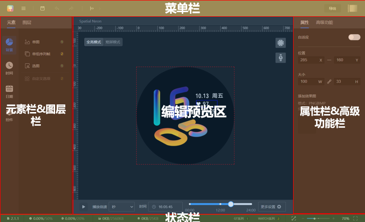

<strong>区域介绍</strong>

* 菜单栏：支持新建、导入、保存 、撤回/重做、对齐、导出等操作。
* 元素栏：支持选择表盘元素，包括单图、选图等。
* 图层栏：支持查看图层，调整图层状态、位置等。
* 编辑预览区： 所有的操作都可在编辑预览区完成，实时预览表盘效果。
* 属性栏：支持调整元素、图层的属性。
* 高级功能栏：支持表盘高级功能，包括景深、颜色自定义、样式自定义。
* 状态栏：支持查看当前表盘的版本号和校验结果。

<strong>布局调整</strong>

元素栏、图层栏、属性栏、高级功能栏可以拖拽调整位置，调整布局。

拖拽过程示例：

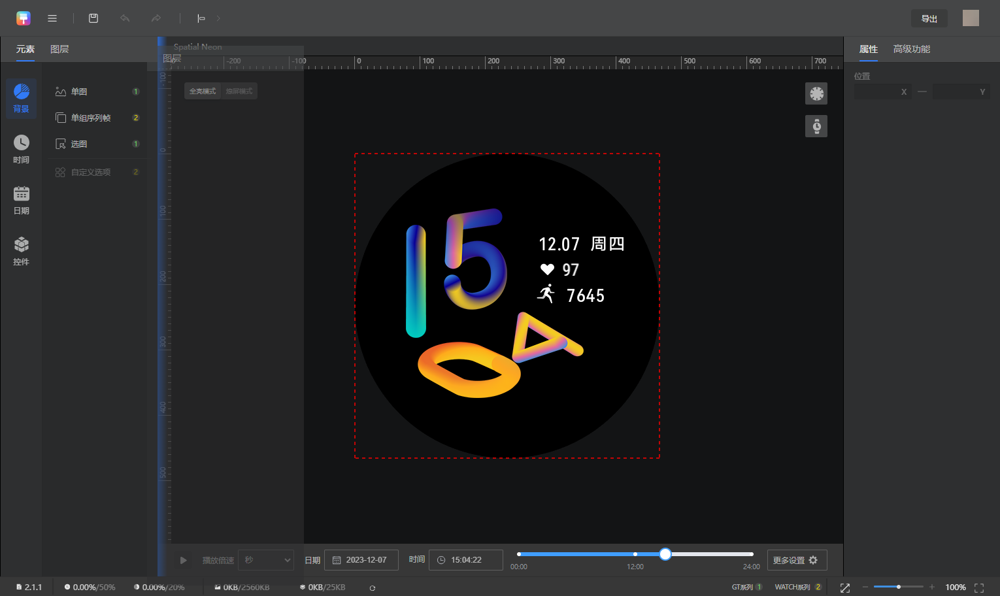

拖拽效果示例：

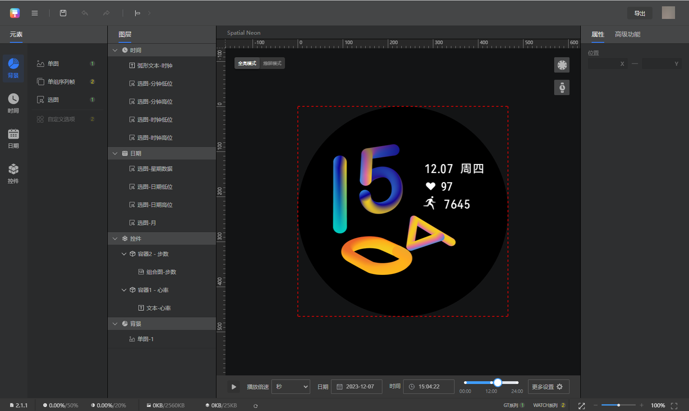

### 菜单栏

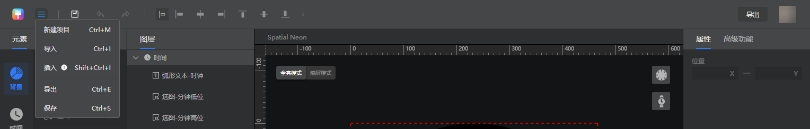

<strong>新建作品：</strong>新建一个表盘作品。

<strong>导入</strong> <strong>：</strong>从本地导入已有的表盘作品。

<strong>插入：</strong>将已制作完成的表盘资源包插入到当前表盘作品中。

<strong>导出：</strong>导出当前表盘资源包。

<strong>保存：</strong>保存当前表盘制作内容。

<strong>：</strong>点击返回作品管理页。

### 元素栏

<strong>背景</strong>：提供制作背景时，支持使用的元素类型。

<strong>时间</strong>：提供制作时间（时、分、秒）时，支持使用的元素类型。

<strong>日期</strong>：提供制作日期（月、日、星期）时，支持使用的元素类型。

<strong>控件</strong>：提供制作数据（天气、步数、心率等）时，支持使用的元素类型。

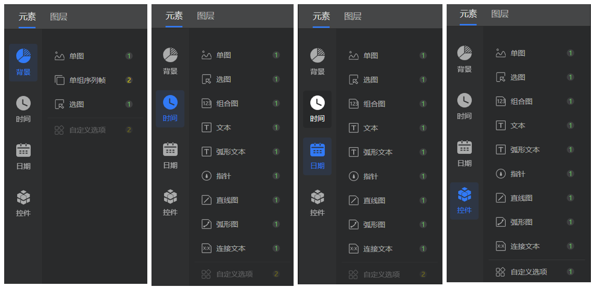

<strong>元素介绍</strong>

元素是表盘的功能选项，每个元素都有其独特作用。

通过添加一定数量的元素，进行表盘制作。

例如：新增一个组合图，选择数据类型为“步数”，添加数字图片，编辑预览区则显示步数。

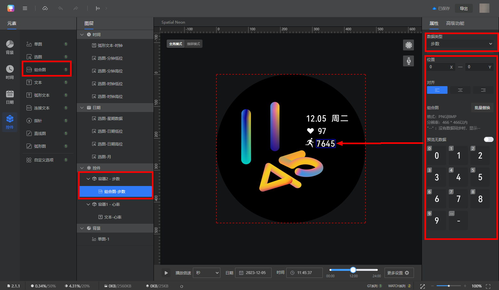

<strong>元素汇总</strong>

当前共支持15种元素，详见下表。

每种元素的功能与使用方法，我们将结合[制作实例](/docs/distribute/content-dist/theme-center/development-tutorial-0000001054519376/watchface-0000001054571181/watch-face-production-pro-0000001633846449/start-production-pro-0000001583807166/production-example-pro-0000001633927109)详细讲解。

每类分辨率支持的元素类型及其对应的版本号，详见：

* [466\*466元素类型](/docs/distribute/content-dist/theme-center/development-tutorial-0000001054519376/watchface-0000001054571181/basic-concepts-0000001207883464/resolution-capability-0000001523484462/x466-capability-0000001881726154#section1921412381417)

<MergeTable
  headers={['元素类型', '元素功能', '关联数据类型', '场景举例']}
  rows={
    ['单图', '上传静态图片，以展示静态画面', { text: '不关联数据', rowspan: 4, colspan: 1 }, { text: '使用单图，制作表盘静态背景 使用单组序列帧/视频/动图控件，制作表盘动态背景', rowspan: 4, colspan: 1 }],
    ['单组序列帧', '上传序列帧动画，以展示动态画面', null, null],
    ['视频', '上传MP4格式的视频，以展示动态画面，仅用于背景', null, null],
    ['动图', '上传GIF格式的动图，以展示动态画面，仅用于背景', null, null],
    ['选图', '上传一组图片，根据数据实际值显示组图中的一张，以制作枚举数据', '枚举数据', '使用选图，制作静态背景切换 使用选图，制作天气类型枚举 使用选图，制作电量枚举'],
    ['多组序列帧', '上传0-9数字序列帧，每个数字设计1组序列帧，以展示每个数字的动态效果，仅用于数字时钟', '枚举数据', '使用多组序列帧控件，制作数字时钟'],
    ['组合图', '上传0-9数字切图，每个数字设计1张切图，并将其组合起来，以展示数据数值', '原始数据', '使用组合图，制作心率数值'],
    ['文本', '展示单个动态文本', { text: '原始数据 文本数据', rowspan: 3, colspan: 1 }, { text: '使用文本，制作步数、心率数值 使用连接文本，制作XX-XX格式的心率、XX%格式的电量、XX/XX格式的日期 使用弧形文本，制作带弧度的步数数值', rowspan: 3, colspan: 1 }],
    ['连接文本', '展示1~2个带特殊符号的动态文本', null, null],
    ['弧形文本', '展示带弧度的动态文本', null, null],
    ['直线', '绘制直线，展示进度/比例', { text: '比例数据', rowspan: 5, colspan: 1 }, { text: '使用弧形图，制作步数目标达成度、电量比例 使用直线，制作心率比例', rowspan: 4, colspan: 1 }],
    ['弧形', '绘制弧形，展示进度/比例', null, null],
    ['直线图', '上传直线图，展示进度/比例', null, null],
    ['弧形图', '上传弧形图，展示进度/比例', null, null],
    ['指针', '上传指针切图，通过指针旋转展示进度/比例', null, '使用指针，制作时针、分针、秒针']
  }
/>

### 图层栏

每添加一个元素，都将自动生成一个对应的图层，显示在图层栏。

表盘图层栏显示已添加的所有图层。

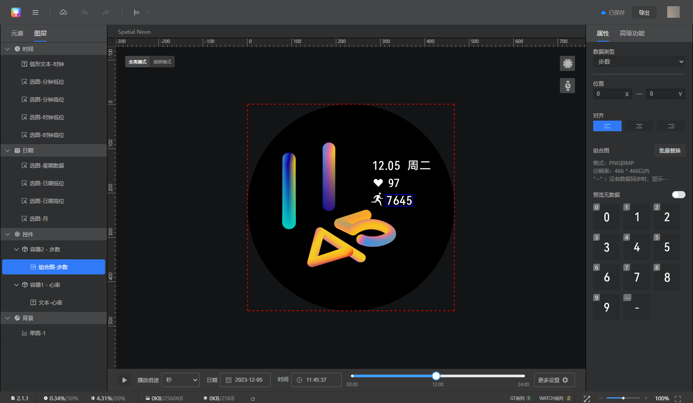

<strong>图层分组</strong>

1. 基于元素添加的位置，元素图层自动分为背景、时间、日期和控件四组。
2. 多个图层叠加显示，背景在最底层，时间在最顶层。

<strong>图层相关操作</strong>

* 显示/隐藏图层：隐藏的图层不会显示在预览区中。
* 锁定/解锁图层：锁定图层以免其在画布上移动。
* 移动图层：移动图层位置，仅支持在当前分组中进行移动。
* 删除图层：删除当前图层（右键后删除/Delete快捷键）。
* 复制图层：通过复制快捷键Ctrl+C和粘贴快捷键Ctrl+V实现。
* 新增图层：在背景、时间、日期模块，直接添加。
* 新增图层：在图层右键，添加新容器；在容器右键，为容器添加新图层。

<strong>容器介绍</strong>

背景、时间、日期无容器。控件有容器：初次从“控件”中添加一个元素后，同时会新建一个容器。

1. 容器是一组图层的细化分组，默认显示为“容器X”（X为阿拉伯数字），此时未关联数据类型。当该容器下的图层关联“数据类型”后，该容器将变为特定数据容器，显示为“容器X-XX数据”。例如：“容器2-心率”、“容器3-天气”。

   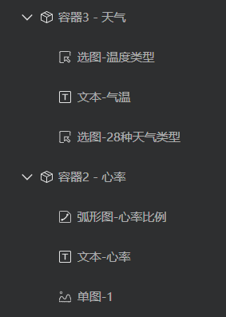
2. 选中某个容器或者容器下的图层时（蓝色为选中状态），只能在当前容器下新建元素图层。且图层关联的数据类型，只能从该数据容器中进行选择。例如：选中“容器1-步数”，只能在此容器下新建元素图层，且只能选择步数相关的数据类型。

   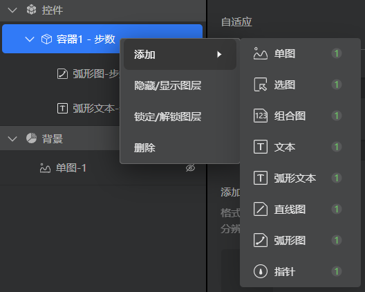
3. 如需添加一个新容器，有以下两种方法：点击“元素”&gt;“控件”或选中“控件” 并右键，添加一个新容器。

   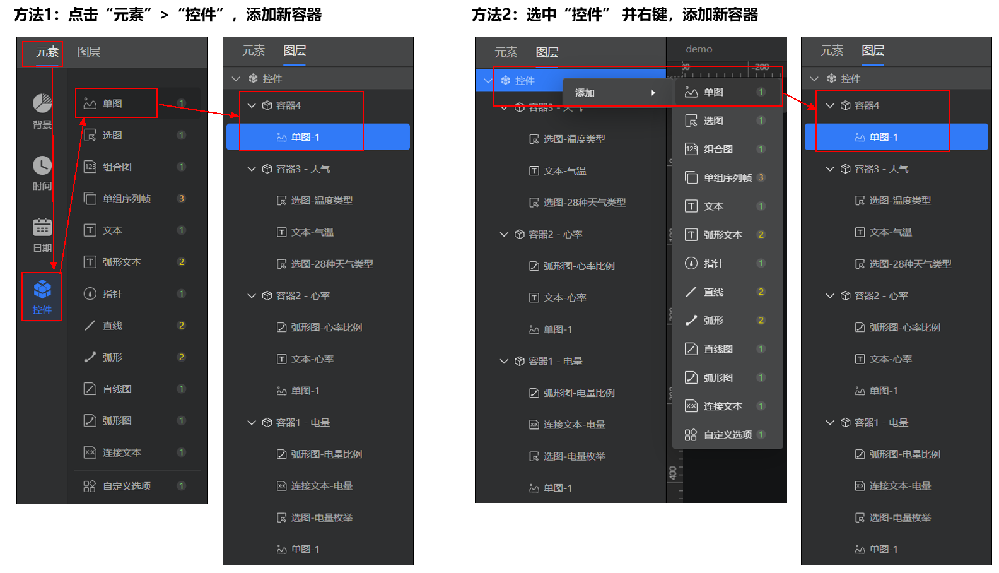
4. 未打开自适应功能时，图层只能在当前容器的范围中移动。打开自适应功能后，容器框会跟随元素框而移动。如关闭自适应功能，需手动调整容器框大小，建议先选中容器，调整好容器的大小和位置，再选中图层，调整图层的大小和位置。

   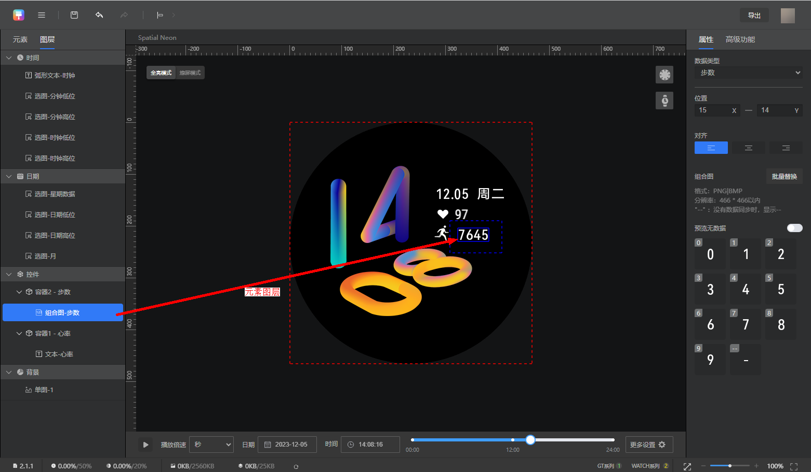

<strong>容器跳转</strong>

容器变为数据容器后，点击当前容器的范围，可跳转至相关应用。哪些容器支持跳转？点击查看[跳转应用](/docs/distribute/content-dist/theme-center/development-tutorial-0000001054519376/watchface-0000001054571181/watch-face-production-pro-0000001633846449/start-production-pro-0000001583807166/value-type-pro-0000001583966586#section1743413371488)。因此，多个数据容器的范围不可重叠，避免出现“点击重叠区域，跳转失误”的问题。

例如：点击天气容器，可跳转至天气应用页面，点击心率容器，可跳转至心率应用页面。因此，天气容器和心率容器的范围不可重叠。

### 属性栏

每个元素图层都有一系列可编辑的属性，我们将结合[制作实例](/docs/distribute/content-dist/theme-center/development-tutorial-0000001054519376/watchface-0000001054571181/watch-face-production-pro-0000001633846449/start-production-pro-0000001583807166/production-example-pro-0000001633927109)详细讲解。

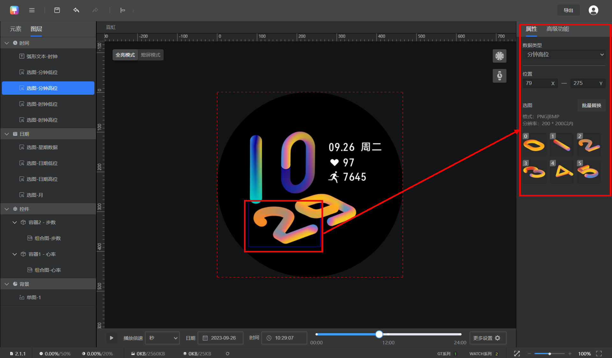

<strong>属性图片替换逻辑</strong>

单点替换：点击图片直接替换。

批量替换：点击批量替换按钮进行替换。

挑选替换：按住Ctrl键，点击需要替换的图片，再点击批量替换。

<strong>数据类型</strong> <strong>介绍</strong>

在一系列属性中，关联<strong>“数据类型”</strong>非常重要。

* 关联“数据类型”前，元素与表盘支持的“数据类型”无联系。
* 关联“数据类型”后，元素与表盘支持的“数据类型”联系起来。

例如：元素关联数据类型“日期高位”，则通过该控件动态、实时显示当前实际日期高位。

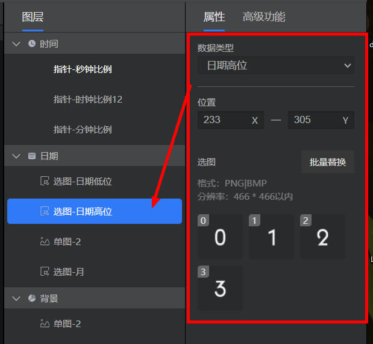

<strong>数据类型对应的占位图</strong>

Theme Studio Pro支持在关联数据类型后，为数据类型提供对应的占位图，指引创作。

* 占位图覆盖全量数据类型场景。
* 占位图必须全部替换后才能导出。

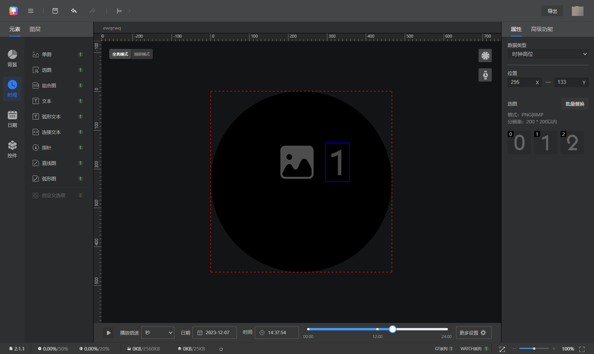

<strong>数据类型汇总</strong>

表盘支持的所有数据类型及其介绍，详见数据类型。

常用的数据类型制作方法，我们将结合[制作实例](/docs/distribute/content-dist/theme-center/development-tutorial-0000001054519376/watchface-0000001054571181/watch-face-production-pro-0000001633846449/start-production-pro-0000001583807166/production-example-pro-0000001633927109)详细讲解。

每类分辨率支持的数据类型及其对应的版本号，详见：

* [466\*466数值类型](/docs/distribute/content-dist/theme-center/development-tutorial-0000001054519376/watchface-0000001054571181/basic-concepts-0000001207883464/resolution-capability-0000001523484462/x466-capability-0000001881726154#section1462914111857)

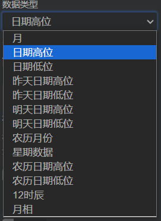

### 编辑预览区

支持在表盘编辑区中，快速选中一个或多个图层，以进行将图层拖拽到合适位置、调整图层对齐方式等操作。

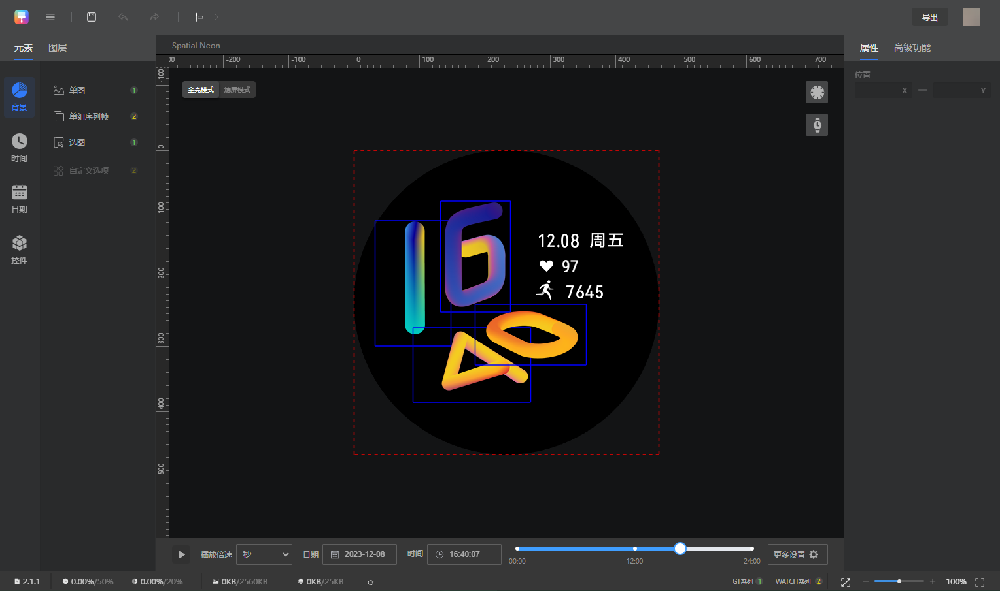

在预览显示模块，Theme Studio Pro做了如下优化：

* 支持画布自由缩放。
* 优化表盘预览方式和效果。点击自动运行表盘，以测试表盘在不同数值下的显示效果。同时支持倍速预览、拉动进度条预览。请对照[表盘主题测试规范](/docs/distribute/content-dist/theme-center/content-release-0000001054679366/content-review-specifications-0000001054679960/content-check-pecifications-0000001057301166/sportwatch-test-0000001057059331)进行预览测试。
* 支持多款高清表带模型预览。点击  按钮，查看表带预览效果。

  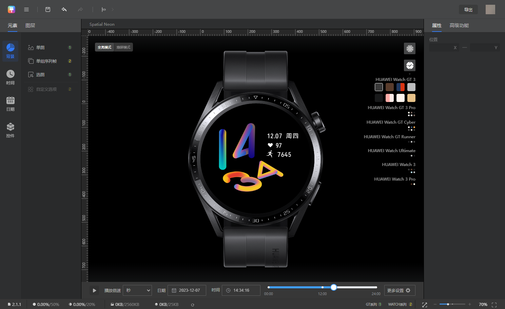
* 校验表盘刻度是否准确。点击  按钮，开启表盘刻度校验。

  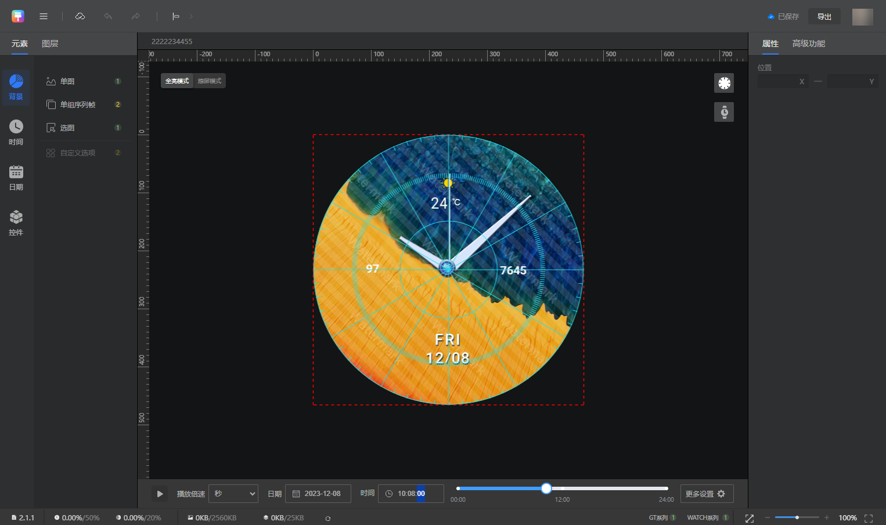

## 表盘导出

### 自动截图

点击“导出”，等待表盘资源包校验完成。然后自动截图生成预览图。

预览无误后，点击“下一步”。

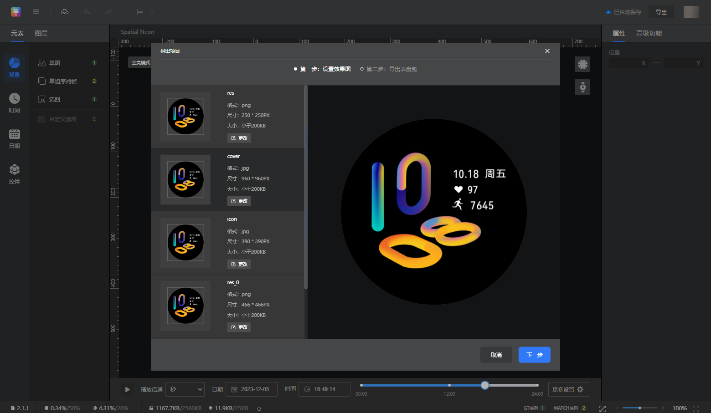

**466\*466分辨率预览图**

自动生成以下几张预览图：

* res.png
* cover.jpg
* icon\_small.jpg
* aod.jpg

| res.png | cover.jpg | icon\_small.jpg | aod.jpg |
| --- | --- | --- | --- |
|  |  | 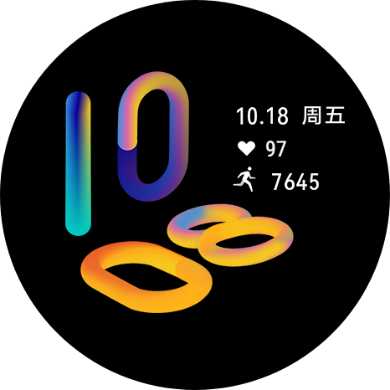 |  |
| 表盘缩略图 | 表盘预览图 | 图标预览图 | 熄屏表盘预览图 |
| 在手表上切换表盘时展示 | 在表盘市场中展示 | 在表盘市场中展示 | 在表盘市场中展示 |
| * 格式：png * 尺寸：250px\*250px | * 格式：jpg * 尺寸：960px\*960px | * 格式：jpg * 尺寸：390px\*390px | * 格式：jpg * 尺寸：960px\*960px |

### 导出信息填写

<strong>填写以下信息后，点击“确认”导出。</strong>

* 表盘英文名称（自定义填写，必须为英文名称），导出的表盘资源包将以这里输入的英文名称命名。
* 表盘中文名称（自定义填写，必须为中文名称）。
* 版本号（Theme Studio Pro自动生成，详见[表盘版本号](/docs/distribute/content-dist/theme-center/development-tutorial-0000001054519376/watchface-0000001054571181/basic-concepts-0000001207883464/resolution-version-0000001252603441#section14815328193116)说明）。
* 开发者（自定义填写，需要和联盟注册的设计师名称相同）。
* 设计师（自定义填写，需要和联盟注册的设计师名称相同）。
* 表盘简介（自定义填写，需要填写中文简介和英文简介）。
* <strong>支持同步导出预览视频。</strong>

### 导出文件说明

* **466\*466分辨率**

导出的表盘资源包（hwt格式）和预览视频，将存储至浏览器下载内容的指定位置。

| 文件名称 | 文件说明 |
| --- | --- |
| aaa.hwt（aaa为表盘作品名称） | 表盘资源包，用于上表测试和上传联盟。  导入Theme Studio Pro进行二次编辑。 |
| aaa.mp4（aaa为表盘作品名称） | 表盘预览视频，为可选导出。 |