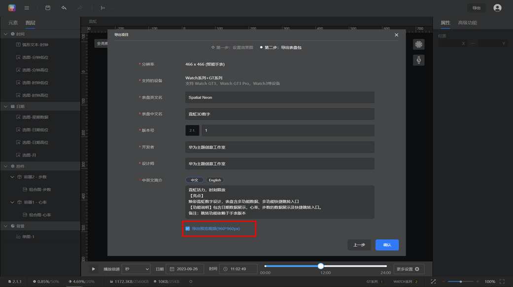

# 预览视频

表盘市场支持播放表盘预览视频，以让您的表盘作品被更好地展示，提高表盘销售。

请按下列规范准备表盘的预览视频文件。

## 预览视频分辨率

import MergeTable from '@site/src/components/MergeTable';

<MergeTable
  headers={['手表类型', '表盘分辨率', '预览视频分辨率']}
  rows={
    [{ text: '智能手表', rowspan: 2, colspan: 1 }, '466*466', '960px*960px'],
    [null, '408*480', '816px*960px']
  }
/>

## 预览视频规格

* 视频格式为MP4，编解码制式要求为H.264，无音轨。
* 在保证清晰度的前提下，视频大小建议在5MB以内，时长建议在5秒以内。
* 为保证预览效果，预览视频的首帧效果请与表盘的cover图一致。
* 请提供能循环播放的视频，确保首尾衔接部分播放流畅，不会出现画面跳动或者闪烁。
* 该文件无需打包在表盘文件包内。通过主题联盟上传表盘作品时，同时上传该预览视频即可。
* 表盘预览视频不能为手持拍摄的视频，请用设计软件制作，或[使用Theme Studio Pro进行录制](#section138974534422)。
* 表盘市场展示时会自动给预览视频加上手表外框。设计预览视频时，请勿设计手表的外框。功能效果请参考以下视频：

  

## 预览视频录制

在Theme Studio Pro中，支持在导出表盘资源包时，同步导出预览视频。

