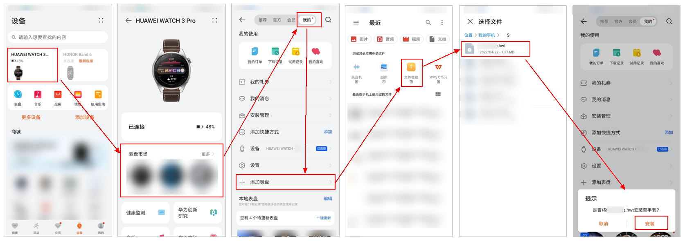

# 上表测试

支持在配对的手表/手环设备上测试您的表盘。

## 上表测试

1. 将制作完成的表盘资源包，保存至手机任一文件夹中。

   

   表盘资源包文件后缀为.hwt（例如：demo.hwt）。资源包名称不能包含中文，只能包含字符、数字。
2. 在应用市场中，下载安装华为运动健康APP。
3. 使用具备<strong>“主题认证设计师-表盘权限”</strong>的华为账号（主账号+团队账号）登录华为运动健康APP。

   

   1. 登录的华为账号必须符合以上要求，否则不展示“添加表盘”入口，无法上表测试。

   2. 如何申请<strong>“主题认证设计师-表盘权限”</strong>？详见[入驻指导](/docs/distribute/content-dist/theme-center/beginner-guide-0000001054200638/settlement-guidance-0000001056348857)。
4. 在华为运动健康APP中，添加配对的手表/手环设备。

   

   表盘资源包只能推送至配对的手表/手环设备上进行测试，详见[分辨率与版本号](/docs/distribute/content-dist/theme-center/development-tutorial-0000001054519376/watchface-0000001054571181/basic-concepts-0000001207883464/resolution-version-0000001252603441)。
5. 进入当前设备的“表盘市场”，在“我的”页面点击“添加表盘”。找到手机中的表盘资源包，并将其安装至手表。安装成功后，在手表上查看、测试表盘效果。

   

<strong>如何在手表上更换表盘？</strong>

测试表盘时：需按照[上表测试](#section94576216174)步骤，进行表盘更换。

平时使用时：在当前手表设备的表盘市场中找到合适表盘后，将其应用至手表。长按手表屏幕，将显示已应用过的所有表盘的缩略图（左右滑动屏幕切换表盘缩略图），双击缩略图即可应用当前表盘。

## 表盘自检

为确保尽快通过审核，在上传表盘资源包之前，需要您按照[表盘主题测试规范](/docs/distribute/content-dist/theme-center/content-release-0000001054679366/content-review-specifications-0000001054679960/content-check-pecifications-0000001057301166/sportwatch-test-0000001057059331)自检自查。

## 表盘上传

参考[表盘上传指南](/docs/distribute/content-dist/theme-center/content-release-0000001054679366/uploadguide-0000001054359939/sportwatch-upload-0000001054469759#section12564125619118)，将表盘资源包上传至主题联盟。