# 常见问题

## 在使用Theme Studio Pro制作表盘的过程中出现问题，如何进行反馈？

<strong>解决方式：</strong>可通过“个人中心”的“问题反馈”跳转至联盟的[联盟在线工单](https://developer.huawei.com/consumer/cn/support/feedback/#/)反馈。

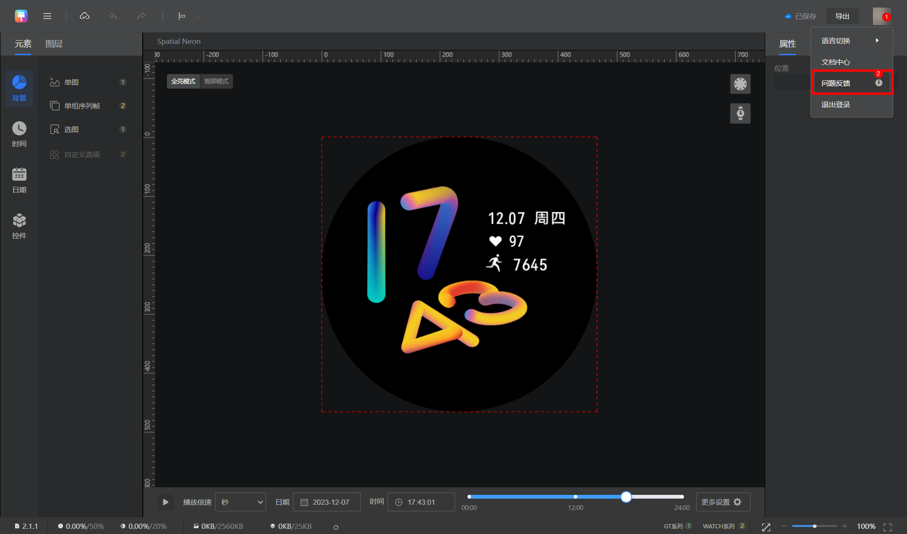

[联盟在线工单](https://developer.huawei.com/consumer/cn/support/feedback/#/)反馈步骤：

1. 选择“华为内容分发”。
2. 选择“主题中心”。
3. 选择“作品开发/工具/引擎类”。
4. 反馈您遇见的问题，为了更好方便问题定位，请您尽可能反馈[以下内容](#section144654196136)，并点击“提交问题”。

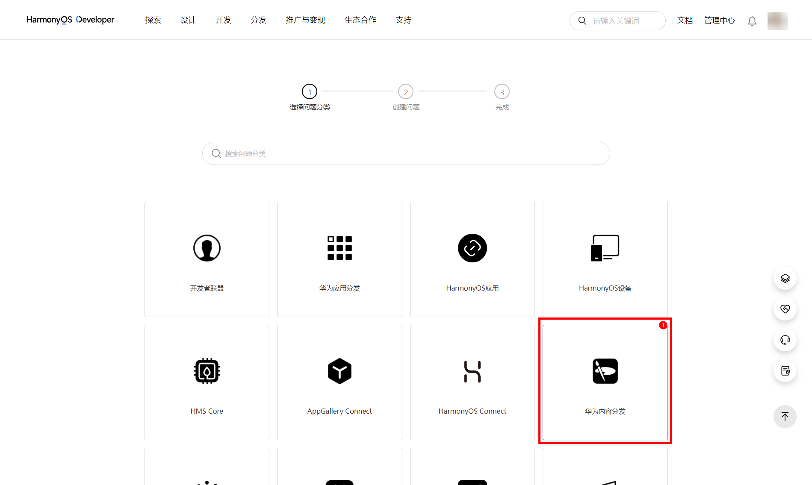

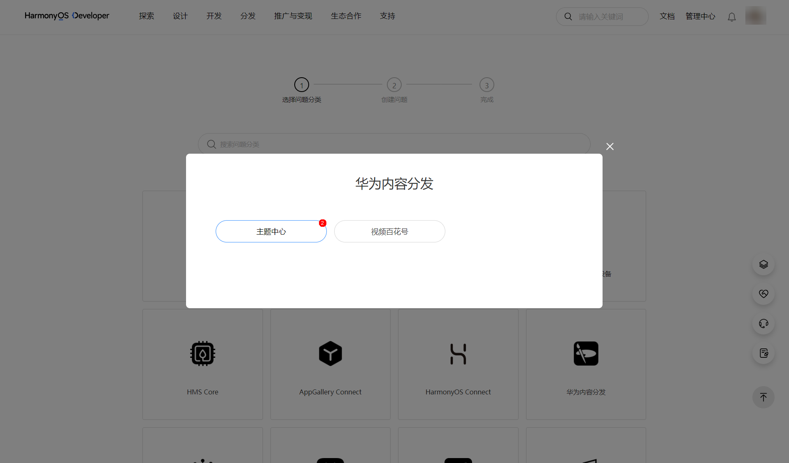

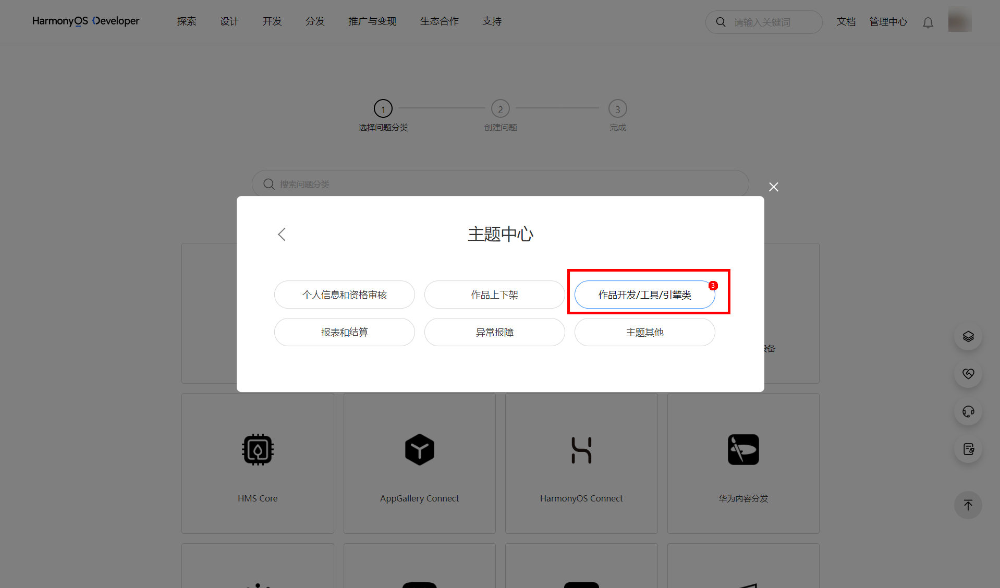

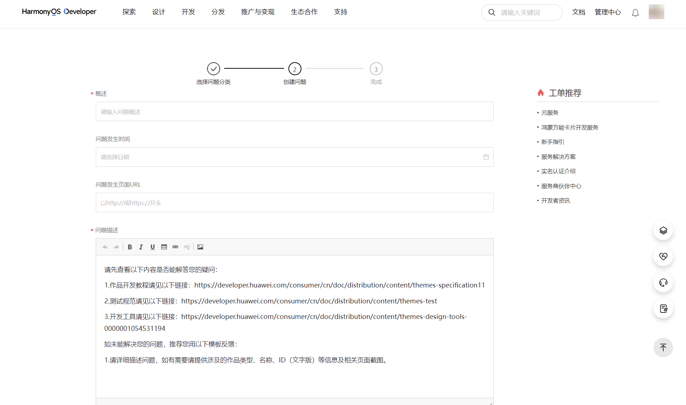

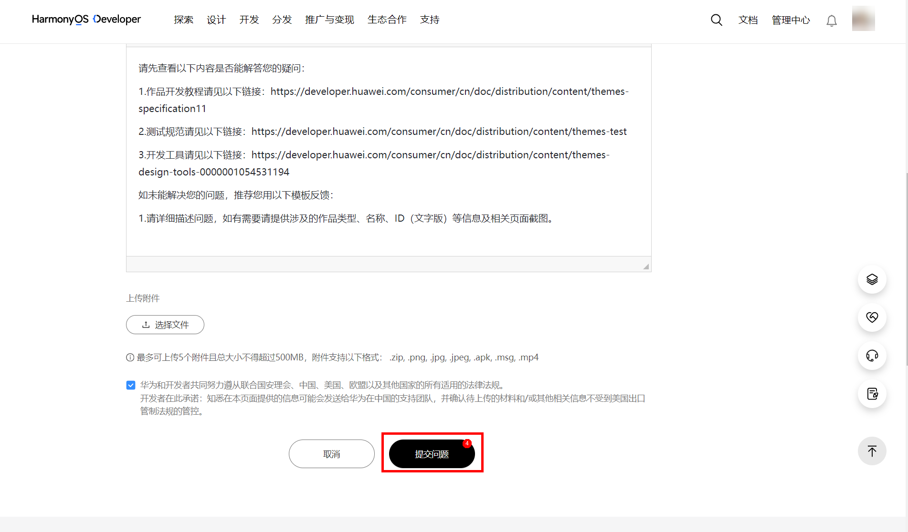

### 反馈内容

请同时提供以下4项内容，以便于我们更高效地复现并定位问题：

1. 详细描述出现的问题和相关操作步骤。

   举例：制作466分辨率表盘，使用时间文本控件后，截屏生成预览图时，发现预览图某个控件/数据的位置与制作过程中动态预览区显示的位置不一样。
2. 提供清晰的、可对比展示问题的多张截图。

   举例：基于1中的问题，同时提供截屏生成的预览图与制作过程中动态预览区显示的位置截图。
3. 提供出现问题的表盘包（xxxx.hwt）。如无法导出，可提供素材包和操作步骤截图或视频。
4. 打开网页开发者工具，提供以下截图，需包括（userId/timeStamp）。

   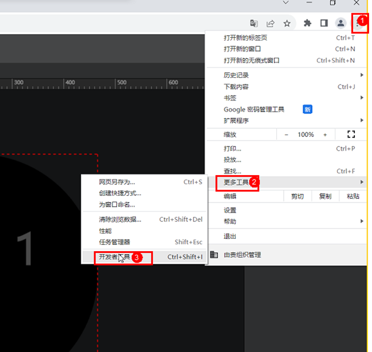

   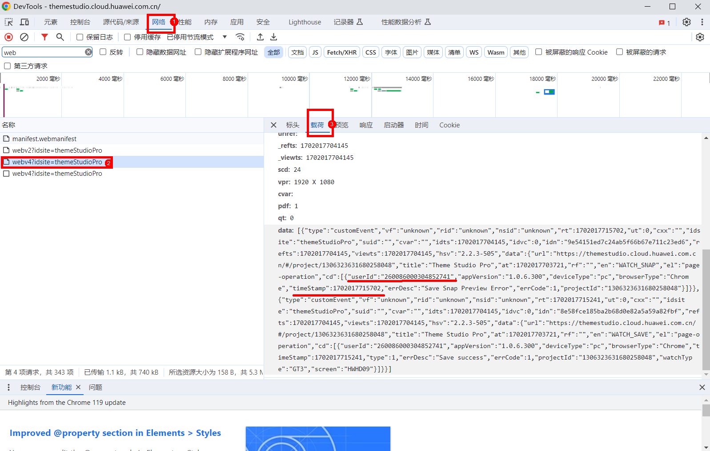

## 提示“上传视频个数与预览图张数需保持一致，请修改”，如何解决？

<strong>问题原因：</strong>视频元素中，预览图的数量与视频的数量不一致。

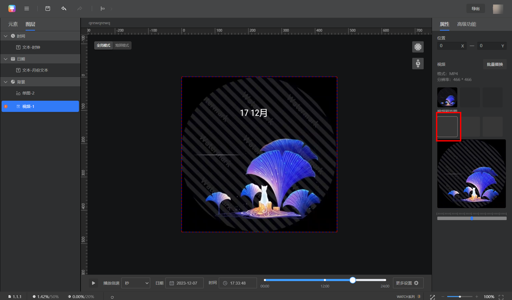

<strong>解决方式</strong>：通过“位置1”上传视频，拖拽“位置2”预览视频的进度条，选择某一帧截取预览图。

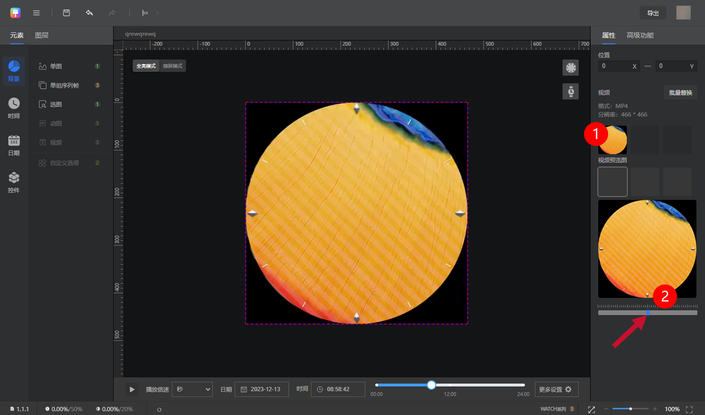

## 如何替换视频元素中的预览图？

<strong>解决方式：</strong>选择需要替换的预览图，拖拽“位置2”预览视频的进度条，选择某一帧截取预览图。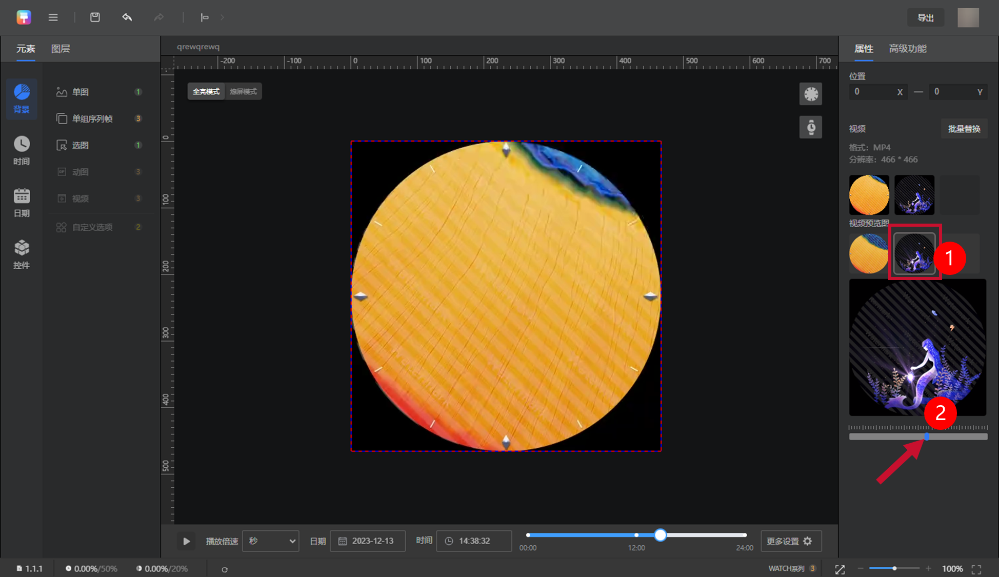

## <strong>如何删除视频和预览图？</strong>

<strong>解决方式：</strong>将光标移动到对应视频，点击  即可删除视频和预览图。

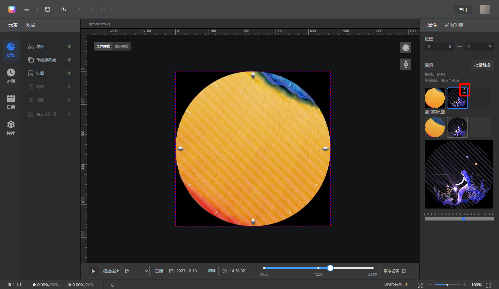

## 提示“制作组合图时，未添加无效资源，请添加后再导出”，如何解决？

<strong>问题原因：</strong>制作组合图时，属性下缺少无效资源。

<strong>解决方式：</strong>在当前元素属性中上传无效资源。

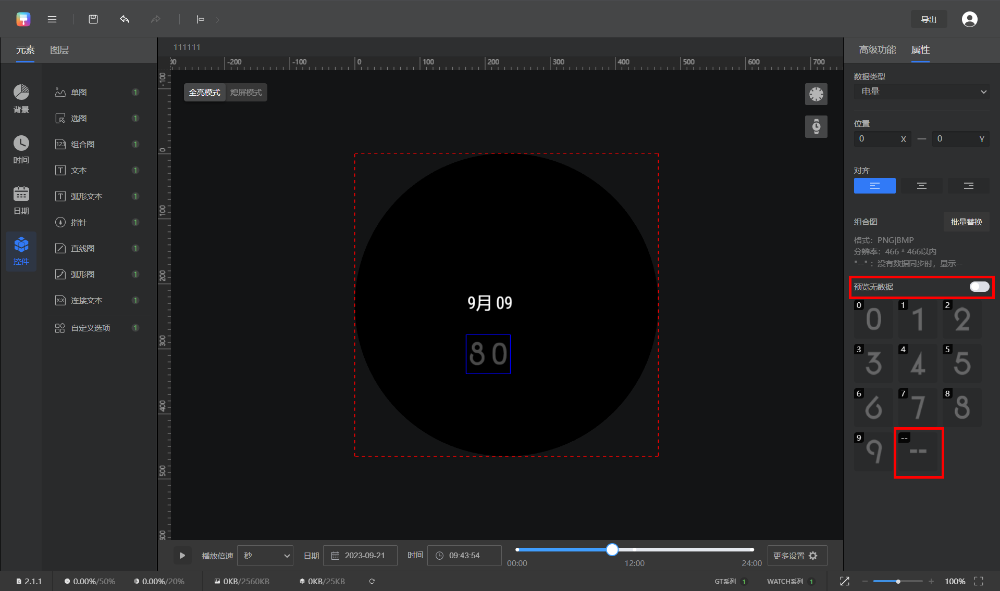

## 出现“当前表盘整体亮度过亮提醒”，如何解决？

<strong>Theme Studio Pro提示：</strong>

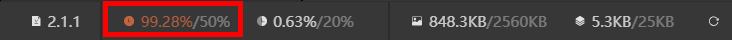

<strong>问题原因：</strong>表盘亮度过高，会导致表盘的能耗过高。表盘亮度校验是对表盘中所有像素点的校验。表盘过亮判定规则为：R&gt;168 、G&gt;168 、B&gt;128 、A&gt;168，当RGBA的四个数值同时满足大于条件时，才算此像素点过亮。同时当过亮的像素点超过50%时，则会判定为表盘整体亮度过亮。

<strong>解决方式：</strong>可通过修改表盘中图片资源的RGBA值，减少过亮像素点的数量，从而解决过亮问题。建议设计师在调整数值幅度时，可差异化大一些。

A的取值范围为0-255，在设计软件中需自行换算成百分比进行设置，A&gt;168换算成百分比即A&gt;(168/255)%。

## 熄屏表盘提示非黑像素点占比过高，如何解决？

<strong>Theme Studio Pro提示：</strong>

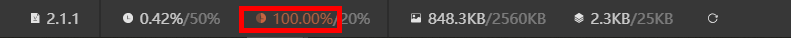

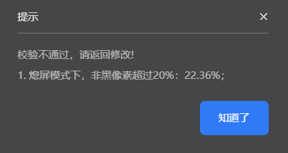

<strong>问题所在：</strong>半量模式制作的样式用于手表熄屏显示下展示的内容，也就是手表正常关闭表盘屏幕后，在表盘屏幕上常亮显示的内容。由于该内容为常亮显示，所以不宜过亮或图案过多。校验原理，非黑色像素（非#000000）像素点占整个手表表盘的像素点的比例不能超过20%（详见[分辨率与版本号](/docs/distribute/content-dist/theme-center/development-tutorial-0000001054519376/watchface-0000001054571181/basic-concepts-0000001207883464/resolution-version-0000001252603441#section1756815468317)）。

<strong>解决方式：</strong>简化表盘的设计，使非黑色像素符合校验要求。可将图案缩小，或增加黑色色块。

## 如何导出制预览视频？

<strong>解决方式：</strong>工具支持录制预览视频，导出表盘包时支持选择是否导出预览视频（见下图）。

## 如何修改导出后的存储路径？

<strong>解决方式：</strong>进入浏览器的设置页，搜索“下载内容”项目，即可查看或修改存储路径。

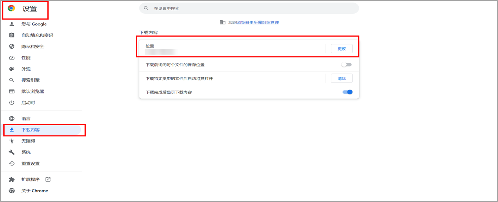

## 每个设计师账号最多可以管理多少个作品？

<strong>解决方式：</strong>在“我的作品” 中，每个设计师账号最多允许管理100个作品，当超出限制后，设计师可以将作品导出后保存在本地，删除该作品，以便有新的空间进行表盘创作。

## 断网后，是否可以继续编辑表盘作品，是否可以保存表盘内容？

<strong>解决方式：</strong>断网情况下可以继续编辑表盘作品，也可以保存表盘作品，表盘作品仅保存在本地设备中（浏览器），在恢复联网前，请勿清理浏览器缓存。新建作品、导入作品、复制作品需联网才能操作。

## 表盘预览图截图功能在哪里？

<strong>解决方式：</strong> 导出表盘时，系统会自动生成表盘预览图。

## 为什么表盘制作时，时间显示不是【10:08】，设置【10:08】时间按钮在哪里？

<strong>解决方式：</strong>预览表盘时，工具获取的是设备本地时间。制作表盘时，如果需要显示【10:08】时间，可通过动态预览区进行设置。

## 工具的动态预览在哪里？

<strong>解决方式：</strong>工具的动态预览功能在编辑页面（如下图）。动态展示与编辑区结合，点击播放按钮，即可实时查看与时间相关的数据变化，【更多设置】中可调整其他数据。

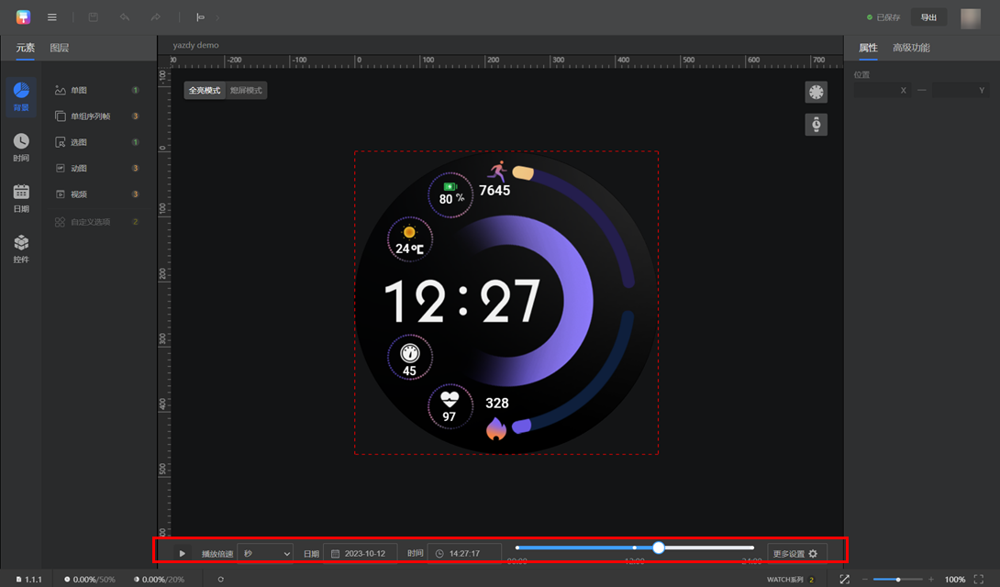

## 控件实现应用跳转功能时，占位图如何删除？

<strong>解决方式：</strong>将光标移动到属性栏占位图的位置，点击  即可删除占位图。

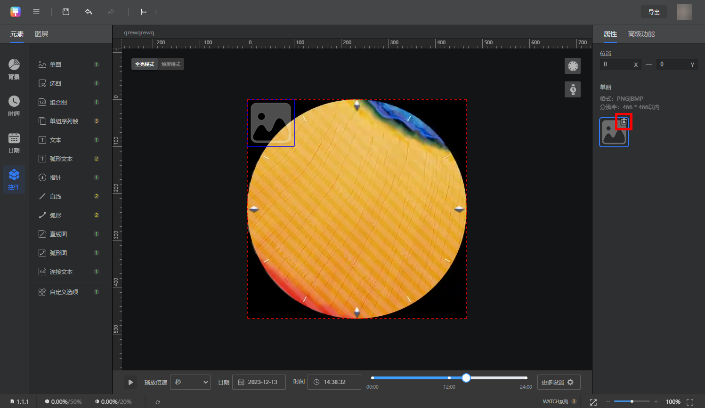

## 占位图资源是否会被导出？

<strong>解决方式：</strong>占位图仅作为示意图，实际导出表盘时不会生效。占位图需设计师制作好相应素材并替换。

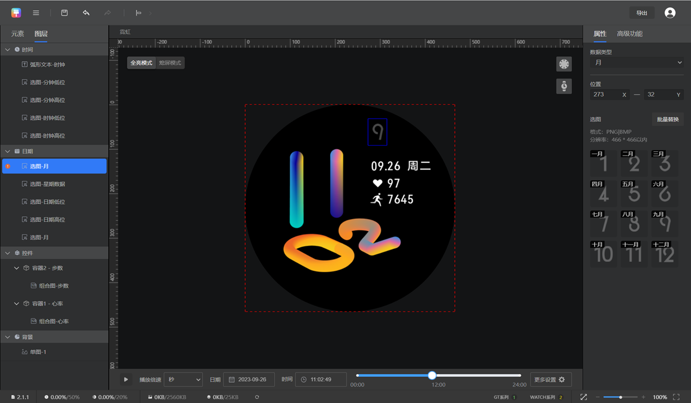

## 为什么我上传资源时，总出现以下提示？

<strong>解决方式：</strong>1、检查所上传的资源图片大小是否一致；2、上传素材时，需一次性替换所有占位图。例如：分钟高位的选图为【0】-【9】的数字，需批量替换【0】-【9】的10张资源大小统一的图片。

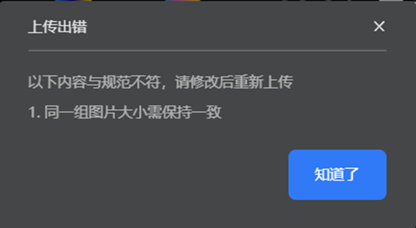

## 如何将全亮模式下的图层复制到熄屏模式下？

<strong>解决方式：</strong>进入全亮模式，选择图层栏。鼠标悬浮至每个图层，若图层出现‘’月亮‘’按钮，则该图层满足复制条件。

方法一：点击‘’月亮‘’按钮，即可将该图层复制到熄屏模式。

方法二：选中图层，鼠标右键选择“复制至熄屏模式”。

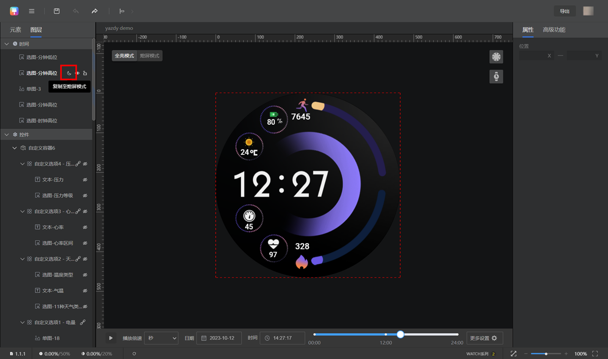

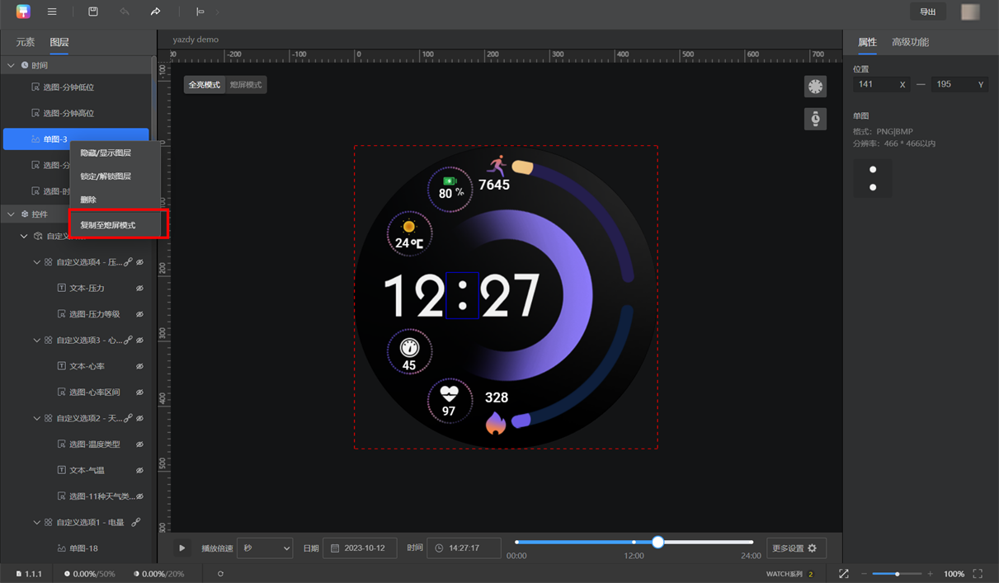

## 如何快速将全亮模式下的多个图层复制到熄屏模式下？

<strong>解决方式：</strong>可通过快捷键【挑选图层】和【连续选中图层】多选图层，鼠标右键【复制至熄屏模式】将全量模式图层到熄屏模式。

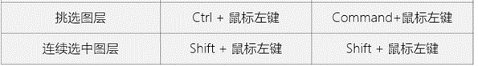

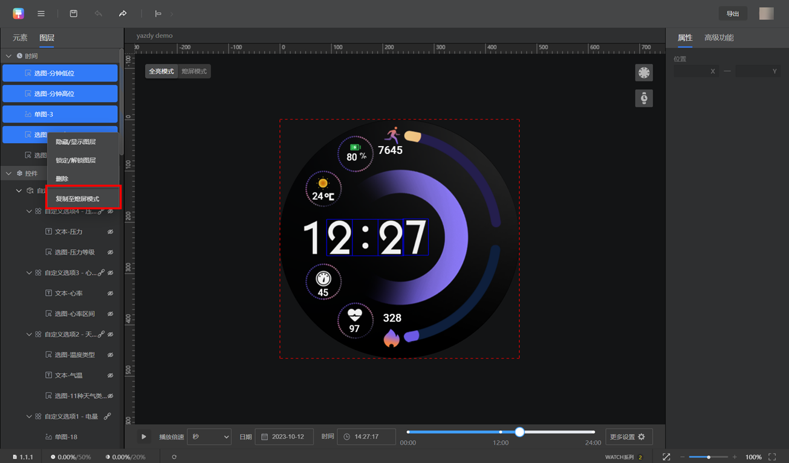

## 景深效果、样式自定义，颜色自定义在哪里？

<strong>解决方式：</strong>景深效果、样式自定义，颜色自定义在高级功能栏，其中，景深功能仅Watch系列设备支持。

## 样式自定义、颜色自定义功能，如何设置默认展示？

<strong>解决方式：</strong>进入高级功能栏，选择样式自定义的数字框或颜色自定义的颜色框，点击鼠标右键，选择【设置为默认】或【设置为默认】。

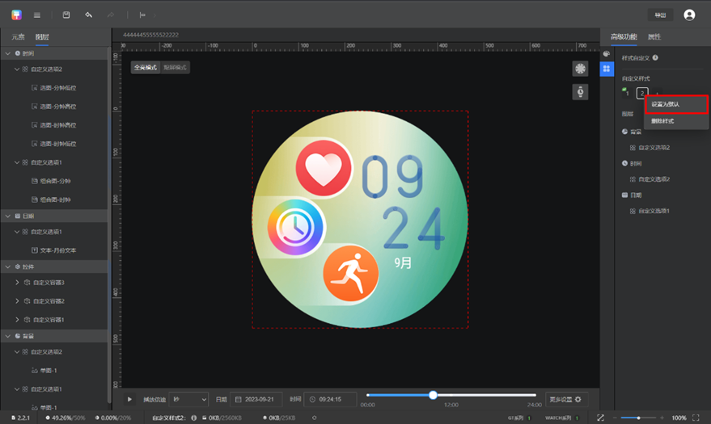

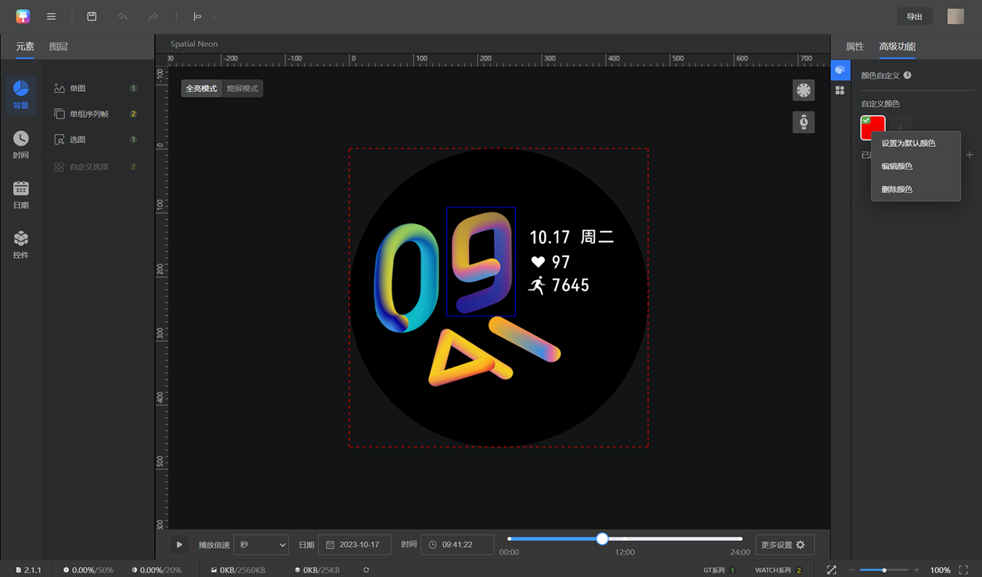

## 当使用Chrome浏览器无痕模式时，出现无法登录或反复登录情况？

<strong>解决方式：</strong>进入浏览器的设置页，搜索“隐私和安全”，选择“第三方Cookie”，设置为允许第三方Cookie。

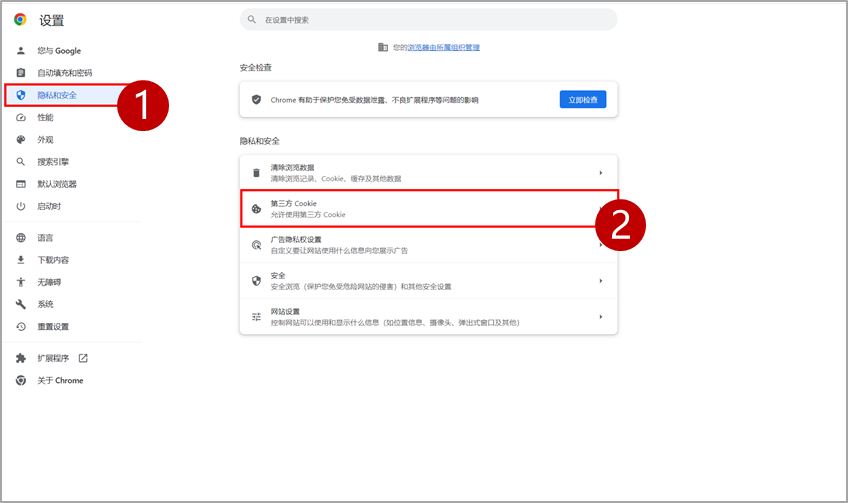

## 为什么打开自适应功能图层属性位置无法输入？

<strong>解决方式</strong>：当打开自适应功能时，容器框会随控件框移动而移动，控件框原点与容器框原点（如图A点和B点）重合，所以才会导致控件的位置X,Y会始终显示（0,0）。如想输入数值，可在容器图层关闭自适应功能。

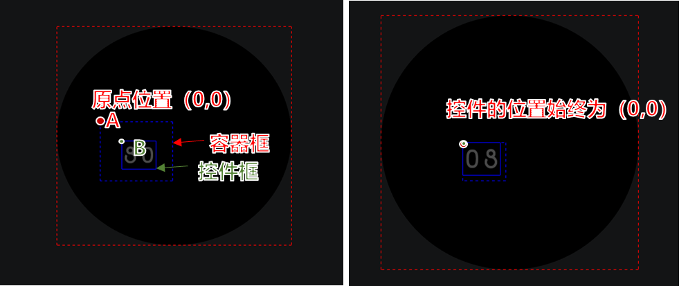