# 1.0.19版本功能介绍（2021-4-15）

## 1. 版本更新特性

* [团队账号](#section41701641193120)
* [报表优化](#section168012551127)
* [动态壁纸上传优化](#section136111226105117)
* [音乐素材库](#section18442142511565)
* [自定义标题栏](#section197861750005)
* [三方分成添加合作人](#section9498972027)
* [查看作品的付费免费比例](#ZH-CN_TOPIC_0000001104887590__section1070911493714)
* [作品申请隐藏](#ZH-CN_TOPIC_0000001104887590__section36491731111420)

## 2. 团队账号

### 2.1 概述

主题联盟团队账号能力支持企业、团队多个账号登录管理，并对所有成员账号进行角色权限管理，帮助企业共同协作完成开发、分发、商户服务、运营分析等工作，提升主题联盟设计师使用体验。

### 2.2 角色权限

团队共有5个角色，账号持有者分配不同的角色给成员账号，且一个成员账号可同时被赋予多个角色。

<strong>5</strong> <strong>个角色分别有以下的权限管理:</strong>

|  |
| --- |
| 信息管理员：   * 可查看团队账号持有者的设计师中英文名称、头像、背景图等个人信息； * 可查看已保存的原创声明文件和三方分成合作人信息； * 可查看自己在团队的资格申请记录，隐私与协议的内容； * 可对消息通知设置。 |
| 报表管理员:   * 可查看所有作品类型的收入数据，以及下载相关数据文件。 |
| 作品管理员：   * 负责作品上传、升级、下架，撤回等管理，且可对作品管理列表的标题栏进行自定义筛选标签； * 负责原创声明文件的添加，删除等管理；负责作品的三方合作人信息的添加，查看，删除等管理； * 当被赋予作品管理员时，请同时赋予信息管理员，以便团队成员的申请。 |
| 活动管理员：   * 负责活动的参与、编辑、删除等操作；可对发布的活动，参与过的活动信息查看； * 同时赋予作品管理员权限； * 当被赋予活动管理员时，请同时赋予信息管理员，以便团队成员的申请。 |
| 评论管理员:   * 负责作品的评论回复，删除，置顶等操作。 |

### 2.3 共同的权限

只要加入了团队，不管是被分配哪个角色，都拥有共同的权限：

|  |
| --- |
| * 允许查看教程文档，论坛，入驻指南，主题商城，公告，资源的付费免费比例。 * 允许申请团队成员的资格申请，并可查看自己的申请记录。 |

### 2.4 如何添加团队成员

1. 账号持有者或其他有权限的成员账号登录联盟管理中心，通过左侧菜单栏“设置-团队账号”进入团队账号页面，点击“添加成员账号”。

   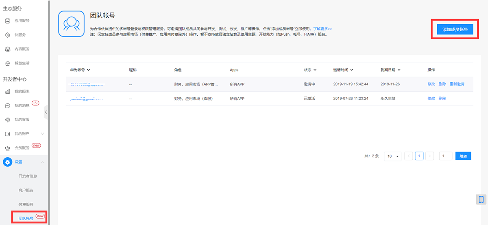
2. 按照页面提示选择账号类型，填写成员的账号及邮箱地址，设置成员账号有效期，点击“下一步”即可。

   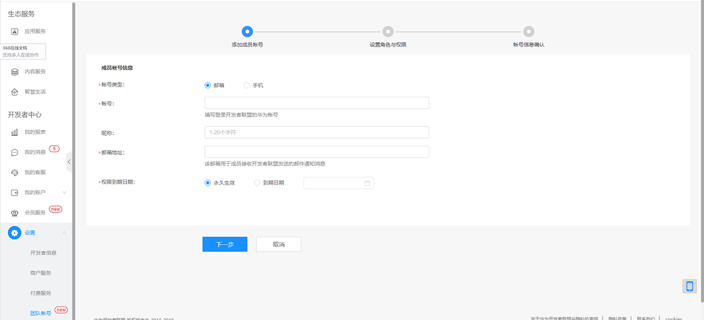

3. 选择被邀请成员在本团队内的角色，角色下方则包含其角色在该业务内的相应权限。

   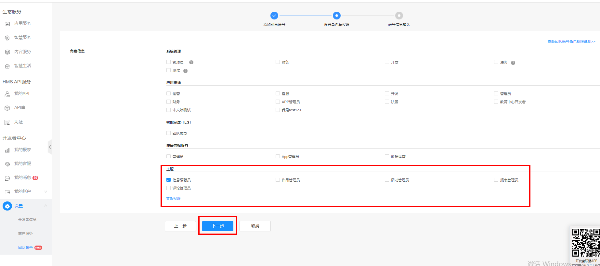

4. 账号信息确认：确认成员账号设置无误后，点击“确认提交”，显示“添加成功”。

   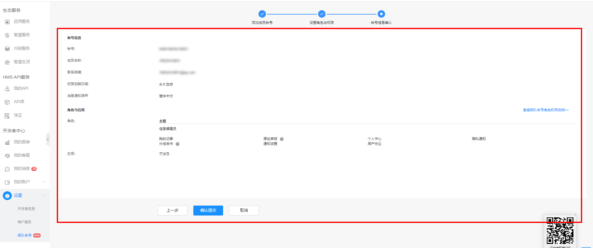

   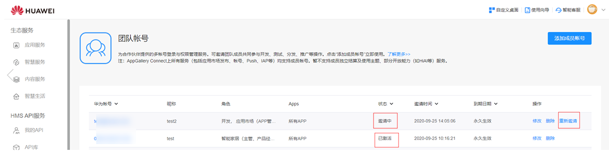

   更多操作可参考：&lt;https://developer.huawei.com/consumer/cn/doc/start/mta-0000001059655998&gt;

### 2.5 如何成为团队成员

1. 账号持有者添加成功后，成员会收到一封含有激活链接的邀请邮件。如下图所示，被邀请的团队账号成员可以点击链接，接受邀请：

   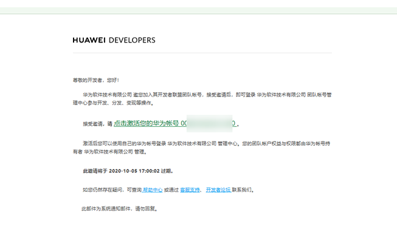

2. 团队账号成员在邮件内接受邀请后，首先需阅读并同意《华为开发者联盟团队账号与隐私的声明》，并接受邀请：

   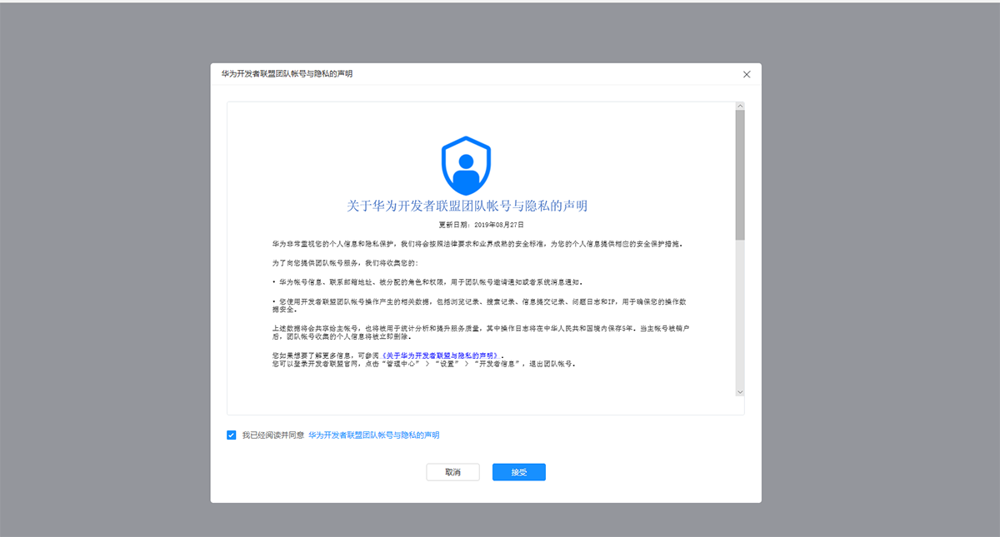

3. 加入团队后，登录状态下点击“管理中心”即可进入团队账号管理中心，被成功邀请并加入团队的成员账号即可在管理中心看到被授予的角色下的相关能力/权限。

   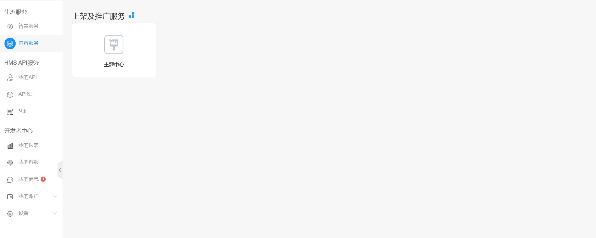

4. 进入团队账号后，可在“设置”下的“开发者信息”处查看自己的团队成员信息。如果是作品管理员或者活动管理员时，需要在“个人中心”的“资格申请”处申请团队成员的角色，华为运营审核通过后，即可有上传作品的权限。更多操作可参考：&lt;https://developer.huawei.com/consumer/cn/doc/start/maug-0000001058696103&gt;

   

   * 成员账号需要完成开发者实名认证（个人或企业），才可以使用主题的团队账号能力。
   * 资格认证成功的作品管理员或活动管理员才可以上传作品。
   * 同一个开发者只允许在一个团队中通过主题资格认证，进行作品操作；但对开发者以个人名义申请主题设计师认证和作品操作没有影响。
   * 主题业务暂不支持海外团队账号能力。

## 3. 报表优化

### 3.1 概述

为了增强设计师对收入报表的使用感，主题联盟对收入报表丰富了功能，为设计师搜索作品提供了便利性，分析销售情况更直观。

### 3.2 功能简介

1. 可自定义时间筛选，跨天、周、月进行查询。
2. 可对作品的销售额、购买次数、点击次数进行升降排序。
3. 可模糊搜索作品，无需输入作品全名称，即可搜索到作品。

### 3.3 如何自定义筛选时间

1. 进入收入报表，选择天维度。

   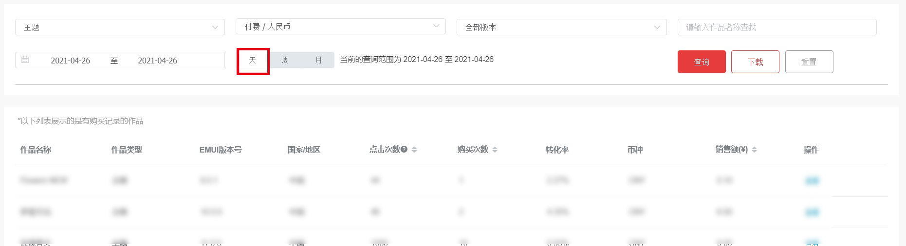
2. 点击时间框，弹出下拉框，先选择起始时间，再选择末尾时间。

   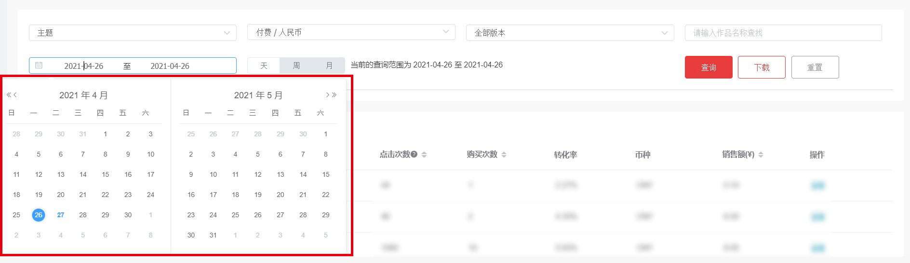

   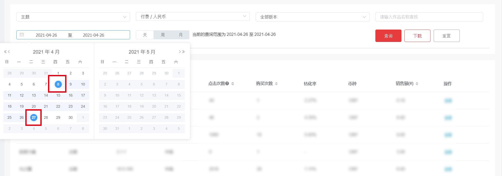
3. 最后点击查看，即可搜索到这段时间内的作品收入情况。

   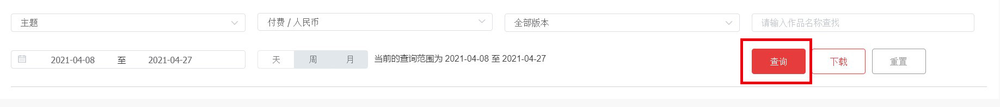
4. 当选择周维度时，与“天”维度操作一致。

   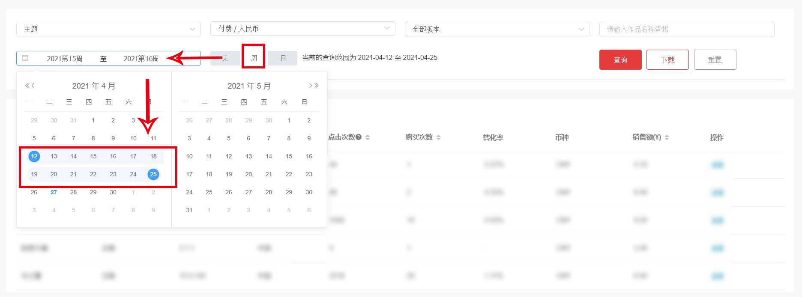
5. 当选择月维度时，与“天”维度操作一致。

   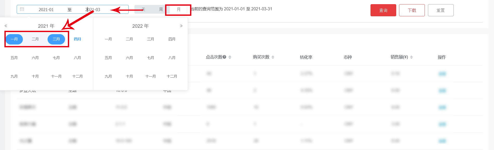

### 3.4 如何对作品的销售额、购买次数、点击次数排序

1. 对作品销售额排序时，只需要点击“销售额”旁边的向上三角形，即可对作品销售额升序排列。

   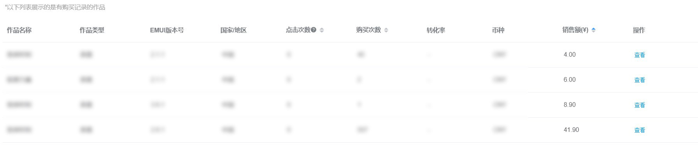

2. 点击“销售额”旁边的向下三角形，即可对作品销售额降序排列。

   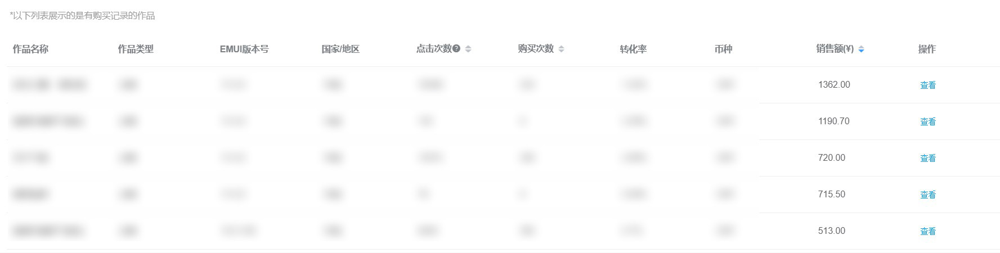

3. 购买次数与点击次数的升降序操作与销售额升降序操作一致。

## 4. 动态壁纸上传优化

### 4.1 概述

为了解决设计师对动态壁纸上传步骤的困惑，主题联盟提供了指引与简化了上传步骤。

### 4.2 优化点

1. 页面嵌入了动态壁纸制作规范文档和动态壁纸上传文档链接，指引设计师应该如何制作与操作。
2. 提供了优秀案例，为设计师填写壁纸的描述作为参考。
3. 动态壁纸的基本信息全部平铺展开，填写的信息清晰明了。
4. 视频文件上传次数由4次减少到2次。
5. 无需再上传预览图。
6. 视频铃声上传入口归回到动态壁纸，即上传带有声音的视频为视频铃声。

   

   无论上传有声的视频还是无声的视频，全部归类为动态壁纸类型。即视频铃声的数据均为历史数据，无新增数据。

### 4.3 上传及升级动态壁纸&视频铃声

请参考[动态壁纸&视频铃声上传指南](https://developer.huawei.com/consumer/cn/doc/content/livewallpaper-upload-0000001055068451#section12967112911314)。

## 5. 音乐素材库

### 5.1 概述

为了缓解设计师在制作视频铃声的背景音乐的版权忧虑，主题联盟为大家提供了一个音乐素材库，里边的每一首音乐都有版权，且有丰富类型的音源，为设计师带来了多种多样的选择。

### 5.2 功能简介

1. 提供了23种不同曲风类型2000首歌。
2. 可进行曲风类型筛选；通过歌曲名或者歌手名搜索歌曲。
3. 可对歌曲进行试听和下载，试听和下载的歌曲是低品质版本。
4. 可一键复制歌曲ID。

### 5.3 如何与音乐素材库的音乐合作

1. 登入主题联盟后，点击素材库&gt;音乐素材。

   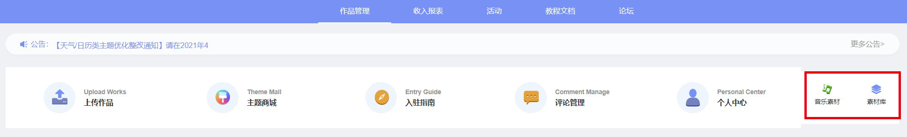

2. 进入音乐专区，根据类型筛选出你想要的歌曲，进行试听。

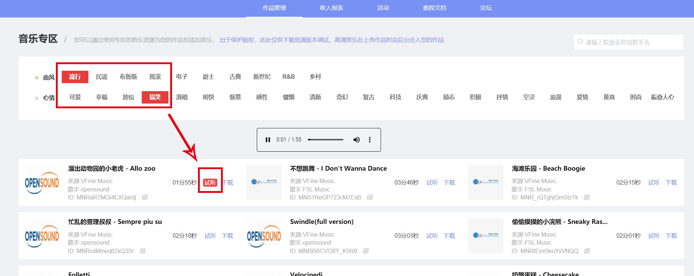

3. 当找到合适的歌曲进行下载后，可把自己的视频和歌曲在视频编辑器中结合，进行预览。
4. 选取最合适的一段音乐，且预览效果合适的话，把起始时间记下来，可精确到毫秒。

   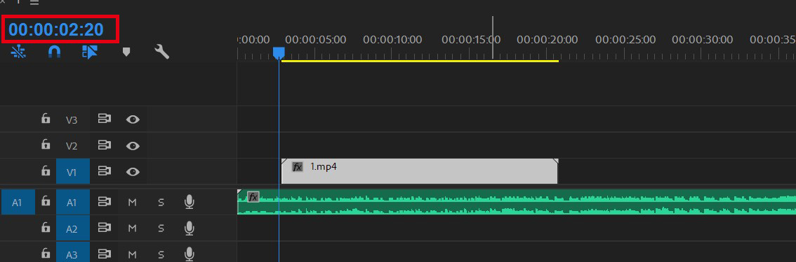
5. 回到音乐素材库的页面，对刚刚的歌曲的ID进行一键复制。

   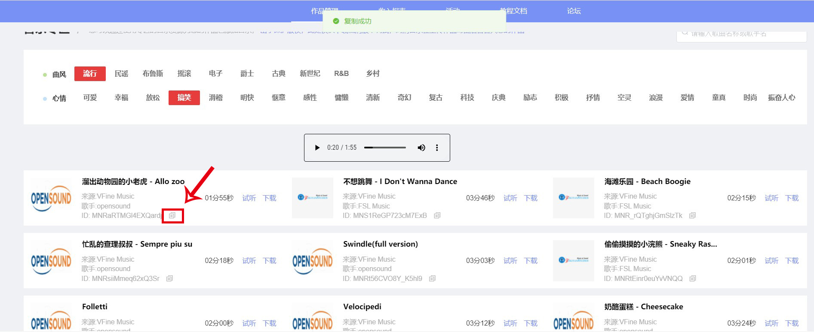
6. 上传动态壁纸（参考动态壁纸上传步骤），填写完所有的信息后，到付费设置的步骤时，勾选付费&gt;与第三方合作&gt;音乐三方分成。

   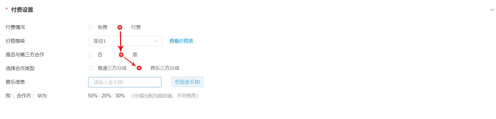
7. 在ID输入框粘贴ID后，点击校验ID，把起始时间填写上，可精确到毫秒。

   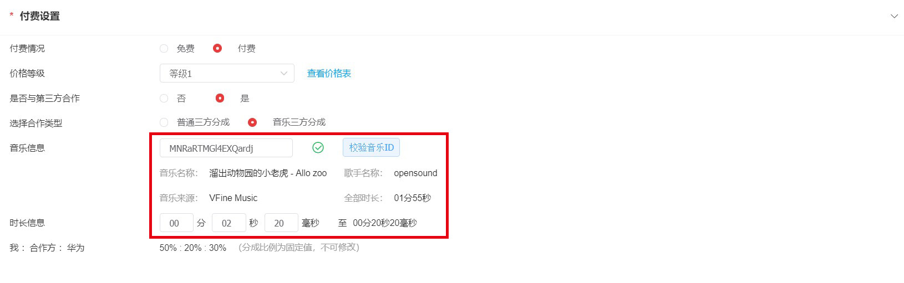
8. 填写完成后，接着进行其他的操作，提交审核即可。

## 6. 自定义标题栏

### 6.1 概述

“我的作品列表”展示的是设计师作品的状态，昵称，类型等信息，但不是每项信息都是设计师想要了解的，为此，自定义标题栏功能提高了设计师调整标题栏信息的灵活性，实时展示想要了解的信息。

### 6.2 功能简介

1. 可调整的信息标签共有10个：

   作品ID、价格等级、分成类型、合作状态、版本、我的分成比例、状态、区域、版权到期时间、更新时间。
2. 可实时勾选标签并展示作品对应的信息。
3. 点击保存，即可展示当前已勾选的标签项。后续默认展示保存的标签项，直到下次重新进行编辑。

### 6.3 如何自定义标题栏

1. 将鼠标移动到列表的右顶边的“自定义标题栏”，弹出下拉框。

   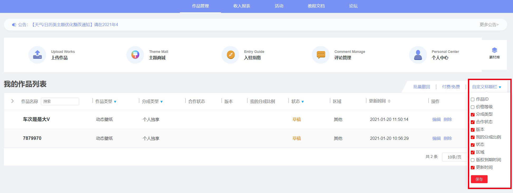
2. 勾选自己想要的信息标签。

   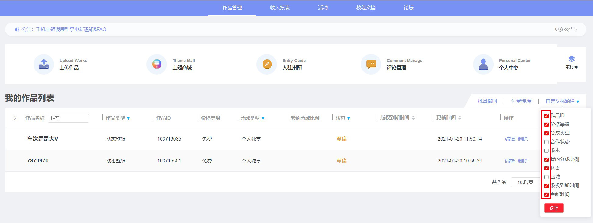
3. 勾选完毕后，点击保存即可。

   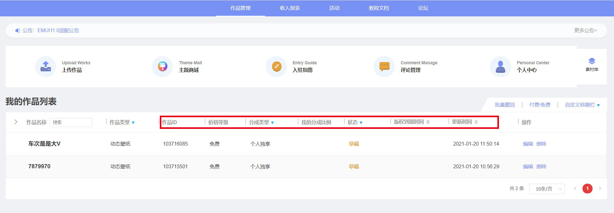

## 7. 三方分成添加合作人

### 7.1 概述

设计师在上传有三方合作的作品时候，需要每次填写合作方ID和昵称。为此，添加合作人的功能会减少设计师上传的填写合作方信息的步骤，并且可以保存合作方的信息，以免丢失信息。

### 7.2 功能简介

* 可添加、删除两种合作人信息：“普通三方分成合作人”和“字体三方分成合作人”
* 可搜索保存过的合作人的信息
* 可查看该合作人参与分成的作品

### 7.3 如何添加合作人

<strong>添加合作人有两个入口：</strong>

* 在个人中心处添加
* 在上传作品处添加

### 7.4 在个人中心处如何添加合作人

1. 进入“个人中心”&gt;“分成合作”的页面，点击“添加”。

   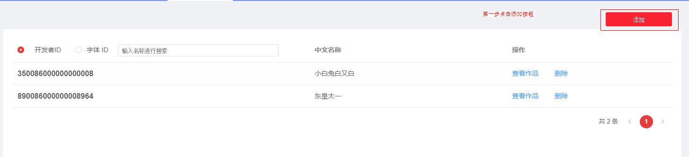
2. 选择合作人类型“普通三方分成”或者“字体三方分成”后，填入相应的信息：

   普通三方分成——合作方的ID和名称

   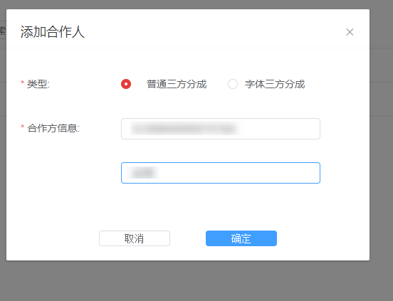

   字体三方分成——字体ID

   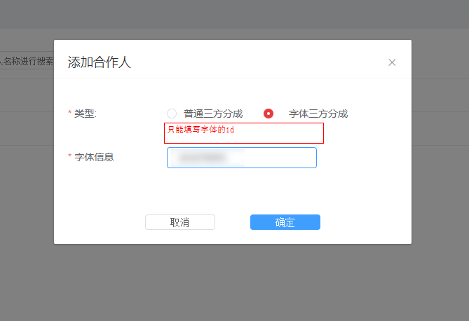
3. 点击确定，添加成功。

### 7.4 在上传作品处如何添加合作人

1. 在上传作品的时候，到了“付费设置”时，选择其中一个合作类型，并填写相应的信息：

   普通三方分成——开发者ID和名称

   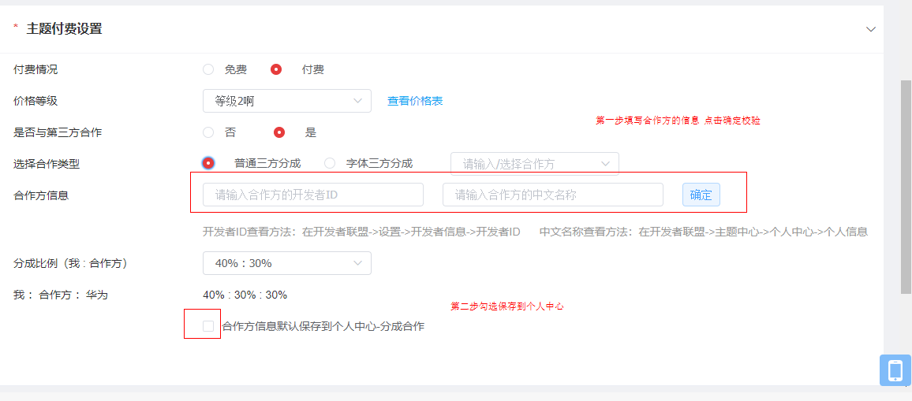

   字体三方分成——字体ID

   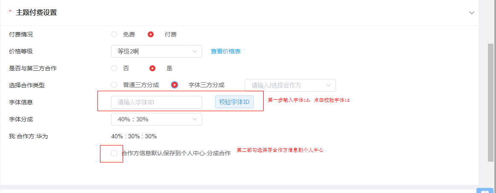
2. 填写信息完毕后，下方勾选“合作方信息默认保存到个人中心—分成合作”后，即刻保存成功。

### 7.5 上传作品时如何减少填写合作人信息步骤

1. 在设置“付费设置”时，选择其中一个合作类型。

   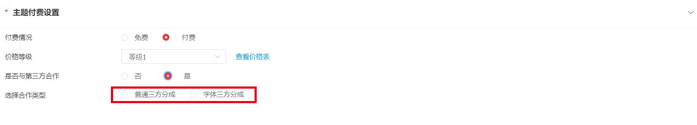
2. 点击“请输入/选择合作方”处，可输入合作方名称，回车即可筛选出对应的合作方；亦可点击箭头，弹出下拉，选择合作方，即可筛选出。

   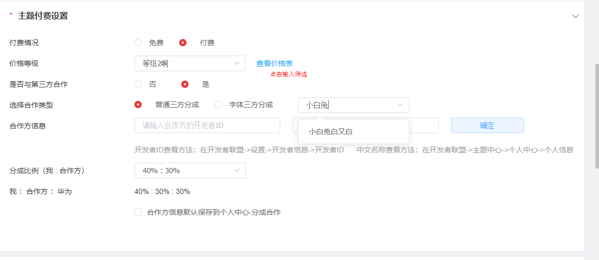

   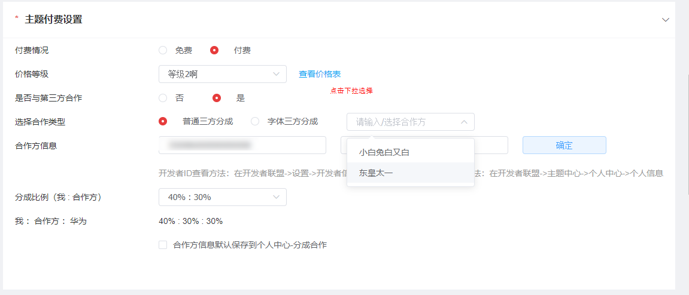

## 8. 查看作品的付费免费比例

### 8.1 概述

主题业务会对大部分的作品的付费与免费作品进行数量比例规范，以便维持作品生态平台。该功能可让设计师可随时看到自己的作品付费免费比例是多少，方便调整自己的数量。

### 8.2 功能简介

* 可展示6大作品类型：主题、AOD、表盘、静态字体、静态壁纸、动态壁纸；
* 可实时计算作品付费免费比例；
* 可明显告知设计师的作品比例是否符合标准。绿色代表符合，红色代表不符合。

### 8.3 如何查看作品付费免费比例

1. 进入主题联盟&gt;作品管理页面，点击作品列表右上角的“付费/免费”，弹出弹框：

   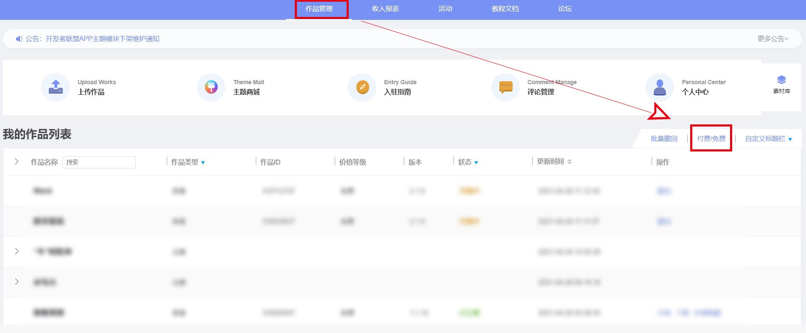
2. 弹框里展示的是设计师上传过的作品数量统计，并计算出比例。

   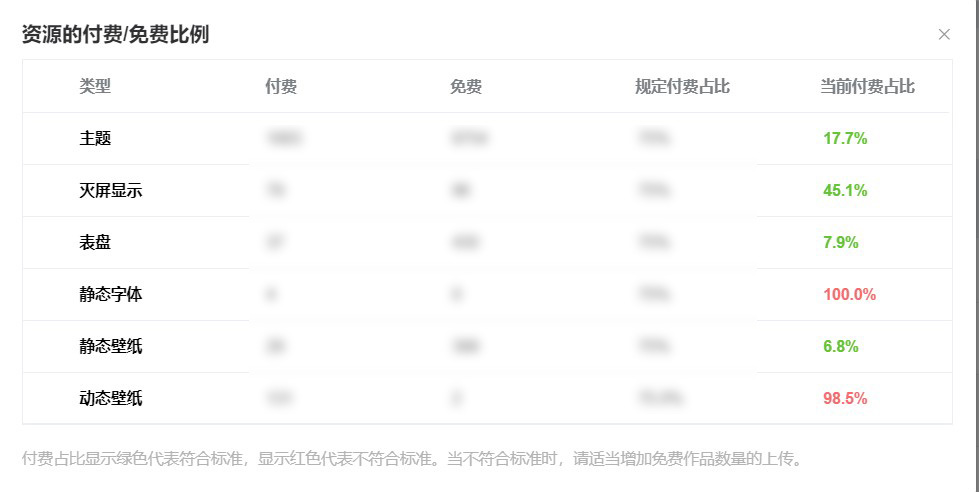

## 9. 作品申请隐藏

### 9.1 概述

作品版权到期、页面升级等原因下架作品，造成用户已购买或者下载后的资源被删除，无法重新应用。为此，主题联盟将“申请下架”操作转换成“申请隐藏”，可为用户保留下已购买或者下载后的资源记录。

### 9.2 功能简介

* 保留用户购买和下载作品的记录。

### 9.3 如何申请隐藏作品

1. 进入主题联盟&gt;作品管理&gt;我的作品列表。

   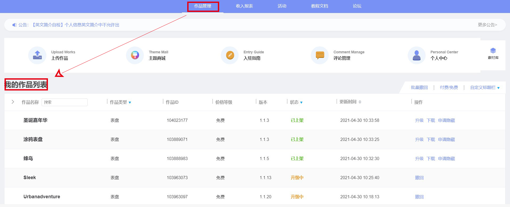
2. 状态选择“已上架”，列表展示状态已上架的作品。

   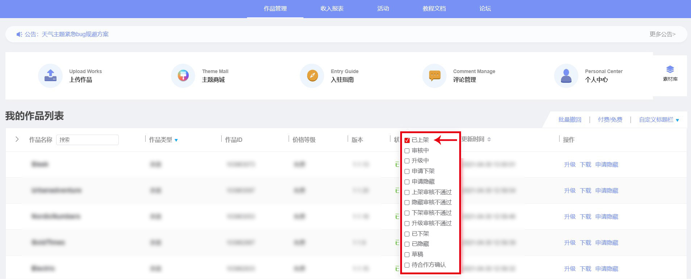
3. 在操作处，对要隐藏的作品点击“申请隐藏”，填写申请理由之后，提交即可。

   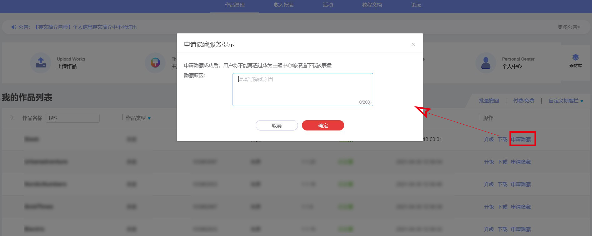