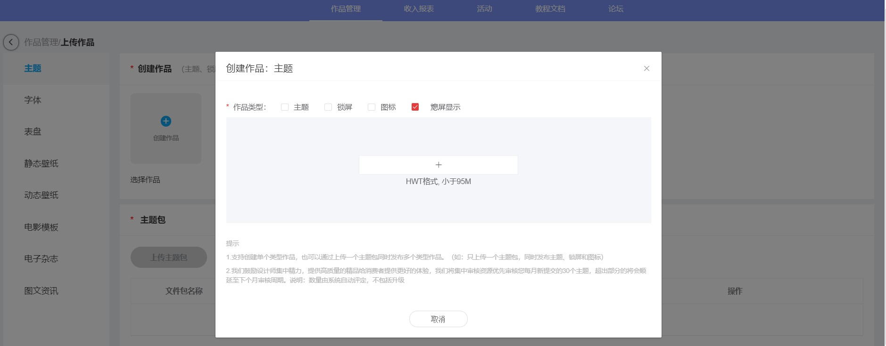
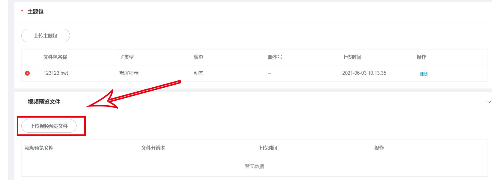
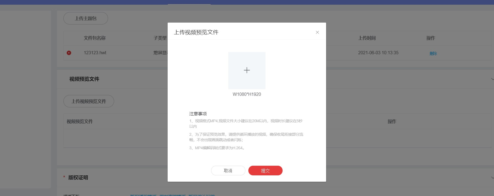

# 1.0.20版本功能介绍（2021-5-29）

## 1. 版本特性

[AOD预览视频](#section3158181962916)

## 2. AOD预览视频

### 2.1 概述

为了更好地展示动态AOD的详情，引导用户购买下载，主题联盟提供上传动态AOD预览视频通道。上传后可以在主题App上展示视频，用户可预览效果。

### 2.2 预览视频规范

* 视频分辨率1080\*1920px。
* MP4格式，编解码制式为H.264。
* 大小在20M以内，时长建议5s以内。

### 2.3 如何上传AOD预览视频

1. 创建AOD作品。

   

2. 点击上传预览视频。

   

   
3. 填写完其他信息后提交作品。
4. 审核通过后该作品可在主题App上展示您添加的预览视频。

   