# 1.0.20补丁版本功能介绍（2021-6-18）

## 1. 版本更新特性

* [取消折叠屏多版本绑定上传](#section16602164912259)
* [校验日历/天气主题的脚本](#section1049815104614)
* [主题联盟嵌入规范文档](#section666916158419)
* [付费免费比例提示](#section8267185113349)

## 2. 取消折叠屏多版本绑定上传

### 2.1 概述

折叠屏与手机主题一致，在上传10版本时须同时上传11版本的主题。折叠屏主题业务当前已提供兼容方案，支持1个10.0.10X的主题版本适配EMUI10.1及以上系统版本。为了减少设计师的制作主题成本，主题联盟取消折叠屏类型的主题多版本绑定上传。

### 2.2 功能简介

* 取消折叠屏主题10（10.0.1XX）和11（11.0.0-99）版本的绑定上传；
* 支持上传同名称的折叠屏主题和手机主题。

### 2.3 操作流程

1. 创建新的折叠屏10版本的主题。

   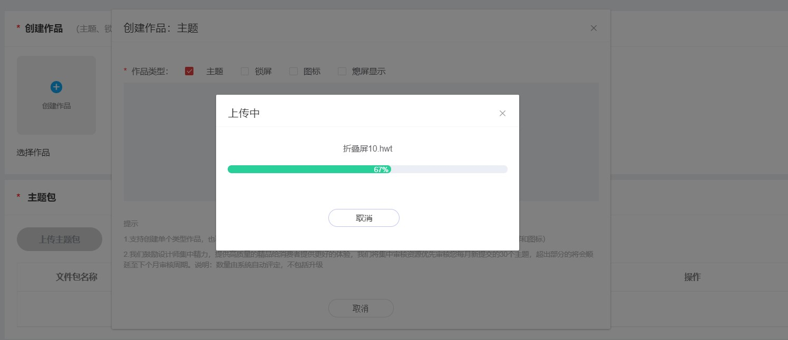

   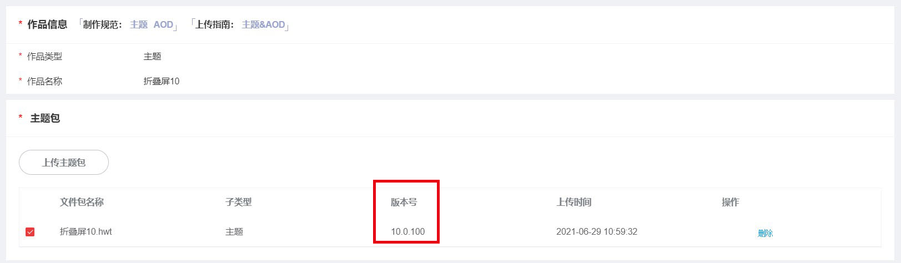
2. 按照流程填写内容。
3. 点击下一步，可直接到预览页面，无提示上传11版本的折叠屏主题。

   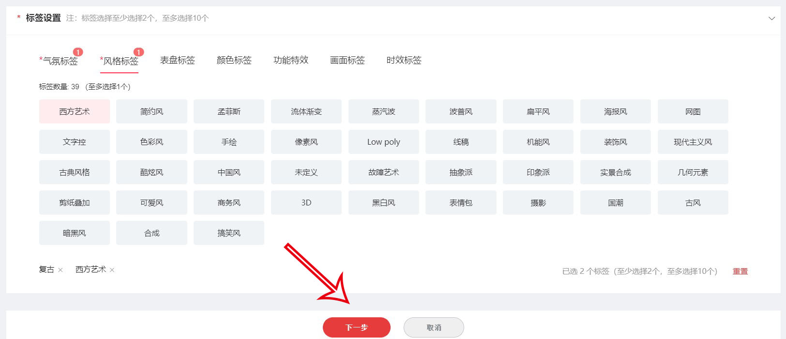

### 2.4 支持同名称的折叠屏和手机主题上传

1. 先上传提交名称为test的手机主题。

   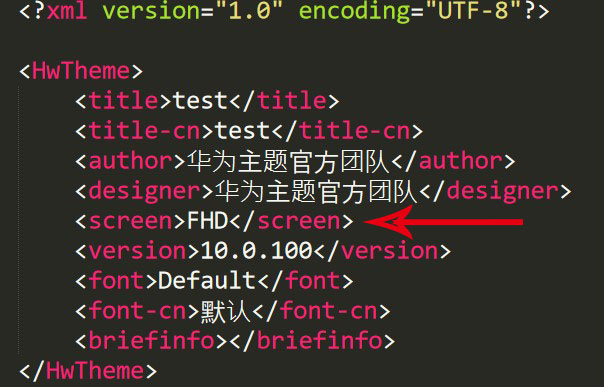

   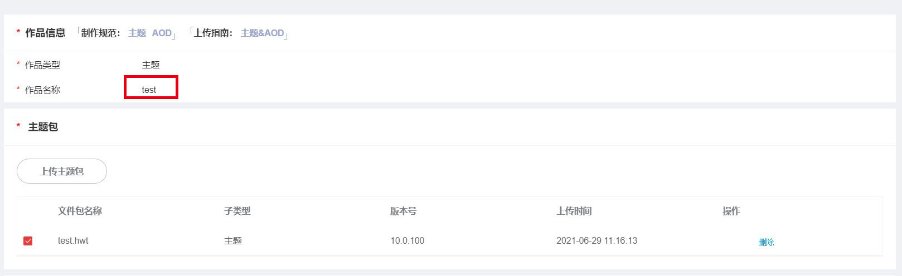
2. 再上传test名称的折叠屏主题，无提示重命名。

   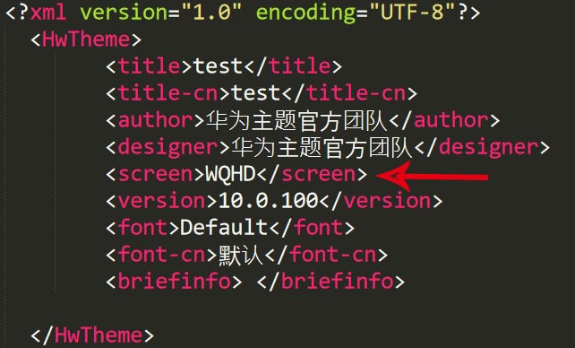

   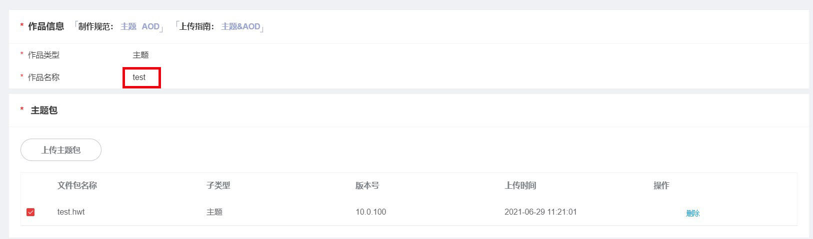
3. 按照上传步骤，填写内容，可正常上传。
4. 在作品列表可展示该两个作品。

   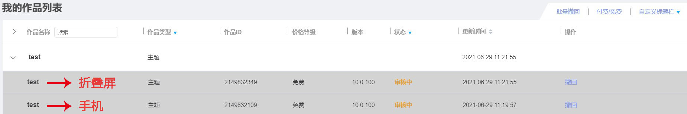

## 3. 校验日历/天气主题的脚本

### 3.1 概述

当前日历/天气主题类型较多，为了避免应用没有跳转到日历/天气APP，降低设计师的作品脚本风险性，于是在主题联盟加上了脚本校验，增强日历/天气的脚本编写的规范性。

### 3.2 脚本编写规范

参考引擎文档：

* [天气数据变量](/docs/distribute/content-dist/theme-center/development-tutorial-0000001054519376/themes-engine-0000001054452463/themes-engine4-0000002530591413/basic-function-0000001054908461/data-open1-0000001694307045/weather-0000001079515110#section5106916545)
* [日历数据变量](/docs/distribute/content-dist/theme-center/development-tutorial-0000001054519376/themes-engine-0000001054452463/themes-engine4-0000002530591413/basic-function-0000001054908461/data-open1-0000001694307045/calendar-0000001126131857#section840971213599)

### 3.3 校验提示

1. 创建一个主题，上传的时候会做校验。

比如上传一个不规范的天气主题：

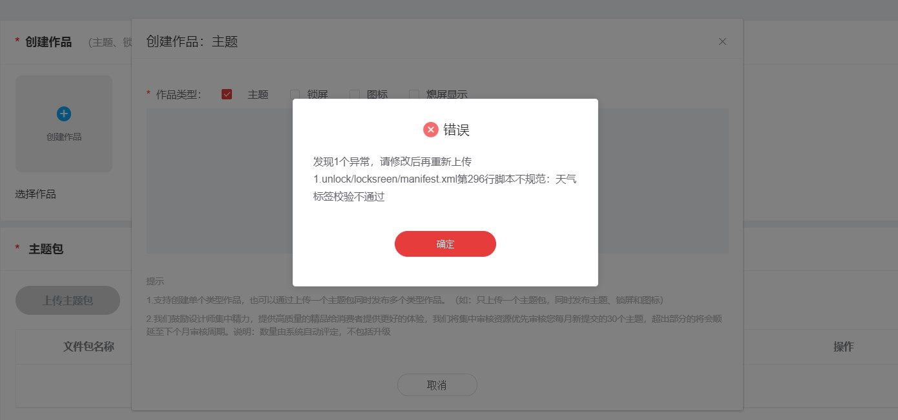

比如上传一个不符合规范的日历主题：

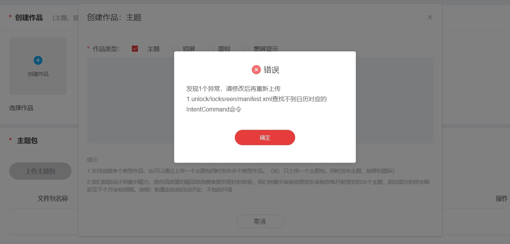

## 4. 主题联盟嵌入规范文档

### 4.1 概述

主题联盟上传界面已经嵌入了对应产品的制作规范及上传文档，设计师们查看文档将更加快速准确。

### 4.2 界面优化

提供了5种大类型的规范，如下：

主题&AOD

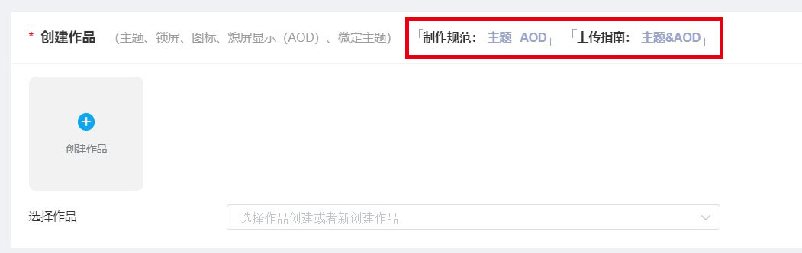

字体&贴纸&花字

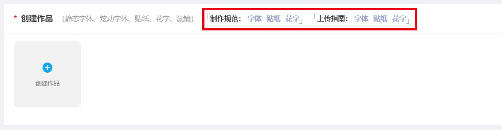

表盘

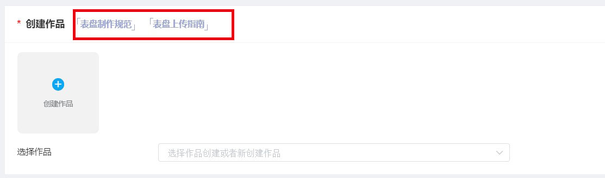

静态壁纸

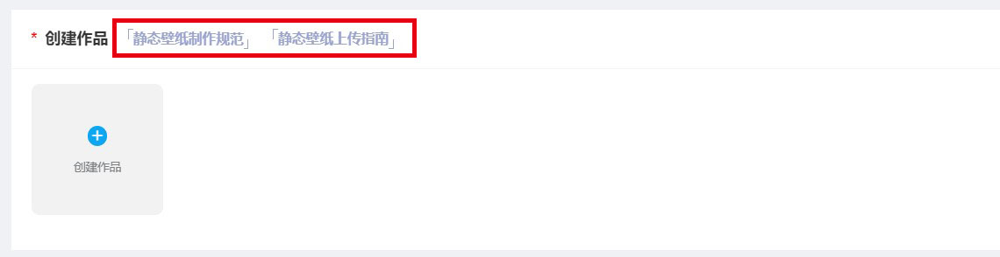

动态壁纸

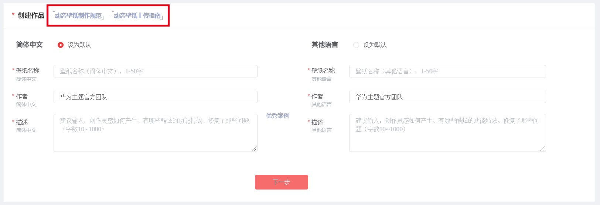

电影模板

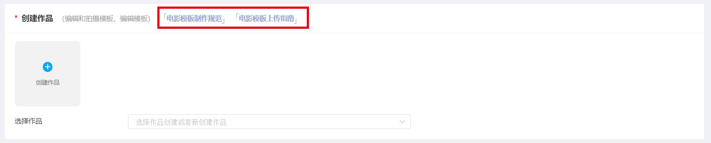

## 5. 付费免费比例提示

### 5.1 概述

主题联盟会作品的付与免费数量的比例，为了让设计师能够一起维护生态的平衡，主题联盟会根据您的作品比例是否符合规范比例，当不符合规范时，则会提醒您的该类型作品付费与免费数量比例不符合规范。

### 5.2 规范比例

| 资源类型 | 付费 | 免费 |
| --- | --- | --- |
| 主题 | 9 | 1 |
| 熄屏显示 | 8 | 1 |
| 表盘 | 8 | 1 |
| 静态壁纸 | 8 | 1 |
| 动态壁纸 | 8 | 1 |

### 5.3 如何提示

当您的主题作品付费与免费的比例不在规范范围内时，您创建一个主题作品，按照步骤填写信息。

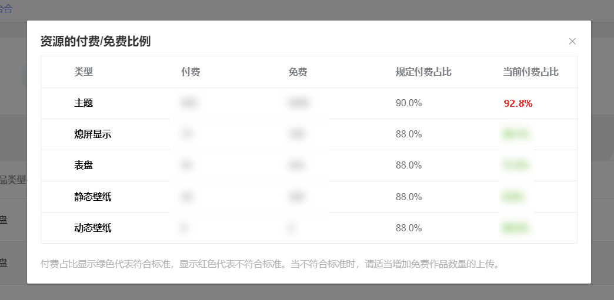

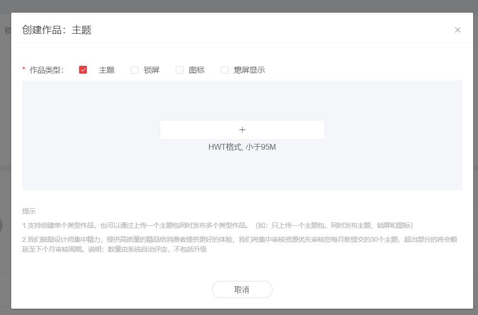

当您选择付费设置时，则会提示您建议上传免费作品。

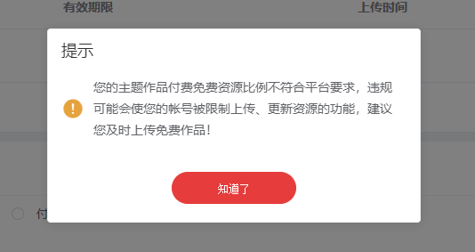