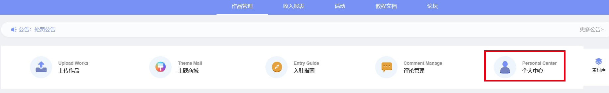
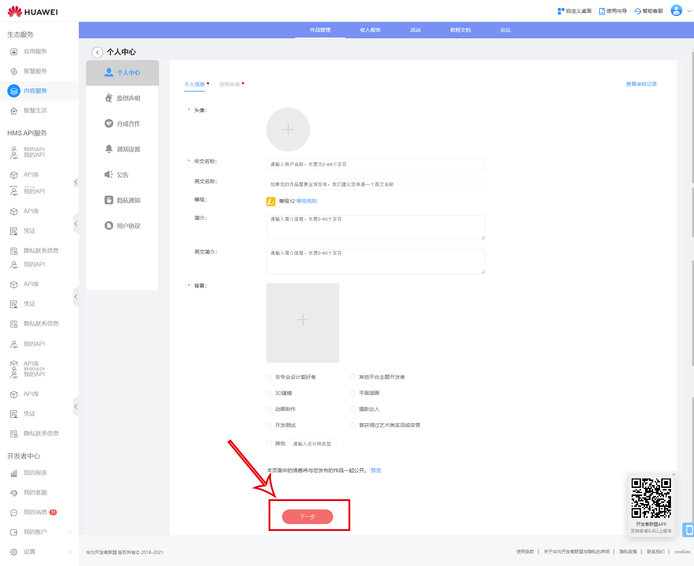
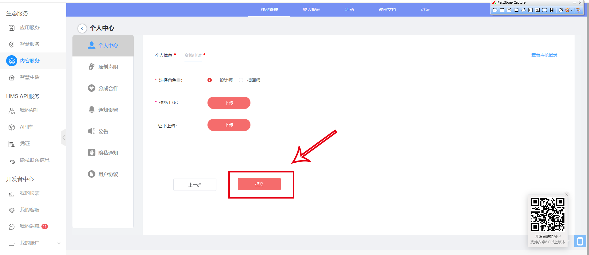
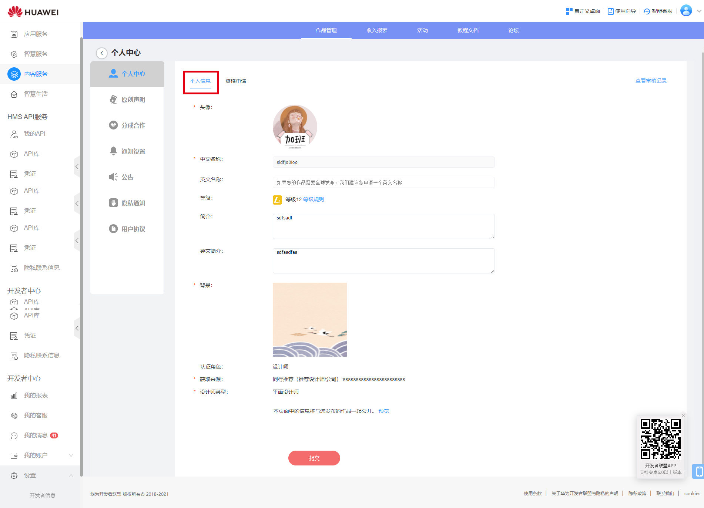
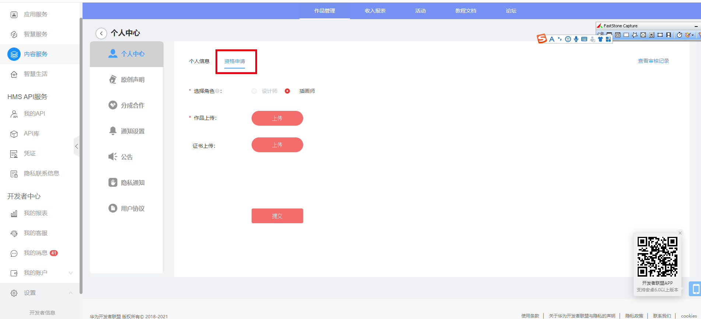
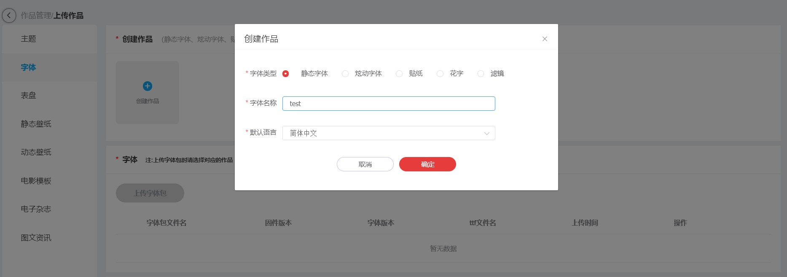
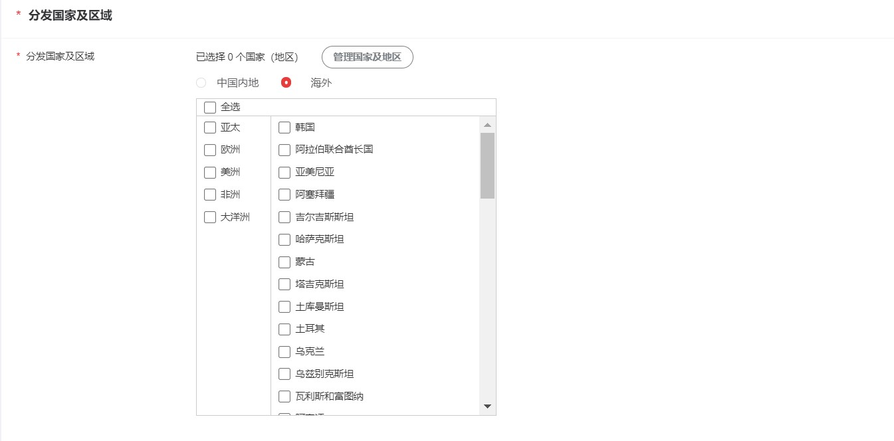
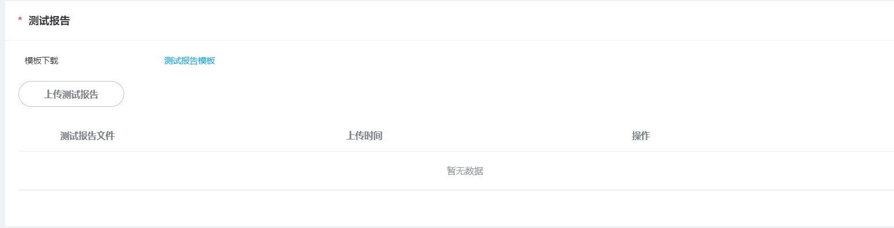

# 1.0.21版本功能介绍（2021-7-1）

## 1. 版本更新特性

* [优化设计师认证逻辑](#section332465419204)
* [支持上传字体测试报告](#section25771618676)
* [APK主题包校验](#section268219361013)
* [限定特定图标上传](#section2283132171512)

## 2. 优化设计师认证逻辑

### 2.1 概述

当设计师没有个人信息和资格的情况下，为了更快速地审核通过，且为审核人员提升审核效率，主题联盟对页面和逻辑进行了优化。

### 2.2 优化点

逻辑：

* 在没有个人信息和资格申请通过的情况下，个人信息和资格申请都必须同时认证；
* 当个人信息和资格申请都审核通过时，才可以修改个人信息或者资格；
* 如果之前已通过个人信息，需要再申请资格认证。

页面：

* 将“资格申请”与“我的记录”合入到“个人中心”页面里；
* 审核记录的操作仅提供“查看”操作。

### 2.3 设计师如何进行信息与资格认证

当您没有通过或者从未申请信息与资格的情况下：

1. 点击“个人中心”跳转到“个人中心”页面；

   
2. 首先填写个人信息，填写完毕后，点击“下一步”；

   
3. 进入到“资格申请”步骤，上传材料，点击“提交”即可。

   

### 2.4 如何修改个人信息或资格

* 当您已通过信息与资格的情况下，修改个人信息：

1. 点击“个人中心”跳转到“个人中心”页面，此时停留在“个人信息”页签，可直接更换头像，更改简介等修改操作；

   
2. 修改完信息后，点击“提交”即可。

* 当您已通过信息与资格的情况下，修改资格：

1. 点击“个人中心”跳转到“个人中心”页面，此时停留在“个人信息”页签，更换“资格申请”页签；

   
2. 更换角色，上传完材料后，点击“提交”即可。

## 3. 支持上传字体测试报告

### 3.1 概述

根据之前的上传发布海外静态字体时，需要通过邮件发送字体的测试报告给审核人员，审核人员收到邮件后需要整理测试报告后再去审核对应的字体，为了减少设计师们上传字体包的时间成本和等待的时间，以及提高审核人员的工作效率。主题联盟支持上传字体测试报告，当设计师们发布海外字体时，需要再上传一份测试报告，便于管理人员在后台审核。

### 3.2 优化点

* 当静态字体发布到海外时，设计师需要上传一份测试报告。（发布国内暂不支持上传测试报告）
* 提供测试模板。
* 以前已上架海外的静态字体包升级的话，无需上传测试报告。

### 3.3 如何上传测试报告

1. 新建上传静态字体包。

   
2. 当分发区域分发海外时，需要上传测试报告。

   

   
3. 上传完毕后，点击下一步进行提交即可。

## 4. APK主题包校验

### 4.1 概述

为了改善性能问题，主题包里面wallpaper目录下的apk包名必须要以"com.huawei.livingwallpaper" 或 "com.huawei.livewallpaper" 开头才允许上传。

### 4.2 校验类型

* 大小主题
* 锁屏包

## 5. 限定特定图标上传

### 5.1 概述

因规范变动，主题包里从EMUI 10.1版本，icons图标不允许上传“com.huawei.android.hwouc.png”和“huawei.com.android.manager.png”两个图标。

### 5.2 限制类型

* 大小主题
* 图标包