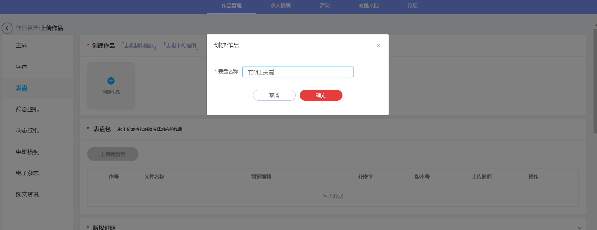
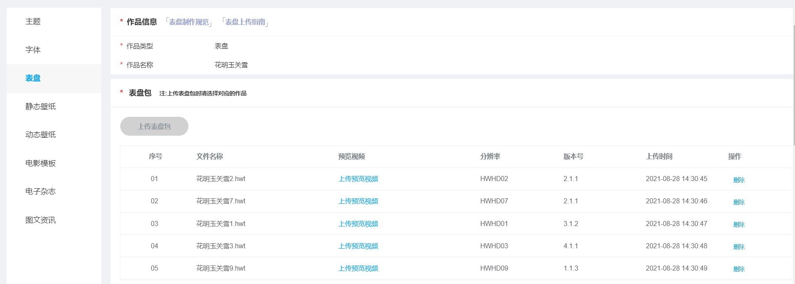
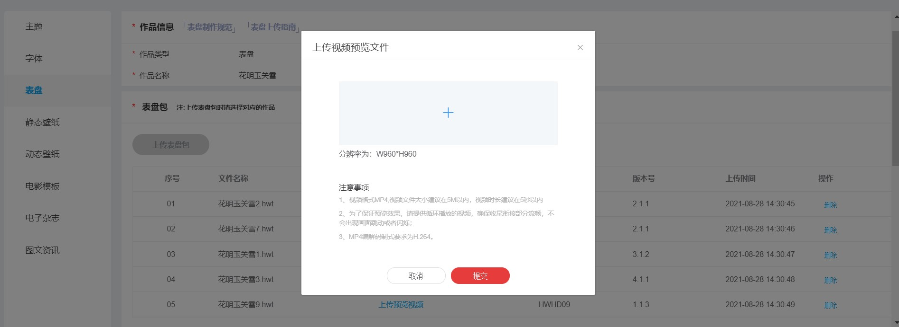
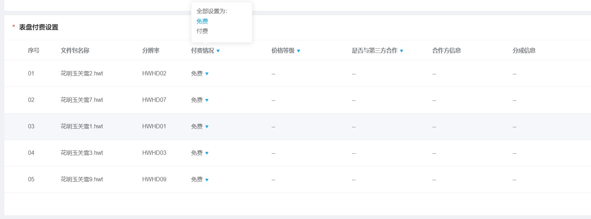
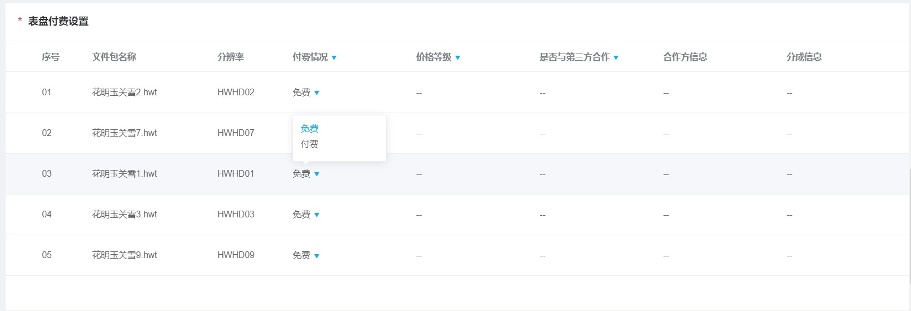
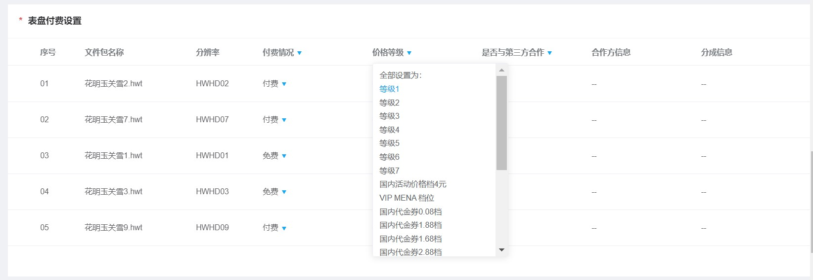
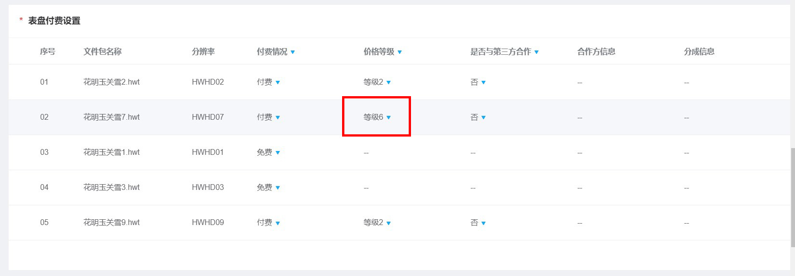
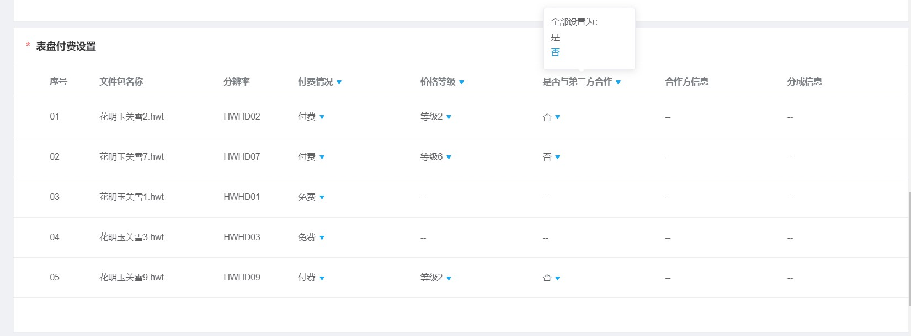
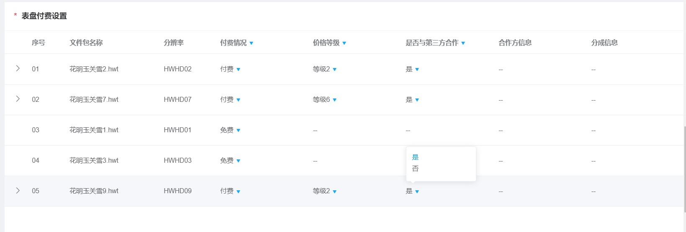
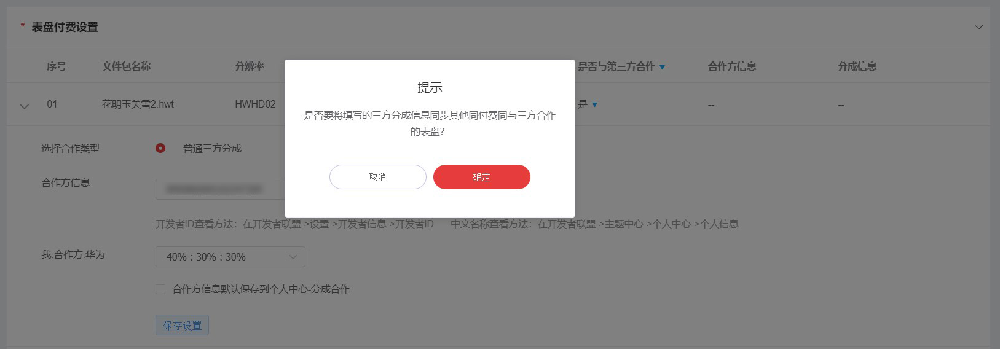

# 1.0.22版本功能介绍（2021-8-25）

## 1. 版本更新特性

* [支持表盘多分辨率同时上传](#section193761491498)

## 2. 支持表盘多分辨率同时上传

### 2.1 概述

存在不同分辨率但表盘主题设计内容几乎一致的表盘场景，主题联盟支持设计师可一次性上传，无需分批上传，减少上传时间成本。

### 2.2 上传规范

* 一次性最多能上传5个表盘；
* 可多个上传同中文名称不同分辨率的表盘；
* 当上传同名称、同分辨率和版本号前两位相同，第三位不同的话，只上传版本号最高的包。

### 2.3 操作流程

1. 登入主题联盟，点击上传作品，选择表盘业务；
2. 创建上传的名称；

   
3. 上传多个同中文名称的表盘之后，进行其他步骤的操作；

   

   <strong>需要注意的步骤：</strong>

* 分开上传预览视频；（不同分辨率的表盘对应不同分辨率的预览视频，可用表盘工具直接导出视频）

  
* 统一/分开设置付费；

  可统一设置付费情况：

可对其中分开设置付费情况：

可统一设置价格等级：

可分开设置价格等级：

可统一设置是否要三方分成合作：

可分开设置是否三方分成合作：

如是与三方合作的话，需要统一/分开填写合作方信息：

