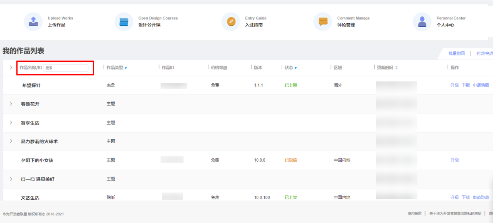
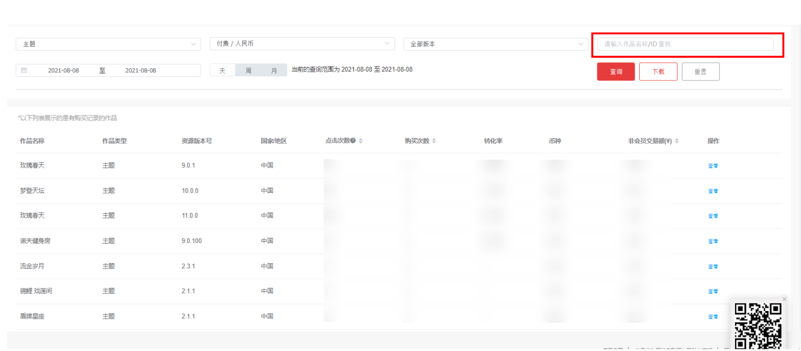
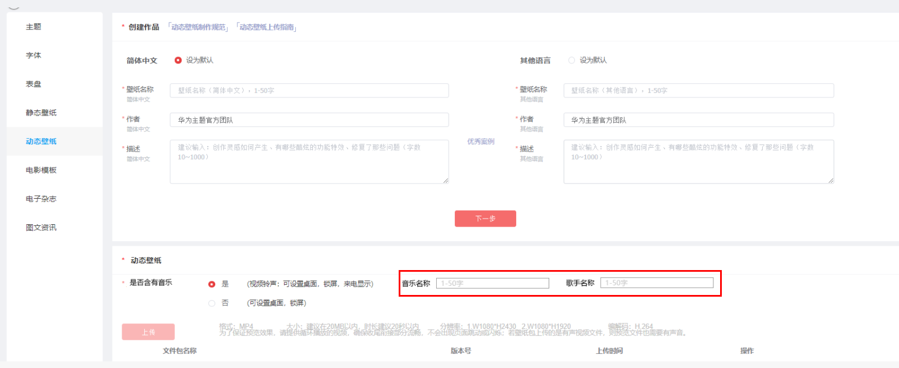

# 1.0.23版本功能介绍（2021-10-12）

## 1. 版本更新特性

* [作品管理列表/报表支持作品ID搜索](#section6539144819502)
* [动态壁纸支持填写背景音乐信息](#section238221045110)
* [支持上传折叠屏MP4格式的动态壁纸](#section421911572235)

## 2. 作品管理列表/报表支持作品ID搜索

### 2.1 概述

作品管理列表/报表新增ID搜索功能，设计师可以通过搜索ID快速找到相关的作品。

### 2.2 操作流程

* 作品管理列表

1. 登录主题联盟，进入作品管理列表；
2. 在作品管理列表左侧输入框中输入作品ID，查找相关作品。

* 收入报表

1. 登录主题联盟，进入收入报表；
2. 在收入报表列表页右侧框中输入作品ID，查找相关作品。

## 3. 动态壁纸支持填写背景音乐信息

### 3.1 概述

设计师上传动态壁纸时，支持输入动态壁纸的音乐名称和歌手名称，便于对包含背景音乐的动态壁纸做专区推荐。

### 3.2 操作流程

1. 登录主题联盟，进入上传作品界面，作品类型选择动态壁纸；
2. 创建好动态壁纸基础信息后，填写声音属性，包括“是否带有声音”“音乐名称”“歌手名称”。

   
3. 若“是否带有声音”您选择了否，您也可以在付费属性中设置[音乐素材库](https://developer.huawei.com/consumer/cn/doc/content/funcation19-0000001104887590#section18442142511565)的音乐信息。

## 4. 支持上传折叠屏MP4格式的动态壁纸

### 4.1 概述

联盟新增上传折叠屏手机MP4格式的动态壁纸。

### 4.2 操作流程

1. 登录主题联盟，进入上传作品界面，作品类型选择动态壁纸；
2. 动态壁纸作品类型新增折叠屏，您可以参考相关的规范进行制作，参考[动态壁纸上传步骤](https://developer.huawei.com/consumer/cn/doc/content/livewallpaper-upload-0000001055068451#section12967112911314)上传。