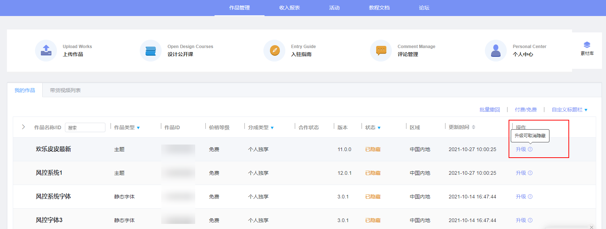
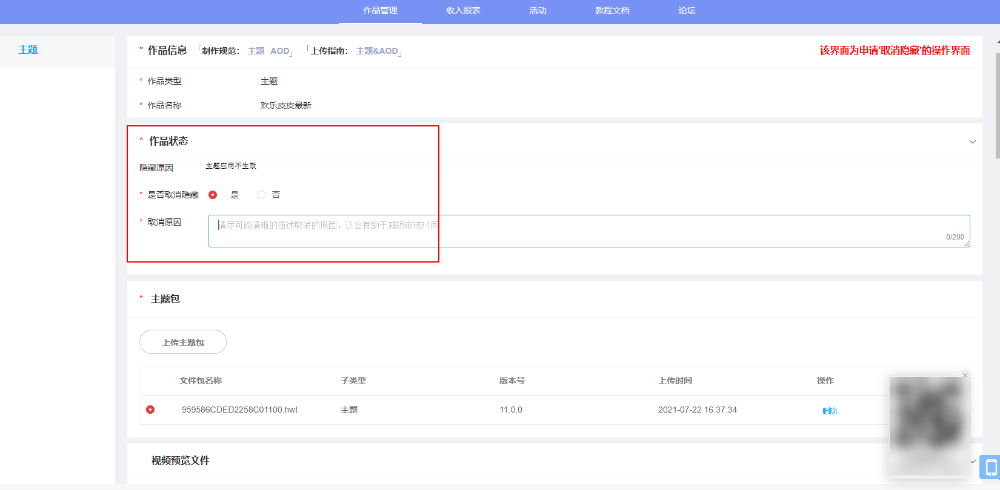

# 1.0.24版本功能介绍（2021-11-30）

## 1. 版本更新特性

* [支持上传平板MP4格式动态壁纸](#section37313187459)
* [支持上传儿童表盘](#ZH-CN_TOPIC_0000001176095250__section186973100536)
* [新增作品取消隐藏功能](#section71107262531)
* [优化资源重名校验规则](#section1150216374531)

## 2. 支持上传平板MP4格式动态壁纸

### 2.1 概述

联盟新增上传平板MP4格式的动态壁纸。

### 2.2 操作流程

1. 登录主题联盟，进入上传作品界面，作品类型选择动态壁纸；
2. 动态壁纸作品类型新增平板，您可以参考[平板动态壁纸的规范](https://developer.huawei.com/consumer/cn/doc/content/livewallpaper-specifications-0000001055029722#section66521717174417)制作，参考[动态壁纸上传步骤](https://developer.huawei.com/consumer/cn/doc/content/livewallpaper-upload-0000001055068451#section12967112911314)上传。

## 3. 支持上传儿童表盘

### 3.1 概述

联盟新增上传儿童表盘，即分辨率为HWHD10的表盘。

### 3.2 操作流程

1. 登录主题联盟，进入上传作品界面，作品类型选择表盘；
2. 编辑表盘的名称，并进行创建；
3. 您可以参考[表盘制作规范](https://developer.huawei.com/consumer/cn/doc/content/watch-face-introduction-0000001566918497)制作，参考[表盘上传步骤](https://developer.huawei.com/consumer/cn/doc/content/sportwatch-upload-0000001054469759#section12564125619118)上传。

## 4. 新增作品取消隐藏功能

### 4.1 概述

被隐藏的作品，可以由设计师在联盟主动发起取消隐藏的申请。

### 4.2 操作流程

1. 找到需要申请取消隐藏的作品，可以在操作中看到文字提示“升级可取消隐藏”。

   
2. 进入作品的升级操作页面，可以看到作品被隐藏的原因。选择“取消隐藏”并填写“取消理由”。

   

   若升级作品需要替换文件包，请直接上传新的作品文件包。

   
3. 点击“提交”按钮，完成取消隐藏的申请操作。

## 5. 优化资源重名校验规则

### 5.1 概述

为了降低设计师给作品取名称的门槛，现在同一个设计师上传不同子类型资源允许有同名称的作品，不同设计师同一子类型允许有同名称的作品。