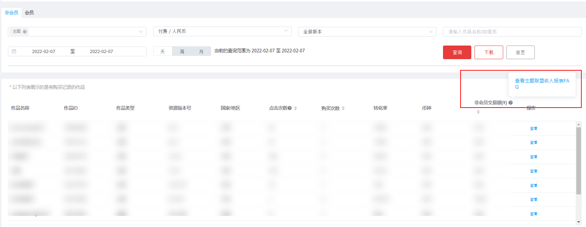
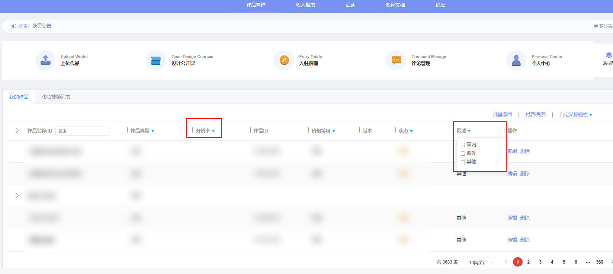
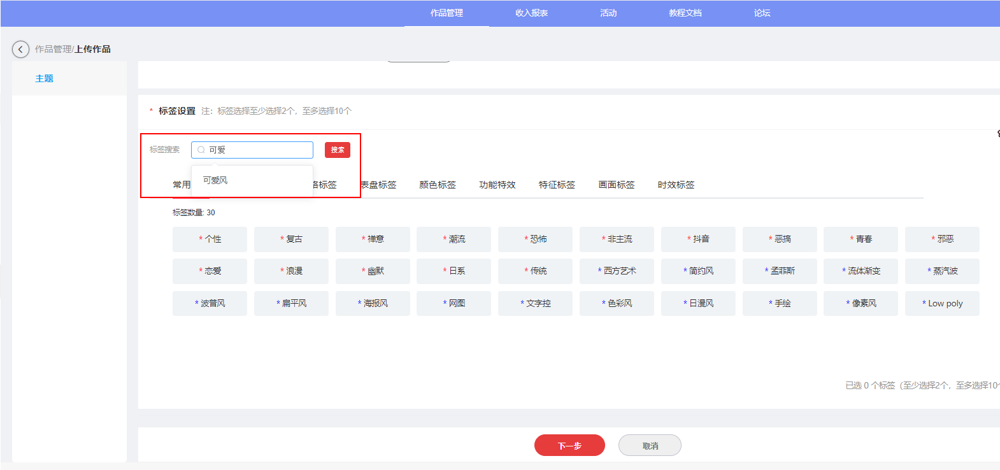

# 1.0.25版本功能介绍（2022-02-08）

## 1. 版本更新特性

* [报表新增数据说明](#section1385402771214)
* [作品列表支持筛选国内外作品、分辨率](#section1580285710135)
* [标签提供模糊查询](#section6413534148)
* [贴纸滤镜新增单独渠道上传](#section1158410512173)

## 2. 报表新增数据说明

收入报表增加了问号标识，点击标识可以跳转至“主题联盟收入报表FAQ”文档中查看报表常见问题。

## 3. 作品列表支持筛选国内外作品、分辨率

作品管理列表表头支持筛选国内外作品，支持筛选分辨率。

1. 登录主题联盟，进入首页即可看到作品列表。
2. 点击作品列表区域和分辨率两个字段即可进行筛选操作。

## 4. 标签提供模糊查询

1. 新增“常用标签”tab页，默认共展示30个常用标签。
2. 设置标签时，可以在标签搜索框中输入，查询标签信息。
3. 带红蓝星号的标签分别属于气氛标签、风格标签，两个标签类型都是必选项。

   

## 5. 贴纸滤镜新增单独渠道上传

联盟上传页左侧侧边栏新增“美化”菜单，贴纸和滤镜两种资源类型上传渠道转移至“美化”菜单。

1. 登录主题联盟，进入上传作品界面，作品类型选择美化。
2. 接下来的步骤，您可以参考贴纸上传步骤。