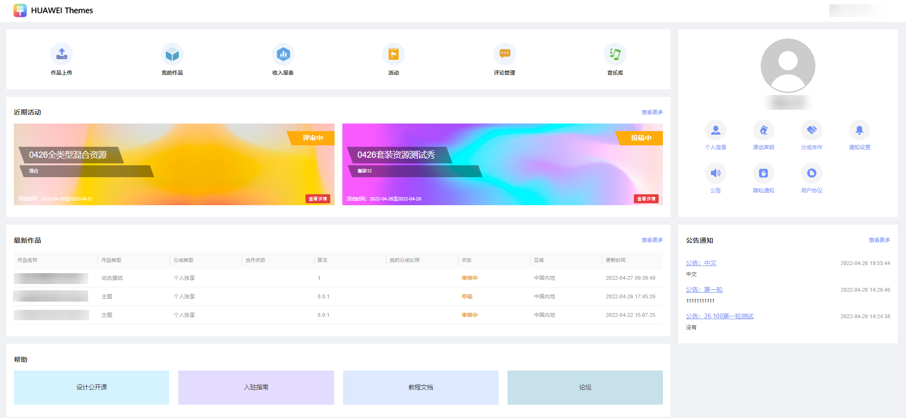
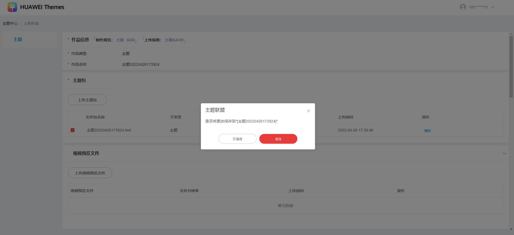

# 1.0.26版本功能介绍（2022-04-26）

## 1. 版本更新特性

* [主题联盟首页布局优化](#section0249101516511)
* [资源上传界面新增保存功能](#section14838201317011)
* [报表资源类别增加“美化”分类](#section185901315124518)
* [联盟同步展示作品被隐藏的原因](#section147616110465)
* [团队账号不校验子账号是否维护商户服务](#section141001116145911)

## 2. 主题联盟首页布局优化

1. 功能与帮助做区分并归类，功能栏在第一排位置，包含6个功能（作品上传，我的作品，收入报表，活动，评论管理，音乐库）。

   帮助栏在底层位置，包含4个超链（设计公开课，入驻指南，教程文档，论坛）。
2. 增加近期活动，展示最新发布的两个活动内容，点击页面上的查看更多可以查看完整的活动列表。
3. 增加最新作品，展示最新上传的三个作品资源，点击页面上的查看更多可以查看完整的作品列表。
4. 个人中心展示优化。
5. 公告展示能力优化。

## 3. 资源上传界面新增保存功能

进入作品上传编辑界面，有修改的内容时，自动进行保存。当停留在该界面时，每间隔5分钟则保存一次。当前界面异常关闭时，内容保存至最近一次自动保存的地方。

<strong>场景一：</strong>

1. 点击“作品上传”进入到上传编辑页面，并且在当前界面进行了修改。
2. 切出当前界面或者关闭当前界面时(即正常退出时)，系统会弹出是否保存提示框。

   

<strong>场景二：</strong>

1. 点击“我的作品”列表内“草稿”状态的作品，进入到上传编辑页面，并且在当前界面进行了修改。
2. 切出当前界面或者关闭当前界面时(即正常退出时)，系统会弹出是否保存提示框。

   

## 4. 报表资源类别增加“美化”分类

1. 报表中的统计数据新增“滤镜”“贴纸”的类型。(过去两周收入、会员/非会员报表)
2. 统计规则同之前保持一致，原本属于字体中“滤镜”“贴纸”的统计数据，单独在报表分类中展示。
3. 评论管理中需要新增“滤镜”“贴纸”的类型，将滤镜和贴纸的评论管理单独展示。

## 5. 联盟同步展示作品被隐藏的原因

作品若由审核人员操作隐藏，联盟将在作品的详情展示具体的隐藏原因。

## 6. 团队账号不校验子账号是否维护商户服务

联盟现只校验主账号是否维护商户服务，若主账号没有维护账号下的商户服务，作品管理员等子账号角色则无法分发付费作品。