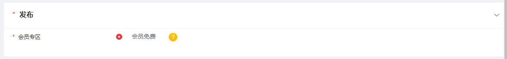
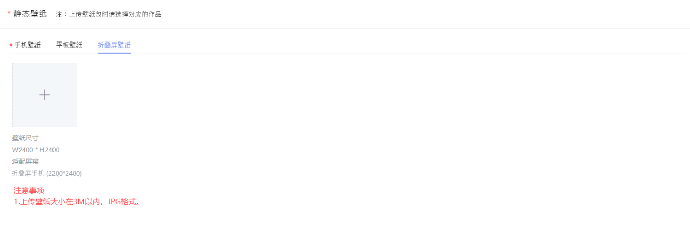
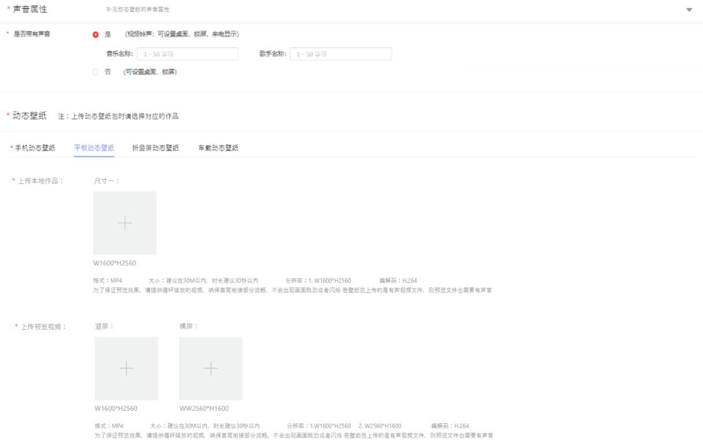
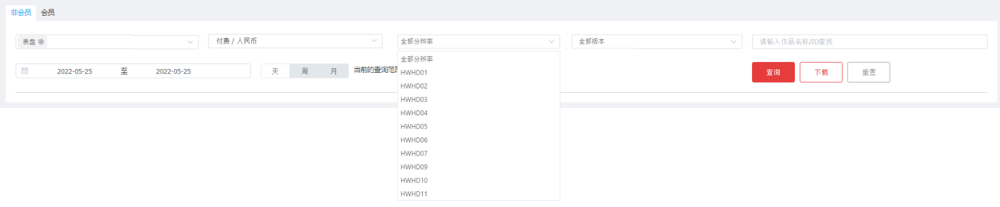
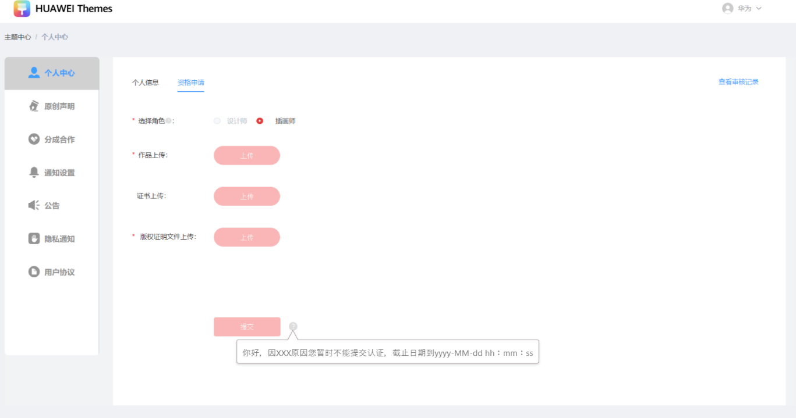
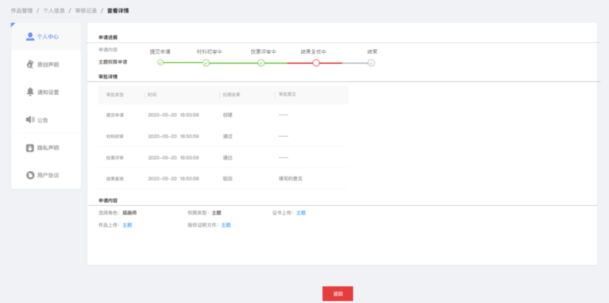

# 1.0.28版本功能介绍（2022-07-19）

## 1. 版本更新特性

* [联盟支持表盘会员的能力](#section1614823365918)
* [修改静态壁纸的上传场景](#section12963204635914)
* [动态壁纸上传时分离声音属性设置](#section164851158195913)
* [表盘作品包的名称字段不允许含有特殊字符 ' =](#section16171314106)
* [联盟收入报表支持分辨率筛选](#ZH-CN_TOPIC_0000001302936976__section91591844205)
* [万象小组件单独上架](#section109611457302)
* [拒收后，联盟侧限制设计师提交申请](#section12692132915114)
* [联盟侧展示设计师资格申请进展](#section11721934818)

## 2. 联盟支持表盘会员的能力

联盟支持表盘会员能力。设计师在上传表盘作品时，增加了“发布-会员专区"。

## 3. 修改静态壁纸的上传场景

静态壁纸上传页面，手机tab页中分离出折叠屏分辨率作为单独的上传界面。

## 4. 动态壁纸上传时分离声音属性设置

1. 原来上传作品处的声音设置删除。
2. 在上传文件之前，增加“声音属性”的设置项。
3. 文件上传完成后，声音属性不能被手动更改，必须删除文件后才支持手动更改。

   

## 5. 表盘作品包的名称字段不允许含有特殊字符 ' =

1. 创建表盘时，表盘的作品名称中不能含有特殊字符 ' 和 = （英文标点）。
2. 上传表盘包后，表盘包的中文名称和英文名称两个字段不能含有 ' 和 = （英文标点）。
3. 更多名称规定请查看[表盘的自检测试规范](/docs/distribute/content-dist/theme-center/content-release-0000001054679366/content-review-specifications-0000001054679960/content-check-pecifications-0000001057301166/sportwatch-test-0000001057059331)。

## 6. 联盟收入报表支持分辨率筛选

1. 非会员报表和会员报表的详细列表中，已支持通过分辨率筛选并展示数据。
2. 导出的表格中，也支持展示分辨率信息。

   

## 7. 万象小组件单独上架

1. 联盟新增资源类型：万象小组件。
2. 上传时，支持同时上传预览视频，预览视频分辨率，大小与主题资源的分辨率、大小保持一致。详细的上传步骤可以参考[主题上传文档](/docs/distribute/content-dist/theme-center/content-release-0000001054679366/uploadguide-0000001054359939/themes-upload-0000001055029726#section96731130204020)。

## 8. 拒收后，联盟侧限制设计师提交申请

1. 根据拒收的时间做出限制，在拒收期间不能再提交申请。
2. 拒收期间，若设计师进行信息变更或者资格申请，提交按钮会被禁用，页面并给出友好提示。

## 9. 联盟侧展示设计师资格申请进展

1. 设计师能够查看提交的入驻申请材料所处的审核阶段，并且能够实时查看申请进展。
2. 查看界面如下图所示。

   