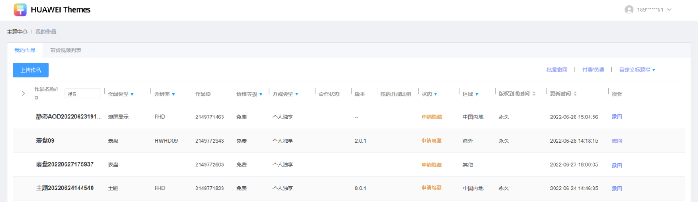
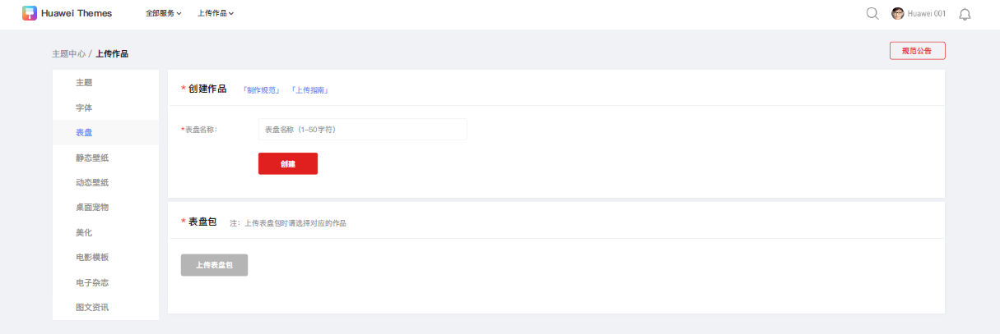
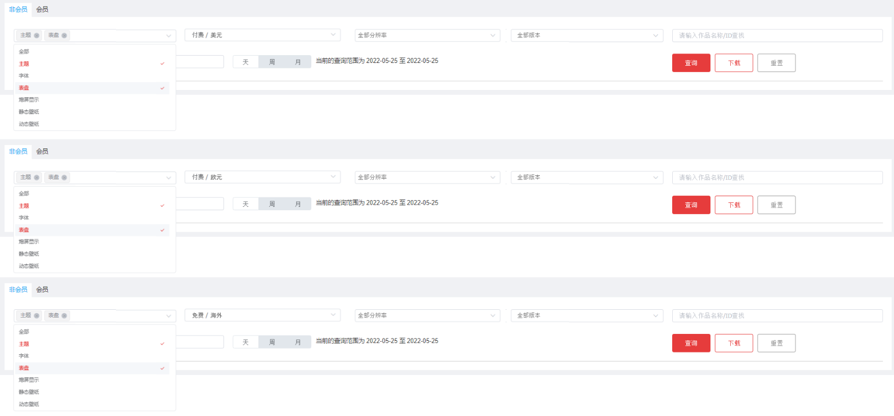
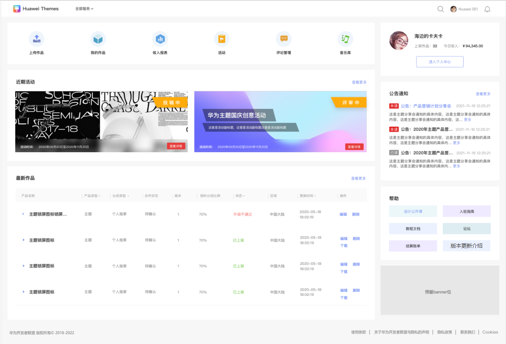
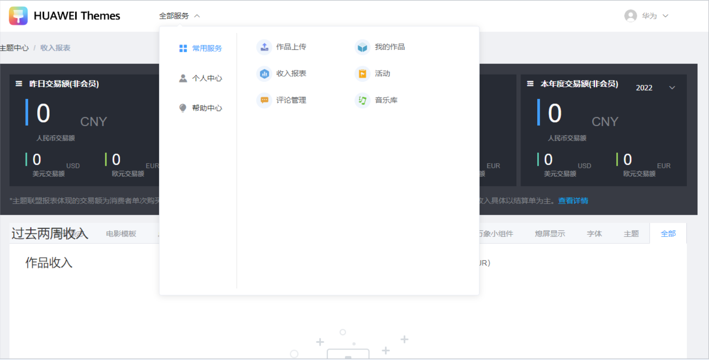
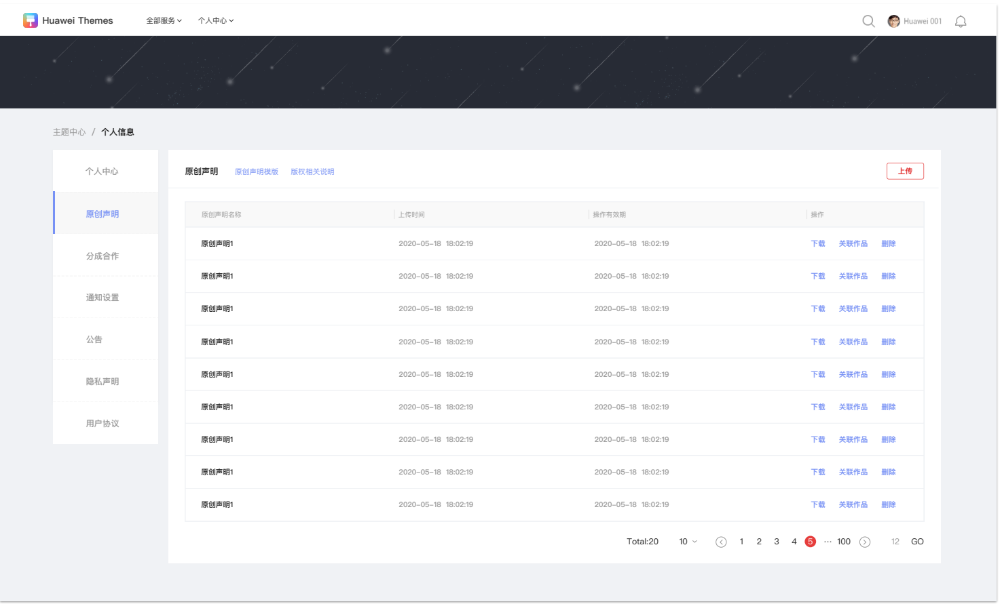

# 1.0.29版本功能介绍（2022-09-27）

## 1. 版本更新特性

* [“申请隐藏”状态的作品支持撤回操作](#section5178521558)
* [主题、表盘作品增加英文名称的重名校验](#section8808141445610)
* [优化上传作品中创建的步骤](#section1597522885615)
* [收入报表中补充缺少的作品类型](#section77551638165617)
* [页面交互及布局优化](#section126051850205614)

## 2. “申请隐藏”状态的作品支持撤回操作

设计师资源申请隐藏上传后，如果发现属于是误操作问题，支持“撤回”的方式取消申请隐藏，能够迅速撤回误操作的资源。同时，也支持批量“撤回”操作。

## 3. 主题、表盘作品增加英文名称的重名校验

1. 主题、表盘新作品上传场景下，同一个设计师ID下的作品，若资源类型，分辨率 ，版本号前两位相同，则资源包内的英文名称（title字段）必须唯一，不能与名下历史作品重复。
2. 允许国内和海外，分别用同一个英文名的需求。故设计师在点击“下一步”时才执行重名校验。

## 4. 优化上传作品中创建的步骤

1. 上传作品的流程中，创建作品包括填写名称、基本的属性信息、上传包等内容。
2. 如下图，基本属性由弹窗展示更新为平铺展示，设计师可以直接在页面内填写作品的基本属性。

   

## 5. 收入报表中补充缺少的作品类型

在非会员报表中，若设计师选择 “免费/欧元”“付费/美元 ”“付费/欧元”这三种分类。报表的作品类型选项支持选择“表盘”“熄屏显示”。

## 6. 页面交互及布局优化

1. 优化个人中心的内容和展示区域。

   
2. 增加全部服务，支持各个页面之间相互跳转。

   
3. 调整原创声明上传位置等。

   