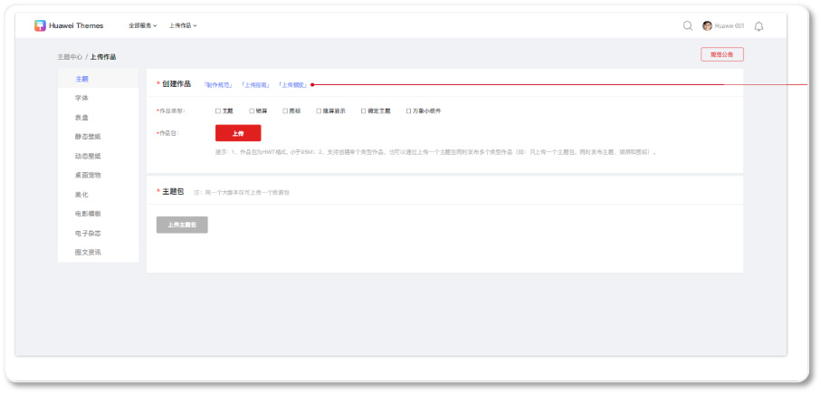
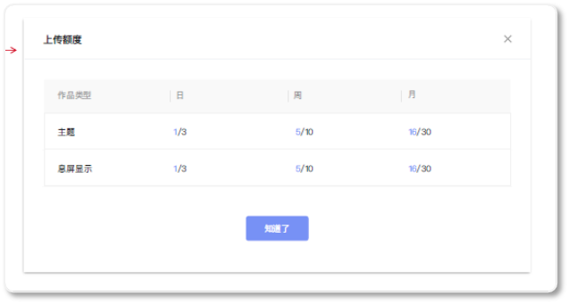
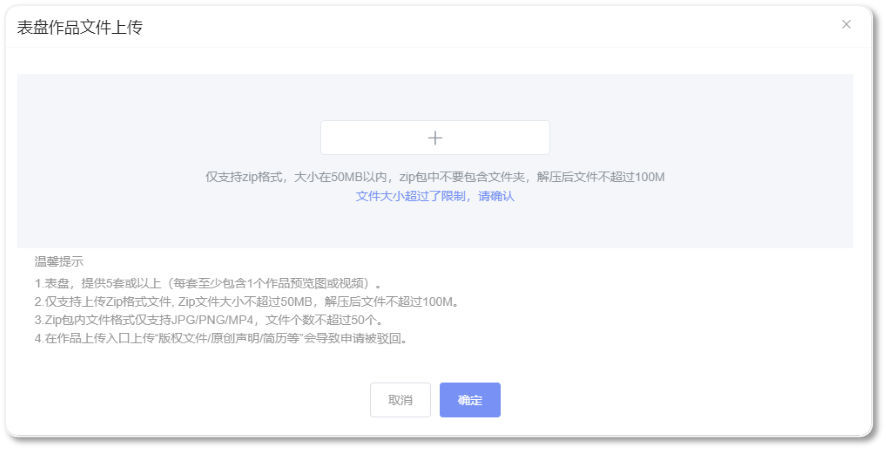

# 1.0.30版本功能介绍（2022-11-30）

## 1. 版本更新特性

* [上传作品界面支持展示额度提醒](#section7512546103619)
* [上传作品数量增加按“作品类型”限制](#section1165277431)
* [上传作品数量增加“月维度”限制](#section13851439184914)
* [入驻申请文案优化](#section9843925410)

## 2. 上传作品界面支持展示额度提醒

联盟上传界面提供额度查询的能力。

1. 支持展示上传作品类型的额度明细，比如主题的上传页可以上传主题+息屏显示，则上传额度列表支持展示主题、息屏显示。
2. 额度列表支持按日、周、月三个时间维度展示。
3. 额度提醒以分数形式展示，分子=已使用的额度，分母=系统配置的额度数。额度提醒将按照上传数量动态变化。

## 3. 上传作品数量增加按“作品类型”限制

静态壁纸、动态壁纸、AOD、万象小组件、主题、表盘，六种作品类型具备单独的上传额度限制。其他作品类型不限制上传数量。

1. 账号+子账号上传的数量不能超过限制数。
2. 在提交作品后，若超过上限，联盟会出现相关的超额提示。

## 4. 上传作品数量增加“月维度”限制

按照自然月的维度，限制每月的上传作品额度，规范上传作品和其他的内容。

1. 账号+子账号上传的数量不能超过限制数。
2. 在提交作品后，若超过上限，联盟会出现相关的超额提示。

## 5.入驻申请文案优化

在资格申请界面增加“入驻指南”的跳转链接。

若选择的是插画师，作品提交界面的温馨提示新增：附上10张及以上手绘插画。

修改了入驻时的文案。

