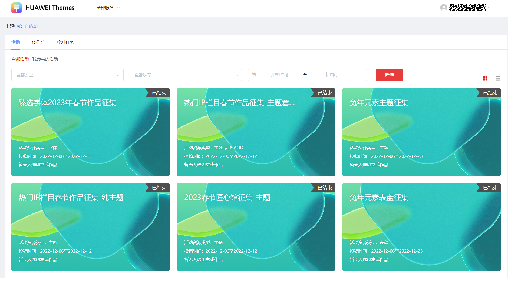
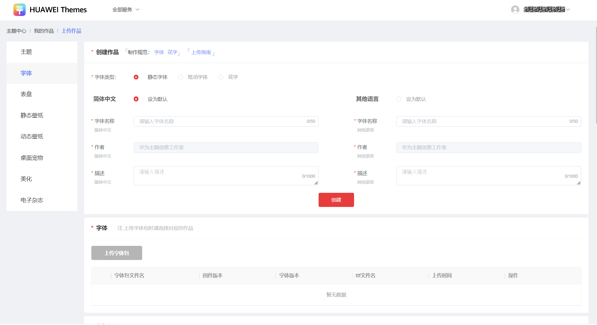
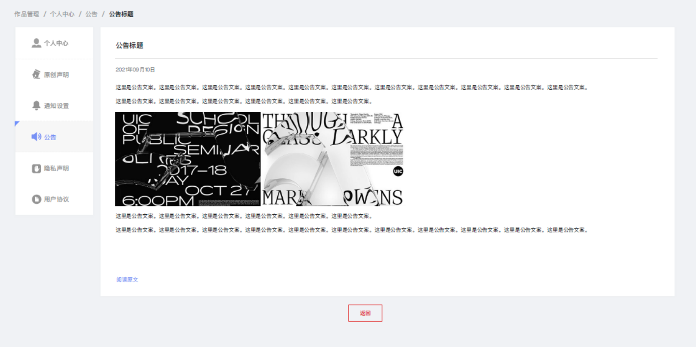
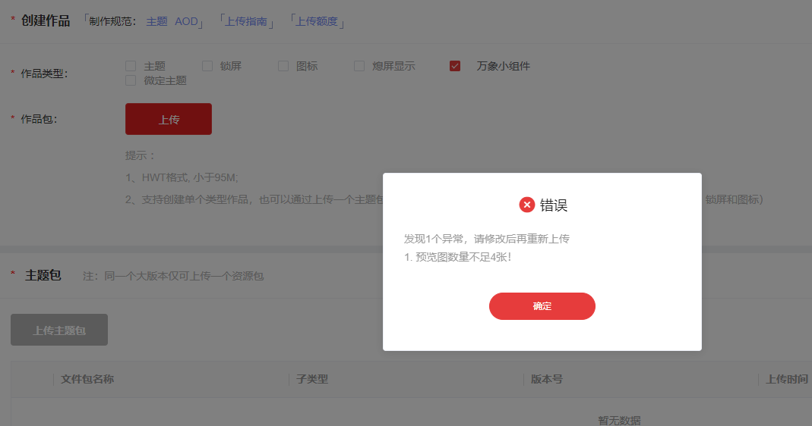
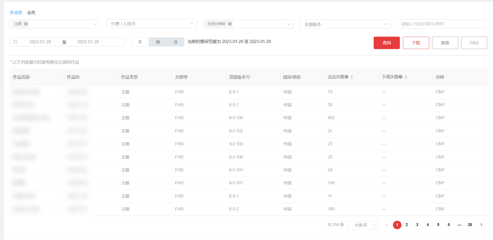

# 1.0.31版本功能介绍（2023-01-13）

## 1. 版本更新特性

* [活动中心布局和页面改版](#section13163105417236)
* [页面自适配显示器的分辨率](#section67525228249)
* [字体上传流程和步骤优化](#section1051194718242)
* [公告支持富文本展示](#section44611218202518)
* [小组件作品类型的预览图数量校验](#section172021247182516)
* [联盟报表展示下载次数](#section1272113512265)

## 2. 活动中心布局和页面改版

活动界面内的布局调整，一行支持展示3个活动图。

## 3. 页面自适配显示器的分辨率

联盟页面针对终端显示器的分辨率做自适配，统一视觉效果和使用体验。

## 4. 字体上传流程和步骤优化

字体上传的流程中有一些步骤和字段重复，统一上传流程和步骤。

1. 支持在界面内直接创建字体作品。
2. 创建作品时，需要填写字体包的双语种信息（名称、简介），并可以选择默认的语种，后续无需再次编辑。

## 5. 公告支持富文本展示

公告通知支持文本，图片，link等形式。

## 6. 小组件作品类型的预览图数量校验

规范上传小组件的预览图数量，不足最低值时限制上传。

## 7. 联盟报表展示下载次数

1. 点击次数，数据口径：作品的总点击次数（不区分用户属性）。
2. 下载次数，数据口径：以作品维度统计下载次数（作品的总下载次数，包含单次及会员下载）。
3. 由于“下载次数”属于新增加的字段，故在2023/01/28前，所有作品都不具备此数据，页面显示为“—”。
4. 若选择的日期中含有2023/01/28前的日期，此字段则都展示“—”。

