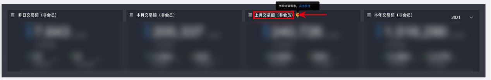
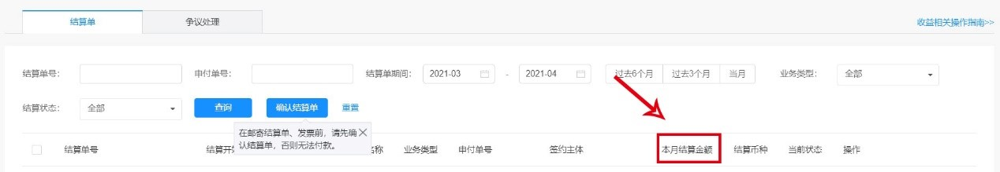
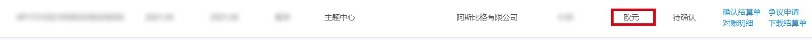
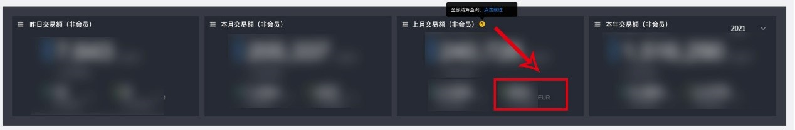

# 主题联盟收入报表FAQ

## 问题1

<strong>主题联盟[收入报表](https://developer.huawei.com/consumer/en/console#/openCard/ThemeService/30)中的“上月交易额（非会员）”和[结算单](https://developer.huawei.com/consumer/en/console#/myaccount/new-earnings/new-earnings-settlement)的结算金额不一致的原因是什么？</strong>

* <strong>数据的换算</strong>

  主题联盟报表上的“上月交易额（非会员）”为支付金额，与结算单的结算金额之间因渠道费、增值税、分成等原因存在差额。

## 问题2

<strong>在哪里可以查询到详细的计算数据？</strong>

结算相关说明，请参考[华为开发者商户服务协议](https://developer.huawei.com/consumer/cn/doc/start/merchantserviceagreement-0000001052848245)。

## 问题3

<strong>设计师的收入是以报表的数据为准还是结算单的数据为准？</strong>

主题联盟报表体现的是消费者单次购买的收入，同时受渠道费、增值税、分成等因素影响，会跟结算单的数据有所出入。此数据仅供参考分析，您的收入具体以结算单为准。

## 问题4

<strong>为什么要增加主题联盟收入报表？</strong>

主题联盟收入报表除了提供点击次数，购买次数，转化率等数据，对设计师做数据分析工作提供帮助。

## 问题5

<strong>为什么报表提示“暂无”或“报表正在赶来的路上，请稍后查看”</strong> <strong>？</strong>

## 问题5

<strong>主题联盟收入报表为什么会出现有购买次数，但是没有销售额的情况？</strong>

购买次数的统计包含用户使用0元优惠券兑换购买的场景，故在此场景下不会产生销售额数据。

## 问题6

<strong>主题联盟报表的美元数据与结算单的美元数据不一致的原因是什么？</strong>

* 主题联盟报表：币种包含人民币，美元，欧元三种。其中在海外支付金额非欧元的场景下，均会转换为美元进行统计。
* 结算单：支付金额为实际币种，结算金额为开发者登记币种。

  例如：当开发者登记的币种为欧元时， 用户支付金额的币种为美元，当结算时，就会把用户支付的金额转换成欧元统计。这样会导致结算单的欧元数据和主题联盟报表的欧元数据不一致。

  开发者登记的币种为欧元：

  

  红框处为主题联盟报表上月的欧元数据：

  

如果需要对账，则自行统一转换为美元，再将结算单和联盟报表进行对比。

结算单查看链接：

中文：&lt;https://developer.huawei.com/consumer/cn/console#/myaccount/new-earnings/new-earnings-settlement&gt;

英文：&lt;https://developer.huawei.com/consumer/en/console#/myaccount/new-earnings/new-earnings-settlement&gt;