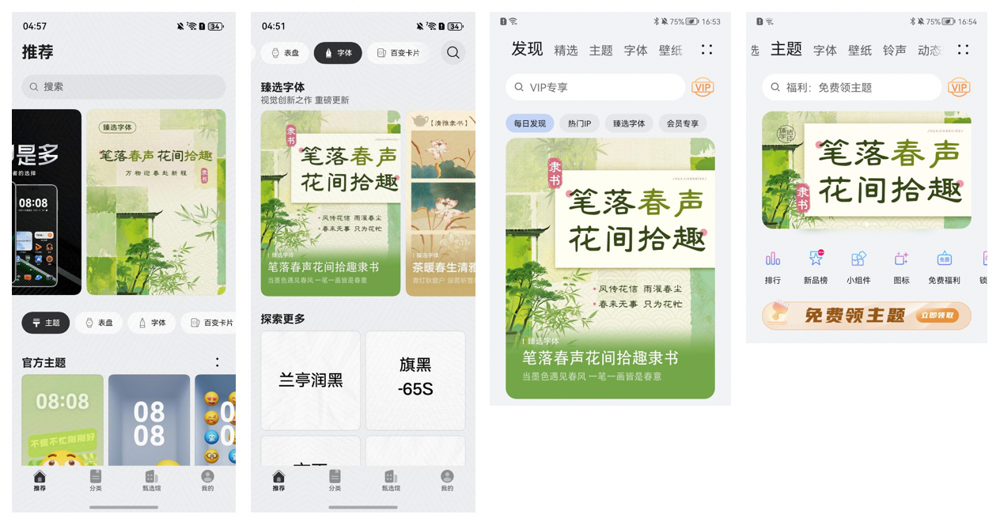

import MergeTable from '@site/src/components/MergeTable';

# 精品栏目推荐

开发者可申请以下栏目进行作品推广。

## 1. 字体类栏目介绍与申请

### 1.1 栏目介绍

<strong>《臻选字体》</strong>

此系列推荐优质精品字体，突出展示字体笔画细节之处，给用户更多形式的字体展示，且每周有3张于推广字体相关的精美壁纸可供用户免费下载。

### 1.2 申请要求

开发者们请按照以下要求申请：

<strong>《臻选字体》申请要求：</strong>

1. 字体需为字符数2万以上的精品字（风格不限）；
2. 需要提供preview\_font\_1\_90、preview\_fonts\_2\_90、preview\_fonts\_3\_90、preview\_fonts\_4\_90四张预览图以及字体应用最常用50个字的效果图；
3. 需制作栏目要求的H5页面，官方会提供相应H5页面及资源模板给予参考；
4. 需配合官方流程按时提供物料；
5. 活动H5只能用于华为主题，不可同一活动在多个平台渠道发布。

### 1.3 物料规范

<strong>（1）格式要求：</strong>

zip压缩包，500mb以内；若物料文件大小超出500mb，可拆分为多个压缩包。

<strong>（2）</strong> <strong>命名要求：</strong>

栏目名称+期数+活动名称+设计师昵称

即：臻选NO.XXX（期数）-活动名称-设计师昵称

<strong>（3）</strong> <strong>物料包规范：</strong>

物料包包含：延展物料+ H5物料+PSD格式文件合集+活动资源列表+push文案+杂志锁屏文案。

* 延展物料规范：

<MergeTable
  headers={['序号', '资源位置', '', '尺寸要求', '设计输出要求']}
  rows={
    [{ text: '1', rowspan: 2, colspan: 1 }, { text: '顶部广告Banner', rowspan: 2, colspan: 1 }, '1-1 顶部广告banner（鸿蒙5.0及以上版本）', '960 x 1280px, （96px）', { text: '以下二选一： 1. jpg+gif （jpg＜250kb，gif＜1m） 2. jpg+png （jpg / png＜250kb，png为banner分层）', rowspan: 2, colspan: 1 }],
    [null, null, '1-2 字体、主题页banner（鸿蒙4.0及以上版本）', '1440 x 844px, （96px）', null],
    ['2', { text: '发现页', rowspan: 1, colspan: 2 }, null, '1248 x 1560px , （96px）', 'jpg / png （jpg＜250kb）；竖线"丨"后为栏目名称'],
    ['3', { text: 'Push 小图/微信分享小图', rowspan: 1, colspan: 2 }, null, '240 × 240 px , （96px）', 'jpg / png （jpg / png＜50kb）'],
    ['4', { text: '杂志锁屏图片', rowspan: 1, colspan: 2 }, null, '1440 × 2560 px , （96px）', 'jpg （jpg＜1m）；图上无logo，可带文字']
  }
/>

* H5物料规范：

<MergeTable
  headers={['序号', 'H5 要求', '尺寸要求', '设计输出要求']}
  rows={
    ['1', 'H5整图', '尺寸宽度：1440，高度不限', 'jpg / png，文件大小不限'],
    ['2', 'H5切图', '切图尺寸宽度：1440，高度不限', 'jpg / png（jpg / png＜400kb，gif＜500kb）；切图命名需用顺序序号标注，如01、02…'],
    ['3', '臻选滚动文案', { text: '', rowspan: 3, colspan: 1 }, 'png（png＜250kb），背景透明，用于《臻选字体》'],
    ['4', 'H5会员悬浮', null, { text: 'jpg / png（jpg / png＜250kb），下载字体+下载壁纸', rowspan: 2, colspan: 1 }],
    ['5', 'H5资源下载按钮', null, null]
  }
/>

* 活动资源列表：

活动期间推广的字体资源、壁纸资源清单，必须包含活动名称、推广资源名称、设计师昵称、推广资源ID、活动推广时间。

* PSD格式文件合集：

合集包含各延展物料、H5物料的PSD格式原文件，PSD文件内各图片元素图层、各文字图层请勿合并。

* PUSH文案：

主标题+副标题，主副标题字符数各≤14个，风格不限，可提供多风格类型push文案。

* 杂志锁屏文案：

标题+文案，标题字符≤10个，文案字符≤30个，语言需精简优美，符合华为杂志锁屏平台调性

<strong>（4）其它注意事项</strong>：

1. 送审物料必须为原创，不得抄袭；
2. 若送审的物料评审不通过，取消当期作品入选资格；
3. 当期物料设计出现低级错误大于3次（如标点符号缺失或错误、错别字，及切图尺寸错误等不按规范设计等问题），取消当期作品入选资格，并暂停一次臻选投稿资格；
4. 字体命名规范：字体标题结尾需以XX体（行楷除外）；
5. 活动H5只能用于华为主题，不可同一活动在多个平台渠道发布；
6. 如作品出现舆情问题，华为主题拥有暂停推广和追责的权利，并将按《开发者管理规范》进行处罚。

## 2. 推荐资源介绍

申请活动通过后，开发者还有机会获得额外推广资源进行曝光。实际上线位置由官方评审决定。

