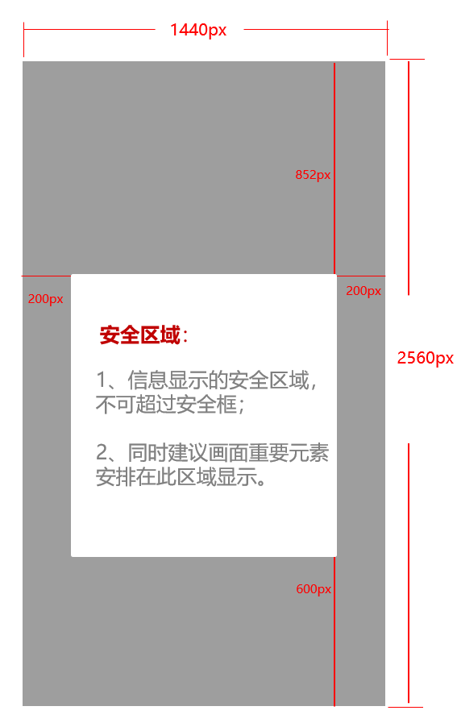

import MergeTable from '@site/src/components/MergeTable';

# 杂志锁屏素材审核规范

## 【基础要求】

|  |  |
| --- | --- |
| 1. 图片规格要求 | 格式：jpg； |
| 手机尺寸：1440\*2560px，图片大小限制在1M以内； |
| 折叠屏尺寸：2934\*3306px，图片大小限制在1M以内； |
| PAD：竖图尺寸：1600\*2560px，横图尺寸：2560\*1600px，图片大小限制在1M以内；素材上线到PAD上会有上、下、左、右各100像素的裁切，请注意主体不要过于贴近边缘； |
| 图片格式将根据终端屏幕的尺寸、分辨率的调整而调整。 |
| 2. 图片视觉要求 | 画质：避免画质模糊不清晰、虚化太多导致眩晕感、处理痕迹明显、渲染太过等； |
| 构图：  ①主视觉在安全区域范围之内，参考下图；    ②主体区域居中上，且主体元素突出；  ③避免主体太简单（如只有一个热气球、一朵花等）、太复杂（不分主次，没有重点等）； |
| 色彩：  ①色彩搭配合理，避免色彩太阴暗、太明亮、太单一、太复杂、搭配不当（如亮红搭配亮黄）等；  ②不可包含大面积的、引起视觉不适的醒目颜色； |
| 人物：  ①含人物肖像图片，需五官端正、气质优美等；  ②图片中人物表情和姿态自然真实，不得出现怪异、夸张的表情； |
| 其他信息：  图片上无浮于画面之上的LOGO、水印、文字等；节日、节气、专题策划等特殊场景除外。 |
| PAD图片：横图和竖图需为同一张图的横竖屏效果，以达到阅读的连贯性。 |
| 3. 标题文案要求 | 标题、文案、图片所传达的信息一致无误，不得使用与内容严重不符的夸张标题，诱导用户点击； |
| 语句通顺、逻辑清晰、重点突出，无语病、错别字、标点错误，标点符号和文案格式一致； |
| 避免文案用词过于简单直白，有文采，可引用诗句、歌词、文章等，精准有温度，避免太冷或太生硬的表达；（引用文案需注明来源）； |
| 字数要求：标题字数在10字以内，文案字数不超过44字；（包括中文标点、空格、版权标识等字符）。 |
| 4. 落地页要求 | 落地页的内容与图片内容有强相关性，合作伙伴必须对图中出现的内容与标题文案所描述的内容做自检，确保一致性； |
| 内容质量：  ①内容质量高、可阅读性强；  ②主题明确、观点聚焦、表达有序、言之有物、内容充实；  ③落地页需包含作者名和头像； |
| UI 设计佳：UI设计风格简洁、色彩搭配和页面布局合理，无弹窗或插屏提醒等内容跳出影响观感； |
| 落地页内容不能私自插入导流相关信息，包含但不限于联系方式（如以变种形式推广微信公众号、图片水印隐藏联系方式等）、营销性质的第三方网址链接、二维码等。 |

## 【内容要求】

### 1. 通用要求

适用范围：杂志锁屏图片、标题、文案、落地页内容。

|  |
| --- |
| 1、 严格保障资讯内容合法合规。  严格按照《网络安全法》、《互联网信息服务管理办法》等法律法规之规定，转载拥有合法合规资质单位发布的信息，并注明信息来源、原作者、原标题、编辑真实姓名等，不得歪曲、篡改标题原意和信息内容，并保证信息来源可追溯。 |
| 2、 需遵守法律法规、社会主义制度、国家利益、公民合法权益、社会公共秩序、道德风尚及信息真实性等要求；不得制作、复制、发布、传播如下法律、法规和政策禁止的内容：  （1）反对宪法所确定的基本原则的；  （2）危害国家安全，泄露国家秘密，颠覆国家政权，破坏国家统一的；  （3）损害国家荣誉和利益的；  （4）煽动民族仇恨、民族歧视，破坏民族团结的；  （5）破坏国家宗教政策，宣扬邪教和封建迷信的；  （6）散布谣言，扰乱社会秩序，破坏社会稳定的；  （7）散布淫秽、色情、赌博、暴力、凶杀、恐怖、或者教唆犯罪的内容；  （8）侮辱或者诽谤他人，侵害他人合法权益的；  （9）煽动非法集会、结社、游行、示威、聚众扰乱社会秩序；  （10）以非法民间组织名义活动的；  （11）含有法律、法规和政策禁止的其他内容的信息。 |
| 3、不涉及以歪曲、曲解、违背事实等方式娱乐化任何政治元素，如政治家、军队、政治制度等； |
| 4、不涉及任何与宗教相关的元素，包括但不限于十字架、宗教故事彩绘、圣坛、神像等； |
| 5、不涉及如图腾、纹身、祭拜、死亡等民俗文化元素；传统节日不宣扬祭拜、迷信、悲伤等负面元素； |
| 6、不涉及任何与赌博、赌具、赌场等相关的元素； |
| 7、不涉及任何形式的烟草及相关元素，如雪茄、烟斗、毒品等； |
| 8、不能将酒类元素作为主视觉，不露出酒标； |
| 9、不涉及任何可能引起生理不适的元素，包括但不限于阴暗、枯萎、死亡、干旱、事故、灾难等消极和负面元素； |
| 10、不露出未成年正面肖像，不作为主视觉； |
| 11、不可上传毒品相关信息，包括不限于毒品药物、涉毒植物、毒物制品及相关的制作、销售等信息； |
| 12、不涉及任何与竞品相关的元素，包括但不限于竞品产品、关联事件等；其中，竞品范围：华为所有在售产品； |
| 13、传递正能量和积极向上的价值观，避免争议事件、人物、地标建筑等。 |

### 2. 具体场景下需特别注意的要求

在【基础要求】和通用要求之上，具体场景需重点关注的审核要求：

|  |  |
| --- | --- |

<MergeTable
  headers={['旅行内容', '避免主权不明确或存在争议的国家的风光内容；']}
  rows={
    [null, '图片展示的地方必须与标题和文案相符，如图片地点为颐和园，标题和文案需写颐和园相关的内容。'],
    [{ text: '汽车内容', rowspan: 2, colspan: 1 }, '汽车类避免有争议品牌；'],
    [null, '不得带有明显广告性质的内容，如汽车销售额榜、排行榜等内容。'],
    [{ text: '明星内容', rowspan: 3, colspan: 1 }, '重点覆盖一二线当红明星，避免带有负面新闻的明星；'],
    [null, '避免着装性感、搔首弄姿等不符合主流价值观的图片；避免软色情（身体不可裸露面积较大，避免感官明显突出胸部、大腿根部、身体整体轮廓）；'],
    [null, '禁止出现明星艺人打榜内容。'],
    [{ text: '时尚内容', rowspan: 3, colspan: 1 }, '避免色彩、风格怪诞的装扮；'],
    [null, '避免模特看上去非主流、不健康；'],
    [null, '避免出现摆卖产品的素材。'],
    [{ text: '生活内容', rowspan: 4, colspan: 1 }, '内容要年轻、有设计感；'],
    [null, '避免风格怪异、色彩太暗的家居、装饰等；'],
    [null, '避免出现蜡烛、罂粟等引起争议的敏感元素；'],
    [null, '避免在图片四周出现“割裂”的线，以免让用户以为手机出现裂痕。'],
    ['体育内容', '避免已过时效性、姿势不够舒展、表情痛苦、裸露较多等体育内容。'],
    [{ text: '动漫内容', rowspan: 3, colspan: 1 }, '避免软色情：着装性感、搔首弄姿的图片（身体不可裸露面积较大，避免感官明显突出胸部、大腿根部、身体整体轮廓）；'],
    [null, '避免低俗行为： 1、低俗联想：低俗引导、性暗示等，如吐舌、咬唇等； 2、不正确导向：同性恋、恋童癖；'],
    [null, '避免出现管制类武器，刀剑不可在主视觉。'],
    ['插画内容', '避免出现模糊、背景简单粗糙、没有突出画面重点、低幼、软色情等内容。'],
    ['艺术内容', '避免伦理内容。'],
    ['动物内容', '避免表情不佳的动物图片；避免画面血腥，动物外形不能引起不良感觉。'],
    [{ text: '美食内容', rowspan: 2, colspan: 1 }, '避免不良联想的食物图片：如血淋淋的肉及造型怪异、油腻腻黏糊糊的食品；'],
    [null, '倡导健康的饮食习惯，以甜品、蔬果谷物等为主，避免大块生肉、酒、海鲜等。'],
    ['科技内容', '不得带有明显广告性质的内容，如某品牌新机强势发布，性能强悍等。']
  }
/>

| 科技内容 | 不得带有明显广告性质的内容，如某品牌新机强势发布，性能强悍等。 |