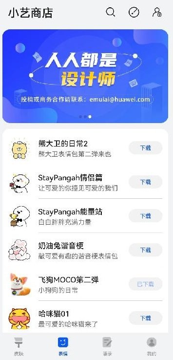
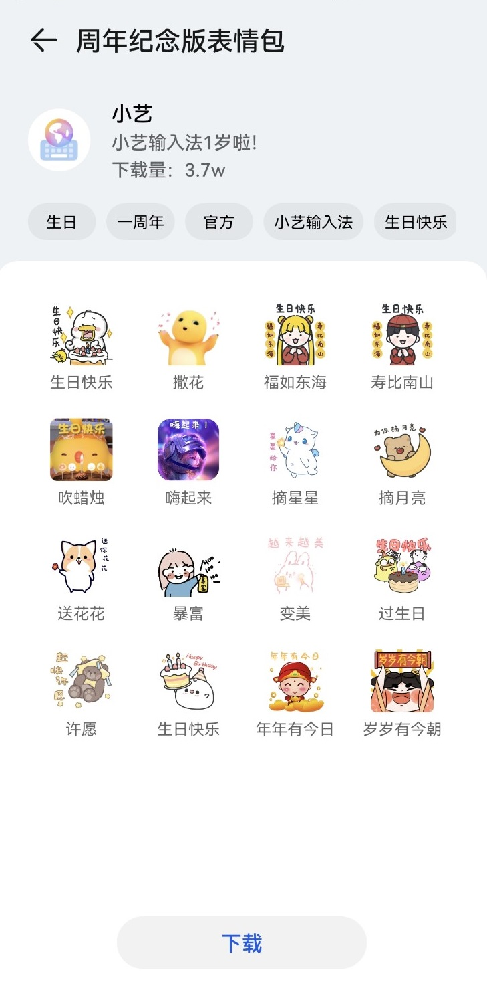
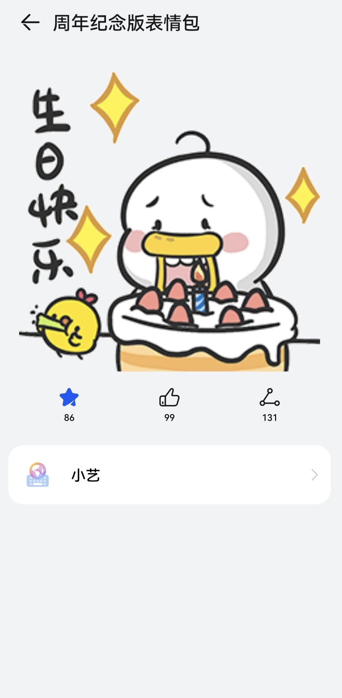
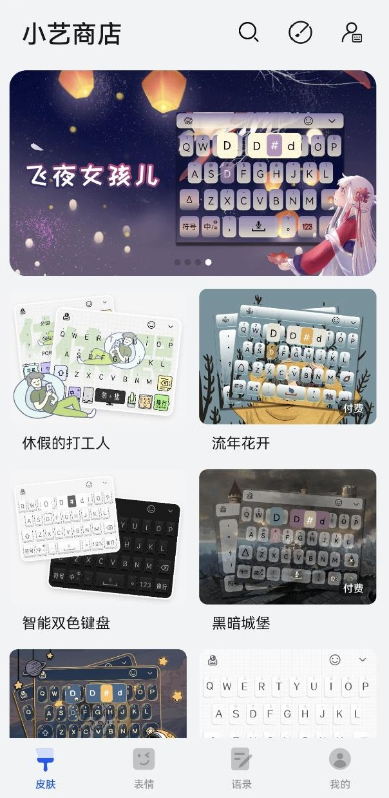
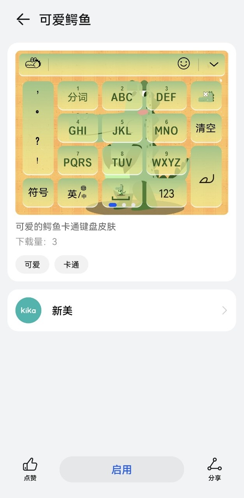
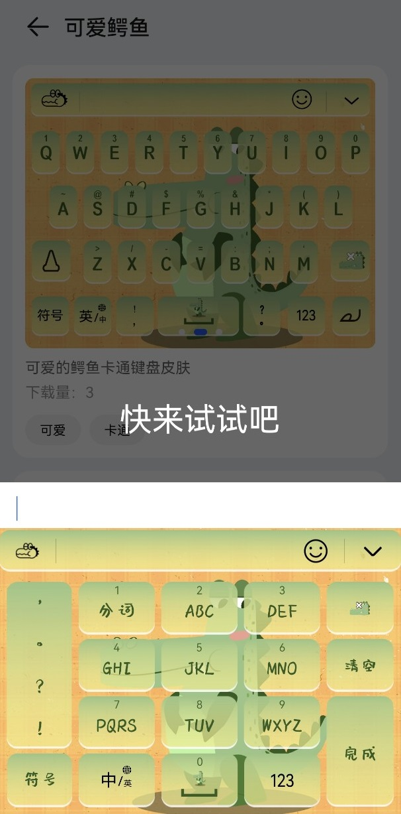

# 业务简介

小艺输入法设计师平台是小艺输入法内容生态的重要组成部分，设计师在平台上传个人原创作品，丰富小艺输入法内容，为小艺输入法用户提供有趣的使用体验，同时为设计师提供可观的创作收入，激励设计师创作更多优秀作品，打造小艺输入法繁荣发展的内容生态。

<strong>1.表情</strong>

表情由企业或者个人创作者设计开发，是一种利用图片来表示感情的方式，在移动互联网时期，人们以时下流行的明星、语录、动漫、影视截图为素材，配上一系列相匹配的文字，来表达特定的情感。小艺输入法表情包资源丰富，有着多家知名IP授权合作。

  

<strong>2.皮肤</strong>

皮肤可以改变输入法的界面整体风格， 按键风格，优化视觉上的整体效果，个性化定制键盘，满足你的多种输入习惯。

  