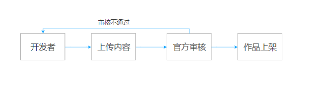
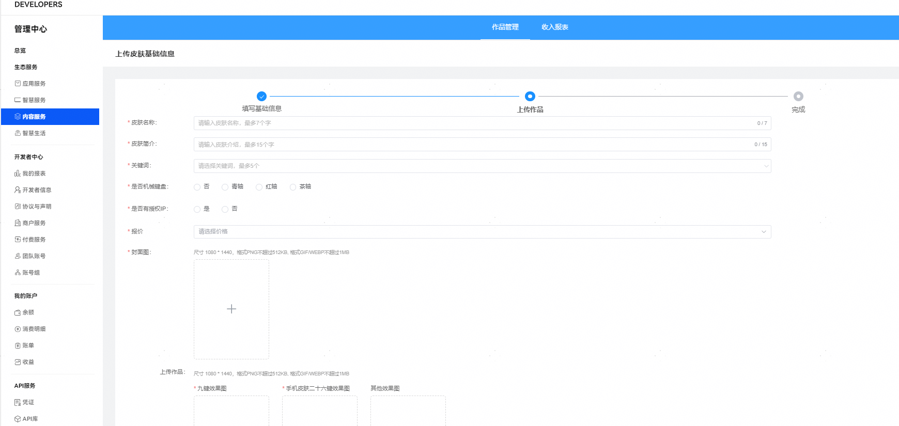

# 内容上架流程

（1）开发者通过小艺输入法设计师平台上传皮肤作品。

（2）官方团队对设计师上传的皮肤作品进行审核。

（3）审核通过后运营团队操作作品上架。

<strong>1.内容上传操作指导</strong>

（1）在tab栏选择皮肤后，点击上传作品按钮，进入皮肤上传界面。

（2）在皮肤上传界面首先填写皮肤的基础信息，包括皮肤名称、皮肤简介、关键词等。具体填写规范见[（鸿蒙4.3及以下）皮肤规范](/docs/distribute/content-dist/xiaoyi-ime-designer/content-on-the-shelves-0000001363969673/content-listing-specifications-0000001311529684/skin-specification-0000001311370036)或[（鸿蒙5.0及以上）皮肤规范](/docs/distribute/content-dist/xiaoyi-ime-designer/content-on-the-shelves-0000001363969673/content-listing-specifications-0000001311529684/skin2-specification-0000002390750545)。

（3）设计师在此界面上传好材料后，若对应皮肤为鸿蒙5及以上版本，点击预览按钮自测无误后，可点击提交按钮等待官方团队审核；

若对应皮肤为鸿蒙4.3及以下版本，请在测试设备上测试无误后，点击提交按钮等待官方团队审核。