# （鸿蒙5.0及以上）皮肤规范

<strong>1.</strong> <strong>小艺</strong> <strong>输入法界面介绍</strong>

（1）各页面

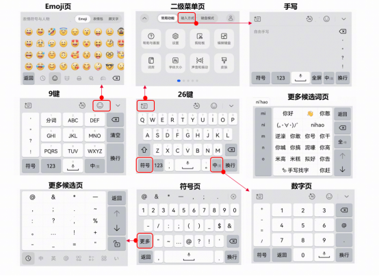

（2）图标

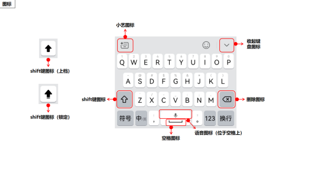

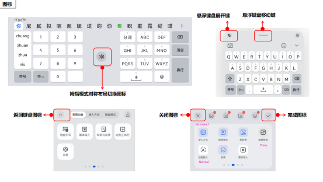

（3）base

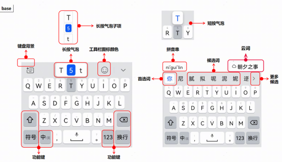

（4）9键

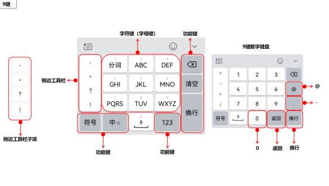

（5）手写

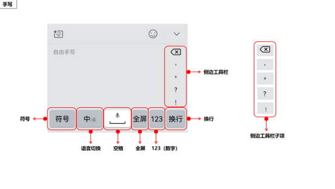

（6） 符号

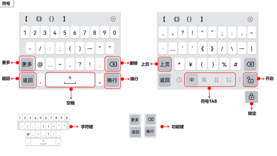

（7）emoji

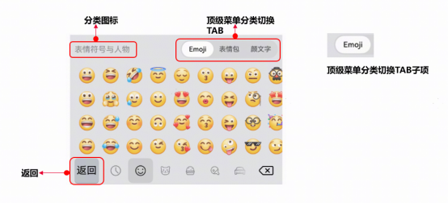

（8）候选词展开页

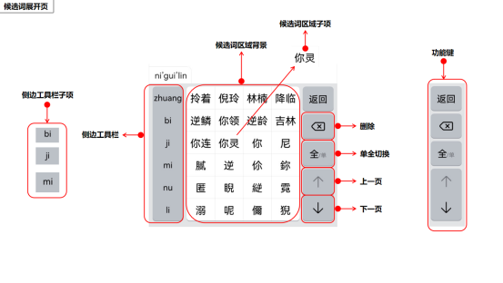

（9）二级菜单

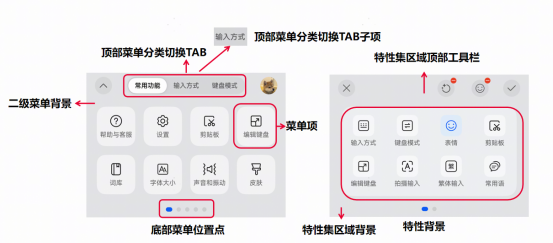

<strong>2.</strong> <strong>皮肤设计规范</strong>

（1）必填项

|  |  |  |  |
| --- | --- | --- | --- |
| 文件名称 | 文件类型 | 是否必须 | 备注 |
| base.xlsx | xlsx | 是 | 竖屏浅色模式键盘 |
| dark.xlsx | xlsx | 是 | 竖屏深色模式键盘 |
| horizontal-light.xlsx | xlsx | 否 | 横屏浅色模式键盘 |
| horizontal-dark.xlsx | xlsx | 否 | 横屏深色模式键盘 |

每套皮肤的base.xlsx、dark.xlsx为必填项。

如有图片资源，需要创建表格同名文件夹，并在该文件夹下面创建media文件夹，相关图片资源放在该文件夹下，如下图所示。

图片资源值在整个表格要保证唯一，并且资源文件夹要有对应的图片。

如果多个属性使用相同的图片，需要添加多张图片。

图片名命名只支持字母、数字和下划线。

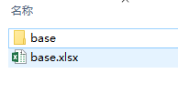 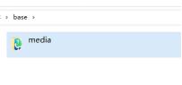

（2） 选填项

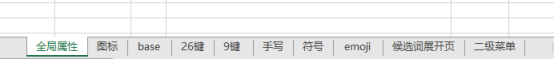

base.xlsx中各sheet页为选填项。

先勾选【资源类型值】，再根据资源值规范填写【资源值】。

【资源类型值】有【未设置】、【自定义】、【透明】、【色值】、【图片】、【可见】、【不可见】共7种类型，设计师根据个人设计理念按需选择。

【色值】：在资源值类型里面填写16进制代码，例如#FF0000。

【图片】：在资源值类型里面填写文件名，例如keyboard\_background，需要在对应文件夹目录中包含该图片。如图所示：

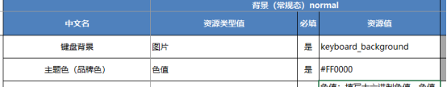

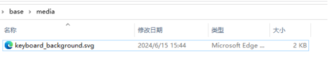

（3）其他

侧边工具栏常规态背景支持换图

工具栏图标支持灌色：base-&gt;工具栏图标颜色-&gt;主文本(常规态)

二级菜单卡片支持对图标和文字灌色：

二级菜单-&gt;菜单项-&gt;主文本(常规态/选中态) 对应图标

二级菜单-&gt;菜单项-&gt;辅助文本(常规态/选中态) 对应文字

二级菜单圆形图标支持灌色：

base-&gt;图标背景-&gt;背景常规态/背景按压态 对应背板颜色

base-&gt;图标背景-&gt;主文本常规态 对应图标灌色

emoji、更多符号页支持滚动条换色:

符号-&gt;更多符号-&gt;符号TAB-&gt;背景（选中态）对应更多符号页滚动条选中背板

符号-&gt;更多符号-&gt;符号TAB-&gt;主文本（常规态/选中态）对应滚动条内容灌色

emoji-&gt;emoji/颜文字-&gt;底部滚动条TAB-&gt;背景（选中态）对应表情页滚动条选中背板

emoji-&gt;emoji/颜文字-&gt;底部滚动条TAB-&gt;主文本（常规态/选中态）对应表情页滚动条内容灌色

增加候选词区域网格线颜色设置：候选词展开页-&gt;候选词区-&gt;候选词区域网格线-&gt;背景（常规态）

增加功能页标题字体颜色、功能页内容颜色：

base-&gt;通用-&gt;功能页标题颜色（剪贴板常用语等）-&gt;主文本常规态

base-&gt;通用-&gt;功能页内容颜色（剪贴板常用语等）-&gt;背景（常规态/按压态）

增加拖动条选中背景色，对应二级菜单-&gt;按键反馈里内容条拖动背景色等：

base-&gt;通用-&gt;拖动条颜色-&gt;背景（选中态）

<strong>参考文件链接</strong>

[【鸿蒙5.0及以上】皮肤设计规范-参考文件.zip](https://alliance-communityfile-drcn.dbankcdn.com/FileServer/getFile/cmtyPub/011/111/111/0000000000011111111.20251222165102.06517730945853486970907506621308%3A50001231000000%3A2800%3A2B1166BDEF8D84C806914B9A5F1A188D5E7692A903B833B6E158CC9DB24F9F4E.zip?needInitFileName=true)