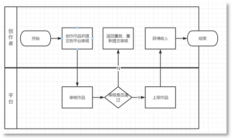

# 合作模式

<strong>1.合作范围</strong>

小艺输入法设计师平台业务合作范围覆盖表情、皮肤等内容模块，企业或个人开发者设计开发出相关作品，上传到开发者联盟&gt;小艺输入法设计师平台，测试审核通过后，上线至小艺商店供用户下载或购买。

<strong>2.商务模式</strong>

按照键盘皮肤/表情的版权归属、设计制作分工，付费免费等不同点，主要分为以下几种合作模式：

* 联运服务（键盘皮肤）：普通开发者完成整个键盘皮肤的设计开发，上线为付费皮肤，皮肤收入按照“华为:开发者=3:7”比例分成。
* 作品打赏（表情）：指您开通打赏功能后，用户对您发布的表情作品进行赞赏、鼓励、支付等行为。打赏所得款项金额扣除相应平台运营服务费用、第三方支付平台服务费用等之后归您所得。

  三方结算模式：三方模式指发布者上传版权方内容，且在上传时将版权方纳入结算分成主体之一，华为将皮肤/表情收入分别结算给发布者和版权方。

<strong>3.合作流程</strong>

