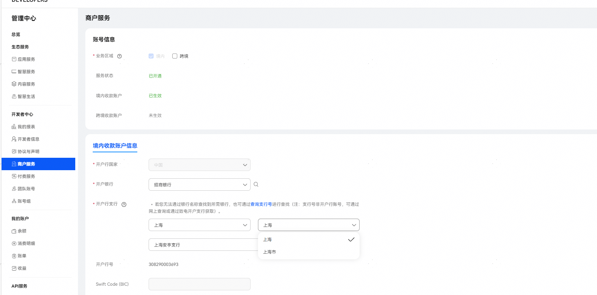
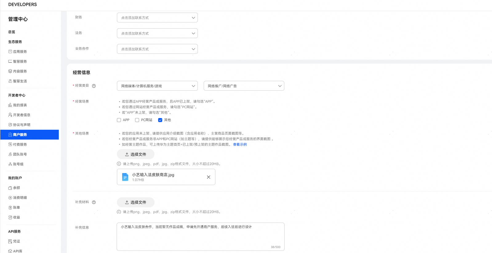
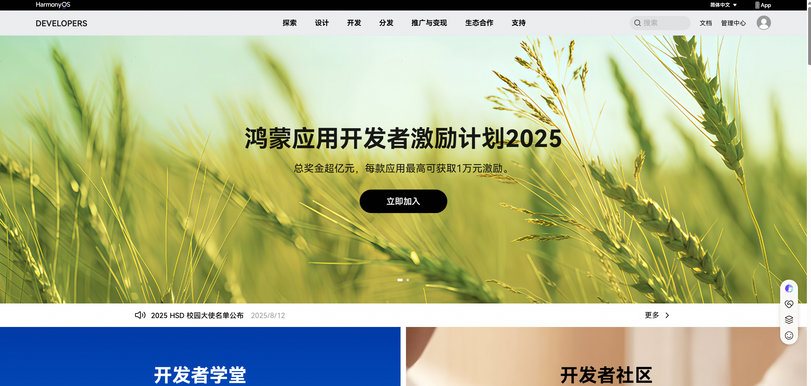
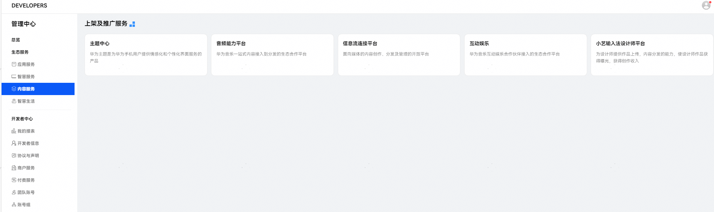
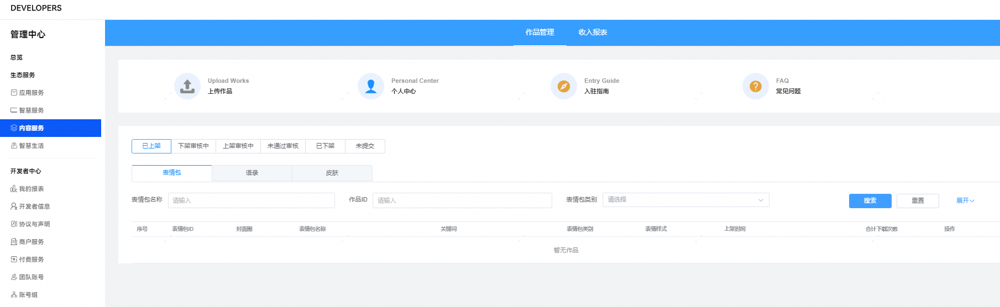

# 入驻指导

为保障小艺输入法良性健康发展，能够为用户提供更优质的作品，我们将对有意向入驻设计师进行资格审核，通过的设计师我们将为您开通作品上传及分发权限，具体要求如下：

<strong>1.入驻条件：</strong>

（1）个人设计师、设计公司、插画师、学生、在职人员均可。

（2）具备优秀色彩搭配、高超审美水平、非凡创意及精湛手绘技能者优先。

（3）具备一个或多个作品设计、制作、开发能力，并提交完整作品或作品源文件。

（4）保证作品原创性，且可持续在平台提供优质作品，一旦发现作品侵权事件，平台将做封号处理，并追究相关法律责任。

<strong>2.入驻方式：</strong>

（1）开发者联盟注册认证指导

* 入驻小艺输入法设计师平台需提前注册华为开发者联盟帐号并完成实名认证，详见：[注册认证](https://developer.huawei.com/consumer/cn/doc/start/registration-and-verification-0000001053628148)。
* 开发者联盟账号完成注册认证后，您需要开通商户服务。开通商户服务是您上架付费皮肤的前提，详见：[开通商户服务](https://developer.huawei.com/consumer/cn/doc/start/merchant-service-0000001053025967)。

温馨提示：

* 开户支行勾选时，若按地区无法查询到所需要的开户支行，请注意同一个城市一般有两个选项，如“上海市”、“上海”每个选项匹配的银行范围不一样，请在不同的选项下查找。若仍没找到，可通过支行号查询查找或拨打客服热线400680999。

  
* 经营类目分为一级行业和二级行业，对于小艺输入法的业务场景，经营类目请选择“网络媒体/计算机服务/游戏——网络推广/网络广告”。

  
* 若当前已有设计好的皮肤作品，经营信息中的其他场景，请上传小艺输入法商店首页+皮肤作品截图，同时补充信息中注明“小艺输入法皮肤合作”。

  若暂无皮肤作品，请上传小艺输入法商店首页，同时补充信息中注明“小艺输入法皮肤合作，当前暂无作品成稿，申请先开通商户服务，后续入驻后进行设计”。

（2） 小艺输入法设计师平台入驻指导

* 登陆开发者联盟帐号后，单击右上角“管理中心”。

* 单击左侧任务栏“内容服务”选项后，单击进入“小艺输入法设计师平台”。

* 单击“个人中心”，完善“个人信息”并提交。

* 待作品自测完成后，您即可上传并分发皮肤作品。